# AgentHarness — implementation specification

- [Part 0 — Orientation](#part-0--orientation)
  - [0.1 What this is](#01-what-this-is)
  - [0.2 System model](#02-system-model)
  - [0.3 The three stores](#03-the-three-stores)
  - [0.4 Worked example — a Slack thread](#04-worked-example--a-slack-thread)
  - [0.5 Worked example — a crash mid-tool](#05-worked-example--a-crash-mid-tool)
  - [0.6 Non-goals](#06-non-goals)
  - [0.7 Notation and source types](#07-notation-and-source-types)
  - [0.8 Validation boundary](#08-validation-boundary)
- [Part 1 — Storage](#part-1--storage)
  - [1.1 The model](#11-the-model)
  - [1.2 Identity](#12-identity)
  - [1.3 Register namespaces](#13-register-namespaces)
  - [1.4 Transactions](#14-transactions)
  - [1.5 Queries](#15-queries)
  - [1.6 Usage ledger](#16-usage-ledger)
  - [1.7 Backends](#17-backends)
  - [1.8 Why write-once plus registers](#18-why-write-once-plus-registers)
- [Part 2 — The conversation tree](#part-2--the-conversation-tree)
  - [2.1 Entries](#21-entries)
  - [2.2 Placement](#22-placement)
  - [2.3 Lanes](#23-lanes)
  - [2.4 Facts](#24-facts)
  - [2.5 Branch queries and context](#25-branch-queries-and-context)
  - [2.6 The branch index](#26-the-branch-index)
  - [2.7 Forks](#27-forks)
  - [2.8 Session and repository boundary](#28-session-and-repository-boundary)
  - [2.9 The precise rewrite](#29-the-precise-rewrite)
- [Part 3 — The operation state machine](#part-3--the-operation-state-machine)
  - [3.1 Operations](#31-operations)
  - [3.2 Operation state — the durable restart point](#32-operation-state--the-durable-restart-point)
  - [3.3 Lane state and current-state validity](#33-lane-state-and-current-state-validity)
  - [3.4 The atomic transition rule](#34-the-atomic-transition-rule)
  - [3.5 The graph](#35-the-graph)
  - [3.6 Acceptance](#36-acceptance)
  - [3.7 Assistant generation](#37-assistant-generation)
  - [3.8 Tools](#38-tools)
  - [3.9 Summary generation — compaction and navigation summaries](#39-summary-generation--compaction-and-navigation-summaries)
  - [3.10 Navigation](#310-navigation)
  - [3.11 Inbox, queues, deferred writes](#311-inbox-queues-deferred-writes)
  - [3.12 The checkpoint procedure](#312-the-checkpoint-procedure)
  - [3.13 Terminal transactions](#313-terminal-transactions)
- [Part 4 — Execution, recovery, abort, close](#part-4--execution-recovery-abort-close)
  - [4.1 The live operation task](#41-the-live-operation-task)
  - [4.2 Breakpoint barrier and effect gate](#42-breakpoint-barrier-and-effect-gate)
  - [4.3 The lane mutation line](#43-the-lane-mutation-line)
  - [4.4 Restore](#44-restore)
  - [4.5 Activation and crash recovery](#45-activation-and-crash-recovery)
  - [4.6 Abort and cancellation reconciliation](#46-abort-and-cancellation-reconciliation)
  - [4.7 Close — a controlled crash](#47-close--a-controlled-crash)
  - [4.8 Faults](#48-faults)
  - [4.9 External finalization](#49-external-finalization)
- [Part 5 — Public surface](#part-5--public-surface)
  - [5.1 The lane surface](#51-the-lane-surface)
  - [5.2 The harness](#52-the-harness)
  - [5.3 SessionTree](#53-sessiontree)
  - [5.4 Snapshots and subscription](#54-snapshots-and-subscription)
  - [5.5 Events](#55-events)
  - [5.6 Hooks](#56-hooks)
  - [5.7 Harness execution blocks](#57-harness-execution-blocks)
  - [5.8 Telemetry](#58-telemetry)
- [Part 6 — Future: partitioned retention (Postgres)](#part-6--future-partitioned-retention-postgres)
- [Part 7 — Schema evolution](#part-7--schema-evolution)
  - [7.1 The problem](#71-the-problem)
  - [7.2 Why this design shrinks the problem](#72-why-this-design-shrinks-the-problem)
  - [7.3 The mechanism: storage version plus migrate-on-open](#73-the-mechanism-storage-version-plus-migrate-on-open)
  - [7.4 Migrations are total](#74-migrations-are-total)
  - [7.5 The three strata, restated as policy](#75-the-three-strata-restated-as-policy)
- [Part 8 — Build order](#part-8--build-order)
- [Part 9 — Invariants and tests](#part-9--invariants-and-tests)
  - [9.1 Invariants](#91-invariants)
  - [9.2 Race catalog](#92-race-catalog)
  - [9.3 Test tiers](#93-test-tiers)
- [Appendix A — Glossary](#appendix-a--glossary)
- [Appendix B — Coding-agent v3-format compatibility](#appendix-b--coding-agent-v3-format-compatibility)
- [Appendix C — Open questions](#appendix-c--open-questions)
# Part 0 — Orientation

## 0.1 What this is

A durable runtime for agent conversations. It persists conversation and operation state so interrupted work can resume without repeating settled effects.

## 0.2 System model

### Session

A session groups related work and has four parts:

- **Entry tree.** An entry is a message, compaction, branch summary, or application-defined custom entry. Entries are immutable. Each branch is a conversational thread; the shared tree enables branching, compaction, forking, and parallel work while preserving history.

  ```text
  a ── b ── c ── d
        └── e ── f
  ```

- **Facts.** Mutable, namespaced key-value state. Built-ins include the session name and entry labels; applications may store custom facts.
- **Lanes.** Named cursors into the tree. Every session has `main`. A lane owns its leaf, model configuration, queues, and at most one operation. Additional lanes support Slack threads, subagents, and other parallel work over shared history.
- **Usage ledger.** Append-only token and cost events for the session.

### Harness and operations

The session layer manages durable data and exposes typed tree views. The harness drives lanes through four general primitives: `accept` durably creates an operation, `drive` advances an expected operation, `requestAbort` durably requests cancellation, and `inspectExecution` atomically reports current and latest-terminal execution. Convenience methods such as `prompt`, `resume`, and `abort` compose those same primitives with process-local waiting policy. A serving layer may instead schedule `drive` calls through alarms, jobs, or another host runtime. The harness also owns harness-wide registries of available tools and prompt resources, hooks that intercept and transform execution, passive events that report activity and durable changes, and runtime configuration.

An **operation** is one accepted unit of lane work: a run, compaction, or navigation. Its immutable metadata records its identity, intent, and starting point; its total current state records its phase, control, queues, and recovery data. Each durable transition replaces the current state. Acceptance and execution ownership are separate: an accepted operation may have no process-local driver. Completion removes the operation state and records the lane's result.

### Storage

Below the session and harness, `Storage` exposes atomic transactions and queries over three durable forms: immutable entries, mutable registers, and append-only usage rows. Registers form a mutable, namespaced key-value store. Facts live there; internal harness namespaces durably store pending content and lane and operation state needed for crash recovery. In particular, `op.meta` is written once with an operation's metadata, while `op.state` is replaced after each transition with its complete current state. The terminal transaction deletes both and writes `lane.lastResult`. No partial transaction is visible.

## 0.3 The three stores

Everything in Parts 1–5 follows from these.

**1. Three stores, one invariant.** Everything durable is one of:

```text
entries        the conversation tree — write-once, append-only
registers      current mutable state — namespaced typed cells, overwrite or delete
usage ledger   cost history — append-only rows
```

*Every payload is in an entry, a register, or the ledger; there is no third place.* An entry is the complete conversation record — placement and payload in one row. A register holds its current typed value directly; overwriting discards the old value, and deletion removes the key. Content that durably exists before it has a place in the tree (queued input, deferred writes) waits in a `pending.entry` register and becomes an entry in the transaction that places it. Per-backend projections — branch index, full-text search, stats — are rebuildable from the three stores and carry no authority.

**2. Atomic transactions.** A transaction is a set of entry inserts, usage inserts, and register writes (set or delete), committed all-or-none with strictly increasing sequence numbers. There is no crash state inside a transaction. This is the only write primitive.

**3. The durable restart point.** After every durable transition, the harness overwrites one register — `op.state/{operationId}` — with the *complete* current state of the operation. While a process-local operation task is alive, ordinary JavaScript control flow may continue across that state; after the task is lost, recovery reads the register and starts at the procedure responsible for it. Recovery never replays a journal or infers position from what is missing. The state is *total* — it never depends on a previous state. Small captured values (configuration, stream options, retry policy) are inline; large stable payloads live in sibling `op.*` registers or are named by id. When the operation ends, the terminal transaction deletes its registers: a finished session holds exactly the conversation, the ledger, and a handful of lane and fact registers. There is no dead state to collect.

**4. The effect sandwich.** Provider requests and real tool calls are wrapped in two commits:

```
commit:  "about to do X; its output will use ids R and U"     ← intent
         do X                                                  ← the uncertain part
commit:  output + usage + next state                           ← settlement
```

Hooks follow their replay contract instead: a result becomes durable in the transaction that consumes it, and a crash before that transaction may rerun the hook. Thus every external effect can still happen without durable settlement. Provider/tool intents make that uncertainty explicit where replay policy depends on it; idempotent hooks accept it as a non-goal.

## 0.4 Worked example — a Slack thread

A user posts in a channel that already has 400 entries of history. The application creates a lane for the thread, anchored at the channel's current leaf. Entry ids are UUIDv7s (§1.2); examples abbreviate them.

```
harness.createLane("slack:1719432.0021", at: "0195c8d1-4a2e-7b31-…")
lane.prompt("what changed in auth last week?")
```

What happens, in order:

1. **Acceptance.** The harness validates, runs the `before_run` hook, and commits one transaction: the user-message entry, the operation's `op.meta` register, and its first `op.state` — *"I am at a checkpoint, and I need an assistant response."*
2. **Intent.** After an internal ready-state commit, it commits the request intent: *"I am about to make a provider request. The response will be entry `0195c8d1-53a0-7c44-…` and the usage row will be `0195c8d1-53a0-7d18-…`."* Both ids are minted now; nothing has been sent yet.
3. **The request.** Streaming happens. This is the only part that is not durable.
4. **Settlement.** One transaction commits the response entry, its usage row, and the next state: *"the response has tool calls; here is the batch plan, with result ids already assigned."*
5. Tool calls follow the same intent → effect → settlement shape, one pair of commits each.
6. When the model stops without tool calls, a terminal transaction deletes the operation's registers, records the outcome in `lane.lastResult`, and leaves the lane idle.

As a trace (ids abbreviated; every `TX[...]` is one atomic commit, in normative write order):

```text
TX[ insert entry n1 (user msg), upsert lane.leaf = n1,
    upsert op.meta/O, upsert op.state/O = checkpoint,
    upsert lane.state = { currentOperationId: O } ]
TX[ upsert op.state/O = assistant ready (config snapshot) ]
TX[ upsert op.state/O = effect_pending (reserves response n2, usage u1) ]
… provider streams …                                  ← the uncertain window
TX[ insert entry n2, upsert lane.leaf = n2, insert usage u1,
    upsert op.state/O = tools (result id n3 reserved) ]
TX[ upsert op.tool_args/O:s1:0, upsert op.state/O = call 0 effect_pending ]
… tool runs …
TX[ insert entry n3, upsert lane.leaf = n3, upsert op.state/O = checkpoint ]
… second turn: ready · intent · stream · settle (n4, u2) …
TX[ delete op.meta/O, op.state/O, op.tool_args/O:*,
    upsert lane.lastResult = { O, completed, n4 },
    upsert lane.state = { currentOperationId: null } ]
```

Kill the process between any two of those transactions and restart. The harness reads the lane's registers, sees exactly which of those sentences was the last one committed, and continues. If it died in step 3, it knows a request may have been billed and may or may not have produced output — that is the one genuinely uncertain window in the whole system, and there is a stated policy for it.

Meanwhile a second thread in the same channel is running its own lane, over the same 400 entries of shared history, with no coordination between them.

## 0.5 Worked example — a crash mid-tool

```
lane.prompt("delete the stale migrations and run the test suite")
```

The model returns two tool calls. The harness commits the batch plan, then commits `call 0 is about to execute, with these exact arguments, and it declares itself unsafe to replay`. The tool starts deleting files. The process is killed.

```text
TX[ insert entry n2 (assistant, 2 calls), insert usage u1, upsert lane.leaf = n2,
    upsert op.state/O = tools (result ids n3, n4 reserved) ]
TX[ upsert op.tool_args/O:s1:0, upsert op.state/O = call 0 effect_pending,
                                                    replay: "never" ]
… tool deletes files …  ← CRASH
```

On restart the harness performs the bounded restore reads from §4.4; `op.state` is the decisive restart point and says `calls[0].status = "effect_pending", replay = "never"`. It does not re-run the deletion. It appends a synthetic error result under the result id that was reserved before the effect started, marks the call complete, and continues to call 1:

```text
TX[ insert entry n3 (synthetic "interrupted" result), upsert lane.leaf = n3,
    upsert op.state/O = call 0 completed ]
```

The conversation stays coherent — every tool call has a result — and nothing ran twice.

Had the tool declared `replay: "safe"` (a read, a query), the harness would have re-executed it with the persisted arguments instead.

## 0.6 Non-goals

- **Exactly-once external effects.** See above. Hooks with their own side effects must be idempotent, keyed by operation id.
- **Provider stream resumption.** Partial streams are process-local, never persisted. A settled response is persisted *completely* before anything classifies it.
- **Multiple writers.** One process per session. The serving layer routes accordingly, and the SQLite backend enforces it with a fenced lease (§1.7). Lanes cover the workload that looks like multi-writer.
- **Work scheduling.** The harness never creates platform alarms, scans repositories for abandoned sessions, leases hosted submissions, or promises an HTTP receipt. It reports durable waits and safe yields through `drive`; the serving layer decides when and where to call it again.
- **Replication.** A session lives in one place.
- **Durable write history.** Registers hold only current values: an overwritten register is gone, and no API or table exposes write history. Order-of-write assertions in tests use an instrumented storage decorator around `commit()` (Part 9); production auditing belongs to the telemetry layer (§5.8).
- **Deletion as a runtime feature.** Entries and usage rows are never deleted: compaction changes provider context, not storage, and terminal cleanup deletes only registers. Note that `retainedTail` copies old messages forward into newer compaction entries and summaries derive from old content, so compaction is not erasure either. Compliance-grade "erase this" is the administrative precise rewrite (§2.9), the sole sanctioned exception.

## 0.7 Notation and source types

- `TX[ a, b, c ]` — one atomic commit containing writes `a`, `b`, `c` in that order. The write vocabulary is `insert entry`, `insert usage`, `upsert namespace/key = value`, and `delete namespace/key`.
- Ids are UUIDv7s (§1.2). Examples abbreviate them: short tags — `e_*` entry ids, `u_*` usage ids, `op_*` operation ids — stand in for full ids where the time prefix is irrelevant; where the prefix matters, examples show it (`0195c8d1-4a2e-7b31-…`).
- `S(next)` — overwrite the `op.state/{operationId}` register with the next total operation state. `L(next)` — the same for `lane.state/{lane}`.
- **must / must not** are normative. Everything else is explanation.

Source type provenance:

- `AgentMessage`, `AgentTool`, `AgentToolResult`, `QueueMode`, and `ThinkingLevel`: `packages/agent/src/types.ts`.
- `Skill`, `PromptTemplate`, `AgentHarnessResources` (`Resources` below), `AgentHarnessTool`, `AgentHarnessToolInvocation`, `AgentHarnessStreamOptions`, and `AgentHarnessStreamOptionsPatch`: `packages/agent/src/harness/types.ts`.
- `Model`, `Models`, `Usage`, `RetryPolicy`, `StopReason`, `AssistantMessage`, `ImageContent`, provider messages, stream options, and deferred handles: `packages/ai`.
- `CompactionSettings`, `CompactionPreparation`, `CompactResult`, `BranchPreparation`, and `BranchSummaryResult`: `packages/agent/src/harness/compaction/`. Existing preparation and split-turn algorithms remain the implementation starting point unless this document explicitly changes them.
- `TelemetryContext` and typed schema helpers: `packages/telemetry`; the agent-owned schemas remain in `packages/agent/src/harness/telemetry.ts`.

The public `QueueMode` remains `"all" | "one-at-a-time"`. Public `RetryPolicy` remains the pi-ai shape `{ enabled, maxRetries, baseDelayMs }`; operation state stores its normalized `{ maxAttempts, baseDelayMs }` equivalent. `maxRetries` and `baseDelayMs` must be finite non-negative safe integers and `maxRetries + 1` must remain safe; disabled retry normalizes to one attempt. Exponential delay and `notBefore` arithmetic saturate at `Number.MAX_SAFE_INTEGER`. Public `CompactionSettings` remains `{ enabled, reserveTokens, keepRecentTokens }`; both token counts must be finite non-negative safe integers. Constructors and setters reject invalid settings before publication. This design adds `deferred?: boolean | { window?: "15m" | "1h" | "24h" }` to `AgentHarnessStreamOptions` and its patch type; structural requests always force it to false.

```ts
type SettledAssistantMessage = AssistantMessage & {
  stopReason: Exclude<StopReason, "pending">;
};

// Provider dispatch resolves the durable { provider, modelId } identity
// through Models at request time, which also applies auth. A missing or
// swapped registry entry fails the request in-band, like an unknown tool.
```

## 0.8 Validation boundary

Internal pi objects are trusted typed values. Session, storage, operation procedures, and in-process extensions do not runtime-validate object shapes or defensively clone values on reads or writes. Storage still enforces its operational invariants, such as atomicity, sequence allocation, unique ids, and parent existence. Backends serialize and parse their representations as needed; externally edited or shape-corrupt storage is unsupported.

Runtime schema validation belongs at untrusted wire boundaries, before remote input enters business logic. A future protocol-schema slice defines shared TypeBox schemas for serializable pi-ai and harness data and derives their TypeScript types from those schemas; it does not add validation back to internal session or storage paths.

---

# Part 1 — Storage

Storage knows nothing about agents, lanes, or conversations. It stores entries and usage rows, updates registers, and answers a small fixed set of queries. Parts 2–4 are built entirely on this.

## 1.1 The model

```ts
type JsonValue = null | boolean | number | string | JsonValue[] | { [k: string]: JsonValue };

/** Write-once. The complete conversation record: placement and payload in one
    row. Created in exactly one transaction, never modified or deleted. The
    four concrete entry types extending this base are defined in §2.1. */
interface EntryBase {
  id: string;                // UUIDv7 (§1.2)
  parentId: string | null;
  seq: number;               // storage-assigned at commit
  timestamp: number;         // Unix ms, storage-assigned at commit
  type: EntryType;
  customType?: string;       // when type === "custom"
  // ...payload fields per entry type (§2.1)
}

type EntryType = "message" | "compaction" | "branch_summary" | "custom";

/** The only mutable store. A namespaced key holding its current typed value
    directly. Overwrite replaces the value; delete removes the key. */
interface Register<N extends RegisterNamespace = RegisterNamespace> {
  namespace: N;
  key: string;
  value: RegisterValues[N];
  seq: number;               // seq of the write that last set this register
}

/** Append-only cost ledger row. Never modified, never deleted (§1.6). */
interface UsageRow {
  id: string;                // UUIDv7 (§1.2)
  seq: number;               // storage-assigned at commit
  usage: Usage;
  entryId?: string;          // the entry this cost belongs to, when there is one
  adjustment: boolean;       // true = caller-supplied reconciliation, not a provider report
  details?: JsonValue;
}
```

## 1.2 Identity

Every id — operation, entry, usage, and every reserved id — is a **UUIDv7** from the session's id generator (§2.8); legacy imports re-mint to conform (Appendix B). `accept` may receive a caller-supplied operation id so a durable host submission and harness operation share one identity; the caller must mint it by the same UUIDv7 contract and never reuse it for another operation. Omission mints internally. The first 48 bits are the mint time, so every reference is self-describing and time-sortable. Cost accepted: ids leak creation time. (A future partitioned Postgres backend would build on this prefix — informative Part 6.)

Minting rules:

1. Ids are minted with `now()` **at reservation**. Direct appends place in the same transaction; assistant/tool ids trail placement by at most the request duration.
2. **Tool-result ids inherit their assistant id's timestamp** (`idGenerator.next(timestampMs?)`, fresh random tail), so a call-and-results group is time-cohesive under id order even across a midnight boundary.
3. Synthetic settlements write under already-reserved ids (§4.5) — no special case.

**Opaque payloads** — custom entry `data`, `details`, `fact.custom` values, message text, hook `resumeData` — may embed entry ids. The harness never tracks those references and they may go stale; copy content, don't reference it.

**Absolutes.** Within a session, entries and usage rows are never deleted — the precise rewrite (§2.9) is the sole exception. A missing parent is always corruption.

## 1.3 Register namespaces

```ts
interface RegisterValues {
  "lane.leaf":       string | null;                // entry id; null = lane at the root
  "lane.config":     LaneConfiguration;            // §2.3
  "lane.state":      LaneState;                    // §3.3
  "lane.lastResult": LaneLastResult;               // §3.13
  "op.meta":         Operation;                    // §3.1
  "op.state":        OperationState;               // §3.2 — durable restart point
  "op.tool_args":    Record<string, JsonValue>;    // effective tool arguments (§3.8)
  "op.preparation":  DurableStructuralPreparation; // §3.9
  "pending.entry":   PendingEntry;                 // §2.2
  "fact.name":       string;
  "fact.label":      string;
  "fact.custom":     JsonValue;                    // JSON null is a legal value
}
type RegisterNamespace = keyof RegisterValues;

/** Unplaced content: current mutable state until the placement transaction
    writes the complete entry and deletes this register (§2.2). */
type PendingEntry =
  | { type: "message"; payload: AgentMessage }
  | { type: "custom"; customType: string; payload?: JsonValue };
    // absent custom payload = a custom entry with no data

interface DurableFileOperations {
  read: string[]; written: string[]; edited: string[];
}
type DurableStructuralPreparation =
  | { kind: "compaction"; messagesToSummarize: AgentMessage[];
      turnPrefixMessages: AgentMessage[]; retainedTail: AgentMessage[];
      isSplitTurn: boolean; tokensBefore: number; previousSummary?: string;
      fileOps: DurableFileOperations; settings: CompactionSettings }
  | { kind: "branch_summary"; messages: AgentMessage[];
      fileOps: DurableFileOperations; totalTokens: number };
```

| Namespace | Key | Value | Meaning |
|---|---|---|---|
| `lane.leaf` | lane name | entry id or `null` | where this lane appends next |
| `lane.config` | lane name | `LaneConfiguration` | total lane configuration |
| `lane.state` | lane name | `LaneState` (§3.3) | `currentOperationId`, `pendingNextRun` |
| `lane.lastResult` | lane name | `LaneLastResult` (§3.13) | terminal outcome of the lane's most recent operation |
| `op.meta` | operation id | `Operation` (§3.1) | acceptance data; written once, never overwritten |
| `op.state` | operation id | `OperationState` (§3.2) | total operation state — the **durable restart point** |
| `op.tool_args` | `{opId}:{stepId}:{sourceIndex}` | effective arguments | written once at tool clearance (§3.8) |
| `op.preparation` | `{opId}:{taskId}` | `DurableStructuralPreparation` | written once before the decision hook (§3.9) |
| `pending.entry` | reserved entry id | `PendingEntry` | queued content awaiting placement (§2.2) |
| `fact.name` | `""` | string | session name |
| `fact.label` | entry id | string | entry label |
| `fact.custom` | application key | `JsonValue` | application state |

That is the complete set. Two lifetimes are visible in the key shape:

```text
lane.*  fact.*     session-lived; facts are deleted only by explicit application action
op.*               operation-lived; deleted by the terminal transaction (§3.13)
pending.entry      lives until its content is placed or cancelled
```

- `op.meta` and `op.preparation` keys are written exactly once; `op.tool_args` keys are written once per key, keyed by the producing step so batches never collide. All are deleted no later than the terminal transaction; only `op.state` is overwritten during the operation.
- Operation-owned `pending.entry` registers still unconsumed at the end (remaining inbox items and abort-drained items) are deleted by the terminal transaction — a consumed item's register dies in its placement transaction; lane-owned ones (`pendingNextRun`) outlive operations and die when consumed or cancelled (§3.11).
- `lane.lastResult` is written only by terminal transactions and overwritten by the next one on its lane — one bounded register per lane, forever. Recovery never reads it; it exists so an application that accepted an operation, crashed, and reopened can still learn its outcome (§3.13).
- Deleting a fact removes its register. Storing JSON `null` in `fact.custom` is a different, legal state; there are no tombstones.
- Cancellations leave no trace: `cancelQueued` triages as pending → `cancelled`, entry exists → `already_consumed`, else → `not_found` (§3.11). A client retrying a lost cancel treats `not_found` as success.

## 1.4 Transactions

```ts
/** Mapped discriminated union: the namespace forces the value type. */
type RegisterSetWrite = {
  [N in RegisterNamespace]: { kind: "register"; op: "set"; namespace: N;
                              key: string; value: RegisterValues[N] }
}[RegisterNamespace];

type Write =
  | { kind: "entry"; entry: Omit<Entry, "seq" | "timestamp"> }
  | { kind: "usage"; row: Omit<UsageRow, "seq"> }
  | RegisterSetWrite
  | { kind: "register"; op: "delete"; namespace: RegisterNamespace; key: string };

interface Transaction { writes: Write[] }

interface CommitResult { firstSeq: number; seqs: number[]; timestamp: number }
```

Rules:

1. A transaction commits **all-or-none**. There is no observable state in which some of its writes exist and others do not.
2. Writes receive **strictly increasing** `seq` values in the order given; gaps are legal, within and between transactions. `seq` is monotonic session-wide across all lanes and all write kinds. A register `set` stamps the register with its assigned `seq`.
3. Within a transaction, writes apply in order: an entry may name a parent created earlier in the same transaction; a register value may reference entry or usage ids created earlier in the same transaction. A placement transaction inserts the complete entry and deletes its `pending.entry` register together (§2.2) — there is never a moment where both exist.
4. Entry and usage ids share one session-wide id namespace. Writing either kind under any existing id is **corruption**, not an update.
5. A register `set` with the same `(namespace, key)` replaces the current value; `delete` removes the key; a later `set` recreates it. No history is retained. A `delete` naming an absent key is a no-op, so public deletions such as clearing an unset label stay legal.
6. Transactions on one session are **serialized**. There is one writer and one queue.

Session passes typed transactions directly to storage without a codec, runtime shape validation, or defensive cloning. A failed admitted commit **faults the harness**: all effects stop, all calls reject, and the process must be restarted. A partially applied transaction is not tolerated.

## 1.5 Queries

One `Storage` instance serves one session. Repository discovery and lifecycle are outside this interface (§2.8).

```ts
interface Storage {
  commit(tx: Transaction): Promise<CommitResult>;

  getEntries(ids: string[]): Promise<Map<string, Entry>>;

  getRegister<N extends RegisterNamespace>(namespace: N, key: string):
    Promise<Register<N> | undefined>;
  /** keyPrefix is ideally an indexed prefix listing over (namespace, key);
      terminal cleanup's op.* prefix scans use it (§3.13). */
  listRegisters<N extends RegisterNamespace>(namespace: N, keyPrefix?: string):
    Promise<Register<N>[]>;

  scanBranch(q: BranchScan): Promise<Entry[]>;            // §2.5
  scanBranchStructure(q: BranchScan): Promise<EntryStructure[]>;
  scanEntries(q: EntryScan): Promise<Entry[]>;            // session-wide tree inventory
  scanUsage(q: UsageScan): Promise<UsageRow[]>;           // seq-ranged ledger read (§1.6)
  getStats(): Promise<SessionStats>;                      // maintained projection (§1.6)

  close(): Promise<void>;
}

/** Placement metadata without payload fields. */
type EntryStructure = Pick<Entry, "id" | "parentId" | "seq" | "timestamp" | "type" | "customType">;

interface EntryScan {
  type?: EntryType; customType?: string;
  fromSeq?: number; toSeq?: number;
  order?: "asc" | "desc"; limit?: number;
}

interface UsageScan {
  fromSeq?: number; toSeq?: number;
  order?: "asc" | "desc"; limit?: number;
}
```

There is deliberately no cross-namespace register scan and no durable write log. Restore, facts, forks, and execution follow exact ids and keys; entry inventory uses `scanEntries`; ledger reads use `scanUsage`; totals use the stats projection (§1.6); test-order assertions wrap `commit()` with the instrumented-storage decorator (Part 9); production auditing belongs to telemetry (§5.8).

Recovery and execution reads must be index-driven and bounded. They may not infer state from an absent value, and there is no register history to fold. Exact dereference is allowed: one current state may name a bounded set of entries and registers, fetched in one batch without order-dependent reduction. Public inventory and debugging APIs may intentionally read more than a hot path; their `limit`/pagination behavior is explicit at the `SessionTree` layer.

`close()` is idempotent. It seals admission, rejects later reads/commits on that instance, drains commits admitted before the seal, then releases resources and the writer claim. Durable data is reopened through the repository.

## 1.6 Usage ledger

Every settled provider attempt writes one `UsageRow` — successful, failed, retried, and synthetic attempts alike, including attempts whose operation later aborts. Settlement transactions write the response entry and its usage row together (§3.7); synthetic settlements write zero usage under the reserved usage id. Rows are append-only: terminal cleanup deletes an operation's registers but never its ledger rows, so billing survives everything that can happen to orchestration state.

```jsonc
{ "id": "u_7", "seq": 815, "entryId": "e_51", "adjustment": false,
  "usage": { "input": 12000, "output": 431, "cost": { ... } } }
```

- `entryId` names the entry the cost belongs to, when there is one. Structural (summary) attempts that fail before producing an entry, and standalone adjustments, have none.
- `adjustment: true` marks a caller-supplied reconciliation (`recordUsage`, §5.1) rather than a provider report. The format-3 import writes one aggregate adjustment row (Appendix B).
- Provider-attempt usage ids are UUIDv7s reserved in the intent commit (§1.2), so a settlement writes under exactly the id its intent promised. Adjustment rows, tool-reported usage rows, hook-supplied compaction/navigation usage rows (§3.9, §3.10), and import aggregates mint their ids at commit; nothing reserves them.
- `getStats()` is a maintained projection over the ledger and the message-entry count — `messageCount` counts `message` entries only, not compactions, summaries, or custom entries. After every commit it equals the ledger sum; the conformance suite asserts this (Part 9). Individual rows reach the application through the `usage` event at commit time (§5.5), and `scanUsage` (§1.5) reads them back by seq range — a consumer that persists the greatest event `seq` it applied catches up after downtime with `scanUsage({ fromSeq })`. Recovery never reads the ledger.

## 1.7 Backends

Three encodings of one model ship now — Memory, JSONL, SQLite — and all three pass the same conformance suite (Part 9). Each backend records the session's `storageVersion` (Part 7): a JSONL header field, a SQLite catalog column. Memory sessions are always current. A possible fourth backend — partitioned Postgres — is sketched informatively in Part 6; nothing here depends on it.

### Memory

```ts
entries:   Map<string, Entry>
registers: Map<string, Register>       // key: `${namespace}\u0000${key}`
usage:     Map<string, UsageRow>
```

One queue serializes commits. A commit checks storage invariants, assigns sequence numbers and the transaction timestamp, then applies the writes synchronously. A register delete is a map delete. Reads are map lookups; `scanBranch` walks `parentId` and filters in RAM. Memory retains and returns typed values directly without defensive cloning. There is no log: Memory holds exactly the live state and nothing else.

### JSONL

The file is not the state; it is the **replay recipe** for the Memory maps above. One physical line per `commit()`. Storage assigns sequence/timestamp fields first, then encodes one committed write as a JSON object line or several as one **array line**.

```jsonl
{"v":4,"kind":"header","id":"s_1","storageVersion":1,"createdAt":1700000000000,"cwd":"..."}
[{"kind":"entry","seq":101,"timestamp":1700000000000,"id":"e_50","parentId":"e_41","type":"message","message":{"role":"user","content":[...]}},
 {"kind":"register","op":"set","seq":102,"namespace":"op.meta","key":"op_9","value":{...}},
 {"kind":"register","op":"set","seq":103,"namespace":"op.state","key":"op_9","value":{...}},
 {"kind":"register","op":"set","seq":104,"namespace":"lane.leaf","key":"main","value":"e_50"},
 {"kind":"register","op":"set","seq":105,"namespace":"lane.state","key":"main","value":{...}}]
{"kind":"usage","seq":110,"id":"u_7","entryId":"e_51","adjustment":false,"usage":{...}}
{"kind":"register","op":"delete","seq":131,"namespace":"op.state","key":"op_9"}
```

- This is format 4. The incompatible format-4 code currently in the source tree is unfinished and is replaced in place; no migration for it is required. Coding-agent format 3 remains supported (Appendix B).
- Open replays lines in order into the Memory maps: entries and usage rows accumulate; a later register `set` overwrites the key, `delete` removes it. That is *decoding*, not recovery logic. Open verifies persisted sequence monotonicity — strictly increasing, gaps legal (§1.4) — and timestamps, and never regenerates committed timestamps. All queries then run in RAM.
- **A torn final line is discarded whole**, including every element of an array, and is truncated before new writes are admitted. This is what makes "no crash prefix inside a transaction" true here.
- A malformed *interior* line or invalid transaction framing is corruption. Superseded old-shape register lines from before a schema migration replay as keyed raw JSON so the migration can convert the current value (Part 7); compaction retires the old bytes. Externally edited shape-invalid data is unsupported rather than runtime-validated on read.
- Durability is process-crash level: a resolved `commit()` survives process death. No fsync promise.
- Optional: retain `(offset, length)` per entry and load payloads lazily, keeping only structure and registers resident. Do this only if profiling demands it.

**Snapshot compaction.** In SQLite a register `set` is an in-place upsert — a 30-turn run leaves one `op.state` row and then zero. In JSONL every `set` appends, so the same run appends ~10 full `op.state` lines, all dead the moment the terminal `delete` line lands: the file grows with *write history* even though the logical state does not. The fix is rewriting the file as `header + current entries + current registers + usage rows`, via temp file + atomic rename; surviving lines keep their original `seq` values, and the gaps the dropped lines leave are legal (§1.4), so compaction needs no renumbering machinery. For a four-entry run:

```text
before compaction:  ~10 transaction lines, ~27 writes — op.state revisions,
                    tool args, pending payloads, all dead since the terminal line
after compaction:   header + 4 entry lines + 2 usage lines + 4 lane register lines
```

When to compact: on open when the dead-bytes ratio crosses a threshold; optionally after terminal transactions; always after a schema migration (Part 7). Between compactions, normal operation is append-only and O(1) per commit. One consequence worth stating: deleted pending payloads and superseded state revisions **linger as bytes** until compaction — logical deletion is immediate, physical deletion is deferred. A deployment that needs prompt physical removal of sensitive cancelled content compacts eagerly at terminal boundaries.

### SQLite

**One database file per session.** The file is the session, exactly as a JSONL
file is. Corruption is confined to one session, deletion is unlinking a file, and
SQLite's one-writer-per-file rule coincides with the design's
one-writer-per-session rule by construction.

```sql
entries(id TEXT PRIMARY KEY, parent_id TEXT, seq INTEGER, type TEXT,
        custom_type TEXT, timestamp INTEGER, payload TEXT) WITHOUT ROWID;
CREATE INDEX ix_entry_parent ON entries(parent_id);
CREATE INDEX ix_entry_seq ON entries(seq, type);

registers(namespace TEXT, key TEXT, seq INTEGER, value TEXT,
          PRIMARY KEY (namespace, key));

usage_ledger(id TEXT PRIMARY KEY, seq INTEGER, entry_id TEXT, adjustment INTEGER,
             usage TEXT, details TEXT) WITHOUT ROWID;
CREATE INDEX ix_usage_seq ON usage_ledger(seq);

-- Private branch index (§2.6). Not registers; no equivalent in the other backends.
branch_entries(branch_id TEXT, entry_id TEXT, entry_seq INTEGER, entry_type TEXT,
               PRIMARY KEY (branch_id, entry_id)) WITHOUT ROWID;
-- Ordered scans. entry_seq must follow branch_id directly or ORDER BY needs a
-- temp b-tree; entry_id and entry_type trail so the index covers id-only reads.
CREATE INDEX ix_be_seq  ON branch_entries(branch_id, entry_seq, entry_id, entry_type);
-- Type-filtered scans.
CREATE INDEX ix_be_type ON branch_entries(branch_id, entry_type, entry_seq, entry_id);
CREATE INDEX ix_be_entry ON branch_entries(entry_id);
branch_meta(branch_id TEXT PRIMARY KEY, tip_entry_id TEXT, tip_seq INTEGER,
            base_branch_id TEXT, base_seq INTEGER);
CREATE UNIQUE INDEX ix_bm_tip ON branch_meta(tip_entry_id);

-- One row each: the file is the session.
session(created_at, parent_session_id, storage_version, metadata,
        message_count, usage_payload, next_seq);
writer_lease(owner_id TEXT, fence INTEGER, expires_at_ms INTEGER);
```

One `commit()` is one SQL transaction: insert entries, insert ledger rows, upsert or delete registers, maintain the branch index, and bump the session stats: maintained projections in `session`: `message_count` for message entries and `usage_payload` for aggregate usage (cached/uncached tokens and cost). Never an UPDATE or DELETE on an entry or ledger row; mutability is confined to registers, the branch index (`branch_meta` tips and bases), stats, sequences, the session catalog row, and leases.

**Every transaction must open with `BEGIN IMMEDIATE`.** A deferred `BEGIN` that
reads before it writes takes a read snapshot and must later upgrade to the write
lock; if another writer committed in between, SQLite fails that upgrade — and
`busy_timeout` does **not** rescue it, because no amount of waiting can refresh a
stale snapshot. The only recovery is rollback and full retry.

Every commit has this shape, not just a few. Allocating the sequence range reads
the session row's `next_seq` and then writes it, so a read precedes a write in every
transaction the system performs. Branch creation (§2.6) adds a second instance,
reading the newest compaction before inserting. `BEGIN IMMEDIATE` takes the write
lock up front and avoids an unrecoverable stale-snapshot upgrade, so there is no case
where a deferred `BEGIN` is the right choice here.

**`writer_lease` enforces the single-writer rule.** WAL happily lets two
processes alternate writes to one file, which is exactly the interleaving the
design forbids — so per-session files do not remove the need for the lease. Expiring fenced ownership:
`open()` acquires the claim, storage renews it on appends and while idle, and close
stops renewal after the queue drains and deletes only its matching `(owner_id,
fence)` pair — so a stale owner cannot release the replacement that succeeded it.
This is what makes "one process owns one session" an enforced property rather than
a convention the serving layer is trusted to uphold. Memory and JSONL have no
equivalent and rely on process ownership; a JSONL session opened twice is corrupt
and undetected.

Atomicity itself needs no special handling. A multi-write transaction is all-or-none
by the file format: WAL frames become visible only when the commit record lands, so a
concurrent reader observes either none of a transaction's writes or all of them.

Each physical segment of `scanBranch` uses one JOIN; §2.6 combines segment ranges:

```sql
SELECT e.id, e.parent_id, e.seq, e.type, e.custom_type, e.timestamp, e.payload
FROM branch_entries b
CROSS JOIN entries e ON e.id = b.entry_id
WHERE b.branch_id = ? AND b.entry_seq > ? AND b.entry_seq <= ?
ORDER BY b.entry_seq;
```

`CROSS JOIN` is load-bearing: it forces `branch_entries` to be the outer loop. Left
to itself the planner may drive from `entries`, scan the table, and sort through a
temporary b-tree. Assert the plan in a test:

```
SEARCH b USING COVERING INDEX ix_be_seq (branch_id=? AND entry_seq>?)
SEARCH e USING PRIMARY KEY (id=?)
```

Any plan containing `USE TEMP B-TREE FOR ORDER BY` or a scan of `entries` is a
regression.

`scanBranchStructure` is the same query without the payload column. `getEntries` is a primary-key lookup keyed by `e.id IN (...)`.

Because the file is the session, the precise rewrite (§2.9) and forks are file operations: build a fresh database (`VACUUM INTO` or row copy over one read snapshot) and, for the rewrite, atomically swap it over the old path — the same shape JSONL uses.

## 1.8 Why write-once plus registers

- **Recovery is a read.** Five register point-lookups per lane, then exact-id dereference (§4.4). No reducer exists to have a bug.
- **Crash states are enumerable.** Between transactions, never inside one.
- **Cleanup is deletion, not collection.** A 30-turn run overwrites one `op.state` register ~30 times and then deletes it. What remains is exactly the conversation, the ledger, and a handful of lane and fact registers — no dead state values, no history rows, nothing to garbage-collect. (JSONL defers *physical* reclamation to snapshot compaction; the logical state is identical.)
- **No repair-by-rewrite.** Recovery appends entries and overwrites only the registers it owns, with the same transitions normal execution would commit; interrupt it and rerun it and you get the same result.
- **Concurrency is trivial.** Readers never see partial state; there is nothing to lock.
- **The one deliberate double-write.** Queued content is serialized twice: into its `pending.entry` register at enqueue and into its entry at placement. Only queued items pay it — assistant and tool settlements, the hot path, write their entries once. In exchange every queue item is one id, cancellation deletes content outright, and no payload ever exists without an owner.

---

# Part 2 — The conversation tree

## 2.1 Entries

An **entry** is the complete stored row (§1.1): placement fields and payload together. What `getEntries` and the scans return is exactly what was committed — there is no materialization step and no join.

```ts
interface MessageEntry       extends EntryBase { type: "message"; message: AgentMessage;
                                                 terminate?: true }
interface CompactionEntry    extends EntryBase { type: "compaction"; summary: string;
                                                 retainedTail: AgentMessage[]; tokensBefore: number;
                                                 details?: JsonValue; usage?: Usage; fromHook: boolean }
/** fromId is the summarized branch's pre-navigation leaf: the producing
    operation's sourceLeafId (§3.10). */
interface BranchSummaryEntry extends EntryBase { type: "branch_summary"; fromId: string;
                                                 summary: string; details?: JsonValue;
                                                 usage?: Usage; fromHook: boolean }
interface CustomEntry        extends EntryBase { type: "custom"; customType: string; data?: JsonValue }

type Entry = MessageEntry | CompactionEntry | BranchSummaryEntry | CustomEntry;
```

Rules:

- `type` and `customType` are structural fields: branch queries filter on them and the branch index denormalizes them (§2.6). `customType` is set exactly on custom entries; payload fields never drive structure.
- Assistant entries always contain a `SettledAssistantMessage`. Reject `pending` before writing.
- Tool-result entries carry `terminate?: true`. It is orchestration state that `ToolResultMessage` has no field for.
- Every compaction and branch summary carries `fromHook`: `true` for hook output, `false` for generated.
- Every compaction stores a complete `retainedTail` (`[]` when empty). **Context never reads past a compaction.** This is what makes a compaction a self-contained checkpoint rather than a pointer into history.
- A custom entry may carry no `data`. All other entry variants carry their typed payload.
- Payloads are inline, so two entries never share stored content; there is no deduplication layer.

## 2.2 Placement

The tree's central rule:

> An **entry** is created, complete, when placement happens. Content that is durable *before* placement is current mutable state and waits in a `pending.entry` register; the placement transaction writes the entry and deletes the register. Neither is ever modified after that.

Three cases, all mechanical:

**Born placed** — assistant responses, tool results, direct appends to an idle lane. Content and placement arrive together; one transaction:

```
TX[ insert e_a4 = { parent: e_q1, type: "message", message: <assistant response> },
    upsert lane.leaf/main = "e_a4" ]
```

**Content first, placement later** — queued input (`steer`, `followUp`, `nextRun`) and deferred tree writes. The entry id is minted at enqueue and doubles as the register key; queue state references content by that one id. Two transactions, possibly far apart:

```
t0  TX[ upsert pending.entry/e_q1 = { type: "message", payload: <200KB message> },
        S(next){ ...inbox.steer += "e_q1" } ]

t1  TX[ insert e_q1 = { parent: e_a3, type: "message", message: <from the register> },
        delete pending.entry/e_q1,
        upsert lane.leaf/main = "e_q1",
        S(next){ ...inbox.steer -= "e_q1" } ]
```

The register dies in the transaction that places the entry. Crash before `t1`: the item is still queued. Crash after: it is placed and the register is gone. **There is no third state** — until placement or cancellation, exactly one of register and entry exists at every commit boundary, never both and never neither. Cancellation is the other exit: `cancelQueued` deletes the register, and the content is simply gone, never having touched the tree (§3.11).

**Id reserved before content exists** — assistant responses and tool results. The reserved id is a plain minted string inside `op.state`; no register and no row exist until settlement inserts the complete entry. Reserving costs nothing.

These are the **two reservation regimes**: settlement-family ids (responses, tool results, usage rows) are strings in operation state; queued-content ids are `pending.entry` registers. "A reserved id is just a string" is true only of the first family.

Consequences to rely on:

- A pending item is **invisible to tree queries** (no entry) but **visible in snapshots**: the owning state lists its id, and the payload is dereferenced from its register.
- "Has this been placed yet?" is answered by the owning queue list and the register's existence — never by the absence of an entry.
- The double write is the model's one deliberate redundancy (§1.8). SQLite and Postgres can implement placement as `INSERT … SELECT` from the register row inside the placement transaction; in JSONL both copies persist as bytes until snapshot compaction (§1.7). Only queued items pay it; settlement never does.

## 2.3 Lanes

A configured lane is three registers — plus `lane.lastResult` once its first operation has ended (§3.13). Fresh or normalized-v3 `main` may temporarily lack `lane.config` until first harness attachment:

```
lane.leaf/{name}    = entry id or null
lane.config/{name}  = LaneConfiguration      // absent only for unconfigured main
lane.state/{name}   = LaneState
```

```ts
interface LaneConfiguration {
  model: { provider: string; modelId: string };
  thinkingLevel: ThinkingLevel;
  activeToolNames: string[];
}
```

- A lane's leaf moves in exactly two ways: the lane appends an entry (leaf becomes that entry), or the lane navigates (leaf jumps to an existing entry).
- `LaneConfiguration` is **total**. A setter overwrites the whole register; it is never a patch and never a tree entry.
- `Session.createLane(name, at, configuration)` is the primitive that creates a lane. It internally opens a mutation on the new lane, validates the permanent lane name, rejects an existing lane or unknown non-null anchor, and consumes that mutator's sole commit to write all three registers atomically. The supplied configuration is a total seed; it is not inferred from the anchor or another lane. The method returns the new lane's `SessionTree` view.
- Creating a lane copies no tree content, no history, and no configuration from its anchor:

```
TX[ upsert lane.config/{name} = <supplied configuration>,
    upsert lane.leaf/{name}   = anchorEntryId,
    upsert lane.state/{name}  = { currentOperationId: null, pendingNextRun: [] } ]
```

- `AgentHarness.createLane()` invokes this primitive with the harness's immutable captured seed, then publishes the harness event. `Session.createLane()` owns its mutation-line admission; callers must not wrap it in another mutation. Session-level callers use the same primitive directly when they need tree and lane management without runtime orchestration.
- Lanes are never deleted or renamed. Names are permanent application keys.
- `main` exists in every session.
- Two lanes at the same leaf simply diverge on their next append.

## 2.4 Facts

Session-scoped, latest-wins, not part of the tree.

```
fact.name/""          = string
fact.label/{entryId}  = string
fact.custom/{key}     = JsonValue
```

Setting a fact to `undefined` deletes its register — real deletion, not a tombstone; deleting an unset fact is a no-op (§1.4). JSON `null` is a legitimate custom value, stored directly, and is distinguishable from deletion because the register itself exists or does not. The built-in and custom namespaces never overlap. Fact writes commit immediately and never move a leaf.

## 2.5 Branch queries and context

```ts
interface BranchScan {
  start?: string;               // required at the Storage layer; the Session
                                // tree view defaults it to the view's lane leaf
  stopAtType?: EntryType;       // scan ends after the first match, inclusive
  stopAtId?: string;
  type?: EntryType;
  customType?: string;
  order?: "newestFirst" | "oldestFirst";   // default newestFirst
  limit?: number;
  cursor?: EntryCursor;
}
type EntryCursor = { seq: number };
```

Semantics: take the path from `start` toward the root, order it (default `newestFirst`), stop **inclusively** at the first `stopAt` match, filter by `type`/`customType`, apply the exclusive cursor, then apply `limit`. For `newestFirst`, a cursor retains `seq < cursor.seq`; for `oldestFirst`, it retains `seq > cursor.seq`. A `stopAt` entry is returned only if it also passes the filter.

**Context projection** — how a provider request is built:

1. `scanBranch({ start: leaf, order: "newestFirst", stopAtType: "compaction" })`.
2. Reverse to oldest-first. If a compaction terminated the scan, the context is: its `summary`, then its `retainedTail`, then every entry after it. **Nothing earlier is read.**
3. Drop assistant responses whose stop reason is `error`, `aborted`, or `deferred`. Retain genuine output-limit `length`.
4. Run custom entries through `entryProjectors`. An unprojected custom entry never enters context.
5. Run `transform_context`, then `toProviderMessages`.

An overflow response needs no dedicated omission rule: it is committed with stop reason `error` (§3.7) and is therefore dropped by rule 3 like any other error, and by any downstream `transformMessages` that filters the same way.

**Append-only context invariant.** Across the requests of one lane, provider context must only grow at the tail. An insertion before the previous request's tail invalidates the provider's KV cache and multiplies cost. This is *why* mid-run writes defer to checkpoints, where they append at the tail. Compaction is the one deliberate cache invalidation, and it trades that for a smaller context.

## 2.6 The branch index

Memory and JSONL walk parent pointers in RAM. SQLite maintains a private segmented branch cache so a diverging append does not copy an unbounded root prefix.

`branch_entries` stores the entries physically present in one segment. `branch_meta` stores its tip and optional `{ baseBranchId, baseSeq }`. A segment logically contains its own rows above `baseSeq` plus the referenced base prefix through `baseSeq`.

Append:

1. If a branch tip equals the lane leaf, append one row and move that tip.
2. Otherwise resolve a branch that actually covers the leaf, find the newest compaction at or below the leaf through the complete segment chain, copy only rows after that compaction through the leaf, and set the older prefix as the new segment's base.
3. Append the new entry and make it the new segment tip.

Read newest segment first. If the requested range crosses `baseSeq`, continue through the base chain with the upper bound capped at that boundary. Merge segment results into the requested order before filtering/limiting.

Two correctness rules are mandatory:

- The base branch must itself cover the leaf within its logical range; merely containing the leaf in an ancestor is insufficient.
- The newest compaction search must traverse the base chain; checking only the newest physical segment can miss it.

The cache must preserve:

- following a segment chain yields the exact root path with no gaps or duplicates;
- all chains containing an entry agree below it;
- runtime reads never fall back to a table scan or parent walk;
- stale branches remain valid cache history;
- only an explicit repair operation rebuilds the cache from entries.

Tests assert these invariants and the required query plans. No wall-clock threshold is normative.

## 2.7 Forks

A fork is a repository operation over one coherent source-session snapshot. It copies selected entries, latest facts, lane leaves, and total configuration; it never copies `op.*`, `pending.entry`, or `lane.lastResult` registers or ledger rows — destination lanes start with a fresh empty `LaneState`.

```ts
type ForkOptions =
  | { scope?: "branch"; entryId?: string; position?: "before" | "at"; id?: string }
  | { scope: "tree"; id?: string };
```

- Memory and JSONL obtain the snapshot as one job on the source storage queue. SQLite uses one read transaction.
- Branch scope copies one path and creates only destination `main`. Tree scope copies the whole tree and every lane leaf/configuration.
- The destination is idle and its token/cost ledger starts at zero. Entry-local display usage remains on copied entries.
- Facts follow the selected scope: name/custom facts always copy; labels copy only when their target copies unless tree scope copies all targets.
- Any message may be the fork point. Request construction heals orphaned tool calls.
- Copied entries keep their ids.
- `id` optionally supplies the destination session id.
- The destination metadata records `parentSessionId` as the source session id; callers cannot override it through fork options.

A source with only fresh/unconfigured `main`—new format 4 or read-only normalized v3—may have no configuration. Either fork scope then creates one unconfigured destination `main`, which first harness attachment seeds normally. Every configured format-4 lane copied by a fork keeps its current total configuration.

## 2.8 Session and repository boundary

`Storage` is deliberately one-session only. `Session` supplies lane-bound typed tree views and delegates typed storage values directly. `SessionRepo` owns discovery and storage-instance lifecycle:

```ts
interface SessionMetadata {
  id: string;
  createdAt: number;
  /** Current storage schema version (Part 7). */
  storageVersion: number;      // starts at 1 for new format-4 sessions
  cwd?: string;                // working directory, when the application records one
  parentSessionId?: string;
  /** Only when a v3 parent path cannot be resolved to an available header id. */
  legacyParentSessionPath?: string;
}

interface SessionRepo<M extends SessionMetadata = SessionMetadata,
                      C extends { id?: string; parentSessionId?: string } =
                        { id?: string; parentSessionId?: string },
                      L = void> {
  create(options: C): Promise<Session<M>>;
  open(metadata: M): Promise<Session<M>>;
  list(options?: L): Promise<M[]>;
  delete(metadata: M): Promise<void>;
  fork(source: M, options: ForkOptions): Promise<Session<M>>;
}

interface SessionReader {
  getEntries(ids: string[]): Promise<Map<string, Entry>>;
  getRegister<N extends RegisterNamespace>(namespace: N, key: string):
    Promise<Register<N> | undefined>;
  listRegisters<N extends RegisterNamespace>(namespace: N, keyPrefix?: string):
    Promise<Register<N>[]>;
}

/** Callback-scoped write capability bound to one lane. */
interface SessionMutator extends SessionReader {
  readonly lane: string;

  /** The callback's sole commit. A second call rejects, including after a
      failed first attempt. */
  commit(tx: Transaction): Promise<CommitResult>;
}

interface Session<M extends SessionMetadata = SessionMetadata>
    extends SessionTree, SessionReader {
  readonly metadata: M;
  /** Mints UUIDv7 ids; a supplied timestamp mints a follower id (§1.2). */
  readonly idGenerator: { next(timestampMs?: number): string };
  view(lane: string): SessionTree;

  /** Serializes one complete read/decide/commit job on the named lane. */
  mutate<T>(lane: string,
            mutation: (mutator: SessionMutator) => T | Promise<T>): Promise<T>;

  createLane(name: string, at: string | null,
             configuration: LaneConfiguration): Promise<SessionTree>;

  close(): Promise<void>;
}
```

`Session.mutate` is the only raw session write surface. It queues the complete callback on the named lane's mutation line and supplies a lane-bound `SessionMutator`. The mutator is valid only until that callback returns or throws. Reads do not consume it. Its first `commit()` attempt consumes its commit capability before awaiting storage, so a second attempt rejects even when the first failed. The callback may return without committing. It must not retain the mutator, invoke another mutating `Session`/`SessionTree` method, wait for lane idleness, or perform provider, tool, hook, or timer effects; those operations either reacquire the same line or hold it across work that must remain concurrent. Separate durable transitions use separate `mutate` calls.

The high-level mutating methods on `SessionTree` and `Session` — fact setters, appends, and `createLane` — acquire the appropriate mutation line themselves and consume one private mutator commit. Callers invoke them directly rather than wrapping them in `mutate`. Reads remain available directly on `Session`, `SessionTree`, and `SessionMutator`.

Declaration-merged custom `AgentMessage` variants are trusted in-process types like other internal values; extensions that violate them are defective. A new repository session creates `main` with null leaf and an empty `LaneState`, but no configuration; first harness attachment writes its seed configuration. Every additional lane is created through `Session.createLane()` with a total configuration.

`open()` compares the stored `storageVersion` with the binary's: equal proceeds; older runs chained migrations under the writer lease before returning (Part 7); newer refuses to open. Old coding-agent v3 JSONL sessions open through the same repository and normalize on load (Appendix B — "v3" there names the legacy JSONL session format, not this document).

A repository must not open the same session twice concurrently. `create()` and `fork()` return their destination session already open; another `open()` for that session rejects until that returned `Session` finishes `close()`. Once close resolves, a later `open()` returns a new session instance over the same durable data. This is one open owner per session id, not a shared-handle or reference-counting contract.

Repository implementations resolve `fork(source, ...)` to the source's serialized snapshot boundary: an active Memory/JSONL storage queues the snapshot with commits; an inactive JSONL file is read as one immutable prefix; SQLite uses one read snapshot of the session's file. Repositories may keep an active-storage registry by session id for this purpose. This is repository coordination, not part of the one-session `Storage` contract.

How a repository organizes its sessions is its own choice, constrained only by the storage backend: JSONL and SQLite storage are one file per session, so their repositories are file-based; a Postgres storage could hold every session in one database.

### Search

Search is a **standalone service with its own store**. The repository knows nothing about search and exposes no search methods. Repository catch-up is separate glue: a sync utility consumes `repo.list()` and read-only session opens, then feeds the service/index store. Applications that want search construct the service, optionally run the sync utility, and query the service directly:

```ts
const search = createSqliteSearchService({ dbPath });                 // reference impl
await syncSessionSearch({ repo, search });                            // catch up cursors
events.on("entry_added", (e) => notifySessionSearch({ repo, search, sessionId: e.sessionId }));

const hits = await search.searchSessions({ text: "auth migration", limit: 10 });
```

The core entry-search API stays minimal:

```ts
export interface SessionSearchHit {
  /** Logical identifier of the session that owns the entry. */
  readonly sessionId: string;

  /** Logical identifier of the entry within that session. */
  readonly entryId: string;
}

export interface SessionSearchOptions {
  /** Restrict results to specific canonical entry types. */
  readonly entryTypes?: readonly Entry["type"][];

  /** Maximum number of hits to return. Backends may return fewer, not more. */
  readonly limit?: number;

  /** Abort signal for cancellation, e.g. search-as-you-type. */
  readonly signal?: AbortSignal;
}

export interface SessionSearch<T extends SessionSearchHit = SessionSearchHit> {
  search(text: string, options?: SessionSearchOptions): AsyncIterable<T>;
}

interface SessionSearchService<
  TSessionResult extends SessionSearchResult = SessionSearchResult,
  TEntryHit extends SessionSearchHit = SessionSearchHit,
> {
  /** Sessions ranked by best match. Required. */
  searchSessions(query: SearchQuery): Promise<TSessionResult[]>;
  /** Entries ranked by match. Optional capability, using the core entry-search API. */
  searchEntries?: SessionSearch<TEntryHit>;

  /** Remove indexed state for a session; sync utilities may call this during reconciliation. */
  remove(sessionId: string): Promise<void>;
  close(): Promise<void>;
}

// Implemented by services that want to use the shared repo catch-up utility.
interface SessionSearchSyncTarget {
  /** Durable cursor stored with the search projection. */
  getCursor(sessionId: string, storeGeneration: number): Promise<number>;
  /** Transactionally upsert projected entries and advance the cursor. */
  indexBatch(batch: SearchIndexBatch): Promise<void>;
  remove(sessionId: string): Promise<void>;
}

interface SearchIndexBatch {
  sessionId: string;
  storeGeneration: number;
  fromSeq: number;
  toSeq: number;
  entries: Array<{ entryId: string; seq: number; text: string; timestamp: number }>;
}

interface SearchQuery { text: string; limit?: number }  // limit counts sessions

/** Stable identity for a session-level search result. */
interface SessionSearchResult {
  sessionId: string;
}

// Example extensions used by a UI-oriented service, or the TUI.
interface DisplayEntrySearchHit extends SessionSearchHit {
  timestamp: number;
  snippet?: string;
  score?: number;
}

interface DisplaySessionSearchResult extends SessionSearchResult {
  score?: number;
  top?: DisplayEntrySearchHit;  // best match, for display
}
```

The application owns the lifecycle: run the sync utility at startup or on a schedule, wire the notify utility to its event stream when it wants freshness, and call `search.remove()` alongside `repo.delete()` (or leave stale rows to the next sync reconciliation). Session results carry `sessionId`; entry hits carry `(sessionId, entryId)`. Callers join metadata and fetch entries through the repository they already hold.

**Indexing is pull-based; events are only hints.** Sync is not part of the core service contract; it is a reusable utility that a search service can use. The search store keeps a durable cursor per session — the highest entry `seq` it has indexed. The sync utility enumerates sessions via the repository (old, new, and files that arrived by copy alike), reads `scanEntries({ fromSeq: cursor + 1 })` on each, asks the service/index store to index message-entry text idempotently per `(sessionId, entryId)`, and advances the cursor in the same store transaction. A crash mid-batch re-indexes a few rows into the same state; a service deployed against years of existing sessions starts empty and catches up with the same loop. The notify utility never carries content — it is a poke that triggers a debounced pull of one session; a lost poke is caught by the next sweep. The index is a rebuildable projection with zero authority: indexing failures never affect the harness or commits.

Two mechanical notes. Reading a session another process is writing is legal — the writer lease gates writers, and WAL gives cross-process snapshot reads — but a sweep may skip lease-held sessions as an optimization, since the notify utility covers the hot ones. The precise rewrite (§2.9) swaps a session's store and may renumber seqs, so cursors key on `(sessionId, storeGeneration)`; the rewrite bumps a generation counter in metadata and a mismatch triggers a full re-index of that session.

The reference implementation is one standalone SQLite database — an FTS5 table over `(session_id, entry_id, text)` plus the cursor table — and works unchanged over JSONL session files when paired with the sync utility. Several processes may share it under the usual discipline (WAL, `busy_timeout`, `BEGIN IMMEDIATE`, idempotent rows, monotonic cursor updates); writers serialize.

**Open question — metadata filtering.** Coding-agent's resume flow filters sessions by `cwd`; other repositories have no cwd concept at all. Repositories already model implementation-specific listing through their `L` options generic (`list(options?: L)`), but search query/options are deliberately generic — how does a repo-specific filter reach the index? Candidates, to be settled by the people who will fight over it:

```ts
// (a) typed filter passthrough — service becomes generic over a filter type
await search.searchSessions({ text: "auth", filter: { cwd: "/repo" } });

// (b) pre-restrict via the repo's own listing; pass the candidate id set
const local = await repo.list({ cwd: "/repo" });
await search.searchSessions({ text: "auth", within: local.map((m) => m.id) });

// (c) post-filter in the app — breaks ranking: limit applies before the filter
const all = await search.searchSessions({ text: "auth", limit: 10 });
const hits = all.filter((h) => byId.get(h.sessionId)?.cwd === "/repo");

// (d) index chosen metadata fields at sync time; filter natively in the index
createSqliteSearchService({ dbPath, metadataFields: ["cwd"] });
await search.searchSessions({ text: "auth", where: { cwd: "/repo" } });
```

(a) keeps one round trip but makes the service generic over each repo's filter vocabulary; (b) composes with any repo unchanged but ships a possibly huge id set into the query; (c) is unsound as shown — filtering after `limit` drops results; (d) is what the index does best but couples the service to the metadata fields chosen at sync time and needs re-`sync` when they change.

## 2.9 The precise rewrite

Entries and usage rows are never deleted (§1.2). The sole sanctioned exception is the **precise rewrite**: an administrative repository operation that copies the retained set — entries, usage rows, facts, lane registers — into a fresh session store over a coherent snapshot, exactly as a fork does (§2.8), then atomically swaps it for the old store. Its keep-predicate can express what no runtime mechanism may: compliance-grade erasure (including content copied forward into `retainedTail`s and summaries), pruning abandoned branches, and re-minting legacy-format ids (Appendix B). It is tooling above the harness — no harness surface exposes it, and no core rule depends on it.

# Part 3 — The operation state machine

## 3.1 Operations

```ts
interface Operation {
  operationId: string;
  lane: string;
  sourceLeafId: string | null;
  startedAt: number;
  intent:
    | { kind: "run"; promptEntryIds: string[];
        systemPromptOverride?: string; resumeData?: Record<string, JsonValue> }
    | { kind: "compaction"; customInstructions?: string }
    | { kind: "navigation"; targetId: string | null; summarize: boolean;
        label?: string; customInstructions?: string };
}
```

Acceptance data lives in the `op.meta/{operationId}` register: written once at acceptance, never overwritten, and deleted by the terminal transaction (§3.13). `sourceLeafId` is the lane's leaf *before* the operation; entries the operation itself appends come after it. `promptEntryIds` name the caller's normalized prompt entries, born placed in the acceptance transaction (§3.6). The id is either supplied to `accept` or minted before pre-acceptance work; it correlates a hosted submission with current operation and `lane.lastResult`, but the harness retains no forever-idempotency index after a later terminal result overwrites that register.

## 3.2 Operation state — the durable restart point

`op.state/{operationId}` holds one total `OperationState` directly. Every durable transition overwrites the whole register; the terminal transaction deletes it (§3.13). There is no finished member of the union — an ended operation has no state at all, and its outcome lives in `lane.lastResult`.

The register is authoritative after process loss, but it is not the finer instruction pointer of a live async procedure. For example, a fresh assistant procedure commits `effect_pending` and retains its JavaScript continuation through the request and settlement. If that continuation is lost, the same durable state becomes the activation point for unknown-outcome recovery (§4.1, §4.5).

```ts
type OperationState = RunState | CompactionState | NavigationState;

type Control =
  | { status: "running" }
  | { status: "cancel_requested"; requestedAt: number;
      /** Drained queue ids. Their pending.entry registers survive the drain
          and are deleted only by the terminal transaction (§3.11, §3.13). */
      drainedSteer: string[]; drainedFollowUp: string[] };

interface RunState {
  kind: "run";
  control: Control;
  /** Captured atomically at acceptance; setters affect later operations. */
  settings: {
    compaction: CompactionSettings;
    steeringMode: QueueMode;
    followUpMode: QueueMode;
    toolExecution: "sequential" | "parallel";
  };
  phase: RunPhase;
  inbox: Inbox;
  /** Newest durable assistant generation/fetch response in this operation. */
  latestAssistantEntryId: string | null;
}

interface CheckpointPhase {
  kind: "checkpoint";
  continuation: Continuation;
  /** Durable correlation source for the next generation step. */
  triggerEntryId: string;
  /** Threshold compaction is attempted at most once per trigger boundary. */
  thresholdCheckedTriggerEntryId?: string;
  /** Generate before draining another queued input after one-at-a-time drain. */
  skipInboxOnce?: boolean;
}

type RunPhase =
  | CheckpointPhase
  | { kind: "assistant"; generation: Generation }
  | { kind: "tools"; batch: ToolBatch }
  | { kind: "compaction"; reason: "threshold" | "overflow";
      structural: StructuralDecision; resumeAfter: CheckpointPhase }
  | { kind: "deferred"; deferred: Deferred }
  | { kind: "failure_drain"; error: OperationError; provenance:
      | { kind: "response"; entryId: string }
      | { kind: "structural"; taskId: string } };

type Continuation =
  | { kind: "need_assistant"; overflowRecoveryUsed: boolean }
  | { kind: "may_finish"; includeFinalAssistant: boolean };

interface Inbox {
  /** Reserved entry ids. Payloads — and, for writes, the entry type and
      customType — live in each id's pending.entry register (§1.3, §2.2). */
  steer: string[];
  followUp: string[];
  writes: string[];
}

interface OperationError { code: string; message: string; details?: JsonValue }
```

A queue item is one entry id; everything else about it — payload, write type, `customType` — is dereferenced from its `pending.entry` register.

`latestAssistantEntryId` updates in the same settlement transaction as every assistant generation or deferred-fetch response. It lets finish and resume construct results/events without a branch scan. A tool batch retains its producing turn id while tool work remains active.

Any transition that appends conversational input or tool results and requires another assistant writes a checkpoint with `need_assistant(false)` and the appended entry as `triggerEntryId`. A `may_finish` checkpoint sets `triggerEntryId` to the entry that caused the boundary: the settled response for a `stop`/genuine-`length` settlement (§3.7), the newest result entry for an all-terminating tool batch (§3.8) — so threshold dedup (§3.12) and restore validation (§3.3) always name an existing entry. An unprojected custom write preserves the current checkpoint, including trigger and overflow flag. Entering threshold compaction first copies the checkpoint to `resumeAfter` with `thresholdCheckedTriggerEntryId = triggerEntryId`; decline, empty preparation, success, and crash therefore cannot recheck the same boundary.

### Generation

```ts
interface NormalizedRetryPolicy { maxAttempts: number; baseDelayMs: number }

interface GenerationContext {
  stepId: string;
  triggerEntryId: string;
  /** Inline snapshot of the lane configuration at step start. */
  configuration: LaneConfiguration;
  streamOptions: AgentHarnessStreamOptions;
  retryPolicy: NormalizedRetryPolicy;
  /** Copied from the producing checkpoint's need_assistant continuation so a
      settlement classified after crash-restore still knows whether overflow
      recovery was already spent (§3.7, §3.9). */
  overflowRecoveryUsed: boolean;
}

type Generation =
  | { status: "ready"; context: GenerationContext; nextAttempt: number }
  | { status: "effect_pending"; context: GenerationContext; attempt: number;
      responseEntryId: string; usageId: string;
      intendedOutputLimit: number; contextWindow: number }
  | { status: "retry_wait"; context: GenerationContext; nextAttempt: number;
      notBefore: number; errorMessage: string };
```

The context snapshots configuration, stream options, and retry policy **inline**; `LaneConfiguration` is small. Recovery can therefore report exactly what is missing without resolving anything (§4.4). For each attempt, `before_request` runs from generation `ready` (an elapsed retry wait first returns to `ready`). Its curated patch is composed with the context's captured base stream options, then `intendedOutputLimit` and `contextWindow` are calculated and persisted in the `effect_pending` intent before dispatch. A pre-intent crash may rerun the hook. Harness-owned `before_payload`/`after_response` callbacks are mounted only after intent and cannot be replaced through stream options.

### Tool batch

```ts
interface ToolBatch {
  assistantEntryId: string;
  /** Producing generation/fetch snapshot; active tool names come from here. */
  configuration: LaneConfiguration;
  /** The assistant generation step id; recovered tool events use it as turnId. */
  turnId: string;
  calls: ToolCall[];
}

type ToolCall =
  | { status: "planned"; sourceIndex: number; resultEntryId: string }
  | { status: "effect_pending"; sourceIndex: number; resultEntryId: string;
      replay: "never" | "safe" }
  | { status: "completed"; sourceIndex: number; resultEntryId: string;
      terminate: boolean };
```

The source call comes from `assistantEntryId` plus `sourceIndex`; large effective arguments live once in the `op.tool_args/{operationId}:{stepId}:{sourceIndex}` register — the producing generation's `stepId` disambiguates batches across turns — written at clearance (§3.8) and located by that deterministic key — the state carries no per-call argument reference. Persist them unconditionally because `prepareArguments`, not only `before_tool`, may change them. Parallel calls may be effect-pending together; result entries commit in source order.

Completed calls always form a source-ordered prefix. In sequential mode, the uncompleted suffix contains at most one `effect_pending` call, followed by `planned` calls. In parallel mode, the uncompleted suffix may mix `planned` and `effect_pending`: an immediate result is retained process-locally as a `planned` position while a later real call commits intent and starts. For example, `[effect_pending, planned, effect_pending]` is a valid parallel restart point. No extra durable status records a computed immediate outcome.

### Deferred

```ts
type Deferred =
  | { status: "suspended"; stepId: string; sourceEntryId: string; poll: number;
      configuration: LaneConfiguration; streamOptions: AgentHarnessStreamOptions }
  | { status: "effect_pending"; stepId: string; sourceEntryId: string; poll: number;
      responseEntryId: string; usageId: string;
      configuration: LaneConfiguration; streamOptions: AgentHarnessStreamOptions };
```

One `drive({ pollDeferred: true })` performs at most one `fetchDeferred(handle, { wait: 0 })`; `resume()` is the convenience call that supplies that permit. Suspended `poll` is the number of completed polls; a fresh intent uses `poll + 1`, and that 1-based value is `before_request.attempt` and the poll turn-id suffix. A poll starts from the original generation's copied base stream options, forces `deferred:false`, runs `before_request`, mounts `before_payload`/`after_response`, then commits its fresh intent and dispatches like assistant generation. Current global stream settings do not affect it. There is no polling retry cap, backoff, or internal loop. A `deferred` response has a valid handle only when `message.deferred` exists, its id is non-empty, and its `{ provider, modelId, api }` equals the captured request model identity/API. An invalid initial handle is normalized to a durable `error` response and response-provenance `failure_drain`. A later pending response must carry a handle completely equal to its source handle and becomes the next source; a mismatch is normalized the same way. Response, usage, `latestAssistantEntryId`, and failure state commit atomically.

The complete transition table — every row is one `commit()`; classification order (§3.7) applies to every poll settlement, cancellation first:

| From | Trigger | Transaction | To |
|---|---|---|---|
| assistant `effect_pending` | settlement classifies `deferred` with a valid handle | §3.7's deferred row | suspended, `poll: 0`, `sourceEntryId: R` |
| suspended, poll *k* | a drive with `pollDeferred: true`: the poll's `before_request` settlement commits its intent, consuming the pass's single poll permit | mint fresh R′ and U′, then `TX[ S(deferred{effect_pending, poll k+1, responseEntryId R′, usageId U′}) ]` | effect_pending, poll *k*+1 |
| effect_pending, poll *k*+1 | fetch returns **pending** with a completely equal handle | `TX[ insert response entry R′, upsert lane.leaf = R′, insert usage U′, S(latestAssistantEntryId=R′, deferred{suspended, sourceEntryId R′, poll k+1}) ]` — the pending response becomes the next source and the operation re-suspends; no second poll this invocation | suspended, poll *k*+1 |
| effect_pending | fetch returns **pending** with a mismatched handle | normalize to a durable `error` response explaining the mismatch: `TX[ insert normalized response R′, upsert lane.leaf = R′, insert usage U′, S(latestAssistantEntryId=R′, failure_drain{error, provenance:response R′}) ]` | failure_drain |
| effect_pending | fetch returns **ready** with tool calls | `TX[ insert response R′, upsert lane.leaf = R′, insert usage U′, S(latestAssistantEntryId=R′, tools{plan with reserved result ids}) ]` — result ids minted as followers of R′ (§1.2) | tools |
| effect_pending | fetch returns **ready** without tool calls | `TX[ insert response R′, upsert lane.leaf = R′, insert usage U′, S(latestAssistantEntryId=R′, checkpoint{may_finish, includeFinalAssistant:true}) ]` | checkpoint |
| effect_pending | fetch settles as a provider `error` | `TX[ insert response R′, upsert lane.leaf = R′, insert usage U′, S(latestAssistantEntryId=R′, failure_drain{error, provenance:response R′}) ]` — polls have no retry path | failure_drain |
| effect_pending, restored, running control | crash left the poll's outcome unknown; the next drive with a poll permit replaces it | mint fresh R″/U″ and commit a fresh intent at the **same** poll number — an unknown-outcome poll never completed, so `poll` does not increment; the old reserved id strings are abandoned, never materialized | effect_pending, poll *k*+1 |
| effect_pending, cancelled control | reconciliation, live or restored (§4.5, §4.6) | synthetic settlement under the **existing** reserved ids: `TX[ insert synthetic aborted response R′, upsert lane.leaf = R′, insert zero usage U′, S(latestAssistantEntryId=R′, cancelled checkpoint{may_finish}) ]` | cancelled checkpoint → aborted finish |
| suspended, cancelled control | reconciliation | no fetch starts; best-effort `cancel_deferred` targets the newest source (§4.6), and the operation finishes through the aborted terminal transaction | terminal |

### Structural work

```ts
type StructuralDecision = { taskId: string } & (
  | { status: "deciding" }
  | { status: "generating"; generation: SummaryGeneration }
);

interface SummaryContext {
  taskId: string;
  resultEntryId: string;
  kind: "compaction" | "branch_summary";
  configuration: LaneConfiguration;
  streamOptions: AgentHarnessStreamOptions;
  retryPolicy: NormalizedRetryPolicy;
  reason?: "manual" | "threshold" | "overflow";
}

type SummaryGeneration =
  | { status: "ready"; context: SummaryContext; nextAttempt: number }
  | { status: "effect_pending"; context: SummaryContext; attempt: number;
      /** Current nested request intent; absent between requests. */
      request?: { index: number; usageId: string };
      usageIds: string[] }
  | { status: "retry_wait"; context: SummaryContext; nextAttempt: number;
      notBefore: number; errorMessage: string };

interface CompactionState {
  kind: "compaction";
  control: Control;
  customInstructions?: string;
  structural: StructuralDecision;
}

type NavigationState =
  | { kind: "navigation"; control: Control; targetId: string | null; label?: string;
      summarize: false; phase: { kind: "ready_to_commit" } }
  | { kind: "navigation"; control: Control; targetId: string; label?: string;
      customInstructions?: string; summarize: true;
      phase: { kind: "summary"; structural: StructuralDecision } };
```

Structural preparation is built from the reserved source leaf and settings snapshot, normalized (`Set<string>` file-operation fields become sorted arrays), and written once to the `op.preparation/{operationId}:{taskId}` register before the decision hook, in the same transaction as the `deciding` state (§3.9). State carries only `taskId`; the deterministic key locates the register, and hooks/generators hydrate arrays back to the source preparation types. Reopen never rebuilds it from current settings, so the provider sees the same summary input the hook approved.

One structural attempt may make one or two sequential provider requests using the existing compaction implementation. Its request callback first commits `request:{index,usageId}`, reaches the provider-request breakpoint, synchronously checks `EffectGate.assertOpen()` immediately before invoking that request, then atomically writes usage and clears/advances the request field. Intermediate content remains process-local; any activated orphaned `effect_pending` attempt is treated as wholly uncertain and starts a later attempt under the captured policy rather than continuing request two. A durable `generating` decision prevents its decision hook from rerunning.

## 3.3 Lane state and current-state validity

```ts
interface LaneState {
  currentOperationId: string | null;
  /** Reserved entry ids; payloads in pending.entry registers (§2.2). */
  pendingNextRun: string[];
}
```

Restore checks only semantic consistency of the current lane and operation registers and the entries/registers they directly name; there is no history to audit and none exists. Required checks:

- `lane.state/{lane}` holds a `LaneState`; when it names operation O, `op.meta/O` holds an `Operation` for that lane, and `op.state/O` holds an `OperationState` compatible with O's intent kind;
- every entry id the current state or `op.meta` names — trigger, latest assistant, batch assistant, deferred source, completed results, prompt entries, a non-null `sourceLeafId`, a navigation intent's non-null `targetId`, the lane leaf — resolves to an existing entry of the expected type;
- every id in `inbox.*`, `control.drained*`, and `pendingNextRun` has its `pending.entry` register; `pendingNextRun`, steer, follow-up, and drained queue items are messages; every effect-pending call has its `op.tool_args` register; every structural decision has its `op.preparation` register;
- tool source indices are complete, ordered, unique, in range, and use unique result ids; completed result entries match their source calls;
- a cancelled run has empty steer/follow-up inboxes, structural operations have no drained run queues, and a current operation may reference an `aborted` assistant response only under cancelled control;
- cancellation, navigation source/target, and structural-source combinations satisfy the state discriminants.

`lane.lastResult` is never a recovery input (§3.13). The bounded checks above establish relationships that types alone cannot express, such as referenced-row existence, owner identity, intent/state compatibility, and reserved-id consistency. They do not revalidate object shapes already guaranteed by internal types.

## 3.4 The atomic transition rule

> Compute the next total state in memory, then atomically commit every entry insert, usage insert, and register write that makes that state true.

A transition rereads the latest operation and lane registers inside the lane mutation line, verifies the semantic state it extends, and changes only the fields it owns. In particular, settlement preserves newer inbox/control fields, and the terminal transaction clears `currentOperationId` while preserving concurrently accepted `pendingNextRun`. An unexpected non-terminal phase or effect identity is an invariant defect, not ordinary stale-state replanning; absent operation registers mean a terminal transaction already won (§4.3, §4.9). Every edge below is exactly one `commit()`.

## 3.5 The graph

```mermaid
stateDiagram-v2
    [*] --> idle
    idle --> checkpoint : accept(run) committed

    checkpoint --> assistant : continuation = need_assistant
    checkpoint --> compaction : context threshold
    checkpoint --> checkpoint : apply write / consume steer / consume follow-up
    checkpoint --> terminal : may_finish + empty inbox

    assistant --> assistant : retryable error (retry_wait)
    assistant --> tools : toolUse
    assistant --> compaction : overflow (first time)
    assistant --> deferred : stopReason deferred
    assistant --> checkpoint : stop / genuine length
    assistant --> failure_drain : terminal error / retries exhausted / 2nd overflow

    tools --> tools : per-call intent + settlement
    tools --> checkpoint : batch complete

    compaction --> checkpoint : resumeAfter restored
    compaction --> failure_drain : overflow declined; threshold/overflow generation failed

    deferred --> deferred : poll returns pending
    deferred --> tools : ready response with calls
    deferred --> checkpoint : ready response without calls
    deferred --> failure_drain : provider error

    failure_drain --> checkpoint : new user-context input applied
    failure_drain --> terminal : inbox drained (failed)

    checkpoint --> terminal : abort reconciled (aborted)
    compaction --> terminal : abort before structural commit (aborted)
    failure_drain --> terminal : abort reconciled after writes drain (aborted)
    terminal --> [*]
```



`terminal` is not a state. It is the terminal transaction (§3.13): after it commits, the operation has no `op.state` register at all.

Standalone operations:

```
compaction:  deciding ──hook declines───────────→ terminal TX (declined)
                      ──hook supplies result────→ terminal TX (completed)
                      ──hook selects generation─→ generating ──→ terminal TX (completed|failed)

navigation:  ready_to_commit ───────────────────→ terminal TX (completed)
             summary.deciding ──hook declines───→ terminal TX (declined; no move)
                              ──→ generating ───→ terminal TX (completed|failed)
```

A declined summarized navigation moves nothing: the leaf stays at the source, and the terminal transaction records outcome `declined`. Abort before any structural commit finishes `aborted`, likewise without a move (§4.6).

## 3.6 Acceptance

`accept(request)` is the only operation-acceptance primitive. It performs operation-kind-specific normalization, validation, preparation, and pre-acceptance hooks, then commits exactly one acceptance transaction and returns `OperationAdmission`. It starts no operation task, hook, provider, tool, or timer after that commit. An accepted operation is therefore allowed to be durably open and process-locally unowned until any caller invokes `drive({ operationId })`.

| From | Request | Transaction |
|---|---|---|
| idle lane | prompt, skill, or prompt-template request after expansion and `before_run` | `TX[ insert entries for captured nextRun items (payloads from their pending.entry registers) and the new messages (caller prompt, hook injections) in order, delete the captured pending.entry registers, upsert lane.leaf = newest entry, upsert op.meta/O, S(run{captured settings, checkpoint need_assistant(false), trigger = newest entry, skipInboxOnce, empty inbox}), L({currentOperationId: O, captured ids removed from pendingNextRun}) ]` |
| reserved idle lane | compaction request with non-empty preparation | `TX[ upsert op.preparation/O:{taskId} = P, upsert op.meta/O, S(compaction{deciding, taskId}), L({currentOperationId: O}) ]` |
| idle lane | unsummarized navigation request after validation | `TX[ upsert op.meta/O, S(navigation{ready_to_commit}), L ]` |
| reserved idle lane | summarized navigation request with preparation | `TX[ upsert op.preparation/O:{taskId} = P, upsert op.meta/O, S(navigation{summary.deciding, taskId}), L ]` |

Captured `nextRun` items already have their payloads in `pending.entry` registers; acceptance inserts their entries from those payloads, deletes the registers, and removes the ids from `pendingNextRun` — the placement half of the one deliberate double write (§1.8). A late-captured item keeps its enqueue-minted id (§1.2).

Compaction first chooses its supplied-or-minted operation id and takes a process-local lane admission reservation, then reads preparation. Summarized navigation uses the same reservation while collecting/building branch preparation; unsummarized navigation needs none because validation and acceptance share one lane-line job. While reserved, competing operation requests receive `LaneBusy` naming that provisional id/kind and idle tree writes wait; `nextRun` and configuration changes may still commit because they do not move the leaf. Empty compaction preparation releases the reservation and returns `NothingToCompact` with no operation write. Non-empty preparation is accepted only against the unchanged reserved source leaf. Process death drops the reservation and leaves the lane idle.

Pre-acceptance rejections write **nothing**: `LaneBusy`, `NothingToCompact`, `InvalidNavigation` (target is the current leaf, label on the root target, summarize from root, or a null target with summarize), `UnknownTarget` (non-null target missing), `MissingIdentities` (model, provider, or an active tool name does not resolve), and `InvalidMessage` when acceptance would append zero entries — an empty normalized prompt with no hook injections and no captured `nextRun` items leaves no newest entry to anchor the checkpoint's trigger. A run request chooses its operation id and takes a process-local lane admission reservation before `before_run`, so hook idempotency keys are stable and the lane has only one pre-acceptance breakpoint. A competing request receives `LaneBusy` naming that provisional id/kind. Idle tree writes wait; `nextRun` and configuration changes may still commit because they do not move the leaf. After the hook, acceptance still validates current durable state and releases the reservation on rejection. Process death drops the reservation and leaves the lane idle.

**Acceptance must observe `currentOperationId === null` and no local `ActiveOperation`/admission reservation.** Because acceptance is on the lane mutation line, this is validation, not compare-and-swap. Acceptance never installs `ActiveOperation`. Convenience calls and hosted schedulers use the same accepted state: `prompt`/`skill`/`compact`/`navigateTree` call `accept`, then `drive`; a serving layer may return the admission, schedule a durable wake, and call `drive` later. A crash after acceptance but before any drive sees the initial ordinary state and starts it without unknown-effect recovery.

## 3.7 Assistant generation

| From | Trigger | Transaction | To |
|---|---|---|---|
| checkpoint `need_assistant` | ordinary procedure | snapshot current lane config, stream options, and normalized retry policy inline into the context in `TX[ S(assistant{ready, nextAttempt:1}) ]` | ready |
| assistant `ready` | `before_request` aggregate completes | mint R and U, then `TX[ S(assistant{effect_pending, attempt=nextAttempt, responseEntryId R, usageId U, intendedOutputLimit, contextWindow}) ]` | effect_pending |
| effect_pending | settles with tool calls | `TX[ insert response entry R, upsert lane.leaf = R, insert usage U, S(latestAssistantEntryId=R, tools{plan with reserved result ids}) ]` | tools |
| effect_pending | retryable error, attempts remain | `TX[ insert response entry R, upsert lane.leaf = R, insert usage U, S(latestAssistantEntryId=R, assistant{retry_wait, nextAttempt k+1, notBefore}) ]` | retry_wait |
| effect_pending | first overflow, preparation non-empty | `TX[ insert response entry R **normalized to error**, upsert lane.leaf = R, insert usage U, upsert op.preparation/O:{taskId} = P, S(latestAssistantEntryId=R, compaction{reason:overflow, structural:{deciding, taskId}, resumeAfter:{checkpoint, prior trigger, need_assistant(true)}}) ]` | compaction |
| effect_pending | first overflow, preparation empty | `TX[ insert normalized response entry R, upsert lane.leaf = R, insert usage U, S(latestAssistantEntryId=R, failure_drain{error, provenance:response R}) ]` | failure_drain |
| effect_pending | `stopReason: "deferred"` | `TX[ insert response entry R, upsert lane.leaf = R, insert usage U, S(latestAssistantEntryId=R, deferred{suspended, sourceEntryId R, poll 0, configuration/options copied}) ]` | deferred |
| effect_pending | `stop` or genuine `length` | `TX[ insert response entry R, upsert lane.leaf = R, insert usage U, S(latestAssistantEntryId=R, checkpoint{may_finish, includeFinalAssistant:true}) ]` | checkpoint |
| effect_pending | terminal error, retries exhausted, or 2nd overflow | `TX[ insert response entry R, upsert lane.leaf = R, insert usage U, S(latestAssistantEntryId=R, failure_drain{error, provenance:response R}) ]` | failure_drain |
| retry_wait | gated timer reaches `notBefore` | `TX[ S(assistant{ready, nextAttempt:k+1}) ]` | ready |

**There is never a durable "response without usage" or "response and usage without a decision."** All three land together or none do. `R` and `U` are minted at intent and exist only as strings in the state until settlement inserts the complete rows (§2.2). A settlement that plans tools mints each `resultEntryId` as a follower of `R`, inheriting its 48-bit timestamp (§1.2), so the assistant and its results form one id-cohesive group by construction.

### Classification order

Pure, computed in memory before the settlement transaction. First match wins.

| Condition | Result |
|---|---|
| `control.status === "cancel_requested"` | normalize stop reason to `aborted`; commit `checkpoint{may_finish, includeFinalAssistant:true}` under cancelled control, then reconcile writes/finish |
| overflow: adapter-reported, or `error` whose message matches the context-limit patterns, or `length` with output below `intendedOutputLimit` | **normalize stop reason to `error`**; compact (first time) or `failure_drain` (second) |
| `deferred` with a valid handle (§3.2) | deferred suspended |
| `deferred` without a valid handle | normalize to `error`; failure_drain |
| retryable `error`, attempts remain / otherwise | retry_wait / failure_drain |
| `toolUse`, or an accepted response carrying calls | tools |
| `stop` or genuine output-limit `length` | checkpoint `may_finish` |

Two normalizations happen at commit, and both are deliberate. A cancelled response commits as `aborted`. An overflow-classified response commits as `error`. In both cases the original stop reason is overwritten and the reason is preserved in human-readable form in `errorMessage`.

Because the committed response is `error`, §2.5 rule 3 drops it from context automatically — the compaction and the operation state carry no reference to it, and no dedicated omission rule exists. The response stays in the tree as durable history, because a provider request happened and was billed.

**Overflow detection is a heuristic and must be labelled as one.** Three sources, in decreasing reliability:

1. **Adapter-reported.** A provider adapter that can compute `usage.input + usage.cacheRead > contextWindow` at settlement sets `stopReason: "error"` with a message matching the context-limit patterns. This requires no new stop reason and no change to any adapter's stop-reason mapping, which matters because those mappings typically throw on unknown values. An adapter doing this should also require negligible output, so a substantive answer that merely trips a counter is not discarded.
2. **Error-message matching.** Providers usually return a context-limit failure as an HTTP error, which arrives as `error` with a message. Matching it is string matching, and it is brittle wherever it lives.
3. **`length` below `intendedOutputLimit`.** Harness-side only. An adapter must not apply this rule, because it cannot distinguish an oversized request from a response truncated mid-thinking — and those need opposite treatment, since a genuine truncation must stay in context.

Overflow is checked before retryable error, so an oversized request compacts rather than retrying unchanged.

**`aborted` is not a classification input.** It means the harness's own abort signal fired (§4.6), and `abort()` commits `control` before signalling — so a settled `aborted` response always has `control.status === "cancel_requested"` and is caught by the first row. An `aborted` response with `control.status === "running"` is unreachable and is corruption (Part 9).

An overflow classification never produces a tool plan. A *genuine* `length` that carries tool calls does produce the full plan, executes nothing, and appends one `isError: true` result per call explaining that truncation may have corrupted the arguments — those results then require another assistant turn.

## 3.8 Tools

| From | Trigger | Transaction | To |
|---|---|---|---|
| call *i* `planned` | clearance passed (`before_tool`, lookup, arg validation) | `TX[ upsert op.tool_args/O:{stepId}:{i} = effective args, S(call i = effect_pending, replay) ]` | dispatch |
| call *i* `effect_pending` | effect settled, `after_tool` applied | `TX[ insert result entry, upsert lane.leaf, insert tool usage row (if reported), S(call i = completed, terminate) ]` | tools or checkpoint |
| call *i* `planned` | unknown tool / invalid args / `before_tool` blocks or throws / control cancelled | `TX[ insert synthetic error result entry, upsert lane.leaf, S(call i = completed, terminate from an intentional block, otherwise false) ]` | tools |
| all calls completed | — | folded into the last settlement, which also deletes the batch's `op.tool_args/{O}:{stepId}:*` registers | checkpoint |

The batch's completion transition is:

- **every** completed call set `terminate: true` → `checkpoint{may_finish, includeFinalAssistant: false}`
- otherwise → `checkpoint{need_assistant(overflowRecoveryUsed: false)}`

`terminate` exists so a tool can end the run without another provider turn. The motivating case is a "submit final result" tool used in place of structured output: the model calls it, the harness commits the result, and the run finishes with those tool results as its final entries — `run_end` then carries no `finalMessage`. Without this, every such run would pay for one more model turn whose only job is to stop.

Modes:

- **Sequential** (option, or any called tool declares `executionMode: "sequential"`): clear → intent → execute → finalize → commit, one call at a time.
- **Parallel** (default): clearance and intent commits happen in source order; dispatch does not await earlier calls; effects settle concurrently; phase 3, result-message lifecycle, and result commits are awaited and finalized in source order.

Blocked and invalid calls skip the intent commit and the effect, but still commit a result at their source position. Their `op.tool_args` register is never written. In a parallel start pass, such an immediate result remains process-local and its durable call stays `planned` until the source-ordered settlement pass reaches it. A crash before that commit discards the immediate value; recovery reruns ordinary clearance, including `before_tool` when applicable. The hook may return a different decision, just as after any crash between a hook return and the transaction that consumes it. This follows the hook replay contract (§5.6): no tool intent or effect existed, and only the eventual result or intent transaction makes the decision durable.

Calls are tracked internally by `sourceIndex`. Hooks and events see the provider `toolCallId` and tool name — never the index. Tool execution additionally receives `AgentHarnessToolInvocation`: its opaque `invocationId` is the call's reserved `resultEntryId`, so it is session-unique and unchanged during safe replay; `operationId` and `turnId` provide correlation. A hosting/tool layer may key durable substeps by `invocationId` without making substeps a harness concept.

## 3.9 Summary generation — compaction and navigation summaries

Both operations generate a summary through the same `deciding → generating → result` machinery, which is why they are specified together. The axes:

| | compaction | navigation |
|---|---|---|
| **standalone operation** | `lane.compact()` — reason `manual` | `lane.navigateTree(target)` |
| **phase inside a run** | reasons `threshold`, `overflow` | — |

| reason | who asked | on hook decline |
|---|---|---|
| `manual` | the caller | operation finishes `declined` |
| `threshold` | context-size check at a checkpoint | back to the stored `resumeAfter` |
| `overflow` | a request that did not fit | `failure_drain` |

"Auto compaction" is the in-run row: `threshold` and `overflow`. Non-empty preparation and the transition into `deciding` commit together (`upsert op.preparation/O:{taskId}` plus the structural state and, for threshold, marked `resumeAfter`). Preparation returning `undefined` never creates `StructuralDecision`: threshold atomically marks the checkpoint checked and continues; overflow atomically enters response-provenance `failure_drain` using the normalized overflow response. Neither path emits structural lifecycle. Empty standalone preparation is rejected before acceptance.

| From | Trigger | Transaction |
|---|---|---|
| deciding | hook declines | standalone: the terminal transaction (§3.13) with outcome `declined` · threshold: `TX[ S(restore marked resumeAfter) ]` · overflow: `TX[ S(failure_drain{error, provenance:structural taskId}) ]` |
| deciding | hook supplies compaction | standalone: `TX[ insert hook usage row?, insert compaction entry, upsert lane.leaf, terminal writes (§3.13) ]`; in-run: same result-publication writes plus `S(resumeAfter)` |
| deciding | hook supplies navigation summary | use §3.10's final transaction with the hook usage/result |
| deciding | hook selects generation | conditionally snapshot current config/policy inline in `TX[ S(generating{ready}) ]` — **the decision hook will never run again** |
| generating ready / retry elapsed | ordinary procedure | `TX[ S(effect_pending, attempt k) ]` |
| generating effect_pending | one nested request returns | `TX[ insert usage row under request.usageId, S(effect_pending, request cleared, usageIds += id) ]`; commit another request intent before request two |
| generating effect_pending | retryable attempt outcome | usage is already durable; `TX[ S(retry_wait) ]` |
| generating effect_pending | terminal or attempts exhausted | standalone: the terminal transaction (§3.13) with outcome `failed` · in-run: `TX[ S(failure_drain{provenance:structural taskId}) ]` |
| generating effect_pending | compaction succeeded | standalone: `TX[ insert result entry, upsert lane.leaf, terminal writes (§3.13) ]`; in-run: result-publication writes plus `S(resumeAfter)` |

Structural provider streams are internal: they emit **no** public assistant-message lifecycle. The existing summary generator is retained, but its one/two request callback uses the nested request intent/effect/usage boundaries from §3.2 and §4.2. Intermediate content is not persisted; a crash before the final transaction makes the whole attempt unknown, and a later numbered attempt starts only under the captured retry policy. Failed-attempt usage stays in the ledger regardless — terminal cleanup deletes registers, never ledger rows (§1.6).

### Worked example — overflow

`e_40` is a tool result awaiting an assistant turn. The request does not fit.

```
… e_38 ── e_39 ── e_40                     phase: assistant, effect_pending
                                           continuation was need_assistant(false)
```

**1. Settlement.** Classification says overflow. Preparation is built against the would-be branch; because the known response is normalized to `error`, ordinary projection excludes it. Response and preparation then commit together:

```
TX[ insert e_41 = { …assistant response, stopReason: "error",
                    errorMessage: "context window exceeded: …" },
    upsert lane.leaf/main = "e_41", insert usage u_41,
    upsert op.preparation/op_9:t_1 = <structural preparation>,
    S(compaction{ reason: overflow,
                  structural: { deciding, taskId: "t_1" },
                  resumeAfter: { checkpoint, triggerEntryId: "e_40",
                                 continuation: need_assistant(true) } }) ]

… e_38 ── e_39 ── e_40 ── e_41
```

**2. Compaction.** The durable preparation was built by the ordinary rules in §2.5. `e_41` is an `error` response, so rule 3 dropped it — from the summary input and from `retainedTail` alike, with no special case:

```
… e_40 ── e_41 ── e_42 (compaction)
                  retainedTail: [e_39, e_40]        ← e_41 absent by rule 3
```

The tail ends on `e_40`, a tool result, which is the correct shape for a request that is about to ask for an assistant turn.

**3. Resume.** `resumeAfter` restores `need_assistant(overflowRecoveryUsed: true)`. Context is now summary + tail + anything after `e_42`, which is small:

```
… e_41 ── e_42 ── e_43        the answer to e_40
   ✗ (error, out of context)
```

`e_41` remains in the tree forever as durable history — a request was made and billed. If the retry overflows *again*, `overflowRecoveryUsed` is already `true` and the run goes to `failure_drain` rather than compacting in a loop. Consuming new user input appends to the tree and resets the flag to `false`.

## 3.10 Navigation

Unsummarized and summarized both finish in **one** transaction — navigation's terminal transaction (§3.13) with its result-publication writes inline:

```
TX[ insert hook-reported usage row (only for a hook-supplied summary),
    upsert lane.leaf = target,
    insert summary entry with its display usage snapshot (when summarize;
      parent is the target; fromId = the operation's sourceLeafId — the
      pre-navigation source leaf),
    upsert lane.leaf = summary entry (when summarize),
    upsert fact.label (when a label is present),
    delete the operation's op.* registers,
    upsert lane.lastResult = { kind: "navigation", outcome: "completed",
                               oldLeafId: sourceLeafId, leafId,
                               summaryEntryId?: generatedSummaryId },
    L({ currentOperationId: null }) ]
```

Writes apply in order inside the transaction. Generated provider usage was already written per request in §3.9 and is not written again here; the summary payload only snapshots its producing attempt's usage. The summary entry explicitly names the target as parent, and the following register write makes that summary the completed lane leaf. A crash sees either an untouched navigation still at its source, or a fully completed one. **No prepared-summary state and no post-move recovery state exist.** Abort before this transaction ends in an aborted terminal transaction with no entry appended; abort after it means the operation completed.

## 3.11 Inbox, queues, deferred writes

Every queued admission mints the item's entry id (§1.2) and writes its payload once into `pending.entry/{id}`; queue lists carry only the id.

| Public input | Admitted when | Transaction |
|---|---|---|
| `nextRun(msg)` | any state, including idle | `TX[ upsert pending.entry/{id} = payload, L(pendingNextRun += id) ]` — never starts a run |
| `steer(msg)` | open run with running control — including deferred suspension; under `cancel_requested` → `NoActiveRun` | `TX[ upsert pending.entry/{id} = payload, S(inbox.steer += id) ]` |
| `followUp(msg)` | open run with running control — including deferred suspension; under `cancel_requested` → `NoActiveRun` | `TX[ upsert pending.entry/{id} = payload, S(inbox.followUp += id) ]` |
| tree write, run active | including suspended and cancelling | `TX[ upsert pending.entry/{id} = payload, S(inbox.writes += id) ]` — survives abort |
| tree write, lane idle | idle | `TX[ insert entry, upsert lane.leaf ]` |
| tree write, structural op open | — | wait for the operation to end, then re-evaluate |
| `cancelQueued(id)` | item still pending | `TX[ S or L with the id removed, delete pending.entry/{id} ]` |
| checkpoint consumes input | eligible | `TX[ insert entries from the register payloads, delete their pending.entry registers, upsert lane.leaf, S(ids removed, continuation → need_assistant(false), triggerEntryId = newest entry, skipInboxOnce = true) ]` |
| first `abort()` | run active | `TX[ S(control = cancel_requested, requestedAt, drainedSteer, drainedFollowUp, steer/followUp emptied) ]` — drained pending.entry registers are **not** deleted |
| finish | inbox empty, no required continuation | the terminal transaction (§3.13) |

`cancelQueued` triage, in order: the id is still pending in a queue list → remove it and delete its `pending.entry` register in one transaction; the content is gone, never having touched the tree, and the call returns `cancelled`. An entry under that id exists → `already_consumed`. Neither → `not_found` — previously cancelled, cleared by abort, or never existed. A client retrying a lost cancel treats `not_found` as success. There are no disposition registers, and nothing here is ever a recovery input.

The first `abort()` moves steer/follow-up ids into `control.drainedSteer`/`control.drainedFollowUp` but deletes none of their `pending.entry` registers: `AbortResult` and a post-crash `SuspendedOperation.aborting` dereference the drained payloads from those registers. They die in the terminal transaction (§3.13), never earlier. Deferred writes stay in `inbox.writes` and are applied during reconciliation.

Because acceptance, cancellation, consumption, abort, and finish all serialize on the lane mutation line, every race has exactly two possible histories, and **no item can be both pending and applied** in durable state: at every commit boundary a queued id has its register (pending or drained), its entry (consumed), or neither (cancelled) — never both.

## 3.12 The checkpoint procedure

Order matters. At each queue drain point, `"all"` consumes every currently eligible item in acceptance order; `"one-at-a-time"` consumes only the oldest and leaves the rest pending. Any projecting drain sets durable `skipInboxOnce`; on that next pass the checkpoint procedure skips steps 1–2, starts generation, and clears the flag in the ready-state transition. Thus a crash cannot turn one-at-a-time into an all-item drain.

1. Unless `skipInboxOnce`, atomically apply accepted deferred writes.
2. Unless `skipInboxOnce`, atomically consume eligible steering, per the steering mode.
3. Run threshold compaction only when `thresholdCheckedTriggerEntryId !== triggerEntryId`, preserving the marked checkpoint in `resumeAfter`.
4. If the continuation is `need_assistant`, start generation and clear `skipInboxOnce`.
5. Once assistant and tool continuation are exhausted, atomically consume eligible follow-up.
6. If the continuation is `may_finish` and the inbox is empty, invoke `before_run_end`.
7. Conditionally finish — the terminal transaction (§3.13).

Consumed steer/follow-up and projecting message writes enter `need_assistant(false)`, set `triggerEntryId` to the newest appended entry, and set `skipInboxOnce`. Tool results do the same unless every result terminates. An unprojected custom write is appended and removed from the inbox but preserves the prior continuation, failure provenance, and overflow flag. Under cancelled control, every deferred write is appended and removed without changing phase/continuation or starting work; reconciliation ends in an aborted terminal transaction after writes drain.

`before_run_end` may return a follow-up. It commits **only** if control is still running and the operation is still at the same finish boundary; otherwise the stale hook result is dropped. The follow-up is born placed — its entry and the `need_assistant` state commit together, with no pending register.

`failure_drain` applies accepted writes, then eligible steer and follow-up input in the same order. Projecting user-context input atomically enters `checkpoint{need_assistant(false)}` and clears the failure. Unprojected custom writes do not. With no such input, it finishes failed without `before_run_end` or another provider request.

## 3.13 Terminal transactions

There is no finished state. An operation ends by ceasing to exist: one **terminal transaction** deletes every register the operation owns, records the outcome in `lane.lastResult`, and clears the lane's `currentOperationId`. After it commits, the operation's only durable footprint is the conversation entries and ledger rows it produced.

The result is computed in memory, pre-commit, from the final operation state — the same value the caller's promise resolves with. What lands durably is its register form:

```ts
type FailedLaneLastResult =
  { outcome: "failed"; error: OperationError; runCompletion?: never };
type AbortedLaneLastResult =
  { outcome: "aborted"; error?: never; runCompletion?: never };
type StructuralLaneLastResultOutcome =
  | FailedLaneLastResult | AbortedLaneLastResult
  | { outcome: "declined" | "completed"; error?: never; runCompletion?: never };

type LaneLastResult =
  | ({ operationId: string; kind: "run"; leafId: string;
       /** Newest settled assistant, when the outcome includes one. */
       finalAssistantEntryId?: string } & (
       | FailedLaneLastResult | AbortedLaneLastResult
       | { outcome: "completed"; error?: never;
           runCompletion: "assistant" | "terminated_tools" }))
  | ({ operationId: string; kind: "compaction"; leafId: string;
       finalAssistantEntryId?: never } & StructuralLaneLastResultOutcome)
  | ({ operationId: string; kind: "navigation"; leafId: string | null;
       /** The operation's pre-navigation source leaf. */
       oldLeafId: string | null;
       finalAssistantEntryId?: never } & (
       | FailedLaneLastResult | AbortedLaneLastResult
       | { outcome: "declined"; error?: never; runCompletion?: never;
           summaryEntryId?: never }
       | { outcome: "completed"; error?: never; runCompletion?: never;
           /** Present when completed navigation published a summary. */
           summaryEntryId?: string }));
```

A normal run finish copies `RunState.latestAssistantEntryId` and records `runCompletion: "assistant"` when `may_finish.includeFinalAssistant` is true. An all-terminating tool batch records `runCompletion: "terminated_tools"` and omits the final assistant. Failed and aborted run outcomes include the newest settled assistant when non-null and omit the field otherwise. Structural operations omit `runCompletion` and the final assistant. Navigation records its source leaf and, when it publishes one, the summary entry id, so a later matching `drive` can hydrate the complete public result after `op.meta` has been deleted. Only terminal transitions construct a `LaneLastResult`.

Every terminal transaction, for every operation kind and outcome, has one shape:

```
TX[ <result-publication writes, when the terminal transition also publishes
     content: §3.9's standalone summary entry and leaf move, §3.10's
     navigation writes>,
    delete op.meta/{O},
    delete op.state/{O},
    delete op.tool_args/{O}:*        defensive prefix scan — listRegisters with
                                     keyPrefix (§1.5); batch completion already
                                     deletes these atomically (§3.8),
    delete op.preparation/{O}:*      prefix scan; in-run compactions leave their
                                     preparation after resume,
    delete pending.entry/{id}        for every operation-owned pending id,
    upsert lane.lastResult/{lane} = <computed result>,
    L({ currentOperationId: null }) ]
```

Operation-owned pending ids are the remaining `inbox.steer ∪ inbox.followUp ∪ inbox.writes` plus `control.drainedSteer ∪ control.drainedFollowUp` — registers that survived an abort drain die here (§3.11). **Never `lane.state.pendingNextRun`**: those registers are lane-owned, outlive operations, and die only when consumed or cancelled. Ledger rows are never deleted (§1.6). The `L` write rereads the latest `LaneState` on the lane mutation line and clears only `currentOperationId`, preserving concurrently accepted `pendingNextRun` (§3.4).

For the completed run of §0.4's shape — prompt `e_50`, tool call `e_51`/`e_52`, final answer `e_53`:

```
TX[ delete op.meta/op_9,
    delete op.state/op_9,
    delete op.tool_args/op_9:s_1:0,   ← usually already gone at batch completion
    upsert lane.lastResult/main = { operationId: "op_9", kind: "run",
                                    outcome: "completed", leafId: "e_53",
                                    finalAssistantEntryId: "e_53",
                                    runCompletion: "assistant" },
    upsert lane.state/main = { currentOperationId: null, pendingNextRun: [] } ]
```

After it, the session holds exactly the conversation entries, the ledger rows, and the lane's registers (`lane.leaf`, `lane.config`, `lane.state`, `lane.lastResult`). The run's ~10 `op.state` revisions, its tool-args register, and any pending payloads existed only as register overwrites and are gone — nothing to collect (§1.8).

**The observation contract.** A terminal outcome is observable once through the live caller's promise (and the corresponding `run_end`/`compaction_end`/`navigation_end` event), which carries the full in-memory result, and thereafter through `lane.lastResult` until the next terminal transaction on the same lane overwrites it. `lane.lastResult` is written only by terminal transactions — one bounded register per lane, forever. Recovery never reads it: restore treats a lane with `currentOperationId: null` as idle regardless of the register's content. It exists so an application that accepted an operation, lost its process, and reopened can still answer "what happened to `op_9`?" — including outcomes the tree alone cannot reconstruct: a structural failure's error, `declined`, and the `aborted`-versus-`completed` ambiguity of a leaf that moved.

The invariant this section carries (restated in Part 9): `op.*` registers and operation-owned `pending.entry` registers exist **iff** their operation is open, because the terminal transaction deletes them atomically with clearing `currentOperationId`. There is no partial-cleanup state to observe or repair.

# Part 4 — Execution, recovery, abort, close

## 4.1 The live operation task

An open operation has durable state whether or not this process is executing it. A **live operation task** is only the process-local async continuation currently executing that operation. It is recorded because durable state cannot answer three process-local questions: whether this process already owns execution, whether an `effect_pending` state still has a live continuation, and what `abort()` should signal.

There is at most one process-local record per lane. It owns one `drive` pass, not the durable operation's whole lifetime: a pass may settle, reach a durable wait, or yield safely for its caller's budget.

```ts
interface ActiveOperation {
  operationId: string;
  completion: Promise<DriveOutcome>;
  effectGate: EffectGate;
}

class AbortRequested extends Error {
  readonly cancellation: Promise<void>;
  constructor(cancellation: Promise<void>) {
    super("Abort requested");
    this.cancellation = cancellation;
  }
}

class OperationEnded extends Error {}
```

The lane implementation also has one breakpoint barrier used by `peekAction()`/`executeAction()`, including the pre-acceptance `before_run` boundary. It is a lane field, not another operation/task record.

This is not another state machine. `completion` is the ordinary promise returned by the async operation procedure. `effectGate` owns only abort-versus-start arbitration and the operation's cooperative signal (§4.2). Current state, retry data, responses awaiting settlement, structural intermediate content, and parallel tool promises remain ordinary procedure-local variables. Streaming drafts and running-tool display values are ordinary lane fields used only for snapshots.

`op.state/{operationId}` is the operation's **durable restart point**, not the live JavaScript instruction pointer. While a task is alive, its call stack is the finer program counter:

```text
live task:
  JavaScript continuation   currently awaiting this exact request
  durable restart point    assistant.effect_pending

process lost:
  JavaScript continuation   gone
  durable restart point    assistant.effect_pending → unknown-outcome recovery
```

That asymmetry is unavoidable around an external effect. Making the task explicit prevents normal execution from mistaking a live pending request for an orphaned one.

The task runs direct async procedures. There is no generic planner, action interpreter, or effect-plan graph:

```ts
async function executeDrivePass(operationId: string,
                                activation: "fresh" | "continue" | "resume",
                                options: DriveOptions): Promise<DriveOutcome> {
  try {
    if (activation === "resume") await recoverAtActivation(operationId);

    while (true) {
      const current = await loadCurrent(operationId);
      if (!current) return settledFromLastResult(operationId);
      if (current.state.control.status === "cancel_requested")
        return reconcileCancellation(current);
      if (mustWaitForRetry(current, options)) return retryWait(current);
      if (isDeferredSuspended(current) && !options.pollDeferred)
        return deferredWait(current);
      if (atSafeBoundary(current) && deadlineReached(options))
        return { kind: "yielded", operationId };

      const result = await continueOrdinaryOperation(current, options);
      if (result) return result;
    }
  } catch (error) {
    if (error instanceof AbortRequested) {
      await error.cancellation;
      const current = await loadCurrent(operationId);
      if (!current) return settledFromLastResult(operationId);
      return reconcileCancellation(current);
    }
    if (error instanceof OperationEnded)
      return settledFromLastResult(operationId);
    throw error;
  }
}
```

The pseudo-code shows ownership and catch boundaries, not required helper names. A deadline is cooperative: it prevents the next transition or external effect only at an effect-free safe boundary; an admitted provider, tool, or hook may finish after it. `waitForRetry: false` returns the durable `notBefore`; `true` starts the existing abort-aware retry timer only when the deadline does not require an earlier return. `pollDeferred: true` grants at most the existing one-poll permit. `AbortRequested` is the one internal control-flow signal used when cancellation interrupts a parked breakpoint or wins the effect gate. A scope holding live local results catches it before the outer boundary when those values affect reconciliation. In particular, the parallel-tool procedure retains its promise map and settles started calls in source order; an assistant procedure parked after receiving a response retains that response long enough to settle it under cancelled control.

Ordinary procedures are straight-line across their own durable restart points. Assistant generation is representative:

```text
run before_request
→ commit assistant.effect_pending intent
→ invoke and await the provider
→ commit response + usage + next state
```

The procedure does not return to a dispatcher after its intent commit. Structural requests and deferred polls use the same shape. Parallel tool execution retains its own local promises until every started call has been finalized and committed in source order.

Normal execution handles checkpoints, ready/retry states, planned or locally owned tools, structural decisions, deferred suspension, failure drain, and navigation commit. An unowned `effect_pending` state must not reach it. Such a state is handled only by activation recovery (§4.5); reaching it from ordinary dispatch is an invariant defect.

### Task installation, joining, and removal

`accept` commits the first durable state and returns without installing `ActiveOperation`. A durably accepted but locally unowned operation is ordinary. `drive({ operationId })` owns activation. On the lane mutation line it reads current ownership and `lane.lastResult`, then applies exactly one rule:

- current operation absent and `lane.lastResult.operationId === operationId`: return its already-settled outcome;
- current operation absent with another/no last id, or current operation has another id: return `OperationMismatch` without starting work;
- the same operation already has `ActiveOperation`: join that pass's `completion`;
- the same operation has no task: install one deferred completion promise and fresh gate before releasing the lane line, then start the pass after `Session.mutate` returns.

The first caller to install a pass supplies that pass's deadline/wait policy. Same-operation joiners receive the same `DriveOutcome`; a convenience caller whose policy requires more progress may call `drive` again after that pass returns. This arbitration lets `prompt` literally compose `accept` and `drive` even if an alarm reaches the accepted operation first, while preserving one process-local driver. Every drive is fenced by its expected operation id, so a stale wake for A never drives later operation B.

The harness remembers process-locally whether an operation was freshly accepted or already attached in this process. Its first same-process drive uses fresh execution and skips `before_resume`; an operation restored by `create()` uses resume activation and recovery. A safe yield or hosted retry wait may continue without pretending a crash occurred while this harness remains alive. Loss of that marker through process death naturally turns the next drive into resume activation. Explicit deferred polling through `resume()`/`pollDeferred` retains the `before_resume` contract.

Every task has one outer `finally` path: after its last durable commit, wait/yield decision, or terminal observation and after publishing its final local events, it performs a no-write lane job that verifies it still owns the slot and removes its `ActiveOperation`; only then does `completion` resolve/reject. Missing-identity suspension records its process-local descriptor in that same job. Close/fault removes records under the harness admission barrier. This keeps a lane locally busy until the old continuation and observations are actually done, even when its terminal transaction already made the durable lane idle. External finalization uses the same eventual `finally` removal after signalling the task (§4.9).

Convenience methods add policy, not another execution path. `prompt`/`skill`/`compact`/`navigateTree` call `accept` and then drive the returned id; they wait locally through retry waits and return on terminal or semantic suspension. `resume()` inspects the current id and drives it with one deferred-poll permit. `abort()` calls `requestAbort`, then ensures cancellation reconciliation has a drive pass; it still returns once cancellation is durable. A scheduler calls the primitives directly and may persist the admission, set an alarm from `waiting.notBefore`, or resume immediately after `yielded`.

`AgentHarness.create()` restores and reports open operations but installs no tasks and starts no hooks, providers, tools, or timers.

## 4.2 Breakpoint barrier and effect gate

Two small process-local mechanisms cover manual drive and abort-versus-start. They have no business logic and own no durable state.

### Breakpoint barrier

A breakpoint is only an execution barrier placed immediately before code whose boundary manual mode must expose:

```ts
await breakpoint({
  kind: "assistant.request",
  description: "Request assistant response",
  details: { attempt: 1 },
});

// Ordinary code follows the barrier.
```

The existing public `ActionInfo` is the breakpoint descriptor:

```ts
interface ActionInfo {
  kind: string;              // stable breakpoint name
  description: string;       // display text
  details?: JsonValue;       // JSON-safe diagnostic data
}

interface BreakpointBarrier {
  hit(info: ActionInfo, options?: { interruptOnAbort?: boolean }): Promise<void>;
  /** Reject only a parked barrier whose interruptOnAbort is not false. */
  interrupt(cancellation: Promise<void>): void;
  close(error: HarnessClosed | HarnessFault | OperationEnded): void;
}
```

There is no second breakpoint-name or breakpoint-data type. `peekAction()` returns the currently parked `ActionInfo`; `executeAction()` releases exactly that barrier. Each runtime slice defines and tests the stable `kind` values and safe `details` fields for the boundaries it adds.

In automatic mode `breakpoint(info)` returns immediately. In manual mode it publishes `info` and parks until released. Ordinary barriers default to `interruptOnAbort:true`; cancellation-reconciliation barriers pass `false`, so a repeated abort reports the same durable marker without skipping reconciliation work. Breakpoints precede operation-procedure commits, hook aggregates, provider requests, real tool invocations, and retry sleeps. Nested boundaries are legal: `before_payload` and `after_response` may park while the enclosing assistant procedure awaits them. Waiting for a provider/tool promise that already started is not another breakpoint.

The breakpoint performs no commit, callback invocation, telemetry, classification, or state transition. The ordinary statement following it does the work. Procedure code and tests can therefore be read in the same order:

```text
breakpoint
→ operation code
→ breakpoint
→ operation code
```

Public lane calls—acceptance, `steer`, `followUp`, `nextRun`, `cancelQueued`, `requestAbort`/`abort`, configuration and fact setters, and tree writes—do not wait at this barrier. They remain able to race a parked drive pass through `Session.mutate`. In manual mode a registered `before_run` hook parks before acceptance; without one, acceptance commits immediately and the first operation breakpoint follows when `drive` claims it.

Abort rejects an ordinary parked breakpoint with `AbortRequested` instead of requiring another `executeAction()`. The signal carries the abort-mutation promise; the task waits for it, reloads durable ownership/control, and either enters cancellation reconciliation or observes that the operation already ended, without executing the ordinary statement after the interrupted barrier. Reconciliation's own commits and cleanup effects still park at their documented breakpoints. Close/fault rejects a parked barrier without executing the following code. An operation performs zero procedure writes and starts zero hooks/providers/tools/timers while parked.

Passive event-listener delivery is observation, not an operation breakpoint. It remains isolated and telemetry-wrapped after publication.

### Effect gate

`Session.mutate` orders every durable race, but admission of a hook/provider/tool/timer operation does not occur inside a session transaction. `EffectGate` closes that one gap. Conceptually it has three states:

```ts
type EffectGateState =
  | { status: "open" }
  | { status: "aborting"; cancellation: Promise<void> }
  | { status: "closed"; error: HarnessClosed | HarnessFault | OperationEnded };

interface EffectGate {
  /** The operation-owned cooperative signal. */
  readonly signal: AbortSignal;
  /** Synchronously throws when ordinary work may no longer start. */
  assertOpen(): void;
  /** Synchronously closes ordinary starts and stores the durable-marker promise. */
  beginAbort(cancellation: Promise<void>): void;
  /** Pull the controller only after the cancellation commit succeeds. */
  signalAbort(): void;
  close(error: HarnessClosed | HarnessFault | OperationEnded): void;
}
```

The gate privately owns the corresponding `AbortController`. `requestAbort(operationId)` is the cancellation primitive. When the expected operation has a live pass, it creates a deferred abort-mutation promise and calls `beginAbort(promise)` synchronously before performing the lane mutation. If the marker commits, it resolves the promise and calls `signalAbort()`. If the expected operation no longer owns the lane, it resolves the promise, closes the gate with `OperationEnded`, and returns `OperationMismatch`. With no live pass it commits or observes the same durable marker but installs no task; a later `drive` performs reconciliation. A commit fault rejects the promise and closes the gate with `HarnessFault`. `assertOpen()` is a synchronous check:

```ts
assertOpen(): void {
  if (state.status === "aborting")
    throw new AbortRequested(state.cancellation);
  if (state.status === "closed") throw state.error;
}
```

`AbortRequested` is internal expected control flow shared with the breakpoint barrier. It carries the in-progress abort-mutation promise. That promise resolves when the lane job either commits cancellation or observes that a terminal transaction already won; it rejects on fault/close. The nearest procedure with relevant local work catches it; otherwise the operation-task boundary catches it, waits for that lane result, reloads, and either reconciles durable cancellation or resolves the already-terminal result. `HarnessClosed` and `HarnessFault` follow their ordinary rejection paths and perform no cancellation write.

For a driven operation, the gate applies to starting ordinary hooks, provider requests/fetches, real tools, and convenience-owned retry timers. It does not wrap commits: dependent commits use `Session.mutate`. Pre-acceptance `before_run` is the one hook without an operation gate because no operation exists for `requestAbort` to cancel; it uses the harness close/fault admission check immediately around pipeline invocation instead. If acceptance later loses the lane race, its result is discarded as specified in §3.6. Best-effort `cancelDeferred` is cancellation cleanup, not ordinary work; it runs only after durable cancellation and uses a close-only signal.

**The admitted-operation boundary is load-bearing.** Preparation must finish first. Then `assertOpen()` and the operation invocation must be adjacent synchronous statements:

```ts
// WRONG: abort may close the gate while this preparation awaits.
effectGate.assertOpen();
await prepareRequest();
models.streamSimple(model, context, { ...options, signal: effectGate.signal });

// Correct: JavaScript cannot interleave another task between these statements.
effectGate.assertOpen();
models.streamSimple(model, context, { ...options, signal: effectGate.signal });
```

The boundary is the public invocation of the operation, not necessarily the eventual SDK/network syscall. `Models.streamSimple()` synchronously returns and starts a lazy stream; its later auth resolution and provider-module loading are part of that admitted request. If abort wins before the call, Models is never invoked. If start wins, abort later pulls the signal and the admitted setup/provider path must stop cooperatively. The same definition applies to a hook aggregate: the complete registered pipeline is one operation admitted by invoking the aggregate runner.

To contain the footgun, the following catalog is complete. Only these low-level integrations own an adjacent `assertOpen()`/invocation pair.

**Accepted-operation hook aggregates:**

- `before_resume`;
- `before_run_end`;
- `transform_context`;
- `before_request`;
- `before_payload`;
- `after_response`;
- `before_tool`;
- `after_tool`;
- `before_compaction`;
- `before_navigation`.

Each item means one check before invoking the complete registered pipeline, not one check per handler. Once admitted, that aggregate finishes under the hook isolation rules. `before_run` is excluded because it runs before an operation exists; it uses the harness close/fault admission check instead.

**Provider operations:**

- an assistant `Models.streamSimple(...)` operation;
- each sequential provider operation inside a structural summary attempt;
- one `Models.fetchDeferred(...)` operation for an explicit poll.

Request preparation, identity preflight, context transformation, and option composition finish before the provider check. Abort-first means `Models` is never called; admission-first means the complete Models request—including later auth resolution, lazy loading, and provider delegation—is already admitted and owns `effectGate.signal`. Those later stages are not new effect starts. Best-effort `Models.cancelDeferred(...)` is cancellation cleanup and uses the separate close-only gate/signal, not the operation gate.

**Other ordinary operations:**

- one real `tool.execute(...)` invocation; unknown, invalid, blocked, and other immediate tool outcomes do not check the gate because they start no tool;
- timer creation for every assistant or structural `retry_wait` sleep.

No other code calls `assertOpen()`. In particular, it is not used for:

- `Session.mutate` or any public queue/configuration/fact/tree mutation;
- pure classification, transaction construction, or synthetic settlement;
- `prepareArguments`, `systemPrompt`, `toolContext`, `toProviderMessages`, or entry projectors;
- awaiting a provider/tool promise that was already admitted;
- cancellation reconciliation, except its separate close-only deferred-cancellation cleanup;
- passive event listeners;
- pre-acceptance `before_run`.

Each listed integration has abort-first/admission-first tests. The assistant block receives `effectGate.signal` for signal-aware preparation even though preparation itself does not call `assertOpen()`.

`requestAbort` starts by synchronously changing a matching live gate to `aborting` and installing the abort-mutation promise. It then attempts to commit `cancel_requested`; only after that commit succeeds does it pull the controller. Thus the only orders are:

```text
operation admission first
→ assertOpen and operation invocation happen synchronously
→ abort closes gate
→ abort commit becomes durable
→ controller signals the already-started effect

abort first
→ gate becomes aborting synchronously
→ later assertOpen throws AbortRequested
→ no operation invocation occurs
→ task waits for the abort commit and reconciles
```

This gate is not durable state, a mutex, a scheduler, or a second mutation line. If the process dies before the cancellation commit, its closed gate disappears and no cancellation exists. Recovery trusts only `op.state.control`.

Every procedure boundary emits its existing telemetry span around the ordinary code following the breakpoint. Breakpoints themselves do not replace telemetry.

## 4.3 The lane mutation line

Every state-dependent mutation on a lane is linearized by `Session.mutate`: read latest state, decide, commit at most once, and complete the process-local update before the next mutation starts. Provider, tool, hook, and timer work never occupies the line. The callback-scoped `SessionMutator` enforces the one-commit limit; a high-level `SessionTree` write uses the same mechanism internally.

An operation transition rereads the latest `lane.state`, `op.state`, leaf, and any dependent registers inside that mutation. It verifies the expected semantic restart point or pending effect identity, preserves fields owned by concurrent public calls, and commits the complete next state. A mismatch is not an ordinary boolean "replan" result:

- `cancel_requested` routes through the task's cancellation control flow;
- absent operation registers mean its terminal transaction already committed (§4.9);
- any other unexpected phase/identity is an invariant defect.

Settlement therefore cannot overwrite steer/write acceptance or cancellation with a stale snapshot. It rereads the latest state, verifies that the same request or tool call remains pending, and merges the output while preserving newer inbox/control fields.

What serializes on the lane line: operation acceptance, drive installation/join/removal, execution inspection, queue enqueue and cancel, queue consumption, deferred-write acceptance and application, cancellation requests, lane-configuration setters, finish, and lane creation. All durable races consequently have the two orders listed in Part 9. The effect gate is needed only because the synchronous start of an external call is not a durable mutation.

Harness-global settings use a second process-local mutation line with a monotonically increasing revision. Run acceptance snapshots compaction, queue modes, and tool execution into `RunState.settings`. A generation or structural-generation start snapshots only current stream options and retry policy, then reads lane configuration on its `Session.mutate` job and commits those values with the ready state. Global setters take only the settings line; lane setters take only the lane line. Snapshot procedures take the settings line before the lane line, and no code acquires them in reverse order. This gives setter-first or step-start-first ordering without holding either line across external work.

## 4.4 Restore

Recovery is point lookups against registers. No history, no folding, no journal replay, no tree walk. Per lane:

```ts
interface CurrentOperation {
  operation: Operation;
  state: OperationState;
  laneState: LaneState;
  leafId: string | null;
  configuration: LaneConfiguration;
}

async function restore(lane: string): Promise<
  { kind: "idle"; lane: string } | { kind: "suspended"; current: CurrentOperation }
> {
  const config = await storage.getRegister("lane.config", lane);
  const state  = await storage.getRegister("lane.state", lane);
  const leaf   = await storage.getRegister("lane.leaf", lane);

  const opId = state.value.currentOperationId;
  const meta    = opId ? await storage.getRegister("op.meta", opId) : undefined;
  const opState = opId ? await storage.getRegister("op.state", opId) : undefined;

  // Idle lanes are validated too: leaf existence and every pendingNextRun
  // id's pending.entry register (§3.3). Only operation checks depend on opId.
  const entryIds     = directEntryIds(opState?.value, meta?.value, state.value, leaf.value);
  const registerKeys = directRegisterKeys(opState?.value, state.value);
  const [entries, registers] = await Promise.all([
    storage.getEntries(entryIds), getRegisters(registerKeys),
  ]);
  validateCurrent({ config, state, leaf, meta, opState }, entries, registers);

  if (!opId) return { kind: "idle", lane };

  return { kind: "suspended", current: {
    operation: meta.value,
    state: opState.value,
    laneState: state.value,
    leafId: leaf.value,
    configuration: config.value,
  } };
}
```

Five register point-lookups: three lane registers, then—only when an operation is open—`op.meta` and `op.state`. The restart point contains or directly names everything activation needs.

**Bounded hydration and semantic checks.** From the loaded state, collect what it names directly and fetch it in one batch:

- **entries:** `triggerEntryId`, `latestAssistantEntryId`, `batch.assistantEntryId`, deferred `sourceEntryId`, completed `resultEntryId`s, the lane leaf, and from `op.meta`—`promptEntryIds`, a non-null `sourceLeafId`, and a navigation intent's non-null `targetId`;
- **registers:** `op.tool_args/…` for effect-pending calls, `op.preparation/…` for structural work, and `pending.entry/…` for every `inbox.*`, `control.drained*`, and `pendingNextRun` id.

Then run §3.3's bounded semantic checks over exactly that set. Every named committed object exists and has the expected identity and relationship; tool indices are complete and unique. Completed tool calls form a source-ordered prefix. When the captured run setting is sequential, the uncompleted suffix has at most one `effect_pending` call before its `planned` calls; when that setting is parallel, the suffix may mix `planned` and `effect_pending` because process-local immediate outcomes can sit before later admitted effects (§3.8). A declaration-level sequential override also produces the stricter shape during execution, but restore does not resolve current tool code merely to audit that historical choice. Unmaterialized settlement-family ids are reservations in state. Restore performs exact-id entry and `pending.entry` lookups for current reservations to reject collisions between the two reservation regimes; it never infers progress from absence or scans for unreferenced content. Storage uniqueness and atomic settlement transitions prevent valid pending state from coexisting with materialized content under those ids. Configuration, stream options, and retry policy need no recovery lookup when they are captured inline.

Restore never reads register history, folds anything, scans tables, builds provider context, audits completed operations, or infers a transition from an absent planned value. It installs no `ActiveOperation` and invokes no breakpoint. The application or serving layer explicitly activates an open operation with `drive({ operationId })`; `resume()` is the convenience composition that inspects and drives the current operation with one deferred-poll permit. Cancellation is durably admitted through `requestAbort(operationId)` or its `abort()` convenience wrapper.

### Worked example — crash in the uncertain window

The process died after committing an assistant intent:

```text
lane.state/main -> { currentOperationId: "op_9" }
op.meta/op_9    -> { intent: run, sourceLeafId: "e_41" }
op.state/op_9   -> { phase: assistant effect_pending, attempt: 1,
                     responseEntryId: "e_51", usageId: "u_7",
                     context: { configuration: { model: {...}, ... },
                                retryPolicy: { maxAttempts: 3, ... } } }

```

`create()` reports the suspended operation and does nothing else. On the next matching `drive()`—whether called directly by a scheduler or through `resume()`—activation recovery sees that no prior task or provider promise survived and applies §4.5 from the captured restart point.

### Per backend

- **Memory:** the maps are the state; nothing to decode.
- **JSONL:** replay the file into current maps; that is storage decoding, not operation recovery. A torn final transaction line is discarded whole.
- **SQLite** (and future Postgres): perform the point lookups above.

### Missing identities

Admission resolves configured identities and returns `Err(MissingIdentities)` before writing when any are absent. After acceptance, identity handling depends on the restart point:

- At assistant/summary `ready`, before any request intent, an unavailable captured model may suspend with state unchanged.
- At a planned tool batch, resolve the complete bound tool snapshot before starting any call. If a captured active tool is unavailable, suspend before any batch effect starts. Provider calls to unknown or inactive names still receive their ordinary synthetic unknown-tool results.
- Never suspend between structural requests of one attempt: earlier summary text is process-local. A missing identity there fails that attempt in-band so it can retry/fail under the captured policy.
- Orphaned `effect_pending` first performs unknown-outcome recovery even when registrations are missing. Synthetic assistant settlement, unsafe-tool interruption, queue application, and finish require no identity. A safe-tool replay or a later `ready` request preflights only the identity that it would actually invoke.

A phase-aware `drive()` precheck returns a `waiting/missing_identities` result only when its next work would need a missing registration; it does not block identity-free recovery. The `resume()` convenience maps that wait to `Err(MissingIdentities)` as before. Registering missing pieces never auto-starts a task.

## 4.5 Activation and crash recovery

Recovery begins only when an open operation has no `ActiveOperation` and a matching `drive({ operationId })` activates it. `AgentHarness.create()` never activates. The first same-process drive after `accept` is fresh ordinary execution and skips orphan recovery. A drive of an operation restored by `create()` begins its activation prelude. The `resume()` convenience requests the same drive with one deferred-poll permit. `requestAbort()` with no task commits cancellation but installs nothing; the next drive enters cancellation reconciliation directly.

The resume prelude first reloads durable control. If cancellation is requested, it does **not** run `before_resume`; it performs no ordinary recovery and enters §4.6. Under running control it reaches the `before_resume` breakpoint, calls `effectGate.assertOpen()`, and immediately invokes that hook aggregate. `requestAbort` racing this boundary is therefore ordered by the same gate as every other accepted-operation hook. After the hook, identity preflight is phase-aware: it never blocks a synthetic recovery that needs no external registration. The prelude then handles only pending effects whose JavaScript continuations are necessarily gone:

| Orphaned restart point | Activation recovery |
|---|---|
| assistant generation `effect_pending` | If the captured retry policy permits, commit a later numbered `ready` attempt. Otherwise commit a synthetic error response and zero usage under the reserved ids, then continue through failure drain. |
| structural generation `effect_pending` | Treat the entire attempt as uncertain, including any completed first split-turn request whose intermediate text was process-local. Advance to a later `ready` attempt under the captured policy or fail at the cap. Already committed request-usage rows remain in the ledger. |
| tool call `effect_pending` | Re-execute persisted arguments only when both the stored and current declarations say `safe`; otherwise commit a synthetic interrupted result. During safe replay the activation procedure owns the new promise exactly like a fresh tool procedure. |
| deferred poll `effect_pending` | The activation's single explicit poll permit replaces the unknown poll with fresh response/usage ids at the same poll number and fetches once. Without a permit it remains suspended. There is no cap. |

After this prelude removes or takes live ownership of every orphaned pending effect, the same ordinary procedures used by fresh execution continue. Recovery is not a second end-to-end driver.

Atomic transactions have no internal prefix, so every repeat-sensitive effect still has the same four durable crash positions:

| Crash point | Durable restart point | Activation behavior |
|---|---|---|
| before intent commit | previous ordinary state | run the ordinary procedure as if nothing happened |
| after intent, before operation admission | `effect_pending` | outcome indistinguishable from a crash during the effect; apply the table above |
| during/after effect, before settlement | `effect_pending` | same unknown-outcome policy |
| after settlement commit | output + usage + next state | continue; never re-settle |

Queue application and final structural commits remain atomic as specified in Part 3. A crash before one sees the prior complete state; a crash after one sees the next complete state. A crash after durable abort activates cancellation reconciliation. A crash after terminal cleanup sees an idle lane and `lane.lastResult`.

Retry waits are ordinary restartable states with two caller policies:

```text
retry_wait
→ drive({ waitForRetry: false }) returns waiting/notBefore with no timer
→ caller schedules a wake and later drives the same operation id

retry_wait
→ drive({ waitForRetry: true }) reaches the retry breakpoint
→ assert EffectGate open and immediately start retry timer
→ deadline: Session.mutate verifies the same wait and commits ready
→ requestAbort: timer wakes after durable cancellation and reconciliation runs
→ close: local task rejects; no durable write
```

If a drive deadline precedes `notBefore`, it returns `waiting` even when `waitForRetry` is true. At or after `notBefore`, either policy verifies the same durable wait and commits `ready` without an unnecessary timer.

## 4.6 Abort and cancellation reconciliation

Cancellation is durable control plus process-local prevention/signalling. It is not another operation phase. `requestAbort(operationId)` is the primitive; `abort()` inspects the current id, invokes that primitive, and ensures a cancellation drive pass exists.

### Live task

For a live operation, the first matching `requestAbort()` performs this order:

```text
1. synchronously put the matching `ActiveOperation.effectGate` into aborting state and install
   the abort-mutation promise;
2. reject any interruptible ordinary breakpoint with `AbortRequested` carrying
   that promise; cancellation-reconciliation barriers are not interruptible;
3. `Session.mutate` rereads the latest operation and either commits
   `cancel_requested` or observes that the expected id no longer owns the lane;
4. for runs, atomically move current steer/follow-up ids to `control.drained*`
   and empty those inbox lists; their `pending.entry` registers remain;
5. after a cancellation commit, resolve the promise and pull the `EffectGate`'s
   `AbortController`; after an ownership mismatch, resolve it and close with `OperationEnded`;
6. return `AbortRequestResult` once cancellation is durable, or `OperationMismatch`
   when the fence failed; a matching live pass continues reconciliation.
```

The cancellation mutation leaves the current phase untouched. A later `requestAbort()` for the same operation while it remains open reuses the same durable marker and drained payloads and reports `newlyRequested: false`. If the terminal transaction or another operation won first, the expected-id fence returns `OperationMismatch`. The `abort()` convenience maps an idle lane to its existing `NoActiveOperation` error.

The effect gate orders only whether external work started. The lane mutation line separately orders cancellation against settlement:

- abort commit first → settlement rereads cancelled control and applies cancellation classification;
- settlement first → its normal next state commits, then abort marks that state cancelled;
- terminal first → abort returns `NoActiveOperation`.

With queued steer/follow-up, successful abort removes their ids from the inbox, records them in `control.drained*`, and returns their dereferenced payloads. They never enter the tree during reconciliation. Their `pending.entry` registers survive so repeated abort and post-crash reporting can read them, then the terminal transaction deletes them.

### No live task

After reopen, safe yield, or suspension there may be no gate to close or work to signal. `requestAbort()` then writes or observes `cancel_requested` and returns without installing `ActiveOperation`. A scheduler sets a wake and later calls `drive`. The `abort()` convenience ensures a same-id drive pass is claimed after the marker; in manual mode that pass parks at its first cancellation breakpoint, and in automatic mode it proceeds immediately. A crash between the marker and that claim is harmless because the next drive observes durable cancellation first.

### Reconciliation

Cancellation reconciliation is separate from ordinary dispatch. It never starts a new ordinary provider request, tool, decision hook, or retry. It handles the current durable phase plus any local results still owned by the task:

- an intended assistant/fetch that really started settles under its reserved ids as `aborted`, retaining reported usage;
- an intended assistant/fetch with no live result settles synthetically as `aborted` with zero usage;
- planned, unstarted tools receive aborted synthetic results;
- restored effect-pending tools receive interrupted results and are never replayed;
- live started tools keep their raw/finalized result with `terminate:false`, regardless of whether the abort marker or result commit wins the lane line;
- structural work not already atomically published is discarded;
- accepted deferred writes are still appended in order;
- operation-owned pending and drained registers are deleted by the aborted terminal transaction.

A scope holding a response or parallel tool promises performs the relevant local settlement before handing off to the shared remainder. This is why those values stay procedure-local rather than moving into a generic runtime object.

Post-effect hooks obey the same gate: abort before a not-yet-started `after_response`/`after_tool` prevents the hook; assistant/fetch uses the raw response and a live tool uses the raw result. Hook start first lets the complete aggregate finish and uses its transformed value. Already-running hooks are not forcibly interrupted.

On a deferred source, reconciliation makes one best-effort `Models.cancelDeferred` call against the newest persisted handle. It has its own breakpoint, is allowed only after cancellation is durable, and uses a close-only signal because the ordinary operation signal has already been pulled. It never writes operation state; failure is telemetry only and does not prevent terminal cleanup. A crash may cause the next cancellation activation to try again. Missing provider identity skips this cleanup but not durable reconciliation.

There is no universal assistant closure. The harness does not start a request or append an assistant response merely to represent abort. An abort between effects, during tools, or while deferred may therefore produce no abort-specific assistant event.

For structural operations the atomic publication commit decides the race: cancellation first discards generated process-local work and finishes `aborted`; publication first finishes the already-committed compaction/navigation as `completed`.

## 4.7 Close — a controlled crash

Close is not abort and writes no cancellation or terminal state:

```text
seal harness admission
→ close every live EffectGate and reject parked breakpoints
→ pull cooperative signals
→ reject local operation promises
→ let commits admitted before the seal drain
→ close storage and release the writer lease
```

A harness-wide admission barrier orders close against every operation and public commit. A commit admitted first may finish and close waits for it; close first prevents admission. A provider/tool result produced after sealing cannot commit. Durable state therefore stops at the last committed restart point, often `effect_pending`, exactly as after process death.

Reopening reports the open operation. A later matching `drive()`—direct or through `resume()`—applies activation recovery. No close-specific recovery path exists, and the durable aborted-implies-cancelled invariant remains true because close admits no locally aborted settlement under running control.

## 4.8 Faults

A failed admitted storage commit faults the whole harness. Fault closes effect gates, rejects barriers and pending/future calls with `HarnessFault`, and requires process restart; it is never an expected `Err` result. `faulted:true` appears in snapshots obtained before observation closes. Reopen restores from the last successful transactions.

Close rejects active drive and convenience-operation promises with `HarnessClosed`; already-resolved admissions remain durable, while calls not yet accepted return `Err(Closed)`. Surfaces without a `Result` channel reject with `HarnessClosed` on and after close. Provider, tool, and isolated hook failures remain per-lane and in-band. A throw/rejection from trusted deterministic application computation (`systemPrompt`, `toolContext`, `toProviderMessages`, or an `entryProjector`) faults the harness. `AgentTool.prepareArguments` is the deliberate exception normalized to a synthetic tool error.

## 4.9 External finalization

An authorized administrative operation may commit the terminal transaction while a task still exists. It uses the same lane mutation line. This specification adds no public `forceFinalize()` method: authorization, SLA policy, and initiation belong to repository or hosting administration, while the terminal-transaction helper and live-task notification remain package-internal. The next task mutation rereads current registers and finds that its operation is no longer current; the mutation raises the internal `OperationEnded` signal rather than returning a normal stale boolean.

The task then stops, closes its effect gate, discards process-local results without writing, emits end observation, and resolves from the matching `lane.lastResult` written by the terminal transaction. It never recreates operation registers or commits a competing terminal result. An unowned operation needs no task to stop; a later matching `drive()` returns the settled result from `lane.lastResult`, while `resume()` sees an idle lane and returns `NothingToResume`.

At most one terminal transaction commits because every candidate rereads ownership on the lane line before writing. An in-process finalizer publishes the terminal events, records the matching result on the `ActiveOperation`, closes any parked breakpoint and its gate with `OperationEnded` immediately after the terminal commit, and pulls the controller so cooperative provider/tool work stops. The task then resolves without publishing a duplicate terminal event once its current awaited work returns; its outer `finally` removes the record. A new operation therefore waits/gets `LaneBusy` during that cleanup even though durable state is already idle. A replacement-process finalizer first acquires ownership after close/crash, so no live task exists to notify.

# Part 5 — Public surface

## 5.1 The lane surface

Expected rejection returns `Result.err`. `accept` resolves only after durable operation acceptance; `drive` resolves after one owned pass settles, waits, or yields. Convenience operations return `Result.ok` for completed, failed, aborted, and suspended outcomes. Storage faults, close during active work, and invariant defects reject the promise.

```ts
interface NavigateOptions { summarize?: boolean; label?: string; customInstructions?: string }

type OperationRequest =
  | { kind: "prompt"; operationId?: string; prompt: string; images?: ImageContent[] }
  | { kind: "prompt"; operationId?: string;
      prompt: AgentMessage | AgentMessage[]; images?: never }
  | { kind: "skill"; operationId?: string; name: string;
      additionalInstructions?: string }
  | { kind: "prompt_template"; operationId?: string; name: string; args?: string[] }
  | { kind: "compaction"; operationId?: string; customInstructions?: string }
  | { kind: "navigation"; operationId?: string; targetId: string | null;
      options?: NavigateOptions };

interface OperationAdmission {
  operationId: string;
  kind: "run" | "compaction" | "navigation";
  startedAt: number;
}

interface DriveOptions {
  /** Expected durable owner; a stale call must never drive another operation. */
  operationId: string;
  /** Epoch-ms budget checked only at effect-free safe boundaries. */
  deadline?: number;
  /** Wait locally through retry_wait; false returns waiting/notBefore. Default false. */
  waitForRetry?: boolean;
  /** Permit at most one poll of a suspended deferred response. Default false. */
  pollDeferred?: boolean;
}

interface CurrentOperationInfo {
  id: string;
  kind: "run" | "compaction" | "navigation";
  status: "running" | "suspended" | "aborting";
  startedAt: number;
  suspended?: SuspendedOperation;
}

interface LaneExecutionInfo {
  lane: string;
  leafId: string | null;
  current: CurrentOperationInfo | null;
  lastResult?: LaneLastResult;
}

interface AgentLane {
  readonly name: string;
  getLeafId(): Promise<string | null>;
  /** The lane's most recent terminal outcome (§3.13); undefined before the
      first terminal transaction. Never consulted by recovery. */
  getLastResult(): Promise<LaneLastResult | undefined>;

  // General execution primitives. Convenience methods below compose these.
  accept(request: OperationRequest): Promise<OperationAdmissionResult>;
  drive(options: DriveOptions): Promise<DriveResult>;
  requestAbort(operationId: string): Promise<AbortRequestResult>;
  /** Coherent current + latest-terminal read on the lane mutation line. */
  inspectExecution(): Promise<LaneExecutionInfo>;

  prompt(text: string, images?: ImageContent[]): Promise<RunResult>;
  prompt(message: AgentMessage | AgentMessage[]): Promise<RunResult>;
  skill(name: string, additionalInstructions?: string): Promise<RunResult>;
  promptFromTemplate(name: string, args?: string[]): Promise<RunResult>;
  compact(options?: { customInstructions?: string }): Promise<CompactionResult>;
  navigateTree(targetId: string | null, options?: NavigateOptions): Promise<NavigationResult>;
  resume(): Promise<ResumeResult>;
  abort(): Promise<AbortResult>;

  steer(message: string | AgentMessage, images?: ImageContent[]): Promise<QueueResult>;
  followUp(message: string | AgentMessage, images?: ImageContent[]): Promise<QueueResult>;
  nextRun(message: string | AgentMessage, images?: ImageContent[]): Promise<NextRunResult>;
  cancelQueued(entryId: string): Promise<CancelQueuedResult>;

  recordUsage(usage: Usage, options?: { entryId?: string; details?: JsonValue }):
    Promise<RecordUsageResult>;
  waitForIdle(): Promise<void>;
  runWhenIdle(callback: () => void | Promise<void>): Promise<void>;

  peekAction(): Promise<ActionInfo | undefined>;
  executeAction(): Promise<ActionInfo | undefined>;
  runToCompletion(): Promise<void>;

  /** Undefined when the durable provider/model identity is not registered. */
  getModel(): Promise<Model | undefined>;
  setModel(model: Model): Promise<void>;
  getThinkingLevel(): Promise<ThinkingLevel>; setThinkingLevel(l: ThinkingLevel): Promise<void>;
  getActiveTools(): Promise<string[]>;        setActiveTools(names: string[]): Promise<void>;

  readonly session: SessionTree;
  watch(): Promise<WatchHandle<LaneSnapshot>>;
}

interface ActionInfo { kind: string; description: string; details?: JsonValue }
interface WatchHandle<T> { snapshot: T; start(listener: EventListener): void; unsubscribe(): void }
```

`accept` starts no driver. Omitted operation ids are minted before pre-acceptance work; supplied ids follow §1.2. A supplied id is correlation, not an unbounded idempotency index: a scheduler first calls `inspectExecution`, drives when that id is current, settles its own receipt when that id is latest-terminal, and calls `accept` only when neither is true. Skill/template expansion precedes storage. Prompt intent names only normalized caller messages, excluding captured `nextRun` and hook injections.

`drive` is fenced by `operationId`. If that id is current and unowned, it claims one pass; if the same pass is already active, it joins; if it is the latest terminal id, it returns the hydrated settled outcome; otherwise it returns `OperationMismatch`. A deadline can prevent the next effect but cannot preempt one already admitted. Same-operation joiners receive the installed pass's outcome and may call `drive` again if their policy requires more progress.

The convenience surface adds only caller-lifetime policy: `prompt`/`skill`/`compact`/`navigateTree` call `accept` then drive the returned id with local retry waiting; `resume` inspects and drives the current id with one deferred-poll permit; `abort` requests cancellation and ensures reconciliation is driven. A serving layer may instead store `OperationAdmission`, return to its caller, schedule from `waiting.notBefore`, and invoke the same primitives later.

`getLastResult()` is the post-crash reconciliation path: an application that accepted an operation, lost its process, and reopened reads the `lane.lastResult` register for the outcome its promise never delivered (§3.13). `inspectExecution()` reads current ownership and that latest result coherently, which lets a scheduler reconcile its own durable submission without an accept/settle race. `lane.lastResult` is still overwritten by the next terminal operation; permanent per-submission receipts remain a serving-layer concern. It is also how a caller learns the outcome of an operation finalized externally (§4.9).

`waitForIdle()` registers on the lane mutation line and resolves when all earlier admitted lane jobs have settled, `currentOperationId` is null, and no process-local operation/admission reservation is held. Later operations may start immediately after it resolves. Multiple waiters resolve together; close/fault rejects pending waiters.

`runWhenIdle(callback)` waits by the same rule, then takes a process-local lane admission reservation for the callback. The reservation is released on return or throw; callback rejection propagates. The callback must not invoke a state-mutating method on the same lane, which would deadlock behind its own reservation. Close rejects callbacks not yet started and waits for an already-running callback, which cannot be forcibly interrupted.

### Results and errors

```ts
type Result<T, E> = { ok: true; value: T } | { ok: false; error: E };
type Tagged<Tag extends string, P extends object = Record<never, never>> =
  Error & { readonly _tag: Tag } & Readonly<P>;

type OptionalFinalAssistant =
  | { finalEntryId: string; finalMessage: AssistantMessage }
  | { finalEntryId?: never; finalMessage?: never };

type MissingIdentitySuspension = {
  kind: "suspended"; reason: "missing_identities";
  missing: { tools: string[]; models: string[] };
};

type RunOutcome =
  | ({ kind: "completed"; leafId: string } & OptionalFinalAssistant)
  | ({ kind: "aborted"; leafId: string } & OptionalFinalAssistant)
  | ({ kind: "failed"; leafId: string; error: OperationError } & OptionalFinalAssistant)
  | { kind: "suspended"; reason: "deferred"; leafId: string;
      finalEntryId: string; deferred: DeferredHandle }
  | (MissingIdentitySuspension & { leafId: string });

type CompactionOutcome =
  | { kind: "completed"; leafId: string; entry: CompactionEntry }
  | { kind: "declined" | "aborted"; leafId: string }
  | { kind: "failed"; leafId: string; error: OperationError }
  | (MissingIdentitySuspension & { leafId: string });

type NavigationOutcome =
  | { kind: "completed"; oldLeafId: string | null; newLeafId: string | null;
      summaryEntry?: BranchSummaryEntry }
  | { kind: "declined" | "aborted"; leafId: string | null }
  | { kind: "failed"; leafId: string | null; error: OperationError }
  | (MissingIdentitySuspension & { leafId: string | null });

type ResumeOutcome =
  | ({ operation: "run"; runId: string } & RunOutcome)
  | ({ operation: "compaction"; runId: string } & CompactionOutcome)
  | ({ operation: "navigation"; runId: string } & NavigationOutcome);
```

A completed run may omit final assistant fields when every finalized tool result terminates. The two fields are always both present or both absent.

Expected errors use the existing `TaggedError` implementation in `harness/result.ts`:

| tag | fields beyond `message` |
|---|---|
| `LaneBusy` | `lane`, `operationId`, `operationKind` |
| `OperationMismatch` | `lane`, `expectedOperationId`, optional `currentOperationId` and `lastOperationId` |
| `MissingIdentities` | `lane`, `tools`, `models` |
| `NoActiveRun`, `NoActiveOperation`, `NothingToResume`, `NothingToCompact` | `lane` |
| `InvalidMessage`, `InvalidNavigation` | `lane`, `reason` |
| `UnknownSkill`, `UnknownTemplate` | `name` |
| `UnknownTarget` | `targetId` |
| `LaneExists`, `InvalidLane` | `lane` (`InvalidLane` also has `reason`) |
| `Closed` | none |

```ts
type OperationAdmissionError =
  | LaneBusy | MissingIdentities | InvalidMessage | UnknownSkill | UnknownTemplate
  | NothingToCompact | InvalidNavigation | UnknownTarget | Closed;
type OperationAdmissionResult = Result<OperationAdmission, OperationAdmissionError>;

type TerminalOperationOutcome =
  | ({ operation: "run"; runId: string } & Exclude<RunOutcome, { kind: "suspended" }>)
  | ({ operation: "compaction"; runId: string } &
      Exclude<CompactionOutcome, { kind: "suspended" }>)
  | ({ operation: "navigation"; runId: string } &
      Exclude<NavigationOutcome, { kind: "suspended" }>);

type DriveOutcome =
  | { kind: "settled"; operationId: string; outcome: TerminalOperationOutcome }
  | { kind: "waiting"; operationId: string; reason: "retry"; notBefore: number }
  | { kind: "waiting"; operationId: string; reason: "deferred";
      deferred: DeferredHandle }
  | { kind: "waiting"; operationId: string; reason: "missing_identities";
      missing: { tools: string[]; models: string[] } }
  | { kind: "yielded"; operationId: string };
type DriveResult = Result<DriveOutcome, OperationMismatch | Closed>;

type AbortRequestResult = Result<{
  operationId: string;
  newlyRequested: boolean;
  steer: AgentMessage[];
  followUp: AgentMessage[];
}, OperationMismatch | Closed>;

type RunResult = Result<{ runId: string } & RunOutcome,
  LaneBusy | MissingIdentities | InvalidMessage | UnknownSkill | UnknownTemplate | Closed>;
type CompactionResult = Result<{ runId: string } & CompactionOutcome,
  LaneBusy | MissingIdentities | NothingToCompact | Closed>;
type NavigationResult = Result<{ runId: string } & NavigationOutcome,
  LaneBusy | MissingIdentities | InvalidNavigation | UnknownTarget | Closed>;
type ResumeResult = Result<ResumeOutcome,
  NothingToResume | MissingIdentities | Closed>;
type QueueResult = Result<{ entryId: string }, NoActiveRun | InvalidMessage | Closed>;
type NextRunResult = Result<{ entryId: string }, InvalidMessage | Closed>;
type CancelQueuedResult = Result<
  { kind: "cancelled" | "already_consumed" | "not_found" }, Closed>;
type AbortResult = Result<{ runId: string; steer: AgentMessage[]; followUp: AgentMessage[] },
  NoActiveOperation | Closed>;
type RecordUsageResult = Result<{ usageId: string }, Closed>;

class HarnessFault extends Error {
  readonly cause: unknown;
  constructor(message: string, cause: unknown) { super(message); this.cause = cause; }
}
class HarnessClosed extends Error {}
```

`cancelQueued` has no unknown-item error: an id that is neither pending nor materialized returns `not_found` (§3.11) — previously cancelled, cleared by abort, or never existed — and a client retrying a lost cancel treats it as success. `AbortRequestResult` and `AbortResult` dereference steer/follow-up payloads from the drained items' surviving `pending.entry` registers (§4.6). `requestAbort` is idempotent for the same open operation and reports whether it wrote the marker; its expected-id fence fails rather than cancelling another operation. `recordUsage` mints its ledger row id at commit (§1.6) and returns it.

`runId` is the operation's durable `operationId`; the public name remains for compatibility. `HarnessFault` and `HarnessClosed` reject promises; they are not tagged expected errors and not members of these unions.

## 5.2 The harness

```ts
class AgentHarness<TContext extends object | undefined = object | undefined>
  implements AgentLane {
  /** Initializes an unconfigured main when needed, then restores every lane
      without starting provider, tool, hook, or timer effects. One suspension
      descriptor per lane with an open operation. */
  static create<TContext extends object | undefined>(options: AgentHarnessOptions<TContext>): Promise<{
    harness: AgentHarness<TContext>;
    suspended: SuspendedOperation[];
  }>;

  lane(name: string): Promise<AgentLane | undefined>;      // lookup, never creates
  createLane(name: string, at: string | null): Promise<Result<AgentLane, LaneExists | InvalidLane | UnknownTarget | Closed>>;
  lanes(): Promise<LaneInfo[]>;                            // always includes "main"

  // Harness-global. Tool implementations are code and cannot persist; active
  // names live in each lane's configuration. setTools replaces only the registry.
  getTools(): Promise<AgentHarnessTool<TContext>[]>;
  setTools(t: AgentHarnessTool<TContext>[]): Promise<void>;
  getResources(): Promise<Resources>;            setResources(r: Resources): Promise<void>;
  getStreamOptions(): Promise<AgentHarnessStreamOptions>;
  setStreamOptions(o: AgentHarnessStreamOptions): Promise<void>;
  getRetryPolicy(): Promise<RetryPolicy>;        setRetryPolicy(p: RetryPolicy): Promise<void>;
  getCompactionSettings(): Promise<CompactionSettings>;
                                                 setCompactionSettings(s: CompactionSettings): Promise<void>;
  getSteeringMode(): Promise<QueueMode>;         setSteeringMode(m: QueueMode): Promise<void>;
  getFollowUpMode(): Promise<QueueMode>;         setFollowUpMode(m: QueueMode): Promise<void>;

  watchSession(): Promise<{ snapshot: SessionSnapshot;
                            start: (l: EventListener) => void; unsubscribe: () => void }>;

  readonly hooks: Hooks;
  readonly events: Events;

  /** Detach cleanly (§4.7). Open operations stay resumable. */
  close(): Promise<void>;
}

interface LaneInfo {
  name: string;
  leafId: string | null;
  operation: null | { id: string; kind: "run" | "compaction" | "navigation";
                      status: "running" | "suspended" | "aborting" };
}

type SuspendedOperation = {
  lane: string; operationId: string;
  kind: "run" | "compaction" | "navigation";
  startedAt: number;
  prompt?: AgentMessage[];
  /** Payloads dereferenced from the drained items' surviving pending.entry
      registers (§4.6). */
  aborting?: { steer: AgentMessage[]; followUp: AgentMessage[] };
} & (
  | { reason: "deferred"; deferred: DeferredHandle; missing?: never }
  | { reason: "missing_identities";
      missing: { tools: string[]; models: string[] }; deferred?: never }
  | { reason: "crash"; deferred?: DeferredHandle;
      missing?: { tools: string[]; models: string[] } }
);

// QueueMode, RetryPolicy, and CompactionSettings use the source types named in §0.7.
```

### Options

```ts
interface AgentHarnessToolInvocation {
  /** Opaque session-unique logical call id; equals the reserved result entry id. */
  invocationId: string;
  operationId: string;
  turnId: string;
}

type AgentHarnessTool<TContext extends object | undefined,
                      TParameters extends TSchema = TSchema,
                      TDetails = unknown> =
  Omit<AgentTool<TParameters, TDetails>, "execute"> & {
    execute(toolCallId: string, params: Static<TParameters>,
            signal: AbortSignal | undefined,
            onUpdate: AgentToolUpdateCallback<TDetails> | undefined,
            context: TContext,
            invocation: AgentHarnessToolInvocation):
      Promise<AgentToolResult<TDetails>>;
  };

/** AgentHarnessStreamOptions is the curated source type from §0.7. It excludes
    signal and provider lifecycle callbacks, which the harness owns. */
interface AgentHarnessOptions<TContext extends object | undefined = object | undefined> {
  session: Session;
  models: Models;

  // Immutable lane seed captured at create(). Initializes main when the session
  // is first attached, and every lane later created by this harness. Never a
  // fallback for a lane that already has a configuration.
  model: Model;
  thinkingLevel?: ThinkingLevel;          // default "off"
  activeToolNames?: string[];             // default: initial tool names

  tools?: AgentHarnessTool<TContext>[];
  toolContext?: TContext | (() => TContext | Promise<TContext>);
  systemPrompt?: string | ((ctx: TContext) => string | Promise<string>);  // per request
  resources?: Resources;                  // skills, prompt templates

  streamOptions?: AgentHarnessStreamOptions;
  retry?: RetryPolicy;
  compaction?: CompactionSettings;
  steeringMode?: QueueMode;
  followUpMode?: QueueMode;
  toolExecution?: "sequential" | "parallel";   // default parallel
  drive?: "automatic" | "manual";              // breakpoint mode; default automatic

  toProviderMessages?: (m: AgentMessage[]) => Message[] | Promise<Message[]>;
  entryProjectors?: Record<string, EntryProjector>;
  /** Existing typed telemetry contract; defaults to no-op. */
  telemetryContext?: TelemetryContext;
}

type Resources = AgentHarnessResources<Skill, PromptTemplate>;
type EntryProjector = (entry: CustomEntry) =>
  AgentMessage[] | undefined | Promise<AgentMessage[] | undefined>;
```

`create()` copies the three seed fields into one immutable `LaneConfiguration`, storing the model as `{ provider, modelId }`. Before restore, it commits that seed as the first `lane.config` for a fresh or normalized-v3 `main`. Existing lanes use only their current config; the seed never overrides them. A configuration-less lane in a format-4 session is corrupt.

`createLane(name, at)` calls `Session.createLane(name, at, capturedSeed)` on the lane mutation line, regardless of later changes to existing lanes. It maps session validation failures to `LaneExists`, `InvalidLane`, or `UnknownTarget`, and emits `lane_created` only after the session transaction commits. Setters replace only their lane's register value. Reopen options can seed new lanes but cannot alter existing ones without a setter. Applications opt into deferred generation through `setStreamOptions({ deferred: ... })` or initial `streamOptions`; `before_request` may patch the same curated field per attempt.

Initial, replacement, and hook-patched stream options are trusted typed internal values. Patch deletion semantics are applied before publication; extensions that return values outside the declared types are defective rather than runtime-validated by the harness.

`systemPrompt`, `toolContext`, `toProviderMessages`, and `entryProjectors` are deterministic/idempotent computation callbacks and may repeat after a crash; effectful interception belongs in hooks. `before_run` receives one preview evaluation of `systemPrompt`. A hook override is fixed in `Operation`; without one, the callback is evaluated again per provider request. `toolContext` is still resolved once per live batch; each bound tool call additionally receives its own stable `AgentHarnessToolInvocation`. A wrapper may declare `replay: "safe"` and use `invocationId` to memoize durable substeps in an application-owned store; the harness neither names nor stores those substeps.

## 5.3 SessionTree

```ts
interface SessionTree {
  getLeafId(): Promise<string | null>;
  getEntry(id: string): Promise<Entry | undefined>;
  getStats(): Promise<SessionStats>;

  // Global facts. Latest wins; not branch-scoped. undefined deletes the
  // register; JSON null is a legitimate custom value. Custom keys cannot
  // collide with name or labels.
  getName(): Promise<string | undefined>;
  setName(name: string | undefined): Promise<void>;
  getLabel(targetId: string): Promise<string | undefined>;
  setLabel(targetId: string, label: string | undefined): Promise<void>;
  getCustomFact(key: string): Promise<JsonValue | undefined>;
  setCustomFact(key: string, value: JsonValue | undefined): Promise<void>;

  /** Session-wide, all branches, sequence order. */
  findEntries(query?: EntryQuery): Promise<Entry[]>;
  findEntry(query?: EntryQuery): Promise<Entry | undefined>;

  /** Branch-scoped: the path from start toward root (§2.5). */
  findEntriesOnBranch(query?: BranchScan): Promise<Entry[]>;
  findEntryOnBranch(query?: BranchScan): Promise<Entry | undefined>;

  // Writes resolve on durable acceptance; the returned id is the entry id,
  // reserved when the write defers.
  appendMessage(message: AgentMessage): Promise<string>;
  appendCustomEntry(customType: string, data?: JsonValue): Promise<string>;
}

interface EntryQuery { type?: EntryType; customType?: string;
                       order?: "asc" | "desc"; limit?: number; cursor?: EntryCursor }
interface SessionStats { messageCount: number; usage: Usage }
```

Global queries filter first, then apply the exclusive cursor, then `limit`; default order is `"desc"`. A descending cursor retains `seq < cursor.seq`, and an ascending cursor retains `seq > cursor.seq`.

Useful patterns: effective extension state is `findEntryOnBranch({ type: "custom", customType })`; a collection is `findEntriesOnBranch(...)`; a global inventory is `findEntries(...)`. Note that extension-state lookups have **no** `stopAt` and therefore walk past compactions — which is exactly why §2.6 segments rather than truncates.

`SessionTree` has no navigation; moving a lane is `navigateTree()` on the lane. Finders and `getEntry` return only committed entries: a deferred write is invisible here until applied, but appears in snapshots by its reserved id.

## 5.4 Snapshots and subscription

```ts
const { snapshot, start, unsubscribe } = await lane.watch();
await send(client, { kind: "snapshot", snapshot });   // snapshot on the wire first
start((event) => send(client, event));                // flush buffer in order, then live
```

`watch()` atomically snapshots and begins buffering. `start(listener)` flushes in order, then delivers live; each event arrives once, in order, without sequence numbers or registration races. `unsubscribe()` drops the watcher and its buffer. A never-started watcher buffers without bound.

```ts
interface QueuedItem { entryId: string; message: AgentMessage }

interface LaneSnapshot {
  lane: string;
  transcript: Entry[];       // this lane's context window plus its compaction entry
  leafId: string | null;

  operation: null | {
    id: string;
    kind: "run" | "compaction" | "navigation";
    status: "running" | "suspended" | "aborting";
    startedAt: number;
    suspended?: SuspendedOperation;
    streamingMessage?: AssistantMessage;     // message_start until entry commit
    runningTools: { toolCallId: string; toolName: string; args: unknown;
                    partialResult?: AgentToolResult<unknown> }[];
    retry?: { attempt: number; maxAttempts: number; nextAttemptAt: number };
  };

  queues: { steer: QueuedItem[]; followUp: QueuedItem[]; nextRun: QueuedItem[] };
  pendingWrites: { entryId: string; type: EntryType; customType?: string;
                   message?: AgentMessage; data?: JsonValue }[];
  faulted: boolean;
}

interface SessionSnapshot {
  lanes: (LaneInfo & { suspended?: SuspendedOperation })[];
  faulted: boolean;
}
```

`operation.status` derives from durable state plus process-local drive ownership: `suspended` whenever an open operation has no `ActiveOperation` (including accepted-but-undriven, hosted retry wait, safe yield, deferred, restored, or missing-identity state); `aborting` when `control.status === "cancel_requested"`; otherwise `running`. `suspended` details are present when the existing `SuspendedOperation` vocabulary can describe the reason; a transient accepted/yielded state needs no invented durable descriptor. The missing-identity marker stores the exact `SuspendedOperation`, survives until a successful drive/resume attempt or cancellation in this process, and is reconstructed as `reason:"crash"` after reopen. It changes snapshots but never durable recovery state. `queues` and `pendingWrites` derive from `inbox` and `pendingNextRun`, with content dereferenced from each id's `pending.entry` register; abort-drained items are exposed only through `AbortResult` and `SuspendedOperation.aborting`, never as still-queued. `streamingMessage` and `runningTools` are process-local extras layered on top.

Rules:

- Configuration is **not** in snapshots. Getters return current values; `config_update` events tell a UI when to re-read. One source of truth.
- `streamingMessage` is not part of `transcript`. `message_end` replaces it with the final post-hook value but does not clear it; the matching `entry_added` confirms the append, adds the entry to `transcript`, and clears the draft.
- Direct messages and finalized tool results use the same immediate `message_start` → `message_end` lifecycle and enter `transcript` only on `entry_added`. They never populate `streamingMessage`.
- An `aborting` snapshot reports only state that actually exists. It never synthesizes a streaming assistant message.
- Reconnect means a new `watch()`. Only process death loses stream state; a restored harness shows the suspended operation instead. Every entry in the durable transcript is complete — a lost draft was never an entry.
- A lane watcher receives events whose `lane` matches, plus events with no lane. The harness-global `usage` event is the explicit exception: it carries its originating lane but reaches every watcher, because its totals are session-wide.

## 5.5 Events

One flat stream. `events.on(type, listener)` matches across the harness; lane watchers filter as above. Events are **passive**: listeners cannot transform the in-flight procedure, payloads are isolated from procedure state and from other listeners, and a throw produces `handler_error` plus telemetry without affecting execution. Listeners run in registration order and delivery awaits each one. A listener may read harness state and perform external observational effects, but must not call state-mutating harness methods; interception belongs in hooks, and new operations belong to an external caller after listener delivery. This avoids reentrant mutation and event-delivery deadlocks.

Durable-fact events fire **after** commit — `entry_added` means queryable. Multi-write events wait for full success, then follow mutation order. `run_start`, standalone `compaction_start`, and `navigation_start` publish after their acceptance transaction and before `accept` resolves; no post-acceptance work has started yet. Explicit accept+drive and their convenience composition publish the same lifecycle once. Process-local lifecycle events need not be durable: `message_end` precedes the entry insert.

```ts
type HarnessEventPayload =
  // Run lifecycle
  | { type: "run_start"; runId: string }
  | { type: "run_resume"; runId: string }
  | { type: "run_suspend"; runId: string; reason: "deferred";
      deferred: DeferredHandle }
  | { type: "run_suspend"; runId: string; reason: "missing_identities";
      missing: { tools: string[]; models: string[] } }
  | { type: "compaction_suspend"; runId: string; reason: "missing_identities";
      missing: { tools: string[]; models: string[] } }
  | { type: "navigation_suspend"; runId: string; reason: "missing_identities";
      missing: { tools: string[]; models: string[] } }
  | { type: "run_abort"; runId: string; steer: AgentMessage[]; followUp: AgentMessage[] }
  | ({ type: "run_end"; runId: string; leafId: string | null } & (
      | ({ outcome: "completed" | "aborted" } & OptionalFinalAssistant)
      | ({ outcome: "failed"; error: OperationError } & OptionalFinalAssistant)))
  | { type: "fault"; code: string; message: string }
  | ({ type: "handler_error"; error: string; stack?: string } &
     ({ kind: "hook"; hook: string } | { kind: "event"; event: string }))

  // Steps and retries. First-try success emits no retry events.
  | { type: "turn_start"; runId: string; turnId: string }
  | { type: "turn_end"; runId: string; turnId: string;
      message: AssistantMessage; toolResults: ToolResultMessage[] }
  | { type: "retry_scheduled"; runId: string; step: string; attempt: number;
      maxAttempts: number; delayMs: number; errorMessage: string }
  | { type: "retry_start"; runId: string; step: string; attempt: number }
  | { type: "retry_end"; runId: string; step: string; attempt: number;
      success: boolean; finalError?: string }

  // Messages
  | { type: "message_start"; runId?: string; message: AgentMessage }
  | { type: "message_update"; runId: string; message: AgentMessage;
      event: AssistantMessageEvent }
  | { type: "message_end"; runId?: string; message: AgentMessage; entryId?: string }

  // Tools
  | { type: "tool_start"; runId: string; turnId: string; toolCallId: string;
      toolName: string; args: unknown }
  | { type: "tool_update"; runId: string; turnId: string; toolCallId: string;
      toolName: string; partialResult: AgentToolResult<unknown> }
  | { type: "tool_end"; runId: string; turnId: string; toolCallId: string;
      toolName: string; result: AgentToolResult<unknown>; isError: boolean; terminate: boolean }

  // Tree, queues, facts
  | { type: "entry_added"; entry: Entry }
  | { type: "write_pending"; runId: string; entryId: string; entryType: EntryType }
  | { type: "queue_update"; steer: QueuedItem[]; followUp: QueuedItem[];
      nextRun: QueuedItem[] }
  | ({ type: "fact_update" } & (
      | { fact: "name"; name: string | undefined }
      | { fact: "label"; targetId: string; label: string | undefined }
      | { fact: "custom"; key: string; value: JsonValue | undefined }))

  // Configuration
  | ({ type: "config_update" } & (
      | { property: "model"; value: { provider: string; modelId: string }; previous: unknown }
      | { property: "thinkingLevel"; value: ThinkingLevel; previous: ThinkingLevel }
      | { property: "activeTools"; value: string[]; previous: string[] }
      | { property: "tools" | "resources" | "streamOptions" | "retryPolicy"
                  | "compactionSettings" | "steeringMode" | "followUpMode" }))

  // Structural
  | { type: "compaction_start"; runId: string; reason: "manual" | "threshold" | "overflow" }
  | ({ type: "compaction_end"; runId: string; reason: "manual" | "threshold" | "overflow" } & (
      | { outcome: "completed"; entry: CompactionEntry; fromHook: boolean }
      | { outcome: "declined" | "aborted" }
      | { outcome: "failed"; error: OperationError }))
  | { type: "navigation_start"; runId: string; targetId: string | null }
  | ({ type: "navigation_end"; runId: string;
       oldLeafId: string | null; newLeafId: string | null } & (
      | { outcome: "completed"; summaryEntry?: BranchSummaryEntry }
      | { outcome: "declined" | "aborted"; summaryEntry?: never; error?: never }
      | { outcome: "failed"; error: OperationError; summaryEntry?: never }))

  // Lanes and cost
  | { type: "lane_created"; at: string | null }
  | { type: "usage"; lane: string; row: UsageRow; totals: Usage };

type SpecialEventPayload = Extract<HarnessEventPayload,
  { type: "fault" | "fact_update" | "usage" | "config_update" | "handler_error" }>;
type LaneEventPayload = Exclude<HarnessEventPayload, SpecialEventPayload>;
type ConfigEventPayload = Extract<HarnessEventPayload, { type: "config_update" }>;
type LaneConfigEventPayload = Extract<ConfigEventPayload,
  { property: "model" | "thinkingLevel" | "activeTools" }>;
type GlobalConfigEventPayload = Exclude<ConfigEventPayload, LaneConfigEventPayload>;
type HandlerErrorPayload = Extract<HarnessEventPayload, { type: "handler_error" }>;

type HarnessEvent =
  | (LaneEventPayload & { lane: string; recovery?: true })
  | (LaneConfigEventPayload & { lane: string; recovery?: true })
  | (Extract<HarnessEventPayload, { type: "fault" | "fact_update" }> &
      { lane?: never; recovery?: never })
  | (Extract<HarnessEventPayload, { type: "usage" }> & { recovery?: never })
  | (GlobalConfigEventPayload & { lane?: never; recovery?: never })
  | (HandlerErrorPayload & (
      | { lane: string; recovery?: true }
      | { lane?: never; recovery?: never }
    ));

type HarnessEventType = HarnessEvent["type"];
type EventListener<E extends HarnessEvent = HarnessEvent> =
  (event: E) => void | Promise<void>;

interface Events {
  on<T extends HarnessEventType>(
    type: T,
    listener: EventListener<Extract<HarnessEvent, { type: T }>>,
  ): () => void;
}
```

`lane` is required on run/turn/retry/message/tool, entry/write/queue, lane model/thinking/active-tool configuration, structural, and lane-created events. It is absent on facts, faults, and harness-global configuration. `handler_error` follows the failed handler's scope. `usage` is the global-delivery exception: base `lane` is absent, while its payload carries the origin lane and the complete ledger row, including its durable `seq` (§1.6). `recovery: true` appears on process-local lifecycle re-emitted by resume activation (`drive` directly or through `resume()`), never on events for already-existing durable entries. Cross-lane events are process ordered, not globally sequence ordered. A totals consumer keeps the greatest usage `row.seq` it has applied, preventing a late older event from regressing totals.

Ordering for a streamed assistant response, asserted exactly by the conformance tests:

```
message_start → message_update* → after_response hook → message_end (final value,
optional reserved id) → atomic response + usage + classified-state commit
→ entry_added → usage
```

Only `entry_added` proves durability. Classification is computed before the transaction and becomes durable with it; it is not a separate event. Abort and overflow classification may normalize the committed response after `message_end`, so `entry_added` is authoritative for those two cases. A synthetic settlement performs no provider effect, update, or response hook: `message_start → message_end → atomic commit → entry_added → usage`.

Nesting:

```
run_start
  message_start / message_end / entry_added         consumed prompt and queue messages
  turn_start
    message_start / message_update* / message_end    assistant stream finished
    entry_added                                     response committed
    tool_start / tool_update* / tool_end             per real call
    message_start / message_end                      tool results, source order
    entry_added                                     each result committed
  turn_end
  compaction_start … entry_added … compaction_end   auto, at a checkpoint
  turn_start … turn_end                              until nothing is pending
run_end
```

Deferred and recovery brackets are deterministic:

- initial assistant generation uses `turnId = stepId`; a durable deferred response ends that turn, then emits `run_suspend`;
- missing-identity suspension emits the operation-specific `run_suspend`, `compaction_suspend`, or `navigation_suspend`; no end event fires until that open operation later completes;
- every application `resume()` emits `run_resume`; a direct `drive` emits the same lifecycle when it performs resume activation. `recovery:true` is present only when this harness restored the operation after process loss, not for a same-process continuation, hosted retry wake, safe yield, or deferred poll;
- one deferred poll opens a turn whose durable id is `${stepId}:poll:${poll}`. Pending/error/ready settlement and any ready tool batch complete inside that turn, followed by `turn_end` and then suspend/failure/checkpoint;
- restored unresolved tools re-open their persisted `ToolBatch.turnId` with `recovery:true`, emit only new replay/interruption tool lifecycle, then close that recovery turn. Existing message/entry events are never replayed;
- resumed structural work re-emits its structural start with `recovery:true`; structural streams emit no message lifecycle and their typed result alone emits `entry_added`.

Deferred polls emit no retry lifecycle. Events may contain sensitive conversation and tool content. Serving layers own authorization and redaction. Event payloads are isolated from mutable procedure state. Telemetry alone is content- and secret-free by default.

## 5.6 Hooks

Hooks are awaited interception points. Registration is harness-global; every payload carries `lane`.

```ts
type BeforeResumePrepared =
  | { kind: "run"; prompt: AgentMessage[]; systemPromptOverride?: string }
  | { kind: "compaction"; sourceLeafId: string | null;
      customInstructions?: string }
  | { kind: "navigation"; sourceLeafId: string | null; targetId: string | null;
      summarize: boolean; label?: string; customInstructions?: string };

interface HookMap {
  before_run: {
    event: { prompt: AgentMessage[]; systemPrompt: string; resources: Resources };
    result: { messages?: AgentMessage[]; systemPrompt?: string; resumeData?: JsonValue } | undefined;
  };
  before_resume: {
    event: BeforeResumePrepared & { resumeData?: JsonValue };
    result: void;
  };
  before_run_end: {
    event: { runId: string; messages: AgentMessage[] };
    result: { followUp?: string } | undefined;
  };
  transform_context: {
    event: { messages: AgentMessage[] };
    result: { messages: AgentMessage[] } | undefined;
  };
  before_request: {
    event: { model: Model;
             step: "assistant" | "deferred" | "compaction" | "branch_summary";
             attempt: number; streamOptions: AgentHarnessStreamOptions };
    result: { streamOptions?: AgentHarnessStreamOptionsPatch } | undefined;
  };
  before_payload: {
    event: { model: Model; payload: unknown };
    result: { payload: unknown } | undefined;
  };
  after_response: {
    event: { status?: number; headers?: Record<string, string>;
             message: SettledAssistantMessage };
    result: { message?: SettledAssistantMessage } | undefined;
  };
  before_tool: {
    event: { toolCallId: string; toolName: string; args: Record<string, JsonValue> };
    result: { args?: Record<string, JsonValue>;
              block?: { reason: string; terminate?: boolean } } | undefined;
  };
  after_tool: {
    event: { toolCallId: string; toolName: string; args: Record<string, JsonValue>;
             content: AgentToolResult<unknown>["content"]; details?: JsonValue;
             isError: boolean; usage?: Usage };
    result: { content?: AgentToolResult<unknown>["content"]; details?: JsonValue;
              isError?: boolean; usage?: Usage; terminate?: boolean } | undefined;
  };
  before_compaction: {
    event: { reason: "manual" | "threshold" | "overflow";
             preparation: CompactionPreparation; customInstructions?: string };
    result: { decline?: boolean; compaction?: CompactResult } | undefined;
  };
  before_navigation: {
    event: { targetId: string; preparation: BranchPreparation;
             customInstructions?: string };
    result: { decline?: boolean; summary?: BranchSummaryResult } | undefined;
  };
}

type HookName = keyof HookMap;
type HookInvocation<K extends HookName> = HookMap[K]["event"] & {
  lane: string;
  /** Durable operation id, provisional for pre-acceptance before_run. */
  runId: string;
};
type HookHandler<K extends HookName> =
  (event: HookInvocation<K>) => Promise<HookMap[K]["result"]> | HookMap[K]["result"];

interface Hooks {
  on<K extends HookName>(name: K, handler: HookHandler<K>,
                         options?: { id?: string }): () => void;
}
```

Uniform semantics:

- `before_run` and `before_resume` require a stable `id`, unique within each hook name; duplicates reject synchronously. An extension reuses its id across both hooks and across restarts; the runner stores `resumeData` by id and gives each resume handler only its own value.
- Handlers run in registration order, each seeing the prior output. `messages` append; `systemPrompt` replaces.
- A throw emits `handler_error`, skips that handler, and lets the rest continue. **`before_tool` instead fails closed and blocks the tool.**
- Durable hook outputs commit before execution continues. A return alone is not durable; a pre-commit crash may rerun the hook.
- Events expose post-hook values. Passive listeners cannot transform them.

One accepted-operation hook invocation reaches one breakpoint, calls `EffectGate.assertOpen()`, then immediately invokes the complete registered pipeline; individual handlers are not separate breakpoints or gate checks. The complete pipeline is the admitted effect, so once it starts, abort does not prevent later handlers in that pipeline from running. Pre-acceptance `before_run` uses the same breakpoint/pipeline but only the harness close/fault admission check because no cancellable operation exists yet (§4.2). The runner still isolates and telemetry-wraps each handler internally. Aggregation is deterministic:

- `before_run` appends messages and lets the latest defined system prompt replace the prior one; resume data is stored under each handler id.
- context/request/payload/response and `after_tool` transformations run in registration order, each seeing the prior transformed value; option/result patches merge field by field.
- `before_tool` argument replacements chain and are revalidated; the first block is terminal and later handlers do not run.
- `before_compaction`/`before_navigation` stop at the first decline or supplied result; if all handlers return neither, generation is selected. Returning decline plus a result is a handler error and is ignored like a throw.
- `before_run_end` uses the latest defined follow-up.

| Hook | When | Event | Result |
|---|---|---|---|
| `before_run` | once, before acceptance, outside the mutation line | `{ prompt, systemPrompt, resources }` | `{ messages?, systemPrompt?, resumeData? }` |
| `before_resume` | on resume activation by `drive` (including `resume()`), after durable control is confirmed running and before recovery/ordinary work; must be idempotent | `BeforeResumePrepared + { lane, runId, resumeData? }` | `void` |
| `before_run_end` | at a normal finish boundary | `{ runId, messages }` | `{ followUp? }` |
| `transform_context` | per request, `AgentMessage` level, before `toProviderMessages` | `{ messages }` | `{ messages }` |
| `before_request` | per request, provider-neutral options | `{ model, step, attempt, streamOptions }` | `{ streamOptions? }` |
| `before_payload` | per request, provider-specific wire payload | `{ model, payload }` | `{ payload }` |
| `after_response` | per response, after streaming settles, before `message_end` and the commit | `{ status, headers, message }` | `{ message? }` (must keep role) |
| `before_tool` | after validation, before execution | `{ toolCallId, toolName, args }` | `{ args?, block?: { reason: string; terminate?: boolean } }` |
| `after_tool` | after execution, before the result commits; patch semantics | `{ toolCallId, toolName, args, content, details, isError, usage? }` | `{ content?, details?, isError?, usage?, terminate? }` |
| `before_compaction` | in `deciding` | `{ reason, preparation, customInstructions? }` | `{ decline?, compaction? }` |
| `before_navigation` | in `deciding` | `{ targetId, preparation, customInstructions? }` | `{ decline?, summary? }` |

`before_request` receives `AgentHarnessStreamOptions` and returns `AgentHarnessStreamOptionsPatch`; neither can contain a signal or provider lifecycle callback. `after_response` must preserve the assistant role and may return `aborted` only when the harness signal is already aborted. `before_navigation` runs only for summarized navigation; unsummarized navigation cannot decline.

Replay across retry and resume:

| Hook | fresh | retry | resume |
|---|---|---|---|
| `before_run` | once | no | no (persisted in `Operation`) |
| `before_resume` | no | no | yes, idempotent |
| `transform_context`, `before_request`, `before_payload` | per request | yes | yes |
| `after_response` | per response unless abort wins before it starts | per response | same rule |
| `before_tool` | per call | — | not when the call is already `effect_pending` |
| `after_tool` | per executed result unless abort wins before it starts | — | on safe replay only, with the same abort rule |
| `before_compaction`, `before_navigation` | once, until a structural source commits | no | never once `generating` is durable |
| `before_run_end` | per normal finish boundary | — | at the boundary resume reaches (may repeat); never for abort, terminal failure, or exhausted auto-compaction |

`before_run_end` may fire again after a crash at the same boundary. Handlers that must not double-fire keep their own durable marker. This is the exactly-once non-goal (§0.6) surfacing in the hook layer.

## 5.7 Harness execution blocks

The harness owns purpose-built execution blocks under `packages/agent/src/harness/execution/`. They implement provider and tool mechanics for the ordinary operation procedures; they know nothing about durable operation state, lanes, retries, classification, queues, or storage. `packages/agent/src/agent-loop.ts` is an independent compatibility implementation and is not modified or rebuilt on these blocks. Its existing exports, injected `StreamFn`, callback shapes, mutable-context behavior, and event ordering remain unchanged.

### Assistant streaming

`assistant.ts` owns one already-approved provider request. Before the request intent commits, the assistant procedure verifies that the captured durable `{ provider, modelId }` resolves in the harness's `Models` registry and runs `before_request`. After that commit, the supplied request adapter resolves the same pair, calls `EffectGate.assertOpen()`, and immediately invokes `Models` with `EffectGate.signal`. The block itself receives only executable values:

```ts
interface AssistantResponseMetadata {
  status?: number;
  headers?: Record<string, string>;
}

interface AssistantStreamObserver {
  start(message: AssistantMessage): void | Promise<void>;
  update(message: AssistantMessage, event: AssistantMessageEvent): void | Promise<void>;
  end(message: SettledAssistantMessage): void | Promise<void>;
}

interface HarnessAssistantStreamConfig {
  model: Model;
  systemPrompt?: string;
  tools?: AgentTool[];
  thinkingLevel: ThinkingLevel;
  streamOptions: AgentHarnessStreamOptions;
  transformContext?: (messages: AgentMessage[], signal: AbortSignal) =>
    Promise<AgentMessage[]>;
  toProviderMessages: (messages: AgentMessage[]) => Message[] | Promise<Message[]>;
  /** Adapter for the before_payload hook; undefined keeps the payload. */
  beforePayload?: (payload: unknown, model: Model) =>
    unknown | undefined | Promise<unknown | undefined>;
  /** Adapter for after_response; runs after settlement and before observer.end. */
  afterResponse?: (message: SettledAssistantMessage,
                   metadata: AssistantResponseMetadata) =>
    Promise<SettledAssistantMessage>;
  /** Models-backed adapter. It resolves the captured identity, synchronously
      checks EffectGate, then immediately invokes Models (§4.2). */
  request(context: Context, options: SimpleStreamOptions):
    AssistantMessageEventStream | Promise<AssistantMessageEventStream>;
  observer: AssistantStreamObserver;
  telemetryContext: TelemetryContext;
  signal: AbortSignal;
}

function streamHarnessAssistant(messages: AgentMessage[],
                                config: HarnessAssistantStreamConfig):
  Promise<SettledAssistantMessage>;
```

The block does, in order:

```text
transformContext
→ toProviderMessages
→ construct provider Context
→ map curated stream options + thinking level to SimpleStreamOptions
→ install signal, telemetry context, beforePayload, and response-metadata capture
→ request
→ observer.start
→ observer.update*
→ settle the stream completely
→ afterResponse(settled message, captured metadata)
→ observer.end
→ return the final settled message
```

It never mutates `messages`. If the stream terminates without a start event, it emits `observer.start` for the final message before `observer.end`, matching the harness lifecycle contract. If abort interrupts the parked `afterResponse` adapter, the block awaits the carried abort-mutation promise, skips that hook, emits `observer.end` with the raw settled message, and returns it so the caller can commit it under the now-current cancellation control. `beforePayload` maps to pi-ai's payload callback. Response metadata capture maps to pi-ai's `onResponse`; it is distinct from `afterResponse`, because `onResponse` runs before the response body is consumed while the harness hook transforms the settled assistant message afterward. The harness exposes neither callback through `AgentHarnessStreamOptions`.

The request function, not this block, owns registry dispatch, auth, and operation admission:

```ts
(context, options) => {
  const model = resolveCapturedModel();
  effectGate.assertOpen();
  return models.streamSimple(model, context, { ...options, signal: effectGate.signal });
}
```

There is no yield between `assertOpen()` and `Models.streamSimple()`. Its asynchronous auth/lazy/provider work is part of the admitted request and owns the same signal (§4.2). A captured identity that disappears after intent becomes an in-band provider error; an identity missing at the earlier safe preflight suspends without burning an attempt (§4.4). Existing summary helpers keep their separate `Models`-based generation logic, but gate their `Models` operation invocation the same way.

### Tool phases

`tools.ts` exposes phases at the exact durable boundaries from §3.8. Hooks remain separate breakpoint/gate invocations, and commits remain explicit operation-procedure statements; neither is hidden behind a callback bag.

```ts
type PreparedToolCall = {
  toolCall: AgentToolCall;
  tool: AgentTool;
  args: Record<string, JsonValue>;
};

type ImmediateToolOutcome = {
  kind: "immediate";
  toolCall: AgentToolCall;
  result: AgentToolResult<unknown>;
  isError: true;
  terminate: boolean;
};

type BeforeToolDecision = {
  args?: Record<string, JsonValue>;
  block?: { reason: string; terminate?: boolean };
};

type ClearedToolCall = {
  toolCall: AgentToolCall;
  tool: AgentTool;
  args: Record<string, JsonValue>;
};

type ExecutedToolCall = {
  result: AgentToolResult<unknown>;
  isError: boolean;
};

type AfterToolPatch = {
  content?: AgentToolResult<unknown>["content"];
  details?: JsonValue;
  isError?: boolean;
  usage?: Usage;
  terminate?: boolean;
};

type FinalizedToolCall = {
  toolCall: AgentToolCall;
  result: AgentToolResult<unknown>;
  isError: boolean;
  terminate: boolean;
};

function prepareToolCall(call: AgentToolCall, tools: AgentTool[]):
  PreparedToolCall | ImmediateToolOutcome;
function applyBeforeToolDecision(prepared: PreparedToolCall,
                                 decision: BeforeToolDecision | undefined):
  ClearedToolCall | ImmediateToolOutcome;
function executeToolCall(call: ClearedToolCall, effectGate: EffectGate,
                         onUpdate: (partial: AgentToolResult<unknown>) => void,
                         telemetryContext: TelemetryContext):
  Promise<ExecutedToolCall>;
function finalizeToolCall(call: ClearedToolCall, executed: ExecutedToolCall,
                          patch: AfterToolPatch | undefined): FinalizedToolCall;
function createToolResultMessage(call: FinalizedToolCall): ToolResultMessage;
```

The tool-batch procedure composes them explicitly:

```text
planned call
→ prepareToolCall                    lookup · prepareArguments · initial validation
→ before_tool hook effect
→ applyBeforeToolDecision            block or validate replacement arguments
→ commit op.tool_args + effect_pending intent
→ executeToolCall                    the uncertain external effect
→ after_tool hook effect
→ finalizeToolCall
→ commit result entry + usage + next state
```

Unknown tools, `prepareArguments` failures, invalid initial/replacement arguments, and blocked calls produce `ImmediateToolOutcome` and skip intent/execution. `AgentTool.prepareArguments` remains deterministic/idempotent computation and may repeat before intent; effectful policy belongs in `before_tool`. At `tool.execute` operation admission, `executeToolCall` calls `EffectGate.assertOpen()` immediately before `tool.execute` and passes `EffectGate.signal`; it also converts expected tool throws to an error result, stops accepting updates after settlement, and emits the required raw tool-effect telemetry. `finalizeToolCall` applies the documented field-by-field patch semantics.

Before starting any call in a live batch, the tool-batch procedure resolves `toolContext` once and binds the complete captured active-tool set into ordinary `AgentTool` adapters retained in a procedure-local snapshot. Each adapter also binds `AgentHarnessToolInvocation { invocationId: resultEntryId, operationId, turnId }` for its call. A missing captured active tool therefore suspends before any call starts; provider calls to names outside that active snapshot still become ordinary unknown-tool results. Every call in the batch observes the same application context and its own stable invocation identity. Safe replay after restart creates one new snapshot and passes the same `invocationId`. `AgentTool.replay` defaults to `"never"` when omitted.

There is deliberately no harness `executeToolBatch`. In parallel mode the direct procedure makes one source-ordered start pass. Each position either starts a real promise or records an immediate prepared/blocked/invalid outcome locally. It does not await an earlier real promise before clearing and starting later positions. It then makes one source-ordered settlement pass: await/finalize/commit a real result or commit the retained immediate outcome at each position. Thus a later immediate outcome never commits ahead of an earlier running call, but it also does not prevent still-later calls from starting. Durably, completed calls form a prefix while the remaining parallel suffix may mix `planned` and `effect_pending`; `[effect_pending, planned, effect_pending]` is valid when the middle position has a retained immediate result. A crash discards promises and immediate outcomes. Recovery safely replays or interrupts orphaned pending effects and reruns ordinary clearance for positions still `planned`, including the documented possible replay of `before_tool`; source-ordered settlement prevents either from overtaking an earlier position. The same procedure owns cancellation and durable batch completion. Genuine-`length` calls bypass these phases and receive their specified synthetic results (§3.7).

R4's stable tool breakpoint names are `hook.before_tool`, `tool.intent`, `tool.execute`, `hook.after_tool`, `tool.settlement`, and `tool.recover_interruption`. Their JSON-safe details identify the operation, turn, source index, provider tool-call id, and tool name; execution/result content is excluded. The recovery-interruption boundary precedes creation of the process-local synthetic outcome, and every outcome still reaches the common settlement boundary before its commit.

The legacy agent loop remains useful behavioral evidence for ordinary provider streaming and tool execution. Harness differences are deliberate: `before_tool` returns explicit replacement arguments that are revalidated, hooks have explicit breakpoint/gate boundaries, and parallel results finalize and commit in source order.

Remote protocol adapters validate untrusted wire data before returning typed provider values. The harness trusts those typed values and all in-process tool, hook, and extension values; violations are defects in the adapter or extension, not storage validation cases. Expected provider failures still become assistant `error` settlements, tool preparation/argument failures still become synthetic tool results, throwing hooks retain their documented handling, and invalid public caller operations still return their declared errors before acceptance.

## 5.8 Telemetry

Use the existing callback-based `TelemetryContext`, no-op/reference implementations, typed schema machinery, and agent-owned schemas. Do not invent a second contract. Context is passed explicitly; no core `AsyncLocalStorage` or global active span.

Required spans remain:

```text
pi.harness.run | compaction | navigation
pi.harness.checkpoint | turn | step | tool | hook | sleep | event_handler
pi.session.write
pi.ai.request
```

Operation, step, tool, hook, event, and write parents follow the actual async procedure nesting. Sleep spans permit run, compaction, navigation, turn, and checkpoint parents. `stepId`/`taskId` correlate retries and recovery. Every provider request/fetch/cancel uses `pi.ai.request`; each real or safely replayed phase-two tool effect uses one tool span.

Every storage transaction uses one `pi.session.write`. Its start attributes include `pi.session.item_count` and `pi.session.item_kinds` (`entry`, `usage`, `register`). A calling procedure may supply its lane/operation ids; storage never infers them from payloads. End attributes include first and last committed sequence. Update the existing schema from old single-mutation vocabulary to this transaction shape; no span is emitted when a mutation returns without committing. Synthetic settlements and blocked/invalid tools emit no provider/tool-effect span.

Telemetry attributes may contain declared ids, names, counts, durations, statuses, and usage. They must never contain prompts, completions, tool arguments/results, file contents, provider payloads, headers, handles, or credentials. Events and hooks may contain such content. The existing generated schema document and adapter/runtime conformance tests remain authoritative; implementation slices extend instrumentation only through those schemas.

# Part 6 — Future: partitioned retention (Postgres)

**This part is informative.** Nothing in it binds the shipping backends: Memory, JSONL, and SQLite never partition and never delete entries or usage rows (§1.2), and no core rule references this part for its correctness. It exists to show that the identity choices in §1.2 are sufficient for the one backend that would eventually retire old data — a possible Postgres deployment with TTL retention. It is a bridge we cross when we get there; this sketch is the current best guess, not a contract.

- **The id is the partition key.** UUIDv7 sorts bytewise in time order, so the bulk tables — entries, usage ledger — use `PARTITION BY RANGE (id)` on the uuid id column, with period-boundary UUIDs (zeroed tails) as bounds. No partition column exists anywhere; §1.2's time prefix is the whole mechanism. Registers, `branch_meta`, stats, leases, and sessions stay in a hot unpartitioned catalog. `branch_entries` partitions by `entry_id` with the same bounds, so dropping a period cleans the branch index for free; `branch_meta` stays hot, and base pointers dangling into a dropped period are trimmed lazily on first access.
- **Pre-pass repair.** Before a period P is dropped, an online repairer makes live state stop referencing it: reparent edges crossing into P onto the nearest retained ancestor, found by an indexed uuid-range query; null any dormant `lane.leaf` decoding into P via a register-seq CAS; force-expire open operations still referencing P register-only — the terminal transaction of §3.13 writing `lane.lastResult`, no synthetic entries, with any live task stopping through external finalization (§4.9); delete `fact.label` registers whose keys decode into P with one uuid-range delete.
- **The commit barrier.** Repair races ordinary commits, so the final step is atomic against all of them: `BEGIN; LOCK entries, registers IN ACCESS EXCLUSIVE MODE; <delta repair for anything committed since the online pass>; ALTER TABLE … DETACH PARTITION p; COMMIT;` — plain `DETACH`, not `CONCURRENTLY`, precisely because it is transactional under the lock; the `DROP TABLE` happens later, unhurried. The barrier makes repair-plus-detach one linearization point: every commit sees either the fully attached period or a fully repaired store without it.
- **The default partition.** A `DEFAULT` partition absorbs stray inserts whose ids predate every attached partition — an ancient `pendingNextRun` item consumed years after its mint still places under its reserved id and simply lands there. Nothing errors and nothing is lost; the default partition stays small and is never dropped.
- **Register access under an external repairer.** A backend that admits an external repairer must perform register reads and CAS checks inside the commit transaction itself, so a repairer holding the barrier cannot interleave between a harness's read and its dependent write. The shipping backends need no such rule: single-writer sessions have no external repairer.

Everything else a real deployment would need — retention policy, per-session versus per-deployment periods, operational partition-count limits — is deliberately unspecified until the backend is real.

# Part 7 — Schema evolution

## 7.1 The problem

Full durability means snapshotting in-flight state, and in-flight state has the shape of *today's* state machine. Ship a new version with a different machine and the durable state written by the old one still exists — mid-run, mid-batch, mid-drain. Most durable-execution systems answer this badly or not at all. This design cannot: sessions are long-lived by intent.

## 7.2 Why this design shrinks the problem

Migration cost is proportional to what must be converted, and this design keeps the convertible surface small (§1.8):

```text
what exists at upgrade time            migration burden
────────────────────────────       ────────────────
entries, usage rows (years)            cannot rewrite — must stay read-compatible
lane/fact registers (a few per lane)   trivial: a for-loop at open
op.* registers                         only for OPEN operations — usually zero
pending.entry registers                open-operation inbox items plus
                                       lane-owned queued nextRun items
```

Because no history is retained, the entire mutable surface is a few dozen current registers — which is what makes migrate-on-open tractable at all. And the fenced single-writer lease (§1.7) means the opening process owns the session exclusively — migration has no concurrency story to solve.

## 7.3 The mechanism: storage version plus migrate-on-open

One session-level `storageVersion` lives in the catalog or header (§1.7, §2.8). A version number is preferable to versioned namespace suffixes (`lane.state.v2`): one number to check, chained `v1→v2→v3` migrations, no probing of historical namespace names, and register keys stay stable for point lookups.

```text
open session:
  version == current → proceed
  version  < current → run migrations in order, each one transaction:
                         convert lane/fact/pending register values
                         handle open operations (§7.4)
                         bump the version
  version  > current → refuse to open (older binary, newer session)
```

Chained migrations run under the writer lease before `open()` returns (§2.8). Each step commits its conversions and version bump atomically, so a crash mid-chain resumes at the recorded version; conversions must be idempotent over already-converted values, which field mappings are by construction.

JSONL has one wrinkle in each direction. Replay must decode superseded old-shape register lines leniently — as keyed raw JSON, overwrite-by-key only — because pre-migration bytes remain in the file (§1.7). And a migration must trigger snapshot compaction, whose temp-file-and-rename both persists the new header version atomically and retires the old-shape bytes. Between crash and compaction, lenient replay plus idempotent conversion make the intermediate state harmless.

Legacy coding-agent format 3 predates `storageVersion` entirely; it normalizes through Appendix B on load and receives the current version with its first format-4 write.

## 7.4 Migrations are total

Register conversion is a field mapping; a state-machine shape change is more. If the next version removes `failure_drain`, or restructures the tool-batch lifecycle, an old `op.state` sitting mid-`failure_drain` has no field-by-field equivalent in the new machine. The rule: **migrations are total.** A vN→vN+1 migration translates every register value — lane and fact registers, `pending.entry` payloads, and open operations' `op.meta` and `op.state` included. The author of a state-machine change writes the mapping that carries every reachable old state into a well-defined new one, in the same change, reviewed and tested with it. A state with no natural successor maps to an explicit choice — typically the nearest safe pre-intent state, from which ordinary recovery (§4.5) proceeds. There is no force-settle path and no partial escape hatch.

This is tractable for the same reason migrate-on-open is tractable at all (§7.2): the entire mutable surface is a few dozen current registers, and migration runs at open under the writer lease, so it sees **quiescent** registers — no operation task is running, no effect is in flight, and every `op.state` is exactly the total state some transaction committed. A migration is a pure function over a small, fully enumerable, fully typed set of values.

## 7.5 The three strata, restated as policy

```text
entries + usage      the stability budget goes HERE. Payloads are provider-shaped
                     messages plus three simple structural types; changes must be
                     read-compatible forever, because years of entries cannot
                     be rewritten at open time — the precise rewrite (§2.9)
                     exists, but it is administrative, not an open-time step. Custom
                     entry payloads are the application's contract.

lane / fact          migrate on open, mechanically. A few registers per lane,
registers            cheap forever.

op.* / pending.*     ephemeral by construction and few in number. Every
                     state-machine change ships the total register mapping for
                     its own states (§7.4). This is where the machine is allowed
                     to churn between versions, because the mapping cost is
                     bounded by open operations — usually zero.
```

The design conclusion: the volatile part of the system — orchestration — was made ephemeral, and the durable part — the conversation — was made structurally boring. Schema evolution is exactly as hard as the boring part, which is the best available outcome.

# Part 8 — Build order

One shared slice lands the complete type surface; everything after it splits into two independent tracks. **Track S** (storage, search, dev TUI) parallelizes across owners — its slices depend only on slices 1–2 and never on each other. **Track R** (runtime) is sequential, runs entirely against the Memory backend, and never waits on Track S. The tracks cannot block each other.

Each slice implements its named behavior end to end and adds focused tests for its normal path, every state it introduces, every owned crash boundary, and both orders of owned races. State-specific restore checks, identity preflight, hooks, events, and breakpoint descriptors land with the slice that first creates or executes that state; earlier slices do not implement generic future-state machinery. The complete public types may precede runtime behavior, but unimplemented methods remain direct stubs rather than speculative shared execution paths. Passing those tests and `npm run check` is each slice's acceptance criterion. If implementation exposes a design contradiction, missing transition, or materially simpler design, stop and send it for review — do not silently improvise a new durable contract inside a slice.

| # | Slice | Implement | Required focused tests |
|---|---|---|---|
| 1 | **Types** (complete through the original runtime surface) | The shared storage/session/state surface: `Entry`/`Register`/`UsageRow` and `RegisterValues` including the full Part 3 state tree, `Write`/`Transaction`/`Storage`/`SessionReader`/`SessionMutator`/`Session`/`SessionTree`/`SessionRepo`, scans, the id-generator, the search interfaces from §2.8, `storageVersion`, and the original Part 5 surface. R1 extends the runtime-facing types with `OperationRequest`, `accept`/`drive`/`requestAbort`/`inspectExecution`, `OperationMismatch`, and `AgentHarnessToolInvocation`; no storage migration is involved. | Type-level only; no behavior. |
| 2 | **Session layer, Memory, conformance** | Entry materialization with inline payloads, atomic configured lane creation, lane/config/state registers, facts, branch/global queries, context projection, `SessionTree`/views, UUIDv7 generator with follower minting, stats projection, the Memory backend with repository lifecycle/forks and the `storageVersion` gate at open, the backend conformance suite, and the instrumented-storage decorator (Part 9). Internal values pass directly between Session and Storage without codecs, cloning, or runtime shape validation. | Rollback, sequence order, duplicate ids, register set/delete/recreate, delete-of-absent-key no-op, atomic lane creation and duplicate/name/anchor rejection, fact deletion vs JSON `null`, stats-equals-ledger, follower minting, placement, divergence, filters/cursors/stops, custom entries with and without data, context projection, fork before first attachment, configured fork snapshots/facts/zero ledger, close. |
| S1 | **JSONL** | Format 4: single-item/array transaction lines, register set/delete replay, header `storageVersion`, torn-tail handling, snapshot compaction (GC keep-predicate), the file-based repository, format-3 read normalization and first-write temp/rename conversion with id re-minting (Appendix B). Replace the unfinished current v4 without migration. | Backend conformance, corrupt interior/final lines, whole-array tear, compaction logical-equivalence, every format-3 rule including id re-minting and reference remapping, resolved/unresolved parent paths, aggregate imported usage adjustment. |
| S2 | **SQLite** | One database file per session: entries/registers/usage-ledger tables, one-row session/lease rows, transactions, `storageVersion`, the file-based repository, segmented branch cache, `VACUUM INTO`-based rewrite/fork, and explicit repair. No values table, no `slot_history`, no `getLog`, no search projection, no migration. | Shared conformance, `BEGIN IMMEDIATE`, fencing, query plans, segment-chain soundness, register upsert/delete, forks/stats/repair. |
| S3 | **Search** | The standalone `SessionSearchService` plus repo catch-up utilities (§2.8): core entry search as `SessionSearch<T>`, session-level ranked results, optional `searchEntries?: SessionSearch<TEntryHit>`, `remove()`, the `SessionSearchSyncTarget` cursor/index-batch contract, sync enumeration and catch-up outside the service contract, debounced notify as a utility, `(sessionId, storeGeneration)` cursor keys, and the reference SQLite FTS5 implementation working over any backend's repository through the sync utility. | Cursor catch-up from empty against existing sessions, idempotent re-index after crash mid-batch, notify-utility/sweep equivalence, sessions-vs-entries queries and ranking, removal and reconciliation, shared-index multi-process discipline. |
| S4 | **Dev TUI and Client** | A minimal `AgentClient` over one lane — `LaneSnapshot` plus `watch()` events, `prompt`/`steer`/`followUp`/`abort`/`resume`/`cancelQueued`, `lane.lastResult` read — and a throwaway alt-screen TUI on `packages/tui`: transcript from snapshot and events, input box, status/queue display, abort key. Built first against a scripted fake client on the slice-1 types; binds to the real harness as Track R lands. Not final. | Compiles; fake-client smoke test. No durability obligations. |
| R1 | **Runtime shell and execution primitives** | Extend the public types with `OperationRequest`, admission/drive/cancellation/inspection results, `OperationMismatch`, and `AgentHarnessToolInvocation`. Implement lane/settings mutation lines; one drive-pass `ActiveOperation` slot per lane; expected-id fencing, same-operation drive joining, coherent `inspectExecution`, safe deadline-yield plumbing, `ActionInfo` breakpoint barrier, `EffectGate` and its internal abort control flow, base current-state validation (lane completeness, operation ownership, and intent/state kind), hook/event primitives, restore inventory (five register reads plus bounded base hydration), registry lookup plumbing, and fault/close plumbing. Also implement the independently testable behavior-only blocks under `packages/agent/src/harness/execution/` from §5.7; they know nothing about durable operation state, lanes, retries, queues, or storage, and `agent-loop.ts` remains unchanged. Operation-kind acceptance and ordinary driving may still report not implemented. | Type surface clean; coherent inspection; expected-id mismatch and latest-result settlement lookup; one same-id pass installed and joined; stale-id drive never touches a newer operation; safe yield starts no following work; breakpoint publication/release; stable `ActionInfo.kind` and JSON-safe details; automatic/manual barrier equivalence; nested barriers; cancellation interrupting a parked ordinary barrier; zero work while parked; task installation/removal; hook aggregation; ordered passive event buffering; restore without history reads; base idle/open-lane validation. Direct assistant/tool block tests from §5.7. Abort-first/start-first at every accepted-operation R1 `EffectGate` integration: `assertOpen()` is immediately adjacent to invocation, abort-first invokes nothing, and start-first passes the gate signal to the admitted work. Close-first/start-first covers pre-acceptance `before_run`. |
| R2 | **Minimal no-tool run** | Compose R1's assistant block with generic prompt `accept`, optional caller-supplied operation id, prompt expansion, `before_run`, the acceptance transaction without task installation, pending-capture placement, fresh `drive`, and `prompt` as `accept`+`drive`; add run/checkpoint/generation semantic restore checks, captured request options/thinking and model preflight, payload/response hooks, one generation intent/effect/settlement, usage, terminal cleanup plus `lane.lastResult`, results, basic events/telemetry, and stable breakpoint descriptors. | Acceptance returns before any drive work; crash between accept and drive resumes the initial state; prompt convenience and explicit accept+drive produce byte-identical writes/events; supplied operation id reaches `op.meta`/events/result; successful run with final assistant fields; caller rejection and adapter-reported failures; exact ordering; terminal cleanup; same-id drive join during the accept/drive gap; close at every boundary; invalid run/checkpoint/generation references. |
| R3 | **Generation recovery and retry** | Activation-only unknown-effect recovery, synthetic cap settlement, ordinary stop/error/deferred classification, provider-compliant `aborted`, failure-drain foundation, and both retry-wait policies: explicit drive returns `waiting/notBefore`, while convenience drive may own the abort-aware timer. Define stable breakpoint descriptors for retry timers and recovery commits. Overflow classification remains explicitly unimplemented until R9. | Every generation state before/after reopen; accept/close/reopen/drive; caps/backoff; no timer under `waitForRetry:false`; due and future `notBefore`; deadline before retry; convenience/explicit-drive durable equivalence; timer abort-first/start-first; stable descriptors; stop/error/aborted/deferred classification; missing identities. |
| R4 | **Tools** | Compose R1's tool phases with bound `AgentHarnessTool` context and per-call `AgentHarnessToolInvocation { invocationId: resultEntryId, operationId, turnId }`, durable complete plans, tool-batch semantic restore checks and tool identity preflight, `op.tool_args/{opId}:{stepId}:{i}` registers with batch-completion deletion, activation recovery/replay, sequential/parallel procedure-local promises, blocked terminate, genuine-length results, tool events/hooks/usage, and stable breakpoint descriptors. | A built-in context-bound tool; stable invocation id unique across calls and unchanged on safe replay; operation integration for model-supplied and hook-replacement argument failures; every planned/pending/completed state; invalid source/result/argument-register relationships; tool-args lifecycle including crash-leak cleanup; safe/unsafe replay; source-ordered passes; termination; abort-ready planned states. |
| R5 | **Inbox, configuration, and writes** | `nextRun`/steer/follow-up via `pending.entry` registers, pending-payload and queue semantic restore checks, `cancelQueued` triage (`not_found`), durable drain markers, checkpoint consumption with register deletion, immediate total config setters, deferred tree writes, adjustments, and stable breakpoint descriptors for the checkpoint boundaries introduced here. | Capture/cancel/consume races, repeated cancellation answering `not_found`, invalid queue payload kinds and missing pending registers, one-at-a-time crash after one drain, register/entry exclusivity at every boundary, custom-write continuation, config-step race, writes surviving reopen. |
| R6 | **Abort, close, and failure drain** | Add expected-id `requestAbort` as commit/signalling only: it never installs a task when none exists. Compose `abort()` from inspection, `requestAbort`, and ensuring a same-id drive pass. Implement orthogonal control and cancellation semantic restore checks, drained ids with surviving pending registers, per-phase reconciliation, best-effort deferred cancellation, waiters/run-when-idle, controlled-crash close, terminal deletion, external-finalization stop on absent registers (§4.9), and stable cancellation/failure descriptors. | Request cancellation with and without a live pass; same-id idempotency; stale-id mismatch; convenience/primitive durable equivalence; invalid cancelled queue/control combinations and aborted responses under running control; abort at every state; parked-breakpoint interruption; deferred cancellation; live/restored tool outcomes; writes before finish; drained-register survival/deletion; close races; externally finalized task stop/result; failure revived only by projecting input. |
| R7 | **Deferred provider redemption** | One poll per drive pass carrying `pollDeferred:true`; `resume()` composes inspection and that drive option. Add deferred-state semantic restore checks and provider identity preflight. Preserve copied configuration/options, per-poll hooks, exact source lineage/equality, fresh intent after unknown poll, mismatch-to-error, ready tools, advancement of R6 cancellation, and stable poll descriptors. | `pollDeferred:false` returns waiting without work; one permit performs at most one poll; invalid/missing/mismatched durable handles; repeated pending, ready/error/aborted/mismatch, crash positions, convenience/primitive equivalence, no cap/backoff/loop, newest-handle cancellation. |
| R8 | **Manual compaction** | Add compaction `OperationRequest` acceptance without task installation and compose `compact()` from accept+drive. Implement reserved-lane preparation, `op.preparation/{opId}:{taskId}`, total structural state and its semantic restore checks, structural model preflight, hook/generated sources, nested request intents/usage, retained tail, retry/recovery/abort, and stable structural descriptors. | Explicit accept+drive versus convenience equivalence; empty/reservation race; accept/close/reopen/drive; invalid task/preparation/source relationships; hook decline/result; crash after request one of split-turn generation; every state/crash; no public summary-stream messages. |
| R9 | **Threshold and overflow compaction** | In-run structural decision, durable once-per-trigger threshold marker, continuation preservation, all overflow predicates, atomic response/preparation publication, specified normalization/projection, one overflow recovery flag, bounded second failure, and stable breakpoint descriptors for added boundaries. | Threshold decline/empty across reopen, all overflow classifier/preparation inputs, no overflow tool plan, genuine length, crash/reopen at every transition. |
| R10 | **Navigation** | Add navigation `OperationRequest` acceptance without task installation and compose `navigateTree()` from accept+drive. Implement navigation source/target/summary semantic restore checks, validation, summarized decision/generation, one final transaction combining move/summary/leaf/label with terminal writes, summary-only navigation hook, and stable descriptors. | Explicit accept+drive versus convenience equivalence; root/current/unknown rejection; invalid durable source/target/summary combinations; accept/close/reopen/drive; summarized/unsummarized paths; final leaf at summary; abort race; exact atomic publication including cleanup. |
| R11 | **Schema version and migrations** | Chained migrate-on-open under the writer lease, migration registry with total register mappings — open operations' `op.meta`/`op.state` included (§7.4), JSONL lenient old-shape replay and mandatory post-migration compaction, refuse-newer. | Version gate (equal/older/newer), chained idempotent migrations across crash, an open-operation state mapped across a state-machine change and resuming correctly, lenient replay of superseded shapes, compaction retiring old bytes. |
| R12 | **Surface completion** | Complete snapshots/watch, event catalog/order/filtering, telemetry instrumentation/schema freshness, public exports, backend parity, hosted-control/convenience surface documentation, and remove remaining scaffold code — including the S4 fake client. | Snapshot/event gap; attach during accepted-undriven, active, waiting, yielded, and terminal states; stale-wake fencing; convenience/primitive equivalence across all operation kinds; sensitive-event/content-free telemetry; full race/crash matrix on all backends. |
| P1 | **Protocol schemas** | Future work after the internal harness is complete: define shared TypeBox schemas for serializable pi-ai and harness protocol data, derive the corresponding TypeScript types from those schemas, and reuse them across client/server protocol boundaries. Validation runs only on untrusted wire input and never inside Session, Storage, operation procedures, or in-process extensions. | Schema/type parity, accepted and rejected client/server payloads, protocol round trips, and no validators or schema construction on internal storage paths. |

Existing source guidance:

- `packages/agent/src/harness/**` and all of its tests are **deletable outright** in slice 1 — no obligation to adapt anything. Salvaging pieces (the compaction preparation/split-turn algorithms for R8–R9 and session fragments) is optional and never required.
- `packages/agent/src/agent-loop.ts` is an independent compatibility implementation. Do not modify or refactor it for the harness. R1 creates the harness-side replacement for its provider/tool mechanics under `packages/agent/src/harness/execution/` (§5.7); later runtime slices compose those primitives.
- `packages/session-backends/sqlite-node`: S2 may keep the working transaction and lease primitives or start clean.
- Telemetry contracts (`packages/telemetry`, the agent-owned schemas) remain authoritative.
- Existing tests are evidence, not authority. Keep those that assert unchanged behavior; delete the rest with the code they tested.

# Part 9 — Invariants and tests

## 9.1 Invariants

Storage:

1. Entries and usage rows are **write-once** and share one session-wide id namespace. Writing either kind under any existing id is corruption.
2. Transactions are all-or-none, with strictly increasing `seq` in write order; gaps are legal. `seq` is monotonic session-wide.
3. Registers are the only mutable state. A register delete removes the key; there are no tombstones, and JSON `null` is a legal value only where a namespace's type permits it.
4. **Every payload lives in exactly one place**: an entry, a register, or the ledger. There is no third place data can hide.
5. No read on a hot path may fold history or infer state from an absent value — no history exists to fold. Execution, recovery, and branch hot paths must be index-driven; inventory and debugging APIs page through indexes.

Tree:

6. An entry's parent chain never changes. Branches share prefixes; nothing is copied.
7. Entries are trusted typed internal values. Only a custom entry may omit payload data; external shape corruption is unsupported rather than revalidated on internal reads.
8. Configuration and orchestration never enter the tree. Deleting every `op.*` and `pending.entry` register must leave a complete, valid conversation and ledger.
9. A lane's leaf moves only by append or navigation.
10. A branch segment chain, followed to its end, yields the full root path (§2.6).
11. A missing parent is corruption — always (§1.2).

Operations:

12. `lane.state/{lane}` confers lane ownership, and `op.state/{operationId}` confers operation-state ownership. An open lane names operation O, `op.meta/O` holds that lane's compatible `Operation`, and `op.state/O` holds an `OperationState` compatible with O's intent kind; state values carry no duplicate owner metadata.
13. `op.*` registers and operation-owned `pending.entry` registers exist **iff** their operation is open: the terminal transaction deletes them atomically with clearing `currentOperationId` (§3.13). Lane-owned `pendingNextRun` registers are never deleted by it.
14. Acceptance must observe `currentOperationId === null`, commits no `ActiveOperation`, and returns before any post-acceptance hook/provider/tool/timer work begins. A supplied operation id obeys §1.2 and is the exact id written to `op.meta`, events, and `lane.lastResult`.
15. A reserved id may exist only with the content its intent named. There are exactly two reservation regimes (§2.2): settlement-family ids are strings in `op.state`; queued-content ids are `pending.entry` registers — until placement or cancellation, exactly one of register and entry exists.
16. Only terminal transitions construct a `LaneLastResult`. A terminal outcome is observable once through the live promise and thereafter through `lane.lastResult` until the next terminal transaction on that lane; recovery never reads it.
17. At most one operation is open per lane. Two is corruption.
18. `overflowRecoveryUsed` is `true` only after overflow compaction. A transition that adds projecting conversational input or tool results and requires an assistant writes `false`; an unprojected custom write preserves it.
19. **The settlement transaction that commits a response with `stopReason: "aborted"` must, in that same transaction, write an operation state with `control.status === "cancel_requested"`.** The invariant is scoped to the committing transaction — later terminal cleanup or forks may remove the state without violating it. Providers must comply with the harness-owned signal contract; violation is corruption.
20. Current-state semantic checks (§3.3) run on every latest lane/operation state before execution — idle lanes included (§4.4). `lane.lastResult` never determines an open operation's next procedure.
21. At most one terminal transaction ever commits per operation. A task mutation that finds its operation's registers absent raises internal `OperationEnded`; the task stops without writing and resolves from `lane.lastResult` (§4.9).
22. At most one `ActiveOperation` drive pass exists per lane. Acceptance and taskless `requestAbort` never install one. A matching `drive` installs it before releasing the lane mutation line; another matching drive joins that pass, and a stale id starts nothing. Every pass's outer `finally` removes it in a no-write lane job only after final local observation; external finalization retains and signals it until that path runs.
23. The §4.2 `assertOpen()` catalog is complete. Every listed hook/provider/tool/timer integration checks immediately before invocation with no yield between them; no unlisted code checks the operation gate. Preparation stays before the check, and admitted asynchronous provider setup/delegation are continuations of the same operation owning `EffectGate.signal`.
24. `drive` and `requestAbort` are fenced by expected operation id. They may affect only that current operation; `drive` may also return its matching latest terminal result. A stale wake for A cannot drive or cancel B.
25. `drive` returns `yielded` only at an effect-free safe boundary. It starts no following transition, hook, provider, tool, or timer after deciding to yield. An already-admitted effect may outlive the caller's deadline and must settle normally or be recovered after task loss.
26. Convenience operations and their explicit primitive compositions produce the same durable writes, events, results, and recovery behavior. Their only difference is process-local waiting/scheduling policy.
27. Each logical tool call's public `invocationId` is its reserved `resultEntryId`: unique within the session and unchanged across safe replay.
28. Completed tool calls form a source-ordered prefix. A batch whose captured run setting is sequential permits at most one pending effect before the remaining planned calls; a batch whose setting is parallel permits any `planned`/`effect_pending` mixture after that prefix, and source-ordered settlement is the only operation that extends the completed prefix. A declaration-level sequential override also follows the stricter shape while that live procedure owns it.

## 9.2 Race catalog

Each durable mutation race has exactly two durable histories. Process-local ownership races additionally have the one-driver/join or fence outcome shown below. Test every listed order under manual breakpoints.

| Race | Orders |
|---|---|
| `prompt` vs `prompt` on one lane | both compose `accept`; one accepts, one gets `LaneBusy` |
| `accept(A)` vs process loss before `drive(A)` | acceptance absent → serving layer retries; acceptance present → restored initial state drives normally, with no unknown effect |
| `drive(A)` vs `drive(A)` | one installs the pass; the other joins exactly that pass and may drive again after its outcome |
| stale `drive(A)`/`requestAbort(A)` vs current B | expected-id mismatch; B is untouched |
| `requestAbort` vs response settlement | marker first → normalized `aborted`; response first → stop reason preserved |
| `abort` vs started tool result commit | abort first → real result settles under cancelled control; result first → real result commits normally before cancellation |
| `abort` vs `before_run_end` follow-up | follow-up dropped; or committed and the run continues |
| `cancelQueued` vs checkpoint consumption | `cancelled`; or `already_consumed` |
| `setModel` vs generation step start | old snapshot used; or new snapshot used |
| `abort` vs structural commit | `aborted` with no entry; or `completed` |
| `nextRun` vs acceptance | captured by this run; or stays for the next |
| manual-compaction reservation vs idle tree write | reservation first → write waits; write first → preparation uses the new leaf |
| deferred write vs abort | write survives abort either way |
| `requestAbort` vs ordinary operation admission | admission first → operation is invoked with the signal; cancellation first → gate refuses invocation |
| `requestAbort` vs parked ordinary breakpoint | cancellation rejects the interruptible barrier with `AbortRequested`; the ordinary statement after it does not run, and reconciliation proceeds after the lane mutation |
| drive deadline vs next ordinary effect | yield decision first → no effect starts; effect admission first → it may finish after the deadline before the pass can return |
| `close` vs parked manual action | action rejected unexecuted; durable state is the committed prefix |
| `close` vs settlement | settlement abandoned, state stays `effect_pending`; or it committed before the flag was set |

## 9.3 Test tiers

**Tier A — state and drive.** For every state in Part 3, construct it durably, close, reopen, drive its expected operation id, and assert the next breakpoint, wait, yield, or terminal result. Coverage must include: restore with no branch walk and no re-resolution of captured step configuration; assistant intent with no settlement, below and at the retry cap; settlement followed by each classification branch; every settled stop reason surviving except the two deliberate normalizations; a self-contained deferred step with copied configuration, consecutive polls, repeated equal-handle pending responses, ready and terminal responses, and handle-mismatch normalization into durable failure; every tool state including planned, effect_pending safe and unsafe, and completed; a batch where every call sets `terminate` finishing the run with no further request; genuine-`length` batches proving no execution and one explanatory result per call; every overflow crash position, including that the compacted `retainedTail` omits the normalized-`error` response by the ordinary projection rule; every navigation state with no post-move generation; abort at every position; missing identities on accept and on resume; every terminal transaction proving complete register deletion (including tool-args prefix-scan cleanup of crash-leaked keys), `lane.lastResult` correctness, and preserved `pendingNextRun`; register/entry exclusivity for every queued id at every crash boundary; and every half-completed recovery prefix.

For each recovery prefix: close, reopen, drive, and compare against uninterrupted recovery. Invoking recovery twice from the initial prefix is **not** sufficient. Every operation kind also covers accept → close before first drive → reopen → drive.

One corruption assertion constructs an `aborted` response with running control directly and requires load rejection. Provider conformance separately proves implementations emit `aborted` only for the supplied signal.

**Tier B — writer conformance.** Run the public harness against the instrumented-storage decorator: a spy wrapping `Storage.commit()` that records every transaction's writes in order. Assert exact write order and content against the Part 3 transaction tables and the §5.5 ordering rules. There is no durable log to compare against; the decorator is the oracle. Faux provider/tool/hook spies interleave their start events with the decorator's commit record, so effect timing is observable. This tier catches the critical regression classes: an effect starting before its intent commit, a response omitted for one stop reason, execution of a classified next phase starting before response+usage settlement is durable, a result id reserved after clearance began, or a terminal transaction leaking a register.

**Tier C — deterministic interleavings.** Every race in §9.2, both orders, using the manual breakpoint barrier. Every introduced breakpoint kind and JSON-safe details shape is asserted explicitly.

**Cross-cutting:**

- **Backend conformance.** One suite, three backends, identical results — identical query results, register states, and stats after every scenario, including register set/delete/recreate semantics and torn-transaction handling. Internal values are not cloned or shape-validated. Write-order assertions use the instrumented decorator, never a durable log.
- **Drive equivalence.** The same scenario in automatic and manual breakpoint mode must produce byte-identical durable state. Convenience calls and explicit `accept`/`drive`/`requestAbort` compositions must likewise produce byte-identical durable state and equivalent events/results.
- **Breakpoint catalog.** Each runtime slice specifies and tests the stable `ActionInfo.kind` values and JSON-safe details for the boundaries it introduces. A parked operation performs no following procedure work; abort rejects interruptible ordinary barriers into reconciliation but leaves cancellation barriers parked; close/fault rejects every barrier.
- **Effect-start gate.** Cover every item in §4.2's complete catalog and assert that no other path calls `assertOpen()`. At each listed integration, force both orders of abort versus operation admission: the check and invocation are adjacent, abort-first invokes nothing, and admission-first gives the complete operation `EffectGate.signal`. Provider tests assert that request preparation precedes the check and that the same signal reaches Models auth/lazy/provider work. Hook tests treat each aggregate pipeline as one admitted unit. A cancelled activation must enter reconciliation without invoking `before_resume`.
- **Signal ownership.** No public surface accepts a signal; a `before_request` patch carrying one has it stripped. Assert by type and by test.
- **Ledger completeness.** Every settled attempt commits its response and its usage. Failed structural attempts retain their cost. `getStats()` equals the ledger sum after every commit. A fork starts at zero.
- **Query-plan guards.** `EXPLAIN QUERY PLAN` for `scanBranch` matches §1.7 exactly — no `entries` scan or temporary ordering b-tree. Segment tests assert copied rows are bounded by the newest compaction interval.
- **Transaction discipline.** Assert every SQLite transaction opens with `BEGIN IMMEDIATE`. Add a regression test that reads, lets a second connection commit, then writes — it must succeed, and would fail with `database is locked` under a deferred `BEGIN`.
- **Segment chain soundness.** Build a chain by alternating branch-and-append across several compactions, then assert that a full-to-root scan through the chain returns exactly the entries a flat branch would, with no duplicates and no gaps. Both §2.6 rules — resolve-through-base coverage and the chain-searched newest compaction — fail this test when violated, and fail silently without it.

---

# Appendix A — Glossary

| Term | Meaning |
|---|---|
| **Entry** | Write-once conversation record: placement and payload in one row. Its id is the public entry id. |
| **Register** | Namespaced mutable cell holding its current typed value directly. Overwrite replaces; delete removes the key. |
| **Usage row** | Append-only cost ledger row. Never modified, never deleted. |
| **Pending entry** | Unplaced content in a `pending.entry` register keyed by its reserved entry id, until placement or cancellation. |
| **Session** | One conversation: tree, facts, ledger, lanes. |
| **Lane** | Named cursor into the tree with its own config, queues, and one operation. |
| **Operation** | One accepted unit of work: run, compaction, or navigation. |
| **Acceptance** | The atomic creation of one durable operation by `accept`; it starts no driver. |
| **Drive pass** | One process-local ownership span created or joined by `drive`, ending at settlement, a durable wait, or safe yield. |
| **Effect** | Anything not pure computation: commit, provider request, tool, hook, timer. |
| **Repeat-sensitive effect** | One whose repetition is observable outside the harness. |
| **Operation state** | The complete durable state of one open operation — the `op.state` register and restart point after task loss. |
| **Active operation** | The one process-local async task for the lane's current drive pass, with its completion promise and `EffectGate`. |
| **Breakpoint** | A manual-drive barrier described by `ActionInfo`; it parks before ordinary code but does not execute that code. |
| **Effect gate** | Process-local synchronous arbitration of ordinary operation admission against a cancellation request, paired with the operation's cooperative signal. |
| **Reserved id** | An id minted before its content exists: a string in `op.state` (settlement family) or a `pending.entry` key (queued content). |
| **Follower id** | An id minted with its leader's 48-bit timestamp so a call/result group shares one time prefix (§1.2). |
| **Lane mutation line** | Per-lane serialization point where all state-dependent mutations queue. |
| **Control** | Orthogonal cancellation flag: `running` or `cancel_requested`. |
| **Checkpoint** | The state between turns where queues, writes, and finishing are decided. |
| **Continuation** | Durable answer to "does this run still owe an assistant turn?" |
| **Terminal transaction** | The commit that deletes an operation's registers, writes `lane.lastResult`, and clears `currentOperationId`. |
| **Segment** | A branch-index range that references an older branch instead of copying it. |
| **External finalization** | A terminal transaction committed from outside the live task; the task detects absent registers, stops without writing, and resolves from `lane.lastResult` (§4.9). |
| **Precise rewrite** | The administrative copy-retained-and-swap rebuild of a session store — the sole sanctioned path that removes entries or usage rows (§2.9). |

# Appendix B — Coding-agent v3-format compatibility

"v3" in this appendix names the legacy coding-agent JSONL session format, not this document. Old coding-agent v3 JSONL files must open unchanged and restore idle. Normalization on load:

- `custom_message` becomes a custom agent message.
- `label` and `session_info` become facts (latest by file position wins) and leave the tree. A label targets its nearest retained parent.
- Legacy `model_change`, `thinking_level_change`, and `active_tools_change` nodes disappear. They do **not** initialize or alter `LaneConfiguration`; a normalized `main` uses the immutable options seed.
- Each retained child of a discarded node is reparented to its nearest retained ancestor.
- `main`'s leaf is the final physical node resolved through discarded nodes to its nearest retained ancestor.
- An old compaction resolves its legacy `firstKeptEntryId` field against its own branch and materializes that range as `retainedTail`. Format 4 never exposes or persists that field.
- Existing `details`, `usage`, and `fromHook` are preserved; an absent `fromHook` normalizes to `false`.
- v3 ISO timestamps convert to Unix milliseconds.
- A v3 `parentSession` path resolves to an available parent header id; otherwise metadata and first-write conversion preserve it as `legacyParentSessionPath`.
- On first format-4 write, append one aggregate adjustment usage row with `details: { source: "v3-import" }`, summing v3 node usage so ledger-derived totals remain unchanged.
- Legacy v3 ids are re-minted at import: each entry gets a UUIDv7 whose prefix is the legacy entry's own timestamp (random tail for uniqueness), preserving time order and §1.2's every-id-is-time-prefixed property. All references the format knows are remapped — parent chains, `main`'s leaf, label keys, `fromId`, usage `entryId`. Ids embedded in opaque payloads (custom entry data, `details`, message text) are not rewritten; the opaque-payload contract (§1.2) already covers them.

Read-only open leaves the file unchanged and computes stats from normalized entry snapshots. The first format-4 write persists normalization through a temporary file and atomic rename over the original path, including the aggregate adjustment so subsequent stats are ledger-derived, and stamps the current `storageVersion` (§7.3). A fork from an unconfigured read-only v3 session follows §2.7 and leaves destination `main` for first harness attachment to seed.

# Appendix C — Open questions

1. **Repairing a missing model captured inside an open operation.** Registering the same provider/model identity unblocks it without changing state. Replacing it with a different durable identity needs an explicit repair API and is not silently performed by `setModel`.
2. **Overflow detection remains heuristic.** The normalization specified in §3.7 is authoritative. Preserve the original reason in `errorMessage` for diagnosis.
3. **Pending-payload write amplification.** The deliberate double write (§1.8) is paid only by queued items; measure it for pathological payloads before optimizing (`INSERT … SELECT` placement exists on SQL backends, eager compaction on JSONL).
