# AgentHarness — implementation specification

- [Part 0 — Orientation](#part-0--orientation)
  - [0.1 What this is](#01-what-this-is)
  - [0.2 System model](#02-system-model)
  - [0.3 The three stores](#03-the-three-stores)
  - [0.4 Worked example — a Slack thread](#04-worked-example--a-slack-thread)
  - [0.5 Worked example — a crash mid-tool](#05-worked-example--a-crash-mid-tool)
  - [0.6 Non-goals](#06-non-goals)
  - [0.7 Notation and source types](#07-notation-and-source-types)
  - [0.8 Validation boundary](#08-validation-boundary)
- [Part 1 — Storage](#part-1--storage)
  - [1.1 The model](#11-the-model)
  - [1.2 Identity](#12-identity)
  - [1.3 Bound values and lists](#13-bound-values-and-lists)
  - [1.4 Transactions](#14-transactions)
  - [1.5 Queries](#15-queries)
  - [1.6 Usage ledger](#16-usage-ledger)
  - [1.7 Backends](#17-backends)
  - [1.8 Why write-once plus values and lists](#18-why-write-once-plus-values-and-lists)
- [Part 2 — The conversation tree](#part-2--the-conversation-tree)
  - [2.1 Entries](#21-entries)
  - [2.2 Placement](#22-placement)
  - [2.3 Lanes](#23-lanes)
  - [2.4 Session metadata and application values](#24-session-metadata-and-application-values)
  - [2.5 Branch queries and context](#25-branch-queries-and-context)
  - [2.6 The branch index](#26-the-branch-index)
  - [2.7 Forks](#27-forks)
  - [2.8 Session and repository boundary](#28-session-and-repository-boundary)
  - [2.9 The precise rewrite](#29-the-precise-rewrite)
- [Part 3 — The operation state machine](#part-3--the-operation-state-machine)
  - [3.1 Operations](#31-operations)
  - [3.2 Operation state — the durable restart point](#32-operation-state--the-durable-restart-point)
  - [3.3 Lane state and the restore projection](#33-lane-state-and-the-restore-projection)
  - [3.4 The atomic transition rule](#34-the-atomic-transition-rule)
  - [3.5 The graph](#35-the-graph)
  - [3.6 Acceptance](#36-acceptance)
  - [3.7 Assistant generation](#37-assistant-generation)
  - [3.8 Tools](#38-tools)
  - [3.9 Summary generation — compaction and navigation summaries](#39-summary-generation--compaction-and-navigation-summaries)
  - [3.10 Navigation](#310-navigation)
  - [3.11 Inbox, queues, deferred writes](#311-inbox-queues-deferred-writes)
  - [3.12 The checkpoint procedure](#312-the-checkpoint-procedure)
  - [3.13 Terminal transactions](#313-terminal-transactions)
- [Part 4 — Execution, recovery, abort, close](#part-4--execution-recovery-abort-close)
  - [4.1 The live operation task](#41-the-live-operation-task)
  - [4.2 Effect gate](#42-effect-gate)
  - [4.3 The Session mutation line](#43-the-session-mutation-line)
  - [4.4 Attachment and open-operation inventory](#44-attachment-and-open-operation-inventory)
  - [4.5 Driving and crash recovery](#45-driving-and-crash-recovery)
  - [4.6 Abort and cancellation reconciliation](#46-abort-and-cancellation-reconciliation)
  - [4.7 Close — a controlled crash](#47-close--a-controlled-crash)
  - [4.8 Faults](#48-faults)
- [Part 5 — Public surface](#part-5--public-surface)
  - [5.1 The lane surface](#51-the-lane-surface)
  - [5.2 The harness](#52-the-harness)
  - [5.3 Session and Branch](#53-session-and-branch)
  - [5.4 Snapshots and subscription](#54-snapshots-and-subscription)
  - [5.5 Events](#55-events)
  - [5.6 Hooks](#56-hooks)
  - [5.7 Harness execution blocks](#57-harness-execution-blocks)
  - [5.8 Telemetry](#58-telemetry)
- [Part 6 — Future: partitioned retention (Postgres)](#part-6--future-partitioned-retention-postgres)
- [Part 7 — Schema evolution](#part-7--schema-evolution)
  - [7.1 The problem](#71-the-problem)
  - [7.2 Why this design shrinks the problem](#72-why-this-design-shrinks-the-problem)
  - [7.3 The mechanism: storage version plus migrate-on-open](#73-the-mechanism-storage-version-plus-migrate-on-open)
  - [7.4 Migrations are total](#74-migrations-are-total)
  - [7.5 The three strata, restated as policy](#75-the-three-strata-restated-as-policy)
- [Part 8 — Build order](#part-8--build-order)
- [Part 9 — Invariants and tests](#part-9--invariants-and-tests)
  - [9.1 Invariants](#91-invariants)
  - [9.2 Race catalog](#92-race-catalog)
  - [9.3 Test tiers](#93-test-tiers)
- [Appendix A — Glossary](#appendix-a--glossary)
- [Appendix B — Coding-agent v3-format compatibility](#appendix-b--coding-agent-v3-format-compatibility)
- [Appendix C — Open questions](#appendix-c--open-questions)
# Part 0 — Orientation

## 0.1 What this is

A durable runtime for agent conversations. It persists conversation and operation state so interrupted work can resume without repeating settled effects.

## 0.2 System model

### Session

A session groups related work and has four parts:

- **Entry tree.** An entry is a message, compaction, branch summary, or application-defined custom entry. Entries are immutable. Each branch is a conversational thread; the shared tree enables branching, compaction, forking, and parallel work while preserving history.

  ```text
  a ── b ── c ── d
        └── e ── f
  ```

- **Values and lists.** Mutable state at bound typed addresses. Built-ins include the session name and entry labels; applications define their own collision-resistant `value()` and `list()` addresses directly.
- **Branches and AgentLanes.** A Branch is one named data path with a movable tip. An AgentLane adds total model configuration, queues, and at most one operation. Sessions may start with zero Branches/Lanes; `main` is an ordinary explicit name.
- **Usage ledger.** Append-only token and cost events for the session.

### Harness and operations

The Session layer owns global durable data and explicit Branch capabilities. The harness drives lanes through four general primitives: `accept` durably creates an operation, `drive` advances an expected operation, `requestAbort` durably requests cancellation, and `inspectExecution` atomically reports current and latest-terminal execution. Convenience methods such as `prompt`, `resume`, and `abort` compose those same primitives with process-local waiting policy. A serving layer may instead schedule `drive` calls through alarms, jobs, or another host runtime. The harness also owns harness-wide registries of available tools and prompt resources, hooks that intercept and transform execution, passive events that report activity and durable changes, and runtime configuration.

Every asynchronous public harness/lane operation and every Session, Branch, repository, and storage I/O method receives an explicit trailing `Context`. Synchronous registration operations such as `events.on()` and `hooks.on()` remain contextless; hooks and listeners receive Context when invoked. Context exists for two reasons: concurrent asynchronous calls need independent telemetry parentage, and an RPC adapter needs to carry one request's cancellation into the core as `context.abortSignal`. Shared receivers never retain a caller context or discover one through `AsyncLocalStorage`. At an RPC boundary, the client maps its signal to `cancel(requestId)` and injects trace metadata; the server allocates one request `AbortController`, extracts a local telemetry parent, derives a fresh local Context with both `withAbortSignal` and `withTelemetryContext` before invocation, and aborts that controller on matching cancellation or disconnect. Context is process-local invocation authority, never durable operation data: aborting it does not call `requestAbort()` or write `cancel_requested`.

An **operation** is one accepted unit of lane work: a run, compaction, or navigation. Its immutable metadata records its identity, intent, and starting point; its total current state records its phase, control, queues, and recovery data. Each durable transition replaces the current state. Acceptance and execution ownership are separate: an accepted operation may have no process-local driver. Completion removes the operation state and records the lane's result.

### Storage

Below the session and harness, `Storage` exposes atomic transactions and queries over three durable forms: immutable entries, mutable bound values/lists, and append-only usage rows. `value<T>(namespace, key?)` binds one replaceable current value; `list<T>(namespace, key?)` binds one list of immutable appended elements deleted only as a whole address (§1.3). Session metadata, application state, and harness state use the same address mechanism. In particular, `pi.op.meta` is written once with an operation's metadata, while `pi.op.state` is replaced after each transition with its complete current state. A tool may also request occasional durable replacement checkpoints of its bounded live progress; those checkpoints remain auxiliary and never prove effect completion. The terminal transaction deletes operation-owned values/lists and writes `pi.lane.lastResult`. No partial transaction is visible.

## 0.3 The three stores

Everything in Parts 1–5 follows from these.

**1. Three stores, one invariant.** Everything durable is one of:

```text
entries        the conversation tree — write-once, append-only
values/lists   current mutable state — typed replaceable values
               and append-only lists (append or whole-list delete)
usage ledger   cost history — append-only rows
```

*Every payload is in an entry, a bound value/list, or the ledger; there is no third place.* An entry is the complete conversation record—placement and payload in one row. A `Value<T>` holds its current value directly; replacement discards the old value, and deletion removes it. A `ValueList<T>` holds immutable elements ordered by their write sequence; appending never reads or rewrites earlier elements, and deletion removes the whole list. Complete content that durably exists before tree placement—queued input, deferred writes, finalized out-of-order tool results—waits in `pi.pending.entry` and becomes an entry in the transaction that places it. Auxiliary tool progress may occupy `pi.pending.tool_output` only while its effect is uncertain; streamed assistant frames occupy the `pi.pending.assistant_frame` list only while their response is effect-pending (§3.7). Per-backend projections — branch index, full-text search, stats — are rebuildable from the three stores and carry no authority.

**2. Atomic transactions.** A transaction is a set of entry inserts, usage inserts, value writes (set or delete), and list writes (append or whole-list delete), committed all-or-none with strictly increasing sequence numbers. There is no crash state inside a transaction. This is the only write primitive.

**3. The durable restart point.** After every durable transition, the harness replaces `operationState(operationId)` with the *complete* current state of the operation. While a process-local operation task is alive, ordinary JavaScript control flow may continue across that state; after the task is lost, recovery reads that value and starts at the procedure responsible for it. Recovery never replays a journal or infers position from what is missing. The state is *total* — it never depends on a previous state. Small captured values (configuration, stream options, retry policy) are inline; large stable payloads live at sibling operation-owned addresses or are named by id. When the operation ends, the terminal transaction deletes those values/lists: a finished session holds exactly the conversation, the ledger, and a handful of lane and semantic session values. There is no dead state to collect.

**4. The effect sandwich.** Provider requests and real tool calls are wrapped in two commits:

```
commit:  "about to do X; its output will use ids R and U"     ← intent
         do X                                                  ← the uncertain part
commit:  complete output + next state                          ← settlement
         materialize staged output in tree order               ← tools only, when needed
```

Hooks follow their replay contract instead: a result becomes durable in the transaction that consumes it, and a crash before that transaction may rerun the hook. Thus every external effect can still happen without durable settlement. Provider/tool intents make that uncertainty explicit where replay policy depends on it; idempotent hooks accept it as a non-goal.

## 0.4 Worked example — a Slack thread

A user posts in a channel that already has 400 entries of history. The application creates a lane for the thread, anchored at the channel's current tip. Entry ids are UUIDv7s (§1.2); examples abbreviate them.

```
const lane = await harness.lane("slack:1719432.0021", { createAt: "0195c8d1-4a2e-7b31-…" }, context)
lane.prompt("what changed in auth last week?")
```

What happens, in order:

1. **Acceptance.** The harness validates and commits one hook-free transaction: the user-message entry, the operation's metadata value, and its first state value — *"this run is durably accepted and still needs its initial durable context."* The state is `starting`; no task or effect begins.
2. **Intent.** After an internal ready-state commit, it commits the request intent: *"I am about to make a provider request. The response will be entry `0195c8d1-53a0-7c44-…` and the usage row will be `0195c8d1-53a0-7d18-…`."* Both ids are minted now; nothing has been sent yet.
3. **The request.** Streaming happens. Each streamed event converts to a compact frame that is appended, without blocking the stream, to the response's `pi.pending.assistant_frame` list (§3.7). The request's *outcome* is the only part that is not durable — frames never prove completion.
4. **Settlement.** One transaction commits the response entry, its usage row, and the next state, and deletes the response's frame list: *"the response has tool calls; here is the batch plan, with result ids already assigned."*
5. Tool calls follow intent → effect → outcome settlement. A finalized outcome becomes durable immediately, then materializes as a tree entry in assistant source order. This distinction matters only when parallel calls finish out of order.
6. When the model stops without tool calls, a terminal transaction deletes the operation's values/lists, records the outcome in `pi.lane.lastResult`, and leaves the lane idle.

As a trace (ids abbreviated; every `TX[...]` is one atomic commit, in normative write order):

```text
TX[ insert entry n1 (user msg), upsert pi.branch.tip = n1,
    upsert pi.op.meta/O, upsert pi.op.state/O = starting,
    upsert pi.lane.state = { currentOperationId: O } ]
… first drive owns real work; before_drive then before_run …
TX[ insert injected messages if any, upsert pi.branch.tip when needed,
    upsert pi.op.state/O = checkpoint need_assistant ]
TX[ upsert pi.op.state/O = assistant ready (config snapshot) ]
TX[ upsert pi.op.state/O = effect_pending (reserves response n2, usage u1) ]
… provider streams …                                  ← the uncertain window
TX[ append pi.pending.assistant_frame/O:n2 += frame ]    ← zero or one per non-terminal event,
                                                        enqueued without awaiting
TX[ insert entry n2, insert usage u1, upsert pi.branch.tip = n2,
    delete list pi.pending.assistant_frame/O:n2,
    upsert pi.op.state/O = tools (result id n3 reserved) ]
TX[ upsert pi.op.tool_args/O:s1:0, upsert pi.op.state/O = call 0 effect_pending ]
… tool runs; selected bounded updates may replace pi.pending.tool_output/O:n3 …
TX[ upsert pi.pending.entry/n3 = finalized tool result,
    delete pi.pending.tool_output/O:n3, upsert pi.op.state/O = call 0 outcome_ready ]
TX[ insert entry n3, delete pi.pending.entry/n3, upsert pi.branch.tip = n3,
    upsert pi.op.state/O = checkpoint ]
… second turn: ready · intent · stream · settle (n4, u2) …
TX[ delete pi.op.meta/O, pi.op.state/O, pi.op.tool_args/O:*,
    upsert pi.lane.lastResult = { O, completed, n4 },
    upsert pi.lane.state = { currentOperationId: null } ]
```

Kill the process between any two of those transactions and restart. The harness reads the lane's required values, sees exactly which of those sentences was the last one committed, and continues. If it died in step 3, it knows a request may have been billed and may or may not have produced output — that is the one genuinely uncertain window in the whole system, and there is a stated policy for it. The committed frame prefix preserves the latest durable partial for that policy's synthetic settlement and for reconnect display; it never proves how the request ended.

Meanwhile a second thread in the same channel is running its own lane, over the same 400 entries of shared history, with no coordination between them.

## 0.5 Worked example — a crash mid-tool

```
lane.prompt("delete the stale migrations and run the test suite")
```

The model returns two tool calls. The harness commits the batch plan, then commits `call 0 is about to execute, with these exact arguments, and it declares itself unsafe to replay`. The tool starts deleting files. It emits bounded progress snapshots every 100 ms for live UI observation and requests a durable checkpoint every two seconds. The process is killed after one checkpoint commits.

```text
TX[ insert entry n2 (assistant, 2 calls), insert usage u1, upsert pi.branch.tip = n2,
    upsert pi.op.state/O = tools (result ids n3, n4 reserved) ]
TX[ upsert pi.op.tool_args/O:s1:0, upsert pi.op.state/O = call 0 effect_pending,
                                                    replay: "never" ]
… tool deletes files; live updates u1 … u19 …
TX[ upsert pi.pending.tool_output/O:n3 = bounded update u1 ]
… live updates u2 … u19 …  ← CRASH
```

On restart the harness performs the bounded restore reads from §4.4; `pi.op.state` is the decisive restart point and says `calls[0].status = "effect_pending", replay = "never"`. It does not re-run the deletion. When a later drive reconciles the orphan, it uses the latest durable checkpoint when present, appends an explicit warning that newer live output may be missing and the external outcome is unknown, and stages the synthetic error result under the reserved result id:

```text
TX[ upsert pi.pending.entry/n3 = synthetic interrupted result containing u1,
    delete pi.pending.tool_output/O:n3,
    upsert pi.op.state/O = call 0 outcome_ready ]
TX[ insert entry n3, delete pi.pending.entry/n3, upsert pi.branch.tip = n3,
    upsert pi.op.state/O = call 0 completed ]
```

The conversation stays coherent — every tool call has a result — and nothing ran twice. If no checkpoint committed before the crash, the result contains only the interruption warning.

Had the tool declared `replay: "safe"` (a read, a query), the harness would have re-executed it with the persisted arguments instead.

## 0.6 Non-goals

- **Exactly-once external effects.** See above. Hooks with their own side effects must be idempotent, keyed by operation id.
- **Provider stream resumption.** The harness never reattaches to a provider stream. Committed assistant frames (§3.7) preserve the latest durable partial for recovery and reconnect display, but a settled response is persisted *completely* before anything classifies it.
- **Multiple writers.** One process per session. The serving layer routes accordingly, and the SQLite backend enforces it with a fenced lease (§1.7). Lanes cover the workload that looks like multi-writer.
- **Work scheduling.** The harness never creates platform alarms, scans repositories for abandoned sessions, leases hosted submissions, or promises an HTTP receipt. It reports durable waits through `drive`; the serving layer decides when and where to call it again.
- **Replication.** A session lives in one place.
- **Durable write history.** Replaceable values retain only current state; lists retain elements only until whole-list deletion. No API or table exposes replaced values or deleted elements. Order-of-write assertions in tests use an instrumented storage decorator around `commit()` (Part 9); production auditing belongs to the telemetry layer (§5.8).
- **Deletion as a runtime feature.** Entries and usage rows are never deleted: compaction changes provider context, not storage, and terminal cleanup deletes only values/lists. Note that `retainedTail` copies old messages forward into newer compaction entries and summaries derive from old content, so compaction is not erasure either. Compliance-grade "erase this" is the administrative precise rewrite (§2.9), the sole sanctioned exception.

## 0.7 Notation and source types

- `TX[ a, b, c ]` — one atomic commit containing writes `a`, `b`, `c` in that order. The write vocabulary is `insert entry`, `insert usage`, `setValue(address, value)`, `deleteValue(address)`, `appendList(address, element)`, and `deleteList(address)`. Internal transaction traces may abbreviate a bound address as its persisted `namespace/key`; this is never an API signature or a second key argument (§1.3).
- Ids are UUIDv7s (§1.2). Examples abbreviate them: short tags — `e_*` entry ids, `u_*` usage ids, `op_*` operation ids — stand in for full ids where the time prefix is irrelevant; where the prefix matters, examples show it (`0195c8d1-4a2e-7b31-…`).
- `S(next)` — overwrite the `operationState(operationId)` value with the next total operation state. `L(next)` — the same for `laneState(lane)`.
- **must / must not** are normative. Everything else is explanation.

Source type provenance:

- `AgentMessage`, `AgentTool`, `AgentToolResult`, `QueueMode`, and `ThinkingLevel`: `packages/agent/src/types.ts`.
- `Skill`, `PromptTemplate`, `AgentHarnessResources` (`Resources` below), `AgentHarnessTool`, `AgentHarnessToolContextSource`, `AgentHarnessToolInvocation`, `AgentHarnessToolUpdateCallback`, `AgentHarnessToolUpdateOptions`, `AgentHarnessStreamOptions`, and `AgentHarnessStreamOptionsPatch`: `packages/agent/src/harness/types.ts`.
- `Model`, `Models`, `Tool`, `Usage`, `RetryPolicy`, `StopReason`, `AssistantMessage`, `ImageContent`, provider messages, stream options, and deferred handles: `packages/ai`. `AiContext` below aliases pi-ai's provider request `Context` to distinguish it from the harness invocation `Context`.
- `AssistantMessageFrame`, `AssistantMessageFrameEncoder`, and `reduceAssistantMessageFrames`: `packages/ai` (`@earendil-works/pi-ai`), `src/utils/assistant-message-frame.ts`. The harness defines no second frame codec or reducer.
- `CompactionSettings`, `CompactionPreparation`, `CompactResult`, `BranchPreparation`, and `BranchSummaryResult`: `packages/agent/src/harness/compaction/`. Existing preparation and split-turn algorithms remain the implementation starting point unless this document explicitly changes them.
- `TelemetryContext` and typed schema helpers: `packages/telemetry`; the agent-owned schemas remain in `packages/agent/src/harness/telemetry.ts`.
- `Context`, `ContextKey`, `BACKGROUND_CONTEXT`, and the immutable derivation helpers: `packages/agent/src/harness/context.ts`. Context is invocation-scoped propagation and authority, not a durable payload or receiver default.

The public `QueueMode` remains `"all" | "one-at-a-time"`. Public `RetryPolicy` remains the pi-ai shape `{ enabled, maxRetries, baseDelayMs }`; operation state stores its normalized `{ maxAttempts, baseDelayMs }` equivalent. `maxRetries` and `baseDelayMs` must be finite non-negative safe integers and `maxRetries + 1` must remain safe; disabled retry normalizes to one attempt. Exponential delay and `notBefore` arithmetic saturate at `Number.MAX_SAFE_INTEGER`. Public `CompactionSettings` remains `{ enabled, reserveTokens, keepRecentTokens }`; both token counts must be finite non-negative safe integers. Constructors and setters reject invalid settings before publication. This design adds `deferred?: boolean | { window?: "15m" | "1h" | "24h" }` to `AgentHarnessStreamOptions` and its patch type; structural requests always force it to false.

```ts
type SettledAssistantMessage = AssistantMessage & {
  stopReason: Exclude<StopReason, "pending">;
};

// Provider dispatch resolves the durable { provider, modelId } identity
// through Models at request time, which also applies auth. A missing or
// swapped registry entry fails the request in-band, like an unknown tool.
```

## 0.8 Validation boundary

Internal pi objects are trusted typed values. Session, storage, operation procedures, and in-process extensions do not runtime-validate object shapes or defensively clone values on reads or writes. Storage still enforces its operational invariants, such as atomicity, sequence allocation, unique ids, and parent existence. Backends serialize and parse their representations as needed; externally edited or shape-corrupt storage is unsupported.

Runtime schema validation belongs at untrusted wire boundaries, before remote input enters business logic. A future protocol-schema slice defines shared TypeBox schemas for serializable pi-ai and harness data and derives their TypeScript types from those schemas; it does not add validation back to internal session or storage paths.

Attachment validates only the relationships needed to publish the small lane/operation projection (§3.3, §4.4). It does not schema-validate trusted objects. Detailed state-directed references are consumption-time checks: `watch(context)` verifies pending/entry discriminants and message-role relationships needed for its snapshot, while drive verifies transition inputs. Optional assistant-frame lists and tool checkpoints may be absent.

---

# Part 1 — Storage

Storage knows nothing about agents, lanes, or conversations. It stores entries and usage rows, updates bound values/lists, and answers a small fixed set of queries. Parts 2–4 are built entirely on this.

## 1.1 The model

```ts
type JsonValue = null | boolean | number | string | JsonValue[] | { [k: string]: JsonValue };

/** Write-once. The complete conversation record: placement and payload in one
    row. Created in exactly one transaction, never modified or deleted. The
    four concrete entry types extending this base are defined in §2.1. */
interface EntryBase {
  id: string;                // UUIDv7 (§1.2)
  parentId: string | null;
  seq: number;               // storage-assigned at commit
  timestamp: number;         // Unix ms, storage-assigned at commit
  type: EntryType;
  customType?: string;       // when type === "custom"
  // ...payload fields per entry type (§2.1)
}

type EntryType = "message" | "compaction" | "branch_summary" | "custom";

/** The only mutable store, addressed by bound typed addresses (§1.3). */
declare const storedValueType: unique symbol;

interface StoredAddressBase {
  readonly namespace: string;
  readonly key: string;
  readonly kind: "value" | "list";
}
interface Value<T> extends StoredAddressBase {
  readonly kind: "value";
  readonly [storedValueType]?: (value: T) => T;
}
interface ValueList<T> extends StoredAddressBase {
  readonly kind: "list";
  readonly [storedValueType]?: (value: T) => T;
}

function value<T>(namespace: string, key = ""): Value<T>;
function list<T>(namespace: string, key = ""): ValueList<T>;

interface StoredValue<T> {
  address: Value<T>;
  value: T;
  seq: number;               // seq of the write that last set this value
}
interface ListElement<T> {
  seq: number;               // global write seq assigned to the append
  value: T;
}

/** Append-only cost ledger row. Never modified, never deleted (§1.6). */
interface UsageRow {
  id: string;                // UUIDv7 (§1.2)
  seq: number;               // storage-assigned at commit
  usage: Usage;
  entryId?: string;          // the entry this cost belongs to, when there is one
  adjustment: boolean;       // true = caller-supplied reconciliation, not a provider report
  details?: JsonValue;
}
```

## 1.2 Identity

Every id — operation, entry, usage, and every reserved id — is a **UUIDv7** from the session's id generator (§2.8); legacy imports re-mint to conform (Appendix B). `accept` may receive a caller-supplied operation id so a durable host submission and harness operation share one identity; the caller must mint it by the same UUIDv7 contract and never reuse it for another operation. Omission mints internally. The first 48 bits are the mint time, so every reference is self-describing and time-sortable. Cost accepted: ids leak creation time. (A future partitioned Postgres backend would build on this prefix — informative Part 6.)

Minting rules:

1. Ids are minted with `now()` when their committing operation begins. Direct appends place in the same transaction; assistant/tool ids trail placement by at most the request duration.
2. **Tool-result ids inherit their assistant id's timestamp** (`idGenerator.next(timestampMs?)`, fresh random tail), so a call-and-results group is time-cohesive under id order even across a midnight boundary.
3. Synthetic settlements write under already-reserved ids (§4.5) — no special case.

**Opaque payloads** — custom entry `data`, application-defined values, `details`, and message text — may embed entry ids. The harness never tracks those references and they may go stale; copy content, don't reference it.

**Absolutes.** Within a session, entries and usage rows are never deleted — the precise rewrite (§2.9) is the sole exception. A missing parent is always corruption.

## 1.3 Bound values and lists

The public storage abstraction is a **bound typed address**. `value<T>(namespace, key?)` names one replaceable durable value. `list<T>(namespace, key?)` names one append-only durable list whose elements have type `T`. Namespace and key are bound once; every later read or write receives only the address. There is no global value-type map, token catalog, declaration merging, or separate application-state storage mechanism.

```ts
const state = value<ApplicationState>("my-app.state");
const events = list<ApplicationEvent>("my-app.events");

await session.getValue(state, context);
await session.setValue(state, nextState, context);
await session.readList(events, { limit: 100 }, context);
await session.appendList(events, event, context);
```

Dynamic locations use small owner-defined address constructors. Core and applications use the same universal `value()` and `list()` constructors. Namespace `pi` and every `pi.*` namespace are reserved for built-ins by contract; application misuse is a trusted-programming defect, and constructors perform no namespace-ownership check:

```ts
// packages/agent/src/harness/session/values.ts
export const branchTip = (lane: string) =>
  value<string | null>("pi.branch.tip", lane);
export const laneConfig = (lane: string) =>
  value<LaneConfiguration>("pi.lane.config", lane);
export const laneState = (lane: string) =>
  value<LaneState>("pi.lane.state", lane);
export const laneLastResult = (lane: string) =>
  value<LaneLastResult>("pi.lane.lastResult", lane);
/** Used only by scanValues() to enumerate configured lane names. */
export const branchTipInventoryPrefix = () =>
  value<string | null>("pi.branch.tip");

export const operationMeta = (operationId: string) =>
  value<OperationMeta>("pi.op.meta", operationId);
export const operationState = (operationId: string) =>
  value<OperationState>("pi.op.state", operationId);
export const operationToolArgs = (
  operationId: string,
  stepId: string,
  sourceIndex: number,
) => value<Record<string, JsonValue>>(
  "pi.op.tool_args",
  `${operationId}:${stepId}:${sourceIndex}`,
);
export const operationToolMemo = (
  operationId: string,
  invocationId: string,
  name: string,
) => value<JsonValue>("pi.op.tool_memo", `${operationId}:${invocationId}:${name}`);
export const operationPreparation = (operationId: string, taskId: string) =>
  value<DurableStructuralPreparation>(
    "pi.op.preparation",
    `${operationId}:${taskId}`,
  );

/** Prefix addresses are valid only as scanValues() inputs. */
export const operationToolArgsPrefix = (operationId: string, stepId?: string) =>
  value<Record<string, JsonValue>>(
    "pi.op.tool_args",
    stepId === undefined ? `${operationId}:` : `${operationId}:${stepId}:`,
  );
export const operationToolMemoPrefix = (operationId: string, invocationId?: string) =>
  value<JsonValue>(
    "pi.op.tool_memo",
    invocationId === undefined ? `${operationId}:` : `${operationId}:${invocationId}:`,
  );
export const operationPreparationPrefix = (operationId: string) =>
  value<DurableStructuralPreparation>("pi.op.preparation", `${operationId}:`);

export const pendingEntry = (entryId: string) =>
  value<PendingEntry>("pi.pending.entry", entryId);
export const pendingToolOutput = (operationId: string, invocationId: string) =>
  value<AgentToolResult<unknown>>(
    "pi.pending.tool_output",
    `${operationId}:${invocationId}`,
  );
export const pendingAssistantFrames = (
  operationId: string,
  responseEntryId: string,
) => list<AssistantMessageFrame>(
  "pi.pending.assistant_frame",
  `${operationId}:${responseEntryId}`,
);
export const pendingToolOutputPrefix = (operationId: string) =>
  value<AgentToolResult<unknown>>(
    "pi.pending.tool_output",
    `${operationId}:`,
  );

export const sessionName = value<string>("pi.session.name");
export const entryLabel = (entryId: string) =>
  value<string>("pi.entry.label", entryId);
// Applications define their own value()/list() addresses directly.
```

The complete rules are:

- `namespace` must be non-empty; neither component may contain `\u0000`;
- namespace `pi` and every `pi.*` namespace are reserved for built-ins by contract; application use is a trusted-programming defect;
- core and applications use one `value()` and `list()` constructor path with no runtime address registry or catalog;
- every built-in namespace starts with `pi.`, enforced by exact constructor tests rather than runtime privilege checks;
- an empty key is legal and naturally addresses one session-wide value or list;
- object identity has no durable meaning; equal `(kind, namespace, key)` triples name the same location;
- constructing one location with incompatible TypeScript types is a trusted-programming defect;
- value and list addresses may not share one `(namespace, key)` in a storage version; violating this is a trusted-programming defect and storage performs no cross-kind collision check;
- changing namespace, key grammar, kind, or incompatible value shape requires migration (§7.4);
- built-in constructors live in `session/values.ts` and are imported directly; there is no runtime catalog or dependency-injection bundle;
- later operations never accept another key after address construction.

```ts
/** Unplaced content: current mutable state until the placement transaction
    writes the complete entry and deletes this value (§2.2). */
type PendingEntry =
  | { type: "message"; payload: AgentMessage }
  | { type: "custom"; customType: string; payload?: JsonValue };
    // absent custom payload = a custom entry with no data

interface DurableFileOperations {
  read: string[]; written: string[]; edited: string[];
}
type DurableStructuralPreparation =
  | {
      kind: "compaction";
      messagesToSummarize: AgentMessage[];
      turnPrefixMessages: AgentMessage[];
      retainedTail: AgentMessage[];
      isSplitTurn: boolean;
      tokensBefore: number;
      previousSummary?: string;
      fileOps: DurableFileOperations;
      settings: CompactionSettings;
    }
  | {
      kind: "branch_summary";
      messages: AgentMessage[];
      fileOps: DurableFileOperations;
      totalTokens: number;
    };
```

| Address constructor                             | Kind  | Persisted namespace and key                              | Value                            | Meaning                                |
| ----------------------------------------------- | ----- | -------------------------------------------------------- | -------------------------------- | -------------------------------------- |
| `branchTip(lane)`                               | value | `pi.branch.tip`, lane                                    | entry id or `null`               | where this lane appends next           |
| `laneConfig(lane)`                              | value | `pi.lane.config`, lane                                   | `LaneConfiguration`              | total lane configuration               |
| `laneState(lane)`                               | value | `pi.lane.state`, lane                                    | `LaneState` (§3.3)               | `currentOperationId`, `pendingNextRun` |
| `laneLastResult(lane)`                          | value | `pi.lane.lastResult`, lane                               | `LaneLastResult` (§3.13)         | latest terminal outcome                |
| `operationMeta(opId)`                           | value | `pi.op.meta`, operation id                               | `OperationMeta` (§3.1)           | acceptance data; written once          |
| `operationState(opId)`                          | value | `pi.op.state`, operation id                              | `OperationState` (§3.2)          | total durable restart point            |
| `operationToolArgs(opId, stepId, sourceIndex)`  | value | `pi.op.tool_args`, `{opId}:{stepId}:{sourceIndex}`       | effective arguments              | written once at clearance              |
| `operationToolMemo(opId, invocationId, name)`   | value | `pi.op.tool_memo`, `{opId}:{invocationId}:{name}`        | `JsonValue`                      | invocation-scoped durable memo         |
| `operationPreparation(opId, taskId)`            | value | `pi.op.preparation`, `{opId}:{taskId}`                   | `DurableStructuralPreparation`   | structural preparation                 |
| `pendingEntry(entryId)`                         | value | `pi.pending.entry`, reserved entry id                    | `PendingEntry`                   | complete content awaiting placement    |
| `pendingToolOutput(opId, invocationId)`         | value | `pi.pending.tool_output`, `{opId}:{invocationId}`        | `AgentToolResult<unknown>`       | latest bounded progress checkpoint     |
| `pendingAssistantFrames(opId, responseEntryId)` | list  | `pi.pending.assistant_frame`, `{opId}:{responseEntryId}` | `AssistantMessageFrame` elements | committed stream-frame prefix          |
| `sessionName`                                   | value | `pi.session.name`, empty key                             | string                           | session name                           |
| `entryLabel(entryId)`                           | value | `pi.entry.label`, entry id                               | string                           | entry label                            |

The five exported scan-prefix constructors—`branchTipInventoryPrefix`, `operationToolArgsPrefix`, `operationToolMemoPrefix`, `operationPreparationPrefix`, and `pendingToolOutputPrefix`—encapsulate lane inventory and operation-cleanup grammar. Their results are valid only as namespace-scoped `scanValues()` inputs, never exact get/set/delete addresses.

These lifetimes are reflected in the address grammars:

```text
pi.lane.*  pi.session.*  pi.entry.*  session-lived semantic values
pi.op.*                              operation-lived; deleted no later than the terminal transaction (§3.13)
pi.pending.entry      lives until placement, cancellation, or terminal cleanup
pi.pending.tool_output exists only while its invocation is effect-pending
pi.pending.assistant_frame exists only while its response is effect-pending
```

- `pi.op.meta` and `pi.op.preparation` values are written exactly once; `pi.op.tool_args` once per call. Invocation memos die when the invocation reaches `outcome_ready`. Every `pi.op.*` value is deleted no later than the terminal transaction.
- Operation-owned pending entries still unconsumed at the end include inbox/drained items and staged tool outcomes. Lane-owned `pendingNextRun` values outlive operations and die only when consumed or cancelled (§3.11).
- Tool output is optional auxiliary state. Outcome staging deletes it atomically; safe replay deletes it before re-execution; unsafe recovery may consume it into an interrupted result.
- Assistant frames are auxiliary list elements ordered by global write `seq`. A missing list is valid. Frames never prove request admission, completion, or failure and never select a restart point. Response settlement deletes the exact bound list atomically (§3.7).
- `pi.lane.lastResult` is overwritten only by terminal transactions. Recovery never reads it.
- Deleting a bound value removes it; JSON `null` remains distinct from absence when the address type permits it.

## 1.4 Transactions

```ts
/** Erased storage representations. Constructed only through helpers that
    check the bound address/value relationship before erasure. */
type Write =
  | { kind: "entry"; entry: Omit<Entry, "seq" | "timestamp"> }
  | { kind: "usage"; row: Omit<UsageRow, "seq"> }
  | { kind: "value"; op: "set"; namespace: string; key: string; value: unknown }
  | { kind: "value"; op: "delete"; namespace: string; key: string }
  | { kind: "list"; op: "append"; namespace: string; key: string; value: unknown }
  | { kind: "list"; op: "delete"; namespace: string; key: string };

function insertEntry(entry: Omit<Entry, "seq" | "timestamp">): Write;
function insertUsage(row: Omit<UsageRow, "seq">): Write;
function setValue<T>(address: Value<T>, next: NoInfer<T>): Write;
function deleteValue<T>(address: Value<T>): Write;
function appendList<T>(address: ValueList<T>, element: NoInfer<T>): Write;
function deleteList<T>(address: ValueList<T>): Write;

interface CommitResult { firstSeq: number; seqs: number[]; timestamp: number }
```

The raw write shapes are storage internals; harness and application code use `insertEntry`, `insertUsage`, and the value/list helpers rather than constructing discriminants manually. Value helpers cannot target list addresses and list helpers cannot target value addresses. `NoInfer<T>` makes the address authoritative instead of widening `T` from an incompatible write value.

Rules:

1. A transaction commits **all-or-none**. There is no observable state in which some of its writes exist and others do not.
2. Writes receive **strictly increasing** `seq` values in the order given; gaps are legal, within and between transactions. `seq` is monotonic session-wide across all lanes and all write kinds. A value `set` stamps the stored value with its assigned `seq`.
3. Within a transaction, writes apply in order: an entry may name a parent created earlier in the same transaction; a stored value may reference entry or usage ids created earlier in the same transaction. A placement transaction inserts the complete entry and deletes its `pendingEntry(id)` value together (§2.2) — there is never a moment where both exist.
4. Entry and usage ids share one session-wide id namespace. Writing either kind under any existing id is **corruption**, not an update.
5. A scalar `set` with the same `(namespace, key)` replaces the current value; `delete` removes the key; a later `set` recreates it. No history is retained. A `delete` naming an absent key is a no-op, so public deletions such as clearing an unset label stay legal.
6. One list `append` carries one element and never reads existing elements. An element is immutable after commit and ordered by its assigned write `seq`; gaps from unrelated writes are irrelevant. There is no per-element update, delete, insertion, or truncation.
7. A list `delete` removes every element under `(namespace, key)`; deleting an absent list is a no-op; `delete` followed by `append` in one transaction atomically creates a fresh list. “Append-only” describes elements while the key exists — whole-key deletion is lifecycle cleanup, not element mutation.
8. Transactions on one session are **serialized**. There is one writer and one queue.

Session passes typed transactions directly to storage without a codec, runtime shape validation, or defensive cloning. A failed admitted commit **faults the harness**: all effects stop, all calls reject, and the process must be restarted. A partially applied transaction is not tolerated.

## 1.5 Queries

One `Storage` instance serves one session. Repository discovery and lifecycle are outside this interface (§2.8).

```ts
interface Storage {
  commit(writes: Write[], context: Context): Promise<CommitResult>;

  getEntries(ids: string[], context: Context): Promise<Map<string, Entry>>;

  getValue<T>(address: Value<T>, context: Context): Promise<StoredValue<T> | undefined>;
  /** Internal namespace-scoped prefix scan. The bound address key is the prefix. */
  scanValues<T>(prefix: Value<T>, context: Context): Promise<StoredValue<T>[]>;
  readList<T>(address: ValueList<T>, options: ListReadOptions | undefined,
              context: Context): Promise<ListElement<T>[]>;

  scanBranch(q: StorageBranchScan, context: Context): Promise<Entry[]>; // §2.5
  scanBranchStructure(q: StorageBranchScan, context: Context): Promise<EntryStructure[]>;
  scanEntries(q: EntryScan, context: Context): Promise<Entry[]>; // session-wide inventory
  scanUsage(q: UsageScan, context: Context): Promise<UsageRow[]>; // ledger read (§1.6)
  getStats(context: Context): Promise<SessionStats>;             // maintained projection

  close(context: Context): Promise<void>;
}

/** Placement metadata without payload fields. */
type EntryStructure = Pick<Entry, "id" | "parentId" | "seq" | "timestamp" | "type" | "customType">;

interface EntryScan {
  type?: EntryType; customType?: string;
  fromSeq?: number; toSeq?: number;
  order?: "asc" | "desc"; limit?: number;
}

interface UsageScan {
  fromSeq?: number; toSeq?: number;
  order?: "asc" | "desc"; limit?: number;
}

interface ListCursor { seq: number }
interface ListReadOptions {
  cursor?: ListCursor;        // exclusive
  order?: "asc" | "desc";     // default "asc"
  limit?: number;             // query-page size: positive safe integer; default 1,000; values above 10,000 clamp to 10,000
}
```

List read semantics: ascending reads return `seq > cursor.seq`, descending reads `seq < cursor.seq`; results are ordered before `limit` applies; absent and empty keys both return `[]`; callers continue with the last returned element's `seq`, and an empty page ends iteration. A cursor is a sequence filter, not a snapshot or key-incarnation token: concurrent later appends may appear on later ascending pages, and after a whole-key delete a read simply applies the comparison to surviving elements. There is deliberately no unbounded “read the whole list” helper.

`scanValues(prefixAddress)` is namespace-scoped, interprets the bound key as a prefix, and returns values in key-ascending order. Core inventory/cleanup uses only `branchTipInventoryPrefix`, `operationToolArgsPrefix`, `operationToolMemoPrefix`, `operationPreparationPrefix`, and `pendingToolOutputPrefix`; core call sites do not repeat raw reserved namespace/key grammar. Ordinary reads use exact addresses. There is no cross-namespace value dump or durable write log. Entry inventory uses `scanEntries`; ledger reads use `scanUsage`; totals use the stats projection (§1.6); test-order assertions wrap `commit()` with the instrumented-storage decorator (Part 9).

Recovery and execution reads must be index-driven and bounded. They may not infer state from an absent value, and there is no value history to fold. Exact dereference is allowed: current typed state may name a bounded set of entries and bound values. An exact list address derived from current state may be read in bounded sequence pages and reduced by its consumer—assistant frames use pi-ai's `reduceAssistantMessageFrames` (§3.7). Base restore never reads lists (§4.4). Public inventory and debugging APIs expose explicit limits/pagination through Session and Branch.

`close()` is idempotent. It seals admission, rejects later reads/commits on that instance, drains commits admitted before the seal, then releases resources and the writer claim. Durable data is reopened through the repository.

## 1.6 Usage ledger

Every settled provider attempt writes one `UsageRow` — successful, failed, retried, and synthetic attempts alike, including attempts whose operation later aborts. Settlement transactions write the response entry and its usage row together (§3.7); synthetic settlements write zero usage under the reserved usage id. Rows are append-only: terminal cleanup deletes an operation's values/lists but never its ledger rows, so billing survives everything that can happen to orchestration state.

```jsonc
{ "id": "u_7", "seq": 815, "entryId": "e_51", "adjustment": false,
  "usage": { "input": 12000, "output": 431, "cost": { ... } } }
```

- `entryId` names the entry the cost belongs to, when there is one. Structural (summary) attempts that fail before producing an entry, and standalone adjustments, have none.
- `adjustment: true` marks a caller-supplied reconciliation (`recordUsage`, §5.1) rather than a provider report. The format-3 import writes one aggregate adjustment row (Appendix B).
- Provider-attempt usage ids are UUIDv7s reserved in the intent commit (§1.2), so a settlement writes under exactly the id its intent promised. Adjustment rows, tool-reported usage rows, hook-supplied compaction/navigation usage rows (§3.9, §3.10), and import aggregates mint their ids at commit; nothing reserves them.
- `getStats()` is a maintained projection over the ledger and the message-entry count — `messageCount` counts `message` entries only, not compactions, summaries, or custom entries. After every commit it equals the ledger sum; the conformance suite asserts this (Part 9). Individual rows reach the application through the `usage` event at commit time (§5.5), and `scanUsage` (§1.5) reads them back by seq range — a consumer that persists the greatest event `seq` it applied catches up after downtime with `scanUsage({ fromSeq })`. Recovery never reads the ledger.

## 1.7 Backends

Three encodings of one model ship now — Memory, JSONL, SQLite — and all three pass the same conformance suite (Part 9). Each backend records the session's `storageVersion` (Part 7): a JSONL header field, a SQLite catalog column. Memory sessions are always current. A possible fourth backend — partitioned Postgres — is sketched informatively in Part 6; nothing here depends on it.

### Memory

```ts
entries:   Map<string, Entry>
scalarValues: Map<string, StoredValue<unknown>>       // physical key: namespace + separator + key
listValues:   Map<string, ListElement<unknown>[]>     // same physical key shape
usage:     Map<string, UsageRow>
```

One queue serializes commits. A commit checks storage invariants, assigns sequence numbers and the transaction timestamp, then applies the writes synchronously; all validation and serialization needed to admit a transaction completes before any map mutates. A scalar-value delete is a map delete; a list append pushes the already-sequenced element; a whole-key list delete removes the array; a list read filters by the exclusive cursor and slices to the validated limit. Reads are map lookups; `scanBranch` walks `parentId` and filters in RAM. Memory retains and returns typed values directly without defensive cloning. There is no log: Memory holds exactly the live state and nothing else.

### JSONL

The file is not the state; it is the **replay recipe** for the Memory maps above. One physical line per `commit()`. Storage assigns sequence/timestamp fields first, then encodes one committed write as a JSON object line or several as one **array line**.

```jsonl
{"v":4,"kind":"header","id":"s_1","storageVersion":1,"createdAt":1700000000000,"cwd":"..."}
[{"kind":"entry","seq":101,"timestamp":1700000000000,"id":"e_50","parentId":"e_41","type":"message","message":{"role":"user","content":[...]}},
 {"kind":"value","op":"set","seq":102,"namespace":"pi.op.meta","key":"op_9","value":{...}},
 {"kind":"value","op":"set","seq":103,"namespace":"pi.op.state","key":"op_9","value":{...}},
 {"kind":"value","op":"set","seq":104,"namespace":"pi.branch.tip","key":"main","value":"e_50"},
 {"kind":"value","op":"set","seq":105,"namespace":"pi.lane.state","key":"main","value":{...}}]
{"kind":"value","op":"set","seq":106,"namespace":"pi.op.state","key":"op_9","value":{"phase":"assistant-ready",...}}
{"kind":"value","op":"set","seq":107,"namespace":"pi.op.state","key":"op_9","value":{"phase":"assistant-effect-pending","responseEntryId":"e_51","usageId":"u_7",...}}
{"kind":"list","op":"append","seq":108,"namespace":"pi.pending.assistant_frame","key":"op_9:e_51","value":{"type":"text_delta","contentIndex":0,"delta":"hi"}}
[{"kind":"entry","seq":109,"timestamp":1700000000100,"id":"e_51","parentId":"e_50","type":"message","message":{"role":"assistant","content":[...]}},
 {"kind":"value","op":"set","seq":110,"namespace":"pi.branch.tip","key":"main","value":"e_51"},
 {"kind":"usage","seq":111,"id":"u_7","entryId":"e_51","adjustment":false,"usage":{...}},
 {"kind":"list","op":"delete","seq":112,"namespace":"pi.pending.assistant_frame","key":"op_9:e_51"},
 {"kind":"value","op":"set","seq":113,"namespace":"pi.op.state","key":"op_9","value":{...}}]
[{"kind":"value","op":"delete","seq":131,"namespace":"pi.op.meta","key":"op_9"},
 {"kind":"value","op":"delete","seq":132,"namespace":"pi.op.state","key":"op_9"},
 {"kind":"value","op":"set","seq":133,"namespace":"pi.lane.lastResult","key":"main","value":{...}},
 {"kind":"value","op":"set","seq":134,"namespace":"pi.lane.state","key":"main","value":{"currentOperationId":null,"pendingNextRun":[]}}]
```

- This is format 4. The incompatible format-4 code currently in the source tree is unfinished and is replaced in place; no migration for it is required. Coding-agent format 3 remains supported (Appendix B).
- Open replays lines in order into the Memory maps: entries and usage rows accumulate; a later scalar `set` overwrites the key, `delete` removes it; a list `append` adds `{ seq, value }` under its key and a list `delete` removes the whole key. That is *decoding*, not recovery logic. Open verifies persisted sequence monotonicity — strictly increasing, gaps legal (§1.4) — and timestamps, and never regenerates committed timestamps. All queries then run in RAM.
- **A torn final line is discarded whole**, including every element of an array, and is truncated before new writes are admitted. This is what makes "no crash prefix inside a transaction" true here.
- A malformed *interior* line or invalid transaction framing is corruption. WP01 supports no pre-WP01 format-4 record spelling. A future older storage version is decoded only when an explicit R11 migration defines that total mapping; post-migration compaction retires its bytes. Externally edited shape-invalid data is unsupported rather than runtime-validated on read.
- Durability is process-crash level: a resolved `commit()` survives process death. No fsync promise.
- Optional: retain `(offset, length)` per entry and load payloads lazily, keeping only structure and current values/lists resident. Do this only if profiling demands it.

**Snapshot compaction.** In SQLite a value `set` is an in-place upsert—a 30-turn run leaves one `pi.op.state` row and then zero. In JSONL every `set` appends, so the same run appends ~10 full `pi.op.state` lines, all dead when the terminal `delete` lands: the file grows with *write history* even though logical state does not. The fix is rewriting the file as `header + current entries + current values + surviving list elements + usage rows`, via temp file + atomic rename; surviving lines keep their original `seq` values, and the gaps the dropped lines leave are legal (§1.4), so compaction needs no renumbering machinery. Each surviving list element is rewritten as an append record carrying its original `seq`, merged in sequence order — never collapsed into one synthetic append and never renumbered, so list cursors survive compaction. Deleted lists produce no snapshot records; the sequence high-water mark is preserved through the existing mechanism so dropping a trailing delete line cannot permit sequence reuse. For a four-entry run:

```text
before compaction:  ~10 transaction lines, ~27 writes — pi.op.state revisions,
                    tool args, pending payloads, all dead since the terminal line
after compaction:   header + 4 entry lines + 2 usage lines + 4 lane value lines
```

When to compact: on open when the dead-bytes ratio crosses a threshold; after a terminal or outcome-staging deletion when tool checkpoint rewrites or deleted frame lists pushed the file across that threshold; always after a schema migration (Part 7). Between compactions, normal operation is append-only and O(1) per commit. Deleted pending payloads, superseded state revisions, superseded `pendingToolOutput(operationId, invocationId)` checkpoints, and deleted `pi.pending.assistant_frame` lists **linger as bytes** until compaction — logical deletion is immediate, physical deletion is deferred. Tool authors therefore own bounded checkpoint values, cadence, and duplicate suppression; bash emits live updates at 100 ms but requests distinct durable checkpoints at most every two seconds. At 50 KiB per checkpoint, continuously changing output can add approximately 15 MiB per ten minutes before compaction. Assistant frame lists grow append-linear with bounded model output — one compact frame per stream event, never a repeated growing snapshot. A deployment that needs prompt physical removal of sensitive cancelled content compacts eagerly at terminal boundaries.

### SQLite

**One database file per session.** The file is the session, exactly as a JSONL
file is. Corruption is confined to one session, deletion is unlinking a file, and
SQLite's one-writer-per-file rule coincides with the design's
one-writer-per-session rule by construction.

```sql
entries(id TEXT PRIMARY KEY, parent_id TEXT, seq INTEGER, type TEXT,
        custom_type TEXT, timestamp INTEGER, payload TEXT) WITHOUT ROWID;
CREATE INDEX ix_entry_parent ON entries(parent_id);
CREATE INDEX ix_entry_seq ON entries(seq, type);

scalar_values(namespace TEXT NOT NULL, key TEXT NOT NULL, seq INTEGER NOT NULL,
              value TEXT NOT NULL,
              PRIMARY KEY (namespace, key)) WITHOUT ROWID;

list_values(namespace TEXT NOT NULL, key TEXT NOT NULL, seq INTEGER NOT NULL,
            value TEXT NOT NULL,
            PRIMARY KEY (namespace, key, seq)) WITHOUT ROWID;

usage_ledger(id TEXT PRIMARY KEY, seq INTEGER, entry_id TEXT, adjustment INTEGER,
             usage TEXT, details TEXT) WITHOUT ROWID;
CREATE INDEX ix_usage_seq ON usage_ledger(seq);

-- Private branch index (§2.6). Not values/lists; no equivalent in other backends.
branch_entries(branch_id TEXT, entry_id TEXT, entry_seq INTEGER, entry_type TEXT,
               PRIMARY KEY (branch_id, entry_id)) WITHOUT ROWID;
-- Ordered scans. entry_seq must follow branch_id directly or ORDER BY needs a
-- temp b-tree; entry_id and entry_type trail so the index covers id-only reads.
CREATE INDEX ix_be_seq  ON branch_entries(branch_id, entry_seq, entry_id, entry_type);
-- Type-filtered scans.
CREATE INDEX ix_be_type ON branch_entries(branch_id, entry_type, entry_seq, entry_id);
CREATE INDEX ix_be_entry ON branch_entries(entry_id);
branch_meta(branch_id TEXT PRIMARY KEY, tip_entry_id TEXT, tip_seq INTEGER,
            base_branch_id TEXT, base_seq INTEGER);
CREATE UNIQUE INDEX ix_bm_tip ON branch_meta(tip_entry_id);

-- One row each: the file is the session.
session(created_at, parent_session_id, storage_version, metadata,
        message_count, usage_payload, next_seq);
writer_lease(owner_id TEXT, fence INTEGER, expires_at_ms INTEGER);
```

WP01 replaces the unfinished format-4 schema in place: `001_initial.sql` uses these physical table names, keeps storage version 1, and supports no pre-WP01 format-4 SQLite file. Migration machinery belongs to R11, not this WIP schema replacement.

One `commit()` is one SQL transaction: insert entries, insert ledger rows, replace or delete scalar values, insert or whole-list-delete list elements, maintain the branch index, and bump session stats (`message_count` and aggregate `usage_payload`). Never update or delete an entry or ledger row; mutability is confined to values/lists, the branch index, stats, sequences, the session catalog row, and leases. List paging is `SELECT seq, value FROM list_values WHERE namespace = ? AND key = ? AND seq > ? ORDER BY seq ASC LIMIT ?` (descending symmetric; omit the predicate without a cursor); assert with `EXPLAIN QUERY PLAN` that it uses the primary key with no temporary sort.

**Every transaction must open with `BEGIN IMMEDIATE`.** A deferred `BEGIN` that
reads before it writes takes a read snapshot and must later upgrade to the write
lock; if another writer committed in between, SQLite fails that upgrade — and
`busy_timeout` does **not** rescue it, because no amount of waiting can refresh a
stale snapshot. The only recovery is rollback and full retry.

Every commit has this shape, not just a few. Allocating the sequence range reads
the session row's `next_seq` and then writes it, so a read precedes a write in every
transaction the system performs. Branch creation (§2.6) adds a second instance,
reading the newest compaction before inserting. `BEGIN IMMEDIATE` takes the write
lock up front and avoids an unrecoverable stale-snapshot upgrade, so there is no case
where a deferred `BEGIN` is the right choice here.

**`writer_lease` enforces the single-writer rule.** WAL happily lets two
processes alternate writes to one file, which is exactly the interleaving the
design forbids — so per-session files do not remove the need for the lease. Expiring fenced ownership:
`open()` acquires the claim, storage renews it on appends and while idle, and close
stops renewal after the queue drains and deletes only its matching `(owner_id,
fence)` pair — so a stale owner cannot release the replacement that succeeded it.
This is what makes "one process owns one session" an enforced property rather than
a convention the serving layer is trusted to uphold. Memory and JSONL have no
equivalent and rely on process ownership; a JSONL session opened twice is corrupt
and undetected.

Atomicity itself needs no special handling. A multi-write transaction is all-or-none
by the file format: WAL frames become visible only when the commit record lands, so a
concurrent reader observes either none of a transaction's writes or all of them.

Each physical segment of `scanBranch` uses one JOIN; §2.6 combines segment ranges:

```sql
SELECT e.id, e.parent_id, e.seq, e.type, e.custom_type, e.timestamp, e.payload
FROM branch_entries b
CROSS JOIN entries e ON e.id = b.entry_id
WHERE b.branch_id = ? AND b.entry_seq > ? AND b.entry_seq <= ?
ORDER BY b.entry_seq;
```

`CROSS JOIN` is load-bearing: it forces `branch_entries` to be the outer loop. Left
to itself the planner may drive from `entries`, scan the table, and sort through a
temporary b-tree. Assert the plan in a test:

```
SEARCH b USING COVERING INDEX ix_be_seq (branch_id=? AND entry_seq>?)
SEARCH e USING PRIMARY KEY (id=?)
```

Any plan containing `USE TEMP B-TREE FOR ORDER BY` or a scan of `entries` is a
regression.

`scanBranchStructure` is the same query without the payload column. `getEntries` is a primary-key lookup keyed by `e.id IN (...)`.

Because the file is the session, the precise rewrite (§2.9) and forks are file operations: build a fresh database (`VACUUM INTO` or row copy over one read snapshot) and, for the rewrite, atomically swap it over the old path — the same shape JSONL uses.

## 1.8 Why write-once plus values and lists

- **Attachment is bounded.** It performs fixed projection point reads per lane (§4.4). Detailed watch capture later performs one compaction-bounded transcript scan and exact state-directed reads while holding the Session mutation line (§5.4). Drive procedures likewise dereference exact ids/addresses as they consume them. The only reducer on any durable path is pi-ai's frame reducer, applied to one exact bounded list a consumer explicitly names (§3.7).
- **Crash states are enumerable.** Between transactions, never inside one.
- **Cleanup is deletion, not collection.** A 30-turn run replaces one `operationState(operationId)` value ~30 times and then deletes it. What remains is exactly the conversation, the ledger, and a handful of lane and semantic session values — no dead state values, no history rows, nothing to garbage-collect. (JSONL defers *physical* reclamation to snapshot compaction; the logical state is identical.)
- **No repair-by-rewrite.** Recovery appends entries and replaces only the values it owns, with the same transitions normal execution would commit; interrupt it and rerun it and you get the same result.
- **Concurrency is trivial.** Readers never see partial state; there is nothing to lock.
- **Deliberate staging writes.** Queued content is serialized into `pi.pending.entry` at enqueue and again into its immutable entry at placement. Finalized tool outcomes also stage in `pi.pending.entry` before source-ordered materialization, which prevents a completed parallel effect from replaying after a crash. Assistant settlements remain born placed; their streamed frames append once each to an operation-owned list and die atomically with settlement (§3.7). In every case, staging has one owner and dies atomically with placement or cleanup.

---

# Part 2 — The conversation tree

## 2.1 Entries

An **entry** is the complete stored row (§1.1): placement fields and payload together. What `getEntries` and the scans return is exactly what was committed — there is no materialization step and no join.

```ts
interface MessageEntry extends EntryBase {
  type: "message";
  message: AgentMessage;
  terminate?: true;
}
interface CompactionEntry extends EntryBase {
  type: "compaction";
  summary: string;
  retainedTail: AgentMessage[];
  tokensBefore: number;
  details?: JsonValue;
  usage?: Usage;
  fromHook: boolean;
}
/** fromId is the summarized branch's pre-navigation tip: the producing
    operation's sourceTipId (§3.10), or null when that source is the root. */
interface BranchSummaryEntry extends EntryBase {
  type: "branch_summary";
  fromId: string | null;
  summary: string;
  details?: JsonValue;
  usage?: Usage;
  fromHook: boolean;
}
interface CustomEntry extends EntryBase {
  type: "custom";
  customType: string;
  data?: JsonValue;
}

type Entry = MessageEntry | CompactionEntry | BranchSummaryEntry | CustomEntry;
```

Rules:

- `type` and `customType` are structural fields: branch queries filter on them and the branch index denormalizes them (§2.6). `customType` is set exactly on custom entries; payload fields never drive structure.
- Assistant entries always contain a `SettledAssistantMessage`. Reject `pending` before writing.
- Tool-result entries carry `terminate?: true`. It is orchestration state that `ToolResultMessage` has no field for.
- Every compaction and branch summary carries `fromHook`: `true` for hook output, `false` for generated.
- Every compaction stores a complete `retainedTail` (`[]` when empty). **Context never reads past a compaction.** This is what makes a compaction a self-contained checkpoint rather than a pointer into history.
- A custom entry may carry no `data`. All other entry variants carry their typed payload.
- Payloads are inline, so two entries never share stored content; there is no deduplication layer.

## 2.2 Placement

The tree's central rule:

> An **entry** is created, complete, when placement happens. Content that is durable *before* placement is current mutable state and waits in a `pendingEntry(id)` value; the placement transaction writes the entry and deletes the pending value. Neither is ever modified after that.

The cases are mechanical:

**Born placed** — assistant responses and direct appends to an idle lane. Content and placement arrive together; one transaction:

```
TX[ insert e_a4 = { parent: e_q1, type: "message", message: <assistant response> },
    upsert pi.branch.tip/main = "e_a4" ]
```

**Content first, placement later — queued input.** `steer`, `followUp`, `nextRun`, and deferred tree writes mint the entry id at enqueue and construct `pendingEntry(id)`. Queue state references content by that id. Two transactions may be far apart:

```
t0  TX[ upsert pi.pending.entry/e_q1 = { type: "message", payload: <200KB message> },
        S(next){ ...inbox.steer += "e_q1" } ]

t1  TX[ insert e_q1 = { parent: e_a3, type: "message", message: <from pendingEntry(e_q1)> },
        delete pi.pending.entry/e_q1,
        upsert pi.branch.tip/main = "e_q1",
        S(next){ ...inbox.steer -= "e_q1" } ]
```

Crash before `t1`: the item is still queued. Crash after: it is placed and the pending value is gone. Until placement or cancellation, exactly one of pending value and entry exists. Cancellation deletes the value and the content never enters the tree (§3.11).

**Content first, placement later — finalized parallel tool outcomes.** A tool result id begins as a plain reserved string in `pi.op.state`. When execution and `after_tool` finish, the complete final `ToolResultMessage` is staged in `pendingEntry(resultEntryId)` and the call becomes `outcome_ready`. It enters the tree only when every earlier source position is ready:

```
t0  TX[ upsert pi.pending.entry/e_r2 = finalized result,
        S(call 1 = outcome_ready) ]

t1  TX[ insert e_r2 after the earlier result,
        delete pi.pending.entry/e_r2,
        S(call 1 = completed) ]
```

This lets effects settle in completion order while entries materialize in assistant source order. Crash before `t0` leaves an uncertain effect; crash after `t0` never re-executes it; crash after `t1` sees the immutable entry.

**Id reserved before content exists.** Assistant response, tool-result, and usage ids are minted as strings in operation state. Assistant settlement places its result directly; during the effect window the reserved response id also keys the auxiliary `pi.pending.assistant_frame` list, which settlement deletes (§3.7). Tool settlement may pass through `pi.pending.entry` as described above.

Consequences to rely on:

- A queued or outcome-ready item is invisible to tree queries but visible through its owning state and `pendingEntry(id)` payload.
- Queue placement/cancellation and outcome-ready materialization delete `pi.pending.entry` atomically with their state change.
- A reserved tool-result id moves through `string only → pi.pending.entry → immutable entry`; no two representations coexist at a commit boundary.
- Queued input still pays the deliberate content double-write (§1.8). Finalized tool outcomes also stage once before placement when source ordering requires it; this additional write is what prevents completed parallel effects from replaying after a crash.

## 2.3 Branches and AgentLanes

A `Branch` is data for one named path through the immutable entry tree. It exists exactly when its tip value exists:

```text
pi.branch.tip/{name} = entry id or null
```

A Branch owns only its tip, branch-relative queries, and direct append. A raw Branch append always inserts the entry at the current tip and moves the tip in one Session mutation. It has no model, queues, operation state, hooks, or execution policy.

A configured `AgentLane` is a Branch plus total agent state:

```text
pi.lane.config/{name} = LaneConfiguration
pi.lane.state/{name}  = LaneState
pi.lane.lastResult/{name} = LaneLastResult // optional until first terminal result
```

```ts
interface LaneConfiguration {
  model: { provider: string; modelId: string };
  thinkingLevel: ThinkingLevel;
  activeToolNames: string[];
}
```

`AgentHarness.lane(name, options?, context)` is atomic get-or-create. A missing Branch writes its tip, the immutable Harness seed configuration, and idle lane state together. A data-only Branch receives configuration and idle state without moving its existing tip. A complete AgentLane is returned unchanged. Partial combinations fault as corruption. Concurrent acquisitions publish and return one process-local AgentLane. A fresh Session and fresh Harness may have no Branches or AgentLanes; `main` is created only when explicitly acquired.

During an active run, AgentLane append methods preserve operation-aware deferred-write semantics. A raw Branch append remains direct; mutating that raw Branch while a Harness owns its corresponding lane is a trusted-programming defect.

## 2.4 Session metadata and application values

Session name and entry labels are latest-wins values outside the tree:

```ts
sessionName                 // value<string>("pi.session.name")
entryLabel(entryId)         // value<string>("pi.entry.label", entryId)
```

`getName`/`setName` and `getLabel`/`setLabel` are purpose-specific wrappers over those addresses. Passing `undefined` to a setter deletes the value; deleting an absent value is a no-op (§1.4). These writes commit immediately and never move a tip.

Applications define stable, collision-resistant addresses directly:

```ts
const applicationState = value<ApplicationState>("my-app.state");
const applicationEvents = list<ApplicationEvent>("my-app.events");
```

There is no built-in application namespace or separate application-state API. Application values and lists use Session address methods and must define their own fork and migration policy.

## 2.5 Branch queries and context

```ts
interface BranchScan {
  start?: string; // required at Storage; Branch/AgentLane defaults
  // it to the receiver's current tip
  stopAtType?: EntryType; // scan ends after the first match, inclusive
  stopAtId?: string;
  type?: EntryType;
  customType?: string;
  order?: "newestFirst" | "oldestFirst";   // default newestFirst
  limit?: number;
  cursor?: EntryCursor;
}
type EntryCursor = { seq: number };
type StorageBranchScan = BranchScan & { start: string };
```

Semantics: take the path from `start` toward the root, order it (default `newestFirst`), stop **inclusively** at the first `stopAt` match, filter by `type`/`customType`, apply the exclusive cursor, then apply `limit`. For `newestFirst`, a cursor retains `seq < cursor.seq`; for `oldestFirst`, it retains `seq > cursor.seq`. A `stopAt` entry is returned only if it also passes the filter.

**Context projection** — how a provider request is built:

1. `scanBranch({ start: tip, order: "newestFirst", stopAtType: "compaction" })`.
2. Reverse to oldest-first. If a compaction terminated the scan, the context is: its `summary`, then its `retainedTail`, then every entry after it. **Nothing earlier is read.**
3. Drop assistant responses whose stop reason is `error`, `aborted`, or `deferred`. Retain genuine output-limit `length`.
4. Run custom entries through `entryProjectors`. An unprojected custom entry never enters context.
5. Run `transform_context`, then `toProviderMessages`.

An overflow response needs no dedicated omission rule: it is committed with stop reason `error` (§3.7) and is therefore dropped by rule 3 like any other error, and by any downstream `transformMessages` that filters the same way.

**Append-only context invariant.** Across the requests of one lane, provider context must only grow at the tail. An insertion before the previous request's tail invalidates the provider's KV cache and multiplies cost. This is *why* mid-run writes defer to checkpoints, where they append at the tail. Compaction is the one deliberate cache invalidation, and it trades that for a smaller context.

## 2.6 The branch index

Memory and JSONL walk parent pointers in RAM. SQLite maintains a private segmented branch cache so a diverging append does not copy an unbounded root prefix.

`branch_entries` stores the entries physically present in one segment. `branch_meta` stores its tip and optional `{ baseBranchId, baseSeq }`. A segment logically contains its own rows above `baseSeq` plus the referenced base prefix through `baseSeq`.

Append:

1. If a branch tip equals the lane tip, append one row and move that tip.
2. Otherwise resolve a branch that actually covers the tip, find the newest compaction at or below the tip through the complete segment chain, copy only rows after that compaction through the tip, and set the older prefix as the new segment's base.
3. Append the new entry and make it the new segment tip.

Read newest segment first. If the requested range crosses `baseSeq`, continue through the base chain with the upper bound capped at that boundary. Merge segment results into the requested order before filtering/limiting.

Two correctness rules are mandatory:

- The base branch must itself cover the tip within its logical range; merely containing the tip in an ancestor is insufficient.
- The newest compaction search must traverse the base chain; checking only the newest physical segment can miss it.

The cache must preserve:

- following a segment chain yields the exact root path with no gaps or duplicates;
- all chains containing an entry agree below it;
- runtime reads never fall back to a table scan or parent walk;
- stale branches remain valid cache history;
- only an explicit repair operation rebuilds the cache from entries.

Tests assert these invariants and the required query plans. No wall-clock threshold is normative.

## 2.7 Forks

A fork is a repository operation over one coherent source-storage snapshot. It copies selected immutable entries, Branch tips, session name, and labels whose targets copy. It excludes usage rows, operation/pending values and lists, last results, and application-defined values/lists unless a later feature defines an explicit policy.

```ts
type ForkOptions =
  | { scope?: "branch"; entryId?: string; position?: "before" | "at"; id?: string }
  | { scope: "tree"; id?: string };
```

- Branch scope requires source `main`, copies one selected path, and creates destination Branch `main` at that tip.
- Tree scope copies the whole tree and every Branch tip; a branchless source produces a branchless destination.
- A complete configured source AgentLane copies its total configuration and receives fresh idle lane state **together iff** it is configured. Data-only Branches remain data-only.
- Operation state, pending content/progress/frames, last results, and usage rows never copy. Destination usage starts at zero.
- Session name copies; labels copy only with their target. Copied entries retain ids. Destination metadata records the source session id as `parentSessionId`.
- Memory/JSONL serialize snapshot capture with commits; SQLite uses one read transaction.

Code that must admit a commit before starting the independently queued fork snapshot uses keyless `beginMutation()`, invokes `commit()`, starts the repository fork after admission, and calls `end()` in `finally`. Storage queue ordering chooses one coherent boundary.

## 2.8 Session and repository boundary

`Storage` is deliberately one-session only. `Session` owns global metadata, values/lists, entry and usage queries, Branch discovery/creation, one mutation line, and one backend lifecycle. It does not implement Branch and has no implicit main.

```ts
interface SessionReader {
  getEntries(ids: string[], context: Context): Promise<Map<string, Entry>>;
  getValue<T>(address: Value<T>, context: Context): Promise<StoredValue<T> | undefined>;
  scanValues<T>(prefix: Value<T>, context: Context): Promise<StoredValue<T>[]>;
  readList<T>(
    address: ValueList<T>,
    options: ListReadOptions | undefined,
    context: Context,
  ): Promise<ListElement<T>[]>;
  scanBranch(query: StorageBranchScan, context: Context): Promise<Entry[]>;
}

interface SessionMutation extends SessionReader {
  commit(writes: Write[], context: Context): Promise<CommitResult>;
  end(context: Context): Promise<void>;
}
type SessionMutator = Omit<SessionMutation, "end">;

interface Branch {
  readonly name: string;
  getTipId(context: Context): Promise<string | null>;
  findEntries(
    query: BranchScan | undefined,
    context: Context,
  ): Promise<Entry[]>;
  findEntry(
    query: BranchScan | undefined,
    context: Context,
  ): Promise<Entry | undefined>;
  appendMessage(message: AgentMessage, context: Context): Promise<string>;
  appendCustomEntry(
    customType: string,
    data: JsonValue | undefined,
    context: Context,
  ): Promise<string>;
}

interface Session<
  M extends SessionMetadata = SessionMetadata,
> extends SessionReader {
  readonly metadata: M;
  readonly idGenerator: { next(timestampMs?: number): string };
  getEntry(id: string, context: Context): Promise<Entry | undefined>;
  getStats(context: Context): Promise<SessionStats>;
  findEntries(
    query: EntryQuery | undefined,
    context: Context,
  ): Promise<Entry[]>;
  findEntry(
    query: EntryQuery | undefined,
    context: Context,
  ): Promise<Entry | undefined>;
  getName(context: Context): Promise<string | undefined>;
  getLabel(targetId: string, context: Context): Promise<string | undefined>;
  branch(name: string, context: Context): Promise<Branch | undefined>;
  createBranch(
    name: string,
    at: string | null,
    context: Context,
  ): Promise<Branch>;
  beginMutation(context: Context): Promise<SessionMutation>;
  mutate<T>(
    mutation: (mutator: SessionMutator, context: Context) => T | Promise<T>,
    context: Context,
  ): Promise<T>;
  setValue<T>(
    address: Value<T>,
    next: NoInfer<T>,
    context: Context,
  ): Promise<void>;
  deleteValue<T>(address: Value<T>, context: Context): Promise<void>;
  appendList<T>(
    address: ValueList<T>,
    element: NoInfer<T>,
    context: Context,
  ): Promise<void>;
  deleteList<T>(address: ValueList<T>, context: Context): Promise<void>;
  setName(name: string | undefined, context: Context): Promise<void>;
  setLabel(
    targetId: string,
    label: string | undefined,
    context: Context,
  ): Promise<void>;
  close(context: Context): Promise<void>;
}
```

All supported mutations serialize on one keyless Session line. `beginMutation()` is the transportable explicit scope: commit is zero-or-one attempt, commit does not release, and `end()` alone invalidates and releases after any admitted commit settles. `Session.mutate()` is the callback convenience and always ends in `finally`. Normal harness/plugin code uses `mutate`; direct begin/end callers must end in `finally`.

Ordinary Session and Branch reads bypass the line. Each read observes the latest fully applied storage commit, but several reads are not a snapshot. Use `mutate()` for coherent read-decide-write. Providers, tools, hooks, timers, and asynchronous event delivery never run inside mutation callbacks. Process-local projection publication and synchronous event-recipient binding may follow commit before line release.

The explicit begin/read/commit/end lifecycle is retained for RemoteSession transport. The worker runs its local callback and publication while the server holds the sole concrete Session line, then sends end. Disconnect or timeout terminates that server-side scope under hosting policy. No caller-selected lane key exists.

A repository creates only metadata/header/catalog state: no Branch, configuration, or lane state. `createBranch` validates name, absence, and a non-null target atomically and writes only the tip. Repository open ownership, version checks, storage snapshot boundaries, and search integration otherwise remain as described below.

### Search

Search is a **standalone service with its own store**. The repository knows nothing about search and exposes no search methods. Repository catch-up is separate glue: a sync utility consumes `repo.list()` and read-only session opens, then feeds the service/index store. Applications that want search construct the service, optionally run the sync utility, and query the service directly:

```ts
const search = createSqliteSearchService({ dbPath });                 // reference impl
await syncSessionSearch({ repo, search });                            // catch up cursors
events.on("entry_added", (e) => notifySessionSearch({ repo, search, sessionId: e.sessionId }));

const hits = await search.searchSessions({ text: "auth migration", limit: 10 });
```

The core entry-search API stays minimal:

```ts
export interface SessionSearchHit {
  /** Logical identifier of the session that owns the entry. */
  readonly sessionId: string;

  /** Logical identifier of the entry within that session. */
  readonly entryId: string;
}

export interface SessionSearchOptions {
  /** Restrict results to specific canonical entry types. */
  readonly entryTypes?: readonly Entry["type"][];

  /** Maximum number of hits to return. Backends may return fewer, not more. */
  readonly limit?: number;

  /** Abort signal for cancellation, e.g. search-as-you-type. */
  readonly signal?: AbortSignal;
}

export interface SessionSearch<T extends SessionSearchHit = SessionSearchHit> {
  search(text: string, options?: SessionSearchOptions): AsyncIterable<T>;
}

interface SessionSearchService<
  TSessionResult extends SessionSearchResult = SessionSearchResult,
  TEntryHit extends SessionSearchHit = SessionSearchHit,
> {
  /** Sessions ranked by best match. Required. */
  searchSessions(query: SearchQuery): Promise<TSessionResult[]>;
  /** Entries ranked by match. Optional capability, using the core entry-search API. */
  searchEntries?: SessionSearch<TEntryHit>;

  /** Remove indexed state for a session; sync utilities may call this during reconciliation. */
  remove(sessionId: string): Promise<void>;
  close(): Promise<void>;
}

// Implemented by services that want to use the shared repo catch-up utility.
interface SessionSearchSyncTarget {
  /** Durable cursor stored with the search projection. */
  getCursor(sessionId: string, storeGeneration: number): Promise<number>;
  /** Transactionally upsert projected entries and advance the cursor. */
  indexBatch(batch: SearchIndexBatch): Promise<void>;
  remove(sessionId: string): Promise<void>;
}

interface SearchIndexBatch {
  sessionId: string;
  storeGeneration: number;
  fromSeq: number;
  toSeq: number;
  entries: Array<{ entryId: string; seq: number; text: string; timestamp: number }>;
}

interface SearchQuery { text: string; limit?: number }  // limit counts sessions

/** Stable identity for a session-level search result. */
interface SessionSearchResult {
  sessionId: string;
}

// Example extensions used by a UI-oriented service, or the TUI.
interface DisplayEntrySearchHit extends SessionSearchHit {
  timestamp: number;
  snippet?: string;
  score?: number;
}

interface DisplaySessionSearchResult extends SessionSearchResult {
  score?: number;
  top?: DisplayEntrySearchHit;  // best match, for display
}
```

The application owns the lifecycle: run the sync utility at startup or on a schedule, wire the notify utility to its event stream when it wants freshness, and call `search.remove()` alongside `repo.delete()` (or leave stale rows to the next sync reconciliation). Session results carry `sessionId`; entry hits carry `(sessionId, entryId)`. Callers join metadata and fetch entries through the repository they already hold.

**Indexing is pull-based; events are only hints.** Sync is not part of the core service contract; it is a reusable utility that a search service can use. The search store keeps a durable cursor per session — the highest entry `seq` it has indexed. The sync utility enumerates sessions via the repository (old, new, and files that arrived by copy alike), reads `scanEntries({ fromSeq: cursor + 1 })` on each, asks the service/index store to index message-entry text idempotently per `(sessionId, entryId)`, and advances the cursor in the same store transaction. A crash mid-batch re-indexes a few rows into the same state; a service deployed against years of existing sessions starts empty and catches up with the same loop. The notify utility never carries content — it is a poke that triggers a debounced pull of one session; a lost poke is caught by the next sweep. The index is a rebuildable projection with zero authority: indexing failures never affect the harness or commits.

Two mechanical notes. Reading a session another process is writing is legal — the writer lease gates writers, and WAL gives cross-process snapshot reads — but a sweep may skip lease-held sessions as an optimization, since the notify utility covers the hot ones. The precise rewrite (§2.9) swaps a session's store and may renumber seqs, so cursors key on `(sessionId, storeGeneration)`; the rewrite bumps a generation counter in metadata and a mismatch triggers a full re-index of that session.

The reference implementation is one standalone SQLite database — an FTS5 table over `(session_id, entry_id, text)` plus the cursor table — and works unchanged over JSONL session files when paired with the sync utility. Several processes may share it under the usual discipline (WAL, `busy_timeout`, `BEGIN IMMEDIATE`, idempotent rows, monotonic cursor updates); writers serialize.

**Open question — metadata filtering.** Coding-agent's resume flow filters sessions by `cwd`; other repositories have no cwd concept at all. Repositories already model implementation-specific listing through their `L` options generic (`list(options?: L)`), but search query/options are deliberately generic — how does a repo-specific filter reach the index? Candidates, to be settled by the people who will fight over it:

```ts
// (a) typed filter passthrough — service becomes generic over a filter type
await search.searchSessions({ text: "auth", filter: { cwd: "/repo" } });

// (b) pre-restrict via the repo's own listing; pass the candidate id set
const local = await repo.list({ cwd: "/repo" });
await search.searchSessions({ text: "auth", within: local.map((m) => m.id) });

// (c) post-filter in the app — breaks ranking: limit applies before the filter
const all = await search.searchSessions({ text: "auth", limit: 10 });
const hits = all.filter((h) => byId.get(h.sessionId)?.cwd === "/repo");

// (d) index chosen metadata fields at sync time; filter natively in the index
createSqliteSearchService({ dbPath, metadataFields: ["cwd"] });
await search.searchSessions({ text: "auth", where: { cwd: "/repo" } });
```

(a) keeps one round trip but makes the service generic over each repo's filter vocabulary; (b) composes with any repo unchanged but ships a possibly huge id set into the query; (c) is unsound as shown — filtering after `limit` drops results; (d) is what the index does best but couples the service to the metadata fields chosen at sync time and needs re-`sync` when they change.

## 2.9 The precise rewrite

Entries and usage rows are never deleted (§1.2). The sole sanctioned exception is the **precise rewrite**: an administrative repository operation that copies the retained set — entries, usage rows, semantic values, and lane values — into a fresh session store over a coherent snapshot, exactly as a fork does (§2.8), then atomically swaps it for the old store. Its keep-predicate can express what no runtime mechanism may: compliance-grade erasure (including content copied forward into `retainedTail`s and summaries), pruning abandoned branches, and re-minting legacy-format ids (Appendix B). It is tooling above the harness — no harness surface exposes it, and no core rule depends on it.

# Part 3 — The operation state machine

## 3.1 Operations

```ts
interface OperationMeta {
  operationId: string;
  lane: string;
  sourceTipId: string | null;
  startedAt: number;
  intent:
    | { kind: "run"; promptEntryIds: string[] }
    | { kind: "compaction"; customInstructions?: string }
    | { kind: "navigation"; targetId: string | null; summarize: boolean;
        label?: string; customInstructions?: string };
}
```

`OperationMeta` is immutable acceptance metadata. It lives in the `operationMeta(operationId)` value: written once at acceptance, never overwritten, and deleted by the terminal transaction (§3.13). The process-local `Operation` projection is `{ meta: OperationMeta, state: OperationState }`, assembled from the separate `pi.op.meta` and `pi.op.state` values; it is never persisted as one value. `sourceTipId` is the lane's tip _before_ the operation; entries the operation itself appends come after it. `promptEntryIds` name the caller's normalized prompt entries, born placed in the acceptance transaction (§3.6). The id is either supplied to `accept` or minted before the acceptance command; it correlates a hosted submission with current operation and `pi.lane.lastResult`, but the harness retains no forever-idempotency index after a later terminal result replaces that value.

## 3.2 Operation state — the durable restart point

`operationState(operationId)` holds one total `OperationState` directly. Every durable transition replaces the whole value; the terminal transaction deletes it (§3.13). There is no finished member of the union.

The state has one namespaced `at` discriminator. There is no nested operation-kind, phase, generation-status, deferred-status, or structural-status dispatch hierarchy:

```ts
type OperationState =
  | RunStartingOperation                         // run.starting
  | RunCheckpointOperation                       // run.checkpoint
  | RunAssistantReadyOperation                   // run.assistant.ready
  | RunAssistantEffectPendingOperation           // run.assistant.effect_pending
  | RunAssistantRetryWaitOperation               // run.assistant.retry_wait
  | RunToolsOperation                            // run.tools
  | RunDeferredSuspendedOperation                // run.deferred.suspended
  | RunDeferredEffectPendingOperation            // run.deferred.effect_pending
  | RunCompactionDecidingOperation               // run.compaction.deciding
  | RunCompactionReadyOperation                  // run.compaction.ready
  | RunCompactionEffectPendingOperation          // run.compaction.effect_pending
  | RunCompactionRetryWaitOperation               // run.compaction.retry_wait
  | RunFailureDrainOperation                     // run.failure_drain
  | CompactionDecidingOperation                  // compaction.deciding
  | CompactionReadyOperation                     // compaction.ready
  | CompactionEffectPendingOperation             // compaction.effect_pending
  | CompactionRetryWaitOperation                 // compaction.retry_wait
  | NavigationReadyToCommitOperation             // navigation.ready_to_commit
  | NavigationSummaryDecidingOperation           // navigation.summary.deciding
  | NavigationSummaryReadyOperation              // navigation.summary.ready
  | NavigationSummaryEffectPendingOperation      // navigation.summary.effect_pending
  | NavigationSummaryRetryWaitOperation;         // navigation.summary.retry_wait
```

Every leaf carries orthogonal `control`. Every `run.*` leaf also carries captured run settings, inbox ids, and `latestAssistantEntryId` through `RunScope`. Structural and navigation families similarly factor their shared durable data with intersections. `ToolBatch`/`ToolCall` remain a nested child collection state machine because parallel tool children genuinely update sibling statuses concurrently.

```ts
type Control =
  | { status: "running" }
  | { status: "cancel_requested"; requestedAt: number;
      drainedSteer: string[]; drainedFollowUp: string[] };

interface RunScope {
  control: Control;
  settings: {
    compaction: CompactionSettings;
    steeringMode: QueueMode;
    followUpMode: QueueMode;
    toolExecution: "sequential" | "parallel";
  };
  inbox: { steer: string[]; followUp: string[]; writes: string[] };
  latestAssistantEntryId: string | null;
}

interface RunCheckpointOperation extends RunScope {
  at: "run.checkpoint";
  continuation:
    | { kind: "need_assistant"; overflowRecoveryUsed: boolean }
    | { kind: "may_finish"; includeFinalAssistant: boolean };
  triggerEntryId: string;
  thresholdCheckedTriggerEntryId?: string;
  skipInboxOnce?: boolean;
}

interface RunAssistantReadyOperation extends RunScope {
  at: "run.assistant.ready";
  generationContext: GenerationContext;
  nextAttempt: number;
}
interface RunAssistantEffectPendingOperation extends RunScope {
  at: "run.assistant.effect_pending";
  generationContext: GenerationContext;
  attempt: number;
  responseEntryId: string;
  usageId: string;
  intendedOutputLimit: number;
  contextWindow: number;
}
interface RunAssistantRetryWaitOperation extends RunScope {
  at: "run.assistant.retry_wait";
  generationContext: GenerationContext;
  nextAttempt: number;
  notBefore: number;
  errorMessage: string;
}

interface RunToolsOperation extends RunScope {
  at: "run.tools";
  batch: ToolBatch;
}

interface RunDeferredSuspendedOperation extends RunScope, DeferredScope {
  at: "run.deferred.suspended";
}
interface RunDeferredEffectPendingOperation extends RunScope, DeferredScope {
  at: "run.deferred.effect_pending";
  responseEntryId: string;
  usageId: string;
}
```

The canonical complete declarations live in `src/harness/session/types.ts`. Large stable payloads remain at referenced sibling addresses. State carries only the ids and bounded policy data required to dispatch and recover.

The value is authoritative after process loss, but it is not the finer instruction pointer of a live async procedure. A live assistant procedure commits `run.assistant.effect_pending` and retains its JavaScript continuation through request settlement. If that continuation is lost, the same durable leaf becomes the restart point for unknown-outcome recovery.

## 3.3 Lane state and the restore projection

```ts
interface LaneState {
  currentOperationId: string | null;
  /** Reserved entry ids; payloads at `pendingEntry(id)` addresses (§2.2). */
  pendingNextRun: string[];
}
```

Attachment restores only the small durable projection needed to construct each lane and inventory open operations. It reads the lane's `branchTip`, `laneConfig`, `laneState`, optional `laneLastResult`, and, when `currentOperationId` names O, `operationMeta(O)` plus `operationState(O)`. These values become the lane's owned process-local projection. While that harness remains alive and owns the session, this projection is the authoritative current lane and operation control state. Every supported control-state mutation commits through the owning `Lane` and publishes its exact next projection before the Session mutation line is released. `laneLastResult` supports inspection but is never a recovery input (§3.13).

Projection restore validates the relationships required to construct that projection: required value existence, lane ownership, operation-id agreement, and intent/state kind compatibility. Missing or contradictory projection values fault attachment and no harness is returned. Process loss discards the projection; a replacement process rebuilds it from these durable values during attachment.

Attachment does not dereference transcript, queue payloads, deferred sources, assistant frames, tool arguments, tool checkpoints, preparations, memos, or staged outcomes. Those references are validated by the operation that consumes them: `watch(context)` validates presentation references while capturing its snapshot, and drive procedures validate transition inputs. A missing or mismatched referenced payload is terminal storage corruption and faults that consumer. Optional frame lists and tool checkpoints may be absent. This consumption-time validation keeps attachment bounded: live procedures use the owned projection for control flow and the callback reader only to dereference content named by that projection (§3.4, §4.3).

## 3.4 The atomic transition rule

> Compute the next total state in memory, then atomically commit every entry insert, usage insert, and value/list write that makes that state true.

A transition plans from the authoritative owned projection supplied by the Session mutation line and changes only the fields it owns. Settlement preserves newer inbox/control fields, and the terminal transaction clears `currentOperationId` while preserving concurrently accepted `pendingNextRun`. The live procedure is the only top-level state-advance writer, so its continuation does not revalidate operation identity or `at`; cancellation and inbox are the only supported orthogonal changes. The callback reader is used only for referenced payloads and operation-owned cleanup scans. Every edge below is exactly one `commit()`.

## 3.5 The graph

```mermaid
stateDiagram-v2
    [*] --> idle
    idle --> starting : accept(run) committed
    starting --> checkpoint : before_run output committed

    checkpoint --> assistant : continuation = need_assistant
    checkpoint --> compaction : context threshold
    checkpoint --> checkpoint : apply write / consume steer / consume follow-up
    checkpoint --> terminal : may_finish + empty inbox

    assistant --> assistant : retryable error (retry_wait)
    assistant --> tools : toolUse
    assistant --> compaction : overflow (first time)
    assistant --> deferred : stopReason deferred
    assistant --> checkpoint : stop / genuine length
    assistant --> failure_drain : terminal error / retries exhausted / 2nd overflow

    tools --> tools : per-call intent + settlement
    tools --> checkpoint : batch complete

    compaction --> checkpoint : resumeAfter restored
    compaction --> failure_drain : overflow declined; threshold/overflow generation failed

    deferred --> deferred : poll returns pending
    deferred --> tools : ready response with calls
    deferred --> checkpoint : ready response without calls
    deferred --> failure_drain : provider error

    failure_drain --> checkpoint : new user-context input applied
    failure_drain --> terminal : inbox drained (failed)

    checkpoint --> terminal : abort reconciled (aborted)
    compaction --> terminal : abort before structural commit (aborted)
    failure_drain --> terminal : abort reconciled after writes drain (aborted)
    terminal --> [*]
```



`terminal` is not a state. It is the terminal transaction (§3.13): after it commits, the operation has no `operationState(operationId)` value at all.

Standalone operations:

```
compaction:  deciding ──hook declines───────────→ terminal TX (declined)
                      ──hook supplies result────→ terminal TX (completed)
                      ──hook selects generation─→ generating ──→ terminal TX (completed|failed)

navigation:  ready_to_commit ───────────────────→ terminal TX (completed)
             summary.deciding ──hook declines───→ terminal TX (declined; no move)
                              ──→ generating ───→ terminal TX (completed|failed)
```

A declined summarized navigation moves nothing: the tip stays at the source, and the terminal transaction records outcome `declined`. Abort before any structural commit finishes `aborted`, likewise without a move (§4.6).

## 3.6 Acceptance

`accept(request, context)` is the only operation-acceptance primitive. It performs state-independent normalization outside the Session mutation line, then commits exactly one acceptance transaction through `Lane.command(plan, context)`. The command checks the current operation, captures current `pendingNextRun`, and validates every durable state-dependent input. It does not consult process-local model/tool registries. It passes the invocation Context through `Session.mutate`, every read/commit, fault handling, synchronous post-commit `emitBatch`, and later delivery; Context is never added to operation metadata or the write set. After commit, it publishes the owned projection and calls `emitBatch` as the mutation callback's final action, then awaits the retained delivery promise after `Session.mutate` returns. It invokes no hook, provider, tool, timer, process reservation, or process owner. It returns `OperationAdmission` after commit and event delivery; only a later `drive({ operationId }, context)` may own asynchronous work.

| From      | Request                                              | Transaction                                                                                                                                                                                                                                                                                                                                 |
| --------- | ---------------------------------------------------- | ------------------------------------------------------------------------------------------------------------------------------------------------------------------------------------------------------------------------------------------------------------------------------------------------------------------------------------------- |
| idle lane | normalized prompt, skill, or prompt-template request | `TX[ insert entries for captured nextRun items (payloads from their pending values), insert request prompt entries, delete the captured pending values, upsert pi.branch.tip = newest entry, upsert pi.op.meta/O, S(run{captured settings, starting, empty inbox}), L({currentOperationId: O, captured ids removed from pendingNextRun}) ]` |
| idle lane | compaction request with non-empty preparation        | `TX[ upsert pi.op.preparation/O:{taskId} = P, upsert pi.op.meta/O, S(compaction{deciding, taskId}), L({currentOperationId: O}) ]`                                                                                                                                                                                                           |
| idle lane | unsummarized navigation request after validation     | `TX[ upsert pi.op.meta/O, S(navigation{ready_to_commit}), L ]`                                                                                                                                                                                                                                                                              |
| idle lane | summarized navigation request with preparation       | `TX[ upsert pi.op.preparation/O:{taskId} = P, upsert pi.op.meta/O, S(navigation{summary.deciding, taskId}), L ]`                                                                                                                                                                                                                            |

Captured `nextRun` items already have their payloads in `pendingEntry(id)` values; the command inserts their entries before request prompt entries, deletes their values, and removes their ids from `pendingNextRun` — the placement half of queued-content staging (§1.8). A late item keeps its enqueue-minted id and remains queued for the next run. The run's immutable `promptEntryIds` name only the request's normalized prompt entries; hook-injected messages are not acceptance metadata.

A run is accepted in payload-free `starting`. An accepted-but-undriven operation is simply open; its immediate `before_run` consumption and checkpoint commit are identity-free durable progress. Its first real drive, after the cancellation check and `before_drive`, invokes `before_run` outside the Session mutation line. The consuming command appends returned messages and atomically replaces `starting` with `checkpoint{need_assistant(false)}`, using the newest injected entry as trigger or otherwise the newest accepted entry. It preserves concurrent inbox and control changes. A crash before that commit may rerun the hook; a crash after it cannot. Under `cancel_requested`, reconciliation invokes neither prerequisite.

Structural preparation may be computed outside the Session mutation line against an observed source tip and settings snapshot, but it grants no ownership and blocks no lane work. Its final command must revalidate that the lane is idle and that every state-dependent source still matches; stale preparation is discarded and recomputed. A concurrent accepted operation returns `LaneBusy`. Unsummarized navigation performs validation in its one command.

Pre-acceptance rejections write **nothing**: `LaneBusy`, `NothingToCompact`, `InvalidNavigation` (target is the current tip, label on the root target, summarize from root, or a null target with summarize), `UnknownTarget` (non-null target missing), and `InvalidMessage` when acceptance would append zero entries. Acceptance does not consult process-local model/tool registries; unavailable captured implementations become in-band configuration failures at their actual execution boundary. An empty normalized caller request is valid only when the command captures at least one `nextRun` item; no later hook can rescue empty acceptance.

**Acceptance must observe `currentOperationId === null`.** Because the check occurs on the sole Session mutation line, it is validation, not compare-and-swap. Concurrent accepts serialize naturally; the loser observes the committed operation and returns `LaneBusy`. Acceptance never installs a `Drive`. Convenience calls and hosted schedulers use the same accepted state: `prompt`/`skill`/`compact`/`navigateTree` call `accept`, then `drive`; a serving layer may return the admission, schedule a durable wake, and drive later. A crash after acceptance but before drive restores the initial committed phase and starts no work automatically.

## 3.7 Assistant generation

| From                        | Trigger                                                                                     | Transaction                                                                                                                                                                                                                                                                                        | To                                                                                                                                                                  |
| --------------------------- | ------------------------------------------------------------------------------------------- | -------------------------------------------------------------------------------------------------------------------------------------------------------------------------------------------------------------------------------------------------------------------------------------------------- | ------------------------------------------------------------------------------------------------------------------------------------------------------------------- |
| checkpoint `need_assistant` | ordinary procedure                                                                          | snapshot current lane config, stream options, and normalized retry policy inline into the context in `TX[ S(assistant{ready, nextAttempt:1}) ]`                                                                                                                                                    | ready                                                                                                                                                               |
| assistant `ready`           | captured model or configured active-tool definition is unavailable before request admission | `TX[ S(failure_drain{error:{code:"model_unavailable"                                                                                                                                                                                                                                               | "configured_tools_unavailable", ...}, provenance:{kind:"configuration"}}) ]` — no response/usage ids are reserved and no assistant entry or usage row is fabricated | failure_drain |
| assistant `ready`           | identities resolve and `before_request` completes                                           | mint R and U, then `TX[ S(assistant{effect_pending, attempt=nextAttempt, responseEntryId R, usageId U, intendedOutputLimit, contextWindow}) ]`                                                                                                                                                     | effect_pending                                                                                                                                                      |
| effect_pending              | settles with tool calls                                                                     | `TX[ insert response entry R, insert usage U, upsert pi.branch.tip = R, delete frame list O:R, S(latestAssistantEntryId=R, tools{plan with reserved result ids}) ]`                                                                                                                                | tools                                                                                                                                                               |
| effect_pending              | retryable error, attempts remain                                                            | `TX[ insert response entry R, insert usage U, upsert pi.branch.tip = R, S(latestAssistantEntryId=R, assistant{retry_wait, nextAttempt k+1, notBefore}) ]`                                                                                                                                          | retry_wait                                                                                                                                                          |
| effect_pending              | first overflow, preparation non-empty                                                       | `TX[ insert response entry R **normalized to error**, insert usage U, upsert pi.branch.tip = R, upsert pi.op.preparation/O:{taskId} = P, S(latestAssistantEntryId=R, compaction{reason:overflow, structural:{deciding, taskId}, resumeAfter:{checkpoint, prior trigger, need_assistant(true)}}) ]` | compaction                                                                                                                                                          |
| effect_pending              | first overflow, preparation empty                                                           | `TX[ insert normalized response entry R, insert usage U, upsert pi.branch.tip = R, S(latestAssistantEntryId=R, failure_drain{error, provenance:response R}) ]`                                                                                                                                     | failure_drain                                                                                                                                                       |
| effect_pending              | `stopReason: "deferred"`                                                                    | `TX[ insert response entry R, insert usage U, upsert pi.branch.tip = R, S(latestAssistantEntryId=R, deferred{suspended, sourceEntryId R, poll 0, configuration/options copied}) ]`                                                                                                                 | deferred                                                                                                                                                            |
| effect_pending              | `stop` or genuine `length`                                                                  | `TX[ insert response entry R, insert usage U, upsert pi.branch.tip = R, S(latestAssistantEntryId=R, checkpoint{may_finish, includeFinalAssistant:true}) ]`                                                                                                                                         | checkpoint                                                                                                                                                          |
| effect_pending              | terminal error, retries exhausted, or 2nd overflow                                          | `TX[ insert response entry R, insert usage U, upsert pi.branch.tip = R, S(latestAssistantEntryId=R, failure_drain{error, provenance:response R}) ]`                                                                                                                                                | failure_drain                                                                                                                                                       |
| retry_wait                  | gated timer reaches `notBefore`                                                             | `TX[ S(assistant{ready, nextAttempt:k+1}) ]`                                                                                                                                                                                                                                                       | ready                                                                                                                                                               |

Every settlement row above — tool plan, retry, overflow, deferred, checkpoint, and failure alike — additionally executes `deleteList(pendingAssistantFrames(O, R))`; the first row shows it explicitly and the rest abbreviate. Settlement and frame cleanup are one atomic commit.

**There is never a durable "response without usage" or "response and usage without a decision."** All three land together or none do. `R` and `U` are minted at intent and exist only as strings in the state until settlement inserts the complete rows (§2.2). A settlement that plans tools mints each `resultEntryId` as a follower of `R`, inheriting its 48-bit timestamp (§1.2), so the assistant and its results form one id-cohesive group by construction.

### Streamed frame persistence

During the effect window, the assistant procedure owns one pi-ai `AssistantMessageFrameEncoder` and feeds it every provider stream event in order. Provider `partial` values remain shared live response-so-far helpers. The encoder emits an empty-content start frame, snapshots each block once when its queued start is consumed, trims text/thinking delta prefixes already covered by that snapshot, and uses a bounded raw-JSON checkpoint to synchronize an already-advanced tool call before compact deltas resume. Streaming tool calls begin with empty arguments and emit complete raw JSON through deltas; a provider that begins with complete arguments must emit a cumulative prefix that parses to that snapshot at an event boundary before later deltas. A non-terminal event therefore produces zero or one frame. Terminal `done`/`error` events produce no frame — final settlement is separate — and a setup `error` before `start` produces no frames. End frames carry one authoritative completed block value where a provider protocol supplies or corrects content only at the end. Interleaved blocks rely on `contentIndex`, never contiguity. Hydration calls `reduceAssistantMessageFrames`; the harness defines no second frame codec or reducer.

For every convertible event, the procedure:

```text
convert event to frame
→ construct frames = pendingAssistantFrames(O, R)
→ synchronously enqueue one invocation-fenced appendList(frames, frame)
→ attach the ordinary harness-fault observer to the returned promise
→ replace only the process-local latest frame-write promise reference
→ emit and await the existing message_start/message_update event delivery
→ consume the next provider event
```

The provider loop never awaits storage per frame; existing assistant event delivery remains awaited per event. Because `appendList` is enqueued synchronously, Session mutation FIFO preserves provider-event order, and the model's bounded output bounds queued frame memory — a response queues at most its bounded output plus constant frame/transaction overhead. Replacing the latest promise reference never leaves an earlier rejection unobserved: every promise carries the fault observer before it is superseded.

At stream settlement, the procedure stops frame admission and awaits the latest frame-write promise before `after_response`; lane FIFO means its completion implies completion of every earlier append. There is **no** timer, batcher, coalescer, active/waiting state, or flush API — public or internal. A failed frame append faults the harness before `after_response` starts; the complete final response stays process-local and never commits after a storage fault.

Each append mutation verifies that the current leaf is assistant/deferred effect-pending under the same reserved response id. This is a child-progress fence: an append queued before settlement may commit first, while one that executes after the leaf changes declines without recreating the list. The lane-owned Drive is never replaced, so no top-level owner or exact-Drive check exists. Frames are auxiliary: a missing list is valid, frames never prove request admission or completion, never select a restart point, and a crash after the final frame append but before settlement still restores `effect_pending` — a complete-looking draft is not a settled response. Structural summary streams persist no frames (§3.9). There is no frame-persistence event, and reconnect replays no historical updates (§5.4, §5.5).

### Classification order

Pure, computed in memory before the settlement transaction. First match wins.

| Condition | Result |
|---|---|
| `control.status === "cancel_requested"` | normalize stop reason to `aborted`; commit `checkpoint{may_finish, includeFinalAssistant:true}` under cancelled control, then reconcile writes/finish |
| overflow: adapter-reported, or `error` whose message matches the context-limit patterns, or `length` with output below `intendedOutputLimit` | **normalize stop reason to `error`**; compact (first time) or `failure_drain` (second) |
| `deferred` with a valid handle (§3.2) | deferred suspended |
| `deferred` without a valid handle | normalize to `error`; failure_drain |
| retryable `error`, attempts remain / otherwise | retry_wait / failure_drain |
| `toolUse`, or an accepted response carrying calls | tools |
| `stop` or genuine output-limit `length` | checkpoint `may_finish` |

Two normalizations happen at commit, and both are deliberate. A cancelled response commits as `aborted`. An overflow-classified response commits as `error`. In both cases the original stop reason is overwritten and the reason is preserved in human-readable form in `errorMessage`.

Because the committed response is `error`, §2.5 rule 3 drops it from context automatically — the compaction and the operation state carry no reference to it, and no dedicated omission rule exists. The response stays in the tree as durable history, because a provider request happened and was billed.

**Overflow detection is a heuristic and must be labelled as one.** Three sources, in decreasing reliability:

1. **Adapter-reported.** A provider adapter that can compute `usage.input + usage.cacheRead > contextWindow` at settlement sets `stopReason: "error"` with a message matching the context-limit patterns. This requires no new stop reason and no change to any adapter's stop-reason mapping, which matters because those mappings typically throw on unknown values. An adapter doing this should also require negligible output, so a substantive answer that merely trips a counter is not discarded.
2. **Error-message matching.** Providers usually return a context-limit failure as an HTTP error, which arrives as `error` with a message. Matching it is string matching, and it is brittle wherever it lives.
3. **`length` below `intendedOutputLimit`.** Harness-side only. An adapter must not apply this rule, because it cannot distinguish an oversized request from a response truncated mid-thinking — and those need opposite treatment, since a genuine truncation must stay in context.

Overflow is checked before retryable error, so an oversized request compacts rather than retrying unchanged.

**`aborted` is not a classification input.** It means the harness's own abort signal fired (§4.6), and `abort(context)` commits `control` before signalling — so a settled `aborted` response always has `control.status === "cancel_requested"` and is caught by the first row. An `aborted` response with `control.status === "running"` is unreachable and is corruption (Part 9).

An overflow classification never produces a tool plan. A *genuine* `length` that carries tool calls does produce the full plan, executes nothing, and appends one `isError: true` result per call explaining that truncation may have corrupted the arguments — those results then require another assistant turn.

## 3.8 Tools

Tool execution separates effect completion from source-ordered tree placement:

| From                      | Trigger                                                                                                              | Transaction                                                                                                                                                                                           | To                        |
| ------------------------- | -------------------------------------------------------------------------------------------------------------------- | ----------------------------------------------------------------------------------------------------------------------------------------------------------------------------------------------------- | ------------------------- |
| call _i_ `planned`        | clearance passed (`before_tool`, lookup, arg validation)                                                             | `TX[ upsert pi.op.tool_args/O:{stepId}:{i} = effective args, S(call i = effect_pending, replay) ]`                                                                                                    | dispatch                  |
| call _i_ `effect_pending` | tool calls `onUpdate(partial, { checkpoint:true })`                                                                  | `TX[ upsert pi.pending.tool_output/O:{resultEntryId} = partial ]` after invocation fencing; state unchanged                                                                                           | `effect_pending`          |
| call _i_ `effect_pending` | effect settled; latest update delivery and latest checkpoint write awaited; `after_tool` applied; `tool_end` emitted | `TX[ upsert pi.pending.entry/{resultEntryId} = finalized result, delete pi.pending.tool_output/O:{resultEntryId}, delete pi.op.tool_memo/O:{resultEntryId}:*, S(call i = outcome_ready, terminate) ]` | `outcome_ready`           |
| call _i_ `planned`        | unknown tool / invalid args / `before_tool` blocks or throws / control cancelled                                     | stage the complete synthetic result in `pi.pending.entry` and write `outcome_ready` without effect intent                                                                                             | `outcome_ready`           |
| source-ready prefix       | first non-completed calls are `outcome_ready`                                                                        | `TX[ insert result entries in source order, delete their pi.pending.entry values, insert reported usage, upsert pi.branch.tip, S(calls = completed / next checkpoint) ]`                              | `completed` or checkpoint |

Every `onUpdate` remains a process-local `tool_update` observation. The synchronous callback calls `events.emit(tool_update)` and retains the latest delivery promise internally; tools neither receive nor await that promise. `checkpoint:true` additionally requests replacement of the invocation's bounded durable progress snapshot: every such call synchronously enqueues one invocation-fenced scalar replacement on the Session mutation line, attaches the ordinary harness-fault observer to the returned promise, and replaces only the process-local latest checkpoint-write promise reference. No checkpoint write is dropped or coalesced; Session mutation FIFO preserves request order, and each mutation verifies that the same call remains `effect_pending` when it executes. The tool alone controls cadence and duplicate suppression — a tool that requests checkpoints faster than storage can commit queues work in memory under the trusted-tool contract. Tools own bounding; this first API imposes no generic byte cap or truncation on trusted in-process values. When the tool promise settles, the harness stops accepting updates and closes checkpoint admission; a late request returns without committing. Before `after_tool`, the procedure awaits the latest update-delivery promise **and** the latest checkpoint-write promise — each implies completion of everything earlier in its queue. Checkpoint writes are ordered before outcome staging on the Session mutation line, and staging deletes the scalar; a failed checkpoint commit follows the ordinary storage-fault path and prevents staging. The built-in bash tool emits bounded live snapshots every 100 ms and requests a checkpoint at most every two seconds, only when the bounded snapshot differs from its last requested checkpoint.

Outcome staging is the point after which the tool can never replay. After `after_tool`, the procedure constructs the complete canonical final result—bounded independently of progress snapshots—emits and awaits `tool_end` for a real execution, then stages its `ToolResultMessage`; the state carries only `terminate` and the reserved id. Tool-reported usage remains inside that staged message until materialization, where its ledger row commits atomically with the immutable entry. Added tool names likewise become active from the materialized transcript point, never from invisible staging.

After any outcome stages, the procedure materializes the contiguous `outcome_ready` prefix beginning at the first non-completed source position. Several results may enter the tree in one transaction, each parented to the previous inserted result. When the final call materializes, that same transaction deletes the addresses returned by `scanValues(operationToolArgsPrefix(O, stepId))` and chooses:

- **every** completed call set `terminate: true` → `checkpoint{may_finish, includeFinalAssistant: false}`;
- otherwise → `checkpoint{need_assistant(overflowRecoveryUsed: false)}`.

`terminate` exists so a tool can end the run without another provider turn. The motivating case is a "submit final result" tool used in place of structured output: the run finishes with those tool results and `run_end` carries no `finalMessage`.

Modes:

- **Sequential:** clear → intent → execute → finalize → stage → materialize, one call at a time.
- **Parallel:** clearance and intent happen in source order; effects and post-effect hooks settle independently; each complete outcome stages immediately in completion order; tree materialization remains source ordered.

Blocked and invalid calls skip intent/execution but still stage a synthetic outcome. A missing tool implementation is the ordinary unknown-tool case: stage an `isError:true` `ToolResultMessage` whose text says the named tool is unavailable, then continue the batch and later assistant turn. The harness constructs that message directly and omits `details`; it must not invent a value for the tool's application-defined typed details contract. A crash before staging reruns ordinary clearance, including `before_tool` under its replay contract. A crash after staging never reruns the hook or tool.

Calls are tracked internally by `sourceIndex`. Hooks and events see provider `toolCallId` and tool name. `AgentHarnessToolInvocation.invocationId` equals the reserved `resultEntryId`, remains stable across safe replay, and scopes durable memos under `operationToolMemo(O, invocationId, name)` addresses. Memo names must be non-empty and contain no `:`; `setMemo(name, undefined)` deletes. Memo operations synchronously enqueue on the Session mutation line before returning their promises, and tools must await writes. Each job verifies the same effect-pending invocation when it executes, so a queued memo write cannot outlive outcome staging. A pre-return write is FIFO-ordered before staging and then deleted by staging; a post-return call rejects after capability expiry. No separate write drain exists. Flue-style `step.do(name, effect)` awaits these operations: a committed value returns on replay, while a crash before its memo commit may rerun the effect. There is no nested per-step replay state and no exactly-once external-effect promise.

## 3.9 Summary generation — compaction and navigation summaries

Both operations generate a summary through the same `deciding → generating → result` machinery, which is why they are specified together. The axes:

| | compaction | navigation |
|---|---|---|
| **standalone operation** | `lane.compact()` — reason `manual` | `lane.navigateTree(target)` |
| **phase inside a run** | reasons `threshold`, `overflow` | — |

| reason | who asked | on hook decline |
|---|---|---|
| `manual` | the caller | operation finishes `declined` |
| `threshold` | context-size check at a checkpoint | back to the stored `resumeAfter` |
| `overflow` | a request that did not fit | `failure_drain` |

"Auto compaction" is the in-run row: `threshold` and `overflow`. Non-empty preparation and the transition into `deciding` commit together (`upsert pi.op.preparation/O:{taskId}` plus the structural state and, for threshold, marked `resumeAfter`). Preparation returning `undefined` never enters a structural deciding leaf: threshold atomically marks the checkpoint checked and continues; overflow atomically enters response-provenance `failure_drain` using the normalized overflow response. Neither path emits structural lifecycle. Empty standalone preparation is rejected before acceptance.

| From                             | Trigger                                                | Transaction                                                                                                                                                                                       |
| -------------------------------- | ------------------------------------------------------ | ------------------------------------------------------------------------------------------------------------------------------------------------------------------------------------------------- |
| deciding                         | hook declines                                          | standalone: the terminal transaction (§3.13) with outcome `declined` · threshold: `TX[ S(restore marked resumeAfter) ]` · overflow: `TX[ S(failure_drain{error, provenance:structural taskId}) ]` |
| deciding                         | hook supplies compaction                               | standalone: `TX[ insert hook usage row?, insert compaction entry, upsert pi.branch.tip, terminal writes (§3.13) ]`; in-run: same result-publication writes plus `S(resumeAfter)`                  |
| deciding                         | hook supplies navigation summary                       | use §3.10's final transaction with the hook usage/result                                                                                                                                          |
| deciding                         | hook selects generation                                | conditionally snapshot current config/policy inline in `TX[ S(generating{ready}) ]` — **the decision hook will never run again**                                                                  |
| generating ready / retry elapsed | captured model is unavailable before request admission | standalone: terminal `failed` with `OperationError.code = "model_unavailable"` · in-run: `TX[ S(failure_drain{error, provenance:{kind:"configuration"}}) ]`; no request/usage intent is written   |
| generating ready / retry elapsed | captured model resolves                                | `TX[ S(effect_pending, attempt k) ]`                                                                                                                                                              |
| generating effect_pending        | one nested request returns                             | `TX[ insert usage row under request.usageId, S(effect_pending, request cleared, usageIds += id) ]`; commit another request intent before request two                                              |
| generating effect_pending        | retryable attempt outcome                              | usage is already durable; `TX[ S(retry_wait) ]`                                                                                                                                                   |
| generating effect_pending        | terminal or attempts exhausted                         | standalone: the terminal transaction (§3.13) with outcome `failed` · in-run: `TX[ S(failure_drain{provenance:structural taskId}) ]`                                                               |
| generating effect_pending        | compaction succeeded                                   | standalone: `TX[ insert result entry, upsert pi.branch.tip, terminal writes (§3.13) ]`; in-run: result-publication writes plus `S(resumeAfter)`                                                   |

Structural provider streams are internal: they emit **no** public assistant-message lifecycle and persist **no** `pendingAssistantFrames(...)` list — a future structural-diagnostics need would add a separate explicitly scoped consumer rather than silently reusing transcript-assistant semantics. The existing summary generator is retained, but its one/two request callback uses the nested request intent/effect/usage boundaries from §3.2 and §4.2. Intermediate content is not persisted; a crash before the final transaction makes the whole attempt unknown, and a later numbered attempt starts only under the captured retry policy. Failed-attempt usage stays in the ledger regardless — terminal cleanup deletes values/lists, never ledger rows (§1.6).

### Worked example — overflow

`e_40` is a tool result awaiting an assistant turn. The request does not fit.

```
… e_38 ── e_39 ── e_40                     phase: assistant, effect_pending
                                           continuation was need_assistant(false)
```

**1. Settlement.** Classification says overflow. Preparation is built against the would-be branch; because the known response is normalized to `error`, ordinary projection excludes it. Response and preparation then commit together:

```
TX[ insert e_41 = { …assistant response, stopReason: "error",
                    errorMessage: "context window exceeded: …" },
    insert usage u_41, upsert pi.branch.tip/main = "e_41",
    upsert pi.op.preparation/op_9:t_1 = <structural preparation>,
    S(compaction{ reason: overflow,
                  structural: { deciding, taskId: "t_1" },
                  resumeAfter: { checkpoint, triggerEntryId: "e_40",
                                 continuation: need_assistant(true) } }) ]

… e_38 ── e_39 ── e_40 ── e_41
```

**2. Compaction.** The durable preparation was built by the ordinary rules in §2.5. `e_41` is an `error` response, so rule 3 dropped it — from the summary input and from `retainedTail` alike, with no special case:

```
… e_40 ── e_41 ── e_42 (compaction)
                  retainedTail: [e_39, e_40]        ← e_41 absent by rule 3
```

The tail ends on `e_40`, a tool result, which is the correct shape for a request that is about to ask for an assistant turn.

**3. Resume.** `resumeAfter` restores `need_assistant(overflowRecoveryUsed: true)`. Context is now summary + tail + anything after `e_42`, which is small:

```
… e_41 ── e_42 ── e_43        the answer to e_40
   ✗ (error, out of context)
```

`e_41` remains in the tree forever as durable history — a request was made and billed. If the retry overflows *again*, `overflowRecoveryUsed` is already `true` and the run goes to `failure_drain` rather than compacting in a loop. Consuming new user input appends to the tree and resets the flag to `false`.

## 3.10 Navigation

Unsummarized and summarized both finish in **one** transaction — navigation's terminal transaction (§3.13) with its result-publication writes inline:

```
TX[ insert hook-reported usage row (only for a hook-supplied summary),
    upsert pi.branch.tip = target,
    insert summary entry with its display usage snapshot (when summarize;
      parent is the target; fromId = the operation's sourceTipId — the
      pre-navigation source tip),
    upsert pi.branch.tip = summary entry (when summarize),
    setValue(entryLabel(targetId), label) (when a label is present),
    delete the operation-owned values/lists,
    upsert pi.lane.lastResult = { kind: "navigation", outcome: "completed",
                               oldTipId: sourceTipId, tipId,
                               summaryEntryId?: generatedSummaryId },
    L({ currentOperationId: null }) ]
```

Writes apply in order inside the transaction. Generated provider usage was already written per request in §3.9 and is not written again here; the summary payload only snapshots its producing attempt's usage. The summary entry explicitly names the target as parent, and the following value write makes that summary the completed lane tip. A crash sees either an untouched navigation still at its source, or a fully completed one. **No prepared-summary state and no post-move recovery state exist.** Abort before this transaction ends in an aborted terminal transaction with no entry appended; abort after it means the operation completed.

## 3.11 Inbox, queues, deferred writes

Every queued admission mints the item's entry id (§1.2) and writes its payload once into `pendingEntry(id)`; queue lists carry only the id.

| Public input                   | Admitted when                                                                                           | Transaction                                                                                                                                                                                      |
| ------------------------------ | ------------------------------------------------------------------------------------------------------- | ------------------------------------------------------------------------------------------------------------------------------------------------------------------------------------------------ |
| `nextRun(msg)`                 | any state, including idle                                                                               | `TX[ upsert pi.pending.entry/{id} = payload, L(pendingNextRun += id) ]` — never starts a run                                                                                                     |
| `steer(msg)`                   | open run with running control — including deferred suspension; under `cancel_requested` → `NoActiveRun` | `TX[ upsert pi.pending.entry/{id} = payload, S(inbox.steer += id) ]`                                                                                                                             |
| `followUp(msg)`                | open run with running control — including deferred suspension; under `cancel_requested` → `NoActiveRun` | `TX[ upsert pi.pending.entry/{id} = payload, S(inbox.followUp += id) ]`                                                                                                                          |
| tree write, run active         | including suspended and cancelling                                                                      | `TX[ upsert pi.pending.entry/{id} = payload, S(inbox.writes += id) ]` — survives abort                                                                                                           |
| tree write, lane idle          | idle                                                                                                    | `TX[ insert entry, upsert pi.branch.tip ]`                                                                                                                                                       |
| tree write, structural op open | —                                                                                                       | wait for the operation to end, then re-evaluate                                                                                                                                                  |
| `cancelQueued(id)`             | item still pending                                                                                      | `TX[ S or L with the id removed, delete pi.pending.entry/{id} ]`                                                                                                                                 |
| checkpoint consumes input      | eligible                                                                                                | `TX[ insert entries from pending values, delete those values, upsert pi.branch.tip, S(ids removed, continuation → need_assistant(false), triggerEntryId = newest entry, skipInboxOnce = true) ]` |
| first `abort(context)`         | run active                                                                                              | `TX[ S(control = cancel_requested, requestedAt, drainedSteer, drainedFollowUp, steer/followUp emptied) ]` — drained pending values are **not** deleted                                           |
| finish                         | inbox empty, no required continuation                                                                   | the terminal transaction (§3.13)                                                                                                                                                                 |

`cancelQueued` triage, in order: the id is still pending in a queue list → remove it and delete its `pendingEntry(id)` value in one transaction; the content is gone, never having touched the tree, and the call returns `cancelled`. An entry under that id exists → `already_consumed`. Neither → `not_found` — previously cancelled, cleared by abort, or never existed. A client retrying a lost cancel treats `not_found` as success. There are no disposition values, and nothing here is ever a recovery input.

The first `abort(context)` moves steer/follow-up ids into `control.drainedSteer`/`control.drainedFollowUp` but deletes none of their `pendingEntry(id)` values: `AbortResult` and `LaneSnapshot.operation.drained` dereference the drained payloads from those values, including after attachment. They die in the terminal transaction (§3.13), never earlier. Deferred writes stay in `inbox.writes` and are applied during reconciliation.

Because acceptance, cancellation, consumption, abort, and finish all serialize on the Session mutation line, every race has exactly two possible histories, and **no item can be both pending and applied** in durable state: at every commit boundary a queued id has its pending value (pending or drained), its entry (consumed), or neither (cancelled) — never both.

## 3.12 The checkpoint procedure

Order matters. At each queue drain point, `"all"` consumes every currently eligible item in acceptance order; `"one-at-a-time"` consumes only the oldest and leaves the rest pending. Any projecting drain sets durable `skipInboxOnce`; on that next pass the checkpoint procedure skips steps 1–2, starts generation, and clears the flag in the ready-state transition. Thus a crash cannot turn one-at-a-time into an all-item drain.

1. Unless `skipInboxOnce`, atomically apply accepted deferred writes.
2. Unless `skipInboxOnce`, atomically consume eligible steering, per the steering mode.
3. Run threshold compaction only when `thresholdCheckedTriggerEntryId !== triggerEntryId`, preserving the marked checkpoint in `resumeAfter`.
4. If the continuation is `need_assistant`, start generation and clear `skipInboxOnce`.
5. Once assistant and tool continuation are exhausted, atomically consume eligible follow-up.
6. If the continuation is `may_finish` and the inbox is empty, invoke `before_run_end`.
7. Conditionally finish — the terminal transaction (§3.13).

Consumed steer/follow-up and projecting message writes enter `need_assistant(false)`, set `triggerEntryId` to the newest appended entry, and set `skipInboxOnce`. Tool results do the same unless every result terminates. An unprojected custom write is appended and removed from the inbox but preserves the prior continuation, failure provenance, and overflow flag. Under cancelled control, every deferred write is appended and removed without changing phase/continuation or starting work; reconciliation ends in an aborted terminal transaction after writes drain.

`before_run_end` may return a follow-up. It commits **only** if control is still running and the operation is still at the same finish boundary; otherwise the stale hook result is dropped. The follow-up is born placed — its entry and the `need_assistant` state commit together, with no pending value.

`failure_drain` applies accepted writes, then eligible steer and follow-up input in the same order. Projecting user-context input atomically enters `checkpoint{need_assistant(false)}` and clears the failure. Unprojected custom writes do not. With no such input, it finishes failed without `before_run_end` or another provider request.

## 3.13 Terminal transactions

There is no finished state. An operation ends by ceasing to exist: one **terminal transaction** deletes every value/list the operation owns, records the outcome in `pi.lane.lastResult`, and clears the lane's `currentOperationId`. After it commits, the operation's only durable footprint is the conversation entries and ledger rows it produced.

The result is computed in memory, pre-commit, from the final operation state — the same value the caller's promise resolves with. What lands durably is its stored-value form:

```ts
type FailedLaneLastResult =
  { outcome: "failed"; error: OperationError; runCompletion?: never };
type AbortedLaneLastResult =
  { outcome: "aborted"; error?: never; runCompletion?: never };
type StructuralLaneLastResultOutcome =
  | FailedLaneLastResult | AbortedLaneLastResult
  | { outcome: "declined" | "completed"; error?: never; runCompletion?: never };

type LaneLastResult =
  | ({
      operationId: string;
      kind: "run";
      tipId: string;
      /** Newest settled assistant, when the outcome includes one. */
      finalAssistantEntryId?: string;
    } & (
      | FailedLaneLastResult
      | AbortedLaneLastResult
      | {
          outcome: "completed";
          error?: never;
          runCompletion: "assistant" | "terminated_tools";
        }
    ))
  | ({
      operationId: string;
      kind: "compaction";
      tipId: string;
      finalAssistantEntryId?: never;
    } & StructuralLaneLastResultOutcome)
  | ({
      operationId: string;
      kind: "navigation";
      tipId: string | null;
      /** The operation's pre-navigation source tip. */
      oldTipId: string | null;
      finalAssistantEntryId?: never;
    } & (
      | FailedLaneLastResult
      | AbortedLaneLastResult
      | {
          outcome: "declined";
          error?: never;
          runCompletion?: never;
          summaryEntryId?: never;
        }
      | {
          outcome: "completed";
          error?: never;
          runCompletion?: never;
          /** Present when completed navigation published a summary. */
          summaryEntryId?: string;
        }
    ));
```

A normal run finish copies `RunScope.latestAssistantEntryId` and records `runCompletion: "assistant"` when `may_finish.includeFinalAssistant` is true. An all-terminating tool batch records `runCompletion: "terminated_tools"` and omits the final assistant. Failed and aborted run outcomes include the newest settled assistant when non-null and omit the field otherwise. Structural operations omit `runCompletion` and the final assistant. Navigation records its source tip and, when it publishes one, the summary entry id, so a later matching `drive` can hydrate the complete public result after `pi.op.meta` has been deleted. Only terminal transitions construct a `LaneLastResult`.

Every terminal transaction, for every operation kind and outcome, has one shape:

```
TX[ <result-publication writes, when the terminal transition also publishes
     content: §3.9's standalone summary entry and tip move, §3.10's
     navigation writes>,
    delete pi.op.meta/{O},
    delete pi.op.state/{O},
    delete addresses from scanValues(operationToolArgsPrefix(O))
                                     defensively; batch completion already deletes
                                     these atomically (§3.8),
    delete addresses from scanValues(operationToolMemoPrefix(O))
                                     defensive cleanup of invocation memos,
    delete addresses from scanValues(operationPreparationPrefix(O))
                                     in-run compactions leave preparation after resume,
    delete addresses from scanValues(pendingToolOutputPrefix(O))
                                     defensive cleanup of progress checkpoints,
    delete list pi.pending.assistant_frame/{O}:{R}
                                     when current state is assistant/deferred
                                     effect_pending with response id R; response
                                     settlement already deleted its exact key,
    delete pi.pending.entry/{id}        for every operation-owned pending id,
    upsert pi.lane.lastResult/{lane} = <computed result>,
    L({ currentOperationId: null }) ]
```

Operation-owned pending ids are the remaining `inbox.steer ∪ inbox.followUp ∪ inbox.writes`, `control.drainedSteer ∪ control.drainedFollowUp`, and every staged `outcome_ready` result not already materialized. **Never `pi.lane.state.pendingNextRun`**: those values are lane-owned, outlive operations, and die only when consumed or cancelled. Ledger rows are never deleted (§1.6). The `L` write is derived from the current owned `LaneState` supplied on the Session mutation line and clears only `currentOperationId`, preserving concurrently accepted `pendingNextRun` (§3.4).

For the completed run of §0.4's shape — prompt `e_50`, tool call `e_51`/`e_52`, final answer `e_53`:

```
TX[ delete pi.op.meta/op_9,
    delete pi.op.state/op_9,
    delete pi.op.tool_args/op_9:s_1:0,   ← usually already gone at batch completion
    upsert pi.lane.lastResult/main = { operationId: "op_9", kind: "run",
                                    outcome: "completed", tipId: "e_53",
                                    finalAssistantEntryId: "e_53",
                                    runCompletion: "assistant" },
    upsert pi.lane.state/main = { currentOperationId: null, pendingNextRun: [] } ]
```

After it, the session holds exactly the conversation entries, the ledger rows, and the lane's values (`branchTip`, `laneConfig`, `laneState`, `laneLastResult`). The run's `pi.op.state` revisions, tool arguments, invocation memos, tool progress checkpoints, assistant frame lists, and pending payloads are gone logically. JSONL reclaims their superseded bytes through snapshot compaction (§1.7).

**The observation contract.** A terminal outcome is observable once through the live caller's promise (and the corresponding `run_end`/`compaction_end`/`navigation_end` event), which carries the full in-memory result, and thereafter through `pi.lane.lastResult` until the next terminal transaction on the same lane overwrites it. `pi.lane.lastResult` is written only by terminal transactions — one bounded value per lane, forever. Recovery never reads it: restore treats a lane with `currentOperationId: null` as idle regardless of that value's content. It exists so an application that accepted an operation, lost its process, and reopened can still answer "what happened to `op_9`?" — including outcomes the tree alone cannot reconstruct: a structural failure's error, `declined`, and the `aborted`-versus-`completed` ambiguity of a tip that moved.

The invariant this section carries (restated in Part 9): operation-owned values and assistant-frame lists may exist only while their operation is open, because the terminal transaction deletes them atomically with clearing `currentOperationId`. There is no partial-cleanup state to observe or repair.

# Part 4 — Execution, recovery, abort, close

## 4.1 The live operation task

An open operation has durable state whether or not this process is executing it. A `Drive` is the lane-owned process-local continuation for one pass. It answers only whether this lane already has a live continuation, supplies the effect gate, and exposes one shared completion to callers.

```ts
class Drive {
  readonly operationId: string;
  readonly completion: Promise<DriveOutcome>;
  readonly gate: Gate;
  readonly context: Context;       // installing invocation cancellation removed
  readonly waitForRetry: boolean;
  deferredPermits: number;
}
```

The first matching `drive` caller installs the Drive on the Session mutation line. Every later matching caller observes the same `Drive.completion`. The first caller is not an owner; after installation all callers are observation peers and the Lane owns execution.

Each caller races only its own observation with `context.abortSignal`. A signal that wins before installation starts nothing. A signal after installation rejects that caller's invocation but does not remove, replace, or cancel the Drive. Durable operation cancellation exists only through `requestAbort(operationId, context)`.

One Drive is the sole top-level state-advance writer. Inbox methods mutate only inbox fields, `requestAbort` mutates only control, and close seals mutation admission. Therefore a live procedure's operation identity and `at` leaf cannot disappear or change concurrently. Procedures do not repeatedly verify operation existence, operation id, operation kind, Drive identity, or expected `at`. After awaiting external work they enter the Session mutation line and receive the latest authoritative `Lane.state`, preserving concurrent control and inbox changes.

Parallel tool children are the exception: sibling call statuses genuinely race, so call identity/status checks and source-ready-prefix checks remain.

The task runs direct async procedures. There is no graph interpreter or action scheduler. The Lane supplies two concrete mutation operations:

- `continueOperation` declines ordinary progress when current control is cancelled, pairs the next operation-state write with process-local projection publication, and otherwise exposes the procedure's writes/events;
- `settleOperation` performs effect settlement and tool-child transitions against current control, and also owns the universal terminal suffix when the procedure returns a terminal decision.

A pass ends at a terminal result or durable wait. `activeDrive` is then cleared by that pass; no live pass is replaced in-process. A process crash or close destroys/detaches the continuation, and a later attachment rebuilds `Lane.state` from durable values before another pass starts.

Normal procedures remain straight line:

```text
prepare
→ commit effect intent
→ admit and await external effect
→ commit output + next state
```

Recovery dispatches directly from the flat `state.at` leaf. Cancellation reconciliation runs before ordinary dispatch and never starts new ordinary effects.

## 4.2 Effect gate

`Session.mutate` orders durable races, but ordinary hook/provider/tool/timer admission occurs outside a transaction. Each installed `Drive` owns a split gate:

```ts
interface Gate {
  readonly signal: AbortSignal;
  /** Synchronously checks admission and invokes the operation with no yield between them. */
  admit<T>(invoke: () => T): T;
}

interface GateControl {
  beginAbort(cancellation: Promise<void>): void;
  signalAbort(): void;
  close(error: HarnessClosed | HarnessFault): void;
}
```

Procedures receive only `drive.gate`. `Drive` privately retains `GateControl` and exposes owner lifecycle methods `beginAbort`, `signalAbort`, and `closeGate`; there is no procedure-facing `assertOpen` method.

The gate has three process-local states:

```ts
type GateState =
  | { status: "open" }
  | { status: "aborting"; cancellation: Promise<void> }
  | { status: "closed"; error: Error };
```

`Gate.admit(invoke)` performs the only check and immediately returns `invoke()`. If abort is being committed it throws `AbortRequested(cancellation)`; if closed it throws the closing error. The gate owns the cooperative `AbortController`, exposed through `gate.signal`.

`requestAbort(operationId, context)` is the durable cancellation primitive. With a matching live Drive it creates the abort-mutation promise and calls `drive.beginAbort(promise)` synchronously before the lane mutation. A committed marker resolves that promise and then calls `drive.signalAbort()`. An operation-id mismatch resolves it and returns `OperationMismatch`. Commit fault rejects it and closes with `HarnessFault`. With no Drive, requestAbort commits or observes the same durable marker but starts no pass.

**The admitted-operation boundary is load-bearing.** Preparation finishes first; then the gate check and operation invocation are one synchronous expression:

```ts
// WRONG: abort can win while preparation awaits after admission.
const stale = drive.gate.admit(() => prepareRequest());
await stale;
models.streamSimple(model, aiContext, options);

// Correct: all preparation finished; check and invocation are adjacent.
await prepareRequest();
const admittedContext = withAbortSignal(drive.gate.signal, drive.context);
const stream = drive.gate.admit(() =>
  models.streamSimple(model, aiContext, {
    ...options,
    signal: admittedContext.abortSignal,
    telemetryContext: admittedContext.telemetryContext,
  }),
);
```

The admitted boundary is the public Models/tool/hook operation, not an eventual SDK syscall. A Models call synchronously returns a lazy stream; later auth resolution, provider loading, and delegation remain part of that admitted operation and own the same signal.

The complete admission catalog is:

**Accepted hook aggregates:** `before_drive`, `before_run`, `before_run_end`, `transform_context`, `before_request`, `before_payload`, `after_response`, `before_tool`, `after_tool`, `before_compaction`, `before_navigation`. One `admit` wraps the complete registered pipeline, not each handler.

**Provider operations:** one assistant `Models.streamSimple`, each individual structural-summary request, and one explicit `Models.streamDeferred` poll. Best-effort `cancelDeferred` is cancellation cleanup and uses its separate close-only signal.

**Other ordinary operations:** one real `tool.execute` and creation of each assistant/structural retry timer. Unknown, invalid, blocked, and synthetic tool outcomes start no tool and use no gate.

No other code calls `Gate.admit`. It does not wrap commits, public queue/configuration/value/tree mutations, pure classification, transaction construction, synthetic settlement, argument/system/context preparation, an already-admitted promise, cancellation reconciliation, or passive listeners.

The two possible orders are:

```text
admission first
→ Gate.admit checks and invokes synchronously
→ requestAbort begins durable cancellation
→ cancellation commit lands
→ signalAbort pulls the already-admitted operation signal

abort first
→ beginAbort closes ordinary admission synchronously
→ later Gate.admit throws AbortRequested
→ invoke is never called
→ task waits for the marker and reconciles
```

The gate is not durable state, a mutex, scheduler, or mutation line. If the process dies before the cancellation commit, the closed gate disappears and no cancellation exists. Recovery trusts only durable control.

Every catalog item has abort-first/admission-first tests. Preparation must precede `admit`, and the admitted signal must reach asynchronous Models auth/loading/provider work.

## 4.3 The Session mutation line

Every supported mutation uses the one keyless Session line. `Session.beginMutation()` acquires it; reads and at most one commit happen through the capability; successful commits publish their exact process-local projection and synchronously bind event recipients; `end()` releases it. `Session.mutate()` wraps this lifecycle in `finally`.

Lane commands, lane acquisition, progress writes, Branch creation/appends, metadata/value writes, and coherent restore/watch capture all use this same line. This intentionally sacrifices preparation overlap between lanes for a simpler ownership model. Storage retains its independent commit serializer for atomic application and session-global sequence assignment.

`Session.mutate()` is a trusted sharp edge. Its callback must use the supplied mutator for bounded reads and its sole commit. Calling a public Session writer inside that callback queues the nested write behind the active callback; awaiting the nested write therefore deadlocks. Plugins must not perform nested public writes or unbounded work while holding the line.

A Drive procedure uses the current owned Lane projection for control flow. The Lane pairs every operation-state write with publication of the matching process-local projection. Settlement therefore preserves newer inbox/control fields. Providers, tools, hooks, timers, event delivery, idle waits, and Drive completion remain outside the line.

Raw Branch mutation while a Harness owns the corresponding AgentLane can stale the Harness projection and is a trusted-programming defect; AgentLane methods are the operation-aware surface during ownership.

## 4.4 Attachment and open-operation inventory

`AgentHarness.create(options, context)` performs one bounded keyless Session mutation to inventory and restore complete AgentLanes before publishing the Harness. It starts no hook, provider, tool, timer, Drive, or application callback.

Attachment inventories the union of Branch tips and lane configuration/state/results. A Branch with only a tip is data-only and is not published as an AgentLane. A complete lane has tip + configuration + lane state, optional last result, and optional compatible current operation metadata/state. Partial or orphan lane values fault attachment. Zero Branches and no main are legal.

For each complete lane, restore reads the tip, configuration, lane state, optional last result, and current operation metadata/state when named. It validates required existence, operation id, lane ownership, and intent/state kind. It does not dereference transcript, queued payloads, frames, arguments, checkpoints, preparations, memos, or staged outcomes; the consuming watch/drive procedure validates those.

The returned `open` array contains one item per restored lane with a current operation and omits data-only Branches and idle lanes. It is inventory, not scheduling or ownership. Existing configured model identities remain unresolved strings until their actual effect boundary.

## 4.5 Driving and crash recovery

Recovery begins only when an open operation has no `Drive` and a matching `drive({ operationId }, context)` installs a real pass owner. `AgentHarness.create(options, context)` never drives. `resume(context)` inspects and drives the current operation without exposing its id and grants the same pass one deferred-poll permit. `requestAbort(operationId, context)` with no task commits cancellation but installs nothing; the next drive enters cancellation reconciliation directly.

The pass first inspects the authoritative owned control projection. If cancellation is requested, it invokes neither `before_drive` nor `before_run` and enters §4.6. Otherwise it gates and invokes `before_drive`; failure rejects this pass without faulting the harness or writing durable progress. Model/tool implementations are resolved only at the actual operation boundary that needs them. An unavailable provider/model or configured request tool becomes a non-retryable configuration failure before request intent; an unavailable requested tool becomes a synthetic error result. Neither condition suspends the operation. Durable phase then decides the work: `starting` runs and settles `before_run` as §3.6 specifies; an unowned pending effect is orphaned by construction and follows the table below; all other phases continue ordinarily.

| Orphaned restart point | Activation recovery |
|---|---|
| assistant generation `effect_pending` | Read bounded pages from `pendingAssistantFrames(O, R)` and reduce them with `reduceAssistantMessageFrames`. Commit, under the reserved ids, a synthetic zero-usage `error` response carrying the reconstructed partial content. When no start frame committed, use `api:"unknown"` with the captured provider/model strings and empty content. Include an explicit warning that the request was interrupted, the preceding content is the latest committed partial, newer live output may be missing, and the external outcome is unknown. The same transaction deletes the frame list. The committed error then follows ordinary classification: attempts remaining → retry_wait and a later numbered attempt under fresh ids; cap reached → failure drain. Partial tool calls inside it never execute, and `after_response` never runs — there is no trustworthy complete provider result to transform. |
| structural generation `effect_pending` | Treat the entire attempt as uncertain, including any completed first split-turn request whose intermediate text was process-local. Advance to a later `ready` attempt under the captured policy or fail at the cap. Already committed request-usage rows remain in the ledger. |
| tool call `effect_pending` | If stored and current declarations both say `safe`, delete any old progress checkpoint and re-execute persisted arguments with the same invocation memos/id. If the implementation is absent, its current declaration is no longer safe, or the stored declaration is `never`, synthesize interruption instead of suspending. Synthetic interruption preserves checkpoint content/details/usage when present, ignores its added-tool/termination hints, appends an explicit latest-durable/newer-live-may-be-missing/unknown-outcome warning, and stages a non-terminating error without `after_tool`; without a checkpoint it omits `details`. |
| deferred poll `effect_pending` | With no poll permit it remains suspended and may expose its durable partial in snapshots. With a permit and a resolvable captured model, replace the unknown poll with fresh response/usage ids at the same poll number and fetch once; the replacement intent deletes the abandoned old frame list (§3.2). If the captured model is unavailable, delete that old frame list and enter configuration-provenance failure without fabricating settlement. There is no cap. |

After orphan recovery removes or takes live ownership of every pending effect, the ordinary procedures continue. Calls already in `outcome_ready` require no identity or effect recovery; ordinary source-order materialization places their staged results. Recovery is not a second end-to-end driver.

Atomic transactions have no internal prefix, so every repeat-sensitive effect still has the same four durable crash positions:

| Crash point | Durable restart point | Activation behavior |
|---|---|---|
| before intent commit | previous ordinary state | run the ordinary procedure as if nothing happened |
| after intent, before effect admission | `effect_pending` | outcome indistinguishable from a crash during the effect; apply the table above |
| during/after effect, before settlement | `effect_pending` | same unknown-outcome policy |
| after settlement commit | output + usage + next state | continue; never re-settle |

Queue application and final structural commits remain atomic as specified in Part 3. A crash before one sees the prior complete state; a crash after one sees the next complete state. A crash after durable abort activates cancellation reconciliation. A crash after terminal cleanup sees an idle lane and `pi.lane.lastResult`.

Retry waits are ordinary restartable states with two caller policies:

```text
retry_wait
→ drive({ waitForRetry: false }) returns waiting/notBefore with no timer
→ caller schedules a wake and later drives the same operation id

retry_wait
→ drive({ waitForRetry: true }) admits and immediately starts the retry timer through `drive.gate`
→ timer reaches notBefore: Lane.command verifies the same current wait and commits ready
→ requestAbort: timer wakes after durable cancellation and reconciliation runs
→ close: local task rejects; no durable write
```

At or after `notBefore`, either policy verifies the same current durable wait state in the owned projection and commits `ready` without an unnecessary timer.

## 4.6 Abort and cancellation reconciliation

Cancellation is durable control plus process-local prevention/signalling. It is not another operation phase. `requestAbort(operationId, context)` is the primitive; `abort(context)` inspects the current id, invokes that primitive, and ensures a cancellation drive pass exists.

### Live task

For a live operation, the first matching `requestAbort()` performs this order:

```text
1. synchronously call `beginAbort` on the matching Drive and install the abort-mutation promise;
2. `Lane.command` inspects the current owned operation and either commits
   `cancel_requested` or observes that the expected id no longer owns the lane;
3. for runs, atomically move current steer/follow-up ids to `control.drained*`
   and empty those inbox lists; their `pendingEntry(id)` values remain;
4. after a cancellation commit, resolve the promise and call `drive.signalAbort()`; after an operation-id mismatch, resolve it and return `OperationMismatch`;
5. return `AbortRequestResult` once cancellation is durable, or `OperationMismatch`
   when the fence failed; a matching live pass continues reconciliation.
```

The cancellation mutation leaves the current phase untouched. A later `requestAbort(operationId, context)` for the same operation while it remains open reuses the same durable marker and drained payloads and reports `newlyRequested: false`. If the terminal transaction or another operation won first, the expected-id fence returns `OperationMismatch`. The `abort(context)` convenience maps an idle lane to its existing `NoActiveOperation` error.

The effect gate orders only whether external work started. The Session mutation line separately orders cancellation against settlement:

- abort commit first → settlement observes cancelled control in the current projection and applies cancellation classification;
- settlement first → its normal next state commits, then abort marks that state cancelled;
- terminal first → abort returns `NoActiveOperation`.

With queued steer/follow-up, successful abort removes their ids from the inbox, records them in `control.drained*`, and returns their dereferenced payloads. They never enter the tree during reconciliation. Their `pendingEntry(id)` values survive so repeated abort and post-crash reporting can read them, then the terminal transaction deletes them.

### No live task

After reopen or suspension there may be no gate to close or work to signal. `requestAbort(operationId, context)` then writes or observes `cancel_requested` and returns without installing a `Drive`. A scheduler sets a wake and later calls `drive`. The `abort(context)` convenience ensures a same-id drive pass is claimed after the marker and proceeds directly to reconciliation. A crash between the marker and that claim is harmless because the next drive observes durable cancellation first.

### Reconciliation

Cancellation reconciliation is separate from ordinary dispatch. It never starts a new ordinary provider request, tool, decision hook, or retry. It handles the current durable phase plus any local results still owned by the task:

- an intended assistant/fetch that really started settles under its reserved ids as `aborted`, retaining reported usage; all accepted frame appends are awaited first, and normal settlement deletes the frame list;
- an intended assistant/fetch with no live result settles synthetically as `aborted` with zero usage, preserving the partial content reduced from committed frames; the settlement deletes the frame list, starts no provider request, and runs no response hook — cancellation wins classification even if the reduced content appears complete;
- planned, unstarted tools stage aborted synthetic outcomes;
- restored effect-pending tools stage interrupted outcomes, including the latest durable progress checkpoint when present, and are never replayed;
- live started tools keep their raw/finalized result with `terminate:false`, regardless of whether the abort marker or outcome-staging commit wins the Session mutation line;
- already outcome-ready tools keep their staged complete results and materialize in source order;
- structural work not already atomically published is discarded;
- accepted deferred writes are still appended in order;
- operation-owned pending and drained values are deleted by the aborted terminal transaction.

A procedure holding a response or parallel tool promises performs the relevant local settlement before handing off to the shared remainder. This is why those values stay procedure-local rather than moving into a generic runtime object.

Post-effect hooks obey the same gate: abort before a not-yet-started `after_response`/`after_tool` prevents the hook; assistant/fetch uses the raw response and a live tool uses the raw result. Hook start first lets the complete aggregate finish and uses its transformed value. Already-running hooks are not forcibly interrupted.

On a deferred source, reconciliation makes one best-effort `Models.cancelDeferred` call against the newest persisted handle. It is allowed only after cancellation is durable and uses a close-only signal because the ordinary operation signal has already been pulled. It never writes operation state; failure is telemetry only and does not prevent terminal cleanup. A crash may cause the next cancellation drive to try again. Missing provider identity skips this cleanup but not durable reconciliation.

There is no universal assistant closure. The harness does not start a request or append an assistant response merely to represent abort. An abort between effects, during tools, or while deferred may therefore produce no abort-specific assistant event.

For structural operations the atomic publication commit decides the race: cancellation first discards generated process-local work and finishes `aborted`; publication first finishes the already-committed compaction/navigation as `completed`.

## 4.7 Close — a controlled crash

Close is not abort and writes no cancellation or terminal state. It seals new Session mutation admission and waits for mutations admitted before the seal to finish:

```text
seal harness and Lane admission
→ reject caller observations through the harness-close boundary
→ keep detached pass promises observed
→ drain admitted Session mutations
→ close storage
```

A provider/tool result produced after sealing cannot commit because its next Lane mutation rejects with `HarnessClosed`. The Drive is not replaced and durable operation state is not changed. Reopening therefore sees the same restart point as process loss.

Whether a host also signals cooperative provider/tool work is local resource cleanup. It must not write cancellation, synthesize settlement, remove a durable operation, or create an ownership-loss recovery path.

## 4.8 Faults

A failed admitted storage commit faults the whole harness. Fault closes Drive gates, rejects barriers and pending/future calls with `HarnessFault`, and requires process restart; it is never an expected `Err` result. `faulted:true` appears in snapshots obtained before observation closes. Reopen restores from the last successful transactions.

Close rejects active drive and convenience-operation promises with `HarnessClosed`; already-resolved admissions remain durable, while calls not yet accepted return `Err(Closed)`. Surfaces without a `Result` channel reject with `HarnessClosed` on and after close. Provider, tool, and isolated hook failures remain per-lane and in-band. A throw/rejection from trusted deterministic application computation (`systemPrompt`, `toolContext`, `toProviderMessages`, or an `entryProjector`) faults the harness. `AgentTool.prepareArguments` is the deliberate exception normalized to a synthetic tool error.

# Part 5 — Public surface

## 5.1 The lane surface

Expected rejection returns `Result.err`. `accept` resolves only after durable operation acceptance; `drive` resolves after one owned pass settles or waits. Convenience operations return `Result.ok` for completed, failed, aborted, and deferred-suspension outcomes. Storage faults, close during active work, and invariant defects reject the promise.

```ts
interface NavigateOptions { summarize?: boolean; label?: string; customInstructions?: string }

type OperationRequest =
  | { kind: "prompt"; operationId?: string; prompt: string; images?: ImageContent[] }
  | { kind: "prompt"; operationId?: string;
      prompt: AgentMessage | AgentMessage[]; images?: never }
  | { kind: "skill"; operationId?: string; name: string;
      additionalInstructions?: string }
  | { kind: "prompt_template"; operationId?: string; name: string; args?: string[] }
  | { kind: "compaction"; operationId?: string; customInstructions?: string }
  | { kind: "navigation"; operationId?: string; targetId: string | null;
      options?: NavigateOptions };

interface OperationAdmission {
  operationId: string;
  kind: "run" | "compaction" | "navigation";
  startedAt: number;
}

interface DriveOptions {
  /** Expected durable owner; a stale call must never drive another operation. */
  operationId: string;
  /** Wait locally through retry_wait; false returns waiting/notBefore. Default false. */
  waitForRetry?: boolean;
  /** Permit at most one poll of a suspended deferred response. Default false. */
  pollDeferred?: boolean;
}

interface ModelIdentity {
  provider: string;
  modelId: string;
}

type OperationStatus = "running" | "open" | "aborting";

interface CurrentOperationInfo {
  id: string;
  kind: "run" | "compaction" | "navigation";
  startedAt: number;
  status: OperationStatus;
  /** Captured step identity, when the durable phase contains one. */
  capturedModel?: ModelIdentity;
}

interface LaneExecutionInfo {
  lane: string;
  tipId: string | null;
  configuredModel: ModelIdentity;
  current: CurrentOperationInfo | null;
  lastResult?: LaneLastResult;
}

interface AgentLane {
  readonly name: string;
  getTipId(context: Context): Promise<string | null>;
  findEntries(
    query: BranchScan | undefined,
    context: Context,
  ): Promise<Entry[]>;
  findEntry(
    query: BranchScan | undefined,
    context: Context,
  ): Promise<Entry | undefined>;
  appendMessage(message: AgentMessage, context: Context): Promise<string>;
  appendCustomEntry(
    customType: string,
    data: JsonValue | undefined,
    context: Context,
  ): Promise<string>;
  /** The lane's most recent terminal outcome (§3.13); undefined before the
      first terminal transaction. Never consulted by recovery. */
  getLastResult(context: Context): Promise<LaneLastResult | undefined>;

  // General execution primitives. Convenience methods below compose these.
  accept(request: OperationRequest, context: Context): Promise<OperationAdmissionResult>;
  drive(options: DriveOptions, context: Context): Promise<DriveResult>;
  requestAbort(
    operationId: string,
    context: Context,
  ): Promise<AbortRequestResult>;
  /** No-write Session mutation observation of projection, ownership, and identities. */
  inspectExecution(context: Context): Promise<LaneExecutionInfo>;

  prompt(text: string, images: ImageContent[] | undefined, context: Context): Promise<RunResult>;
  prompt(message: AgentMessage | AgentMessage[], context: Context): Promise<RunResult>;
  skill(name: string, additionalInstructions: string | undefined,
        context: Context): Promise<RunResult>;
  promptFromTemplate(name: string, args: string[] | undefined,
                     context: Context): Promise<RunResult>;
  compact(options: { customInstructions?: string } | undefined,
          context: Context): Promise<CompactionResult>;
  navigateTree(targetId: string | null, options: NavigateOptions | undefined,
               context: Context): Promise<NavigationResult>;
  resume(context: Context): Promise<ResumeResult>;
  abort(context: Context): Promise<AbortResult>;

  steer(message: string | AgentMessage, images: ImageContent[] | undefined,
        context: Context): Promise<QueueResult>;
  followUp(message: string | AgentMessage, images: ImageContent[] | undefined,
           context: Context): Promise<QueueResult>;
  nextRun(message: string | AgentMessage, images: ImageContent[] | undefined,
          context: Context): Promise<NextRunResult>;
  cancelQueued(entryId: string, context: Context): Promise<CancelQueuedResult>;

  recordUsage(usage: Usage, options: { entryId?: string; details?: JsonValue } | undefined,
              context: Context): Promise<RecordUsageResult>;
  waitForIdle(context: Context): Promise<void>;
  runWhenIdle(callback: (context: Context) => void | Promise<void>,
              context: Context): Promise<void>;

  /** Undefined when the durable provider/model identity is not registered. */
  getModel(context: Context): Promise<Model | undefined>;
  setModel(model: Model, context: Context): Promise<void>;
  getThinkingLevel(context: Context): Promise<ThinkingLevel>;
  setThinkingLevel(level: ThinkingLevel, context: Context): Promise<void>;
  getActiveTools(context: Context): Promise<string[]>;
  setActiveTools(names: string[], context: Context): Promise<void>;

  watch(context: Context): Promise<WatchHandle<LaneSnapshot>>;
}

interface WatchHandle<T> { snapshot: T; start(listener: EventListener): void; unsubscribe(): void }
```

`accept(request, context)` starts no driver and does not consult process-local model/tool registries. Omitted operation ids are minted before the acceptance command; supplied ids follow §1.2. A supplied id is correlation, not an unbounded idempotency index: a scheduler first calls `inspectExecution(context)`, drives when that id is current, settles its own receipt when that id is latest-terminal, and calls `accept` only when neither is true. Skill/template expansion precedes storage. Prompt intent names only normalized request prompt messages, excluding captured `nextRun` and hook injections.

`drive(options, context)` is fenced by `operationId`. If that id is current and unowned, it claims one pass; if the same pass is already active, it joins; if it is the latest terminal id, it returns the complete settled outcome; otherwise it returns `OperationMismatch`. Same-operation joiners receive the installed pass's outcome and may call `drive` again if their policy requires more progress. Each invocation retains its own Context; a joiner never reparents execution or combines its abort signal into another caller's execution signal.

The convenience surface adds only invocation-lifetime policy: `prompt`/`skill`/`compact`/`navigateTree` call `accept` then drive the returned id with local retry waiting; `resume(context)` inspects and drives the current id with one deferred-poll permit; `abort(context)` requests durable cancellation and ensures reconciliation is driven. A serving layer may instead store `OperationAdmission`, return to its client, schedule from `waiting.notBefore`, and invoke the expected-id primitives later.

`getLastResult(context)` is the post-crash reconciliation path: an application that accepted an operation, lost its process, and reopened reads `laneLastResult(lane)` for the outcome its promise never delivered (§3.13). `inspectExecution(context)` enters a no-write lane job and reports the current small owned projection, local owner status, configured model identity, optional captured step identity, and latest result coherently. It does not resolve either identity through `Models` and performs no transcript/payload/frame reads. This lets a scheduler reconcile its own durable submission without an accept/settle race. Every state publication into that projection is serialized with the committing lane mutation. `pi.lane.lastResult` is still overwritten by the next terminal operation; permanent per-submission receipts remain a serving-layer concern.

`waitForIdle(context)` registers on the Session mutation line and resolves when all earlier admitted lane jobs have settled, `currentOperationId` is null, and no process-local idle callback owns the lane. Later operations may start immediately after it resolves. Multiple waiters resolve together; close/fault rejects pending waiters.

`runWhenIdle(callback, context)` waits by the same rule, then installs a process-local idle-callback owner. The owner is removed on return or throw; callback rejection propagates. The callback must not invoke a state-mutating method on the same lane, which would deadlock behind its own idle-callback ownership. Close rejects callbacks not yet started and waits for an already-running callback, which cannot be forcibly interrupted.

### Results and errors

```ts
type Result<T, E> = { ok: true; value: T } | { ok: false; error: E };
type Tagged<Tag extends string, P extends object = Record<never, never>> =
  Error & { readonly _tag: Tag } & Readonly<P>;

type OptionalFinalAssistant =
  | { finalEntryId: string; finalMessage: AssistantMessage }
  | { finalEntryId?: never; finalMessage?: never };

type RunOutcome =
  | ({ kind: "completed"; tipId: string } & OptionalFinalAssistant)
  | ({ kind: "aborted"; tipId: string } & OptionalFinalAssistant)
  | ({
      kind: "failed";
      tipId: string;
      error: OperationError;
    } & OptionalFinalAssistant)
  | {
      kind: "suspended";
      reason: "deferred";
      tipId: string;
      finalEntryId: string;
      deferred: DeferredHandle;
    };

type CompactionOutcome =
  | { kind: "completed"; tipId: string; entry: CompactionEntry }
  | { kind: "declined" | "aborted"; tipId: string }
  | { kind: "failed"; tipId: string; error: OperationError };

type NavigationOutcome =
  | {
      kind: "completed";
      oldTipId: string | null;
      newTipId: string | null;
      summaryEntry?: BranchSummaryEntry;
    }
  | { kind: "declined" | "aborted"; tipId: string | null }
  | { kind: "failed"; tipId: string | null; error: OperationError };

type RunOperationOutcome = { operation: "run"; runId: string } & RunOutcome;
type CompactionOperationOutcome =
  { operation: "compaction"; runId: string } & CompactionOutcome;
type NavigationOperationOutcome =
  { operation: "navigation"; runId: string } & NavigationOutcome;

type ResumeOutcome =
  | RunOperationOutcome
  | CompactionOperationOutcome
  | NavigationOperationOutcome;

```

A completed run may omit final assistant fields when every finalized tool result terminates. The two fields are always both present or both absent. Missing model/tool implementations are not expected errors or suspension outcomes: request-level absence becomes a failed `OperationError`, while a missing requested tool becomes an `isError` tool-result message.

Expected errors use the existing `TaggedError` implementation in `harness/result.ts`:

| tag                                                                       | fields beyond `message`                                                            |
| ------------------------------------------------------------------------- | ---------------------------------------------------------------------------------- |
| `LaneBusy`                                                                | `lane`, `operationId`, `operationKind`                                             |
| `OperationMismatch`                                                       | `lane`, `expectedOperationId`, optional `currentOperationId` and `lastOperationId` |
| `NoActiveRun`, `NoActiveOperation`, `NothingToResume`, `NothingToCompact` | `lane`                                                                             |
| `InvalidMessage`, `InvalidNavigation`                                     | `lane`, `reason`                                                                   |
| `UnknownSkill`, `UnknownTemplate`                                         | `name`                                                                             |
| `UnknownTarget`                                                           | `targetId`                                                                         |
| `InvalidLane`                                                             | `lane`, `reason`                                                                   |
| `Closed`                                                                  | none                                                                               |

```ts
type OperationAdmissionError =
  | LaneBusy | InvalidMessage | UnknownSkill | UnknownTemplate
  | NothingToCompact | InvalidNavigation | UnknownTarget | Closed;
type OperationAdmissionResult = Result<OperationAdmission, OperationAdmissionError>;

type TerminalOperationOutcome =
  | ({ operation: "run"; runId: string } &
      Exclude<RunOutcome, { kind: "suspended" }>)
  | ({ operation: "compaction"; runId: string } & CompactionOutcome)
  | ({ operation: "navigation"; runId: string } & NavigationOutcome);

type DriveOutcome =
  | { kind: "settled"; operationId: string; outcome: TerminalOperationOutcome }
  | { kind: "waiting"; operationId: string; reason: "retry"; notBefore: number }
  | { kind: "waiting"; operationId: string; reason: "deferred";
      deferred: DeferredHandle };
type DriveResult = Result<DriveOutcome, OperationMismatch | Closed>;

type AbortRequestResult = Result<{
  operationId: string;
  newlyRequested: boolean;
  steer: AgentMessage[];
  followUp: AgentMessage[];
}, OperationMismatch | Closed>;

type RunResult = Result<RunOperationOutcome,
  LaneBusy | InvalidMessage | UnknownSkill | UnknownTemplate | Closed>;
type CompactionResult = Result<CompactionOperationOutcome,
  LaneBusy | NothingToCompact | Closed>;
type NavigationResult = Result<NavigationOperationOutcome,
  LaneBusy | InvalidNavigation | UnknownTarget | Closed>;
type ResumeResult = Result<ResumeOutcome, NothingToResume | Closed>;
type QueueResult = Result<{ entryId: string }, NoActiveRun | InvalidMessage | Closed>;
type NextRunResult = Result<{ entryId: string }, InvalidMessage | Closed>;
type CancelQueuedResult = Result<
  { kind: "cancelled" | "already_consumed" | "not_found" }, Closed>;
type AbortResult = Result<{ runId: string; steer: AgentMessage[]; followUp: AgentMessage[] },
  NoActiveOperation | Closed>;
type RecordUsageResult = Result<{ usageId: string }, Closed>;

class HarnessFault extends Error {
  readonly cause: unknown;
  constructor(message: string, cause: unknown) { super(message); this.cause = cause; }
}
class HarnessClosed extends Error {}
```

`cancelQueued` has no unknown-item error: an id that is neither pending nor materialized returns `not_found` (§3.11) — previously cancelled, cleared by abort, or never existed — and a client retrying a lost cancel treats it as success. `AbortRequestResult` and `AbortResult` dereference steer/follow-up payloads from the drained items' surviving `pendingEntry(id)` values (§4.6). `requestAbort` is idempotent for the same open operation and reports whether it wrote the marker; its expected-id fence fails rather than cancelling another operation. `recordUsage` mints its ledger row id at commit (§1.6) and returns it.

`runId` is the operation's durable `operationId`; the public name remains for compatibility. `HarnessFault` and `HarnessClosed` reject promises; they are not tagged expected errors and not members of these unions.

## 5.2 The harness

```ts
interface AgentHarness<
  TContext extends object | undefined = object | undefined,
> {
  lane(name: string, context: Context): Promise<AgentLane>;
  lane(
    name: string,
    options: { createAt?: string | null },
    context: Context,
  ): Promise<AgentLane>;
  lanes(context: Context): Promise<LaneInfo[]>;
  getName(context: Context): Promise<string | undefined>;
  setName(name: string | undefined, context: Context): Promise<void>;
  getLabel(targetId: string, context: Context): Promise<string | undefined>;
  setLabel(
    targetId: string,
    label: string | undefined,
    context: Context,
  ): Promise<void>;

  // Harness-global. Tool implementations are code and cannot persist; active
  // names live in each lane's configuration. setTools replaces only the registry.
  getTools(context: Context): Promise<AgentHarnessTool<TContext>[]>;
  setTools(tools: AgentHarnessTool<TContext>[], context: Context): Promise<void>;
  getResources(context: Context): Promise<Resources>;
  setResources(resources: Resources, context: Context): Promise<void>;
  getStreamOptions(context: Context): Promise<AgentHarnessStreamOptions>;
  setStreamOptions(options: AgentHarnessStreamOptions, context: Context): Promise<void>;
  getRetryPolicy(context: Context): Promise<RetryPolicy>;
  setRetryPolicy(policy: RetryPolicy, context: Context): Promise<void>;
  getCompactionSettings(context: Context): Promise<CompactionSettings>;
  setCompactionSettings(settings: CompactionSettings, context: Context): Promise<void>;
  getSteeringMode(context: Context): Promise<QueueMode>;
  setSteeringMode(mode: QueueMode, context: Context): Promise<void>;
  getFollowUpMode(context: Context): Promise<QueueMode>;
  setFollowUpMode(mode: QueueMode, context: Context): Promise<void>;

  watchSession(context: Context): Promise<WatchHandle<SessionSnapshot>>;

  readonly hooks: Hooks;
  readonly events: Events;

  /** Detach cleanly (§4.7). Durable open operations remain open. */
  close(context: Context): Promise<void>;
}

interface AgentHarnessConstructor {
  create<TContext extends object | undefined = object | undefined>(
    options: AgentHarnessOptions<TContext>,
    context: Context,
  ): Promise<{ harness: AgentHarness<TContext>; open: OpenOperation[] }>;
}

type OpenOperation = {
  lane: string;
  operationId: string;
  kind: "run" | "compaction" | "navigation";
  startedAt: number;
  aborting?: true;
};

interface LaneInfo {
  name: string;
  tipId: string | null;
  operation: CurrentOperationInfo | null;
}

// QueueMode, RetryPolicy, and CompactionSettings use the source types named in §0.7.
```

Passing an open `Session` to `create(options, context)` transfers orchestration ownership to the attachment attempt and then the returned Harness until `close(context)` resolves. During ownership, raw Branch mutation for a configured AgentLane and direct writes to reserved `pi.*` control addresses can stale the authoritative Lane projection and are trusted-programming defects. Session-global application values remain available through the scoped Session-data capability. If create rejects, ownership returns to the caller.

`create(options, context)` creates nothing and restores the small durable projection for every complete lane under that Context before returning. `open` contains exactly one item per lane with a durable current operation and omits idle lanes; `aborting:true` is copied only from durable cancellation control. The array is an inventory that may become stale after return, not a reservation, identity prediction, or drive claim. Detailed snapshot payloads are read only by `watch(context)`.

### Options

```ts
interface AgentHarnessToolInvocation {
  /** Opaque session-unique logical call id; equals the reserved result entry id. */
  invocationId: string;
  operationId: string;
  turnId: string;

  /** Invocation-scoped durable values. `undefined` deletes. */
  getMemo(key: string): Promise<JsonValue | undefined>;
  setMemo(key: string, value: JsonValue | undefined): Promise<void>;
}

interface AgentHarnessToolUpdateOptions {
  /** Request replacement of this invocation's durable recovery checkpoint. */
  checkpoint?: true;
}

type AgentHarnessToolUpdateCallback<TDetails> = (
  partialResult: AgentToolResult<TDetails>,
  options?: AgentHarnessToolUpdateOptions,
) => void;

type AgentHarnessTool<TContext extends object | undefined,
                      TParameters extends TSchema = TSchema,
                      TDetails = unknown> =
  Omit<AgentTool<TParameters, TDetails>, "execute"> & {
    execute(toolCallId: string, params: Static<TParameters>,
            onUpdate: AgentHarnessToolUpdateCallback<TDetails>,
            toolContext: TContext,
            invocation: AgentHarnessToolInvocation,
            context: Context): Promise<AgentToolResult<TDetails>>;
  };

type AgentHarnessToolContextSource<TContext extends object | undefined> =
  | TContext
  | ((context: Context) => TContext | Promise<TContext>);

/** AgentHarnessStreamOptions is the curated source type from §0.7. It excludes
    signal and provider lifecycle callbacks, which the harness owns. */
interface AgentHarnessOptions<TContext extends object | undefined = object | undefined> {
  session: Session;
  models: Models;

  // Immutable lane seed captured at create(). Initializes every missing
  // AgentLane. Never overrides an existing complete lane configuration.
  model: Model;
  thinkingLevel?: ThinkingLevel;          // default "off"
  activeToolNames?: string[];             // default: initial tool names

  tools?: AgentHarnessTool<TContext>[];
  toolContext?: AgentHarnessToolContextSource<TContext>;
  systemPrompt?: string | ((ctx: TContext, context: Context) =>
    string | Promise<string>);             // per request
  resources?: Resources;                  // skills, prompt templates

  streamOptions?: AgentHarnessStreamOptions;
  retry?: RetryPolicy;
  compaction?: CompactionSettings;
  steeringMode?: QueueMode;
  followUpMode?: QueueMode;
  toolExecution?: "sequential" | "parallel";   // default parallel

  toProviderMessages?: (m: AgentMessage[], context: Context) =>
    Message[] | Promise<Message[]>;
  entryProjectors?: Record<string, EntryProjector>;
}

type Resources = AgentHarnessResources<Skill, PromptTemplate>;
type EntryProjector = (entry: CustomEntry, context: Context) =>
  AgentMessage[] | undefined | Promise<AgentMessage[] | undefined>;
```

There is no harness-level telemetry default. The same shared harness may serve concurrent callers, so each method and callback uses only its explicit invocation Context and `context.telemetryContext` is always the telemetry parent. Runtime configuration must not reintroduce a receiver-level fallback.

`create(options, context)` copies the three seed fields into one immutable `LaneConfiguration`, storing the model as `{ provider, modelId }`. Existing complete lanes use only their current config. `lane(name, options?, context)` uses the seed whenever it creates an AgentLane or attaches one to a data-only Branch.

`lane(name, options?, context)` atomically gets or creates/attaches one AgentLane on the Session mutation line. Missing lanes use `options.createAt ?? null`; existing lanes ignore it. Commit success publishes the one Lane object and synchronously binds `lane_created` recipients before line release, then awaits delivery outside. Invalid names and unknown non-null targets reject with `InvalidLane`/`UnknownTarget`; partial durable combinations fault. Lane configuration and Harness metadata setters likewise bind their events in the committing Session job. Applications opt into deferred generation through `setStreamOptions({ deferred: ... }, context)` or initial `streamOptions`; `before_request` may patch the same curated field per attempt.

Initial, replacement, and hook-patched stream options are trusted typed internal values. Patch deletion semantics are applied before publication; extensions that return values outside the declared types are defective rather than runtime-validated by the harness.

`systemPrompt`, `toolContext`, `toProviderMessages`, and `entryProjectors` are deterministic/idempotent computation callbacks, receive the current invocation Context, and may repeat after a crash; effectful interception belongs in hooks. `systemPrompt` is evaluated per provider request, then `transform_context` receives and may request-locally transform both messages and that prompt. Durable run context belongs in `before_run` message injection, not request-local transformation. `toolContext` is resolved once per live batch; each bound tool call receives its stable `AgentHarnessToolInvocation` and a required synchronous update callback even when no live listener exists. A `replay:"safe"` tool may implement Flue-style durable memoization over `getMemo`/`setMemo`; committed values survive replay until the call reaches `outcome_ready`. Tools must await memo writes. These methods are invocation-scoped capabilities, not raw Session access.

## 5.3 Session and Branch

Session-global metadata, values/lists, global entry queries, Branch discovery/creation, mutation, ID generation, and close live on `Session` (§2.8). Session has no tip or implicit-main methods.

`Branch` is intentionally narrow:

```ts
interface Branch {
  readonly name: string;
  getTipId(context: Context): Promise<string | null>;
  findEntries(
    query: BranchScan | undefined,
    context: Context,
  ): Promise<Entry[]>;
  findEntry(
    query: BranchScan | undefined,
    context: Context,
  ): Promise<Entry | undefined>;
  appendMessage(message: AgentMessage, context: Context): Promise<string>;
  appendCustomEntry(customType: string, data: JsonValue | undefined,
                    context: Context): Promise<string>;
}
```

Because the receiver already names one Branch, its query methods are `findEntries` and `findEntry`. Direct appends always extend its current tip atomically. AgentLane exposes the same methods directly and adds operation-aware append behavior. There is no nested tree/store/view accessor.

## 5.4 Snapshots and subscription

`watch(context)` captures a detailed snapshot on demand. It does not depend on an attachment-time presentation cache and follows the same path for the first watch, reconnects, and watches established during live execution.

One no-write lane mutation job defines the snapshot boundary:

```text
enter Session mutation line after all earlier lane jobs
→ synchronously register a buffering watcher
→ synchronously clone current live presentation fields
→ perform bounded durable snapshot reads while later lane mutations are excluded
→ assemble and install the snapshot
→ release the Session mutation line
→ return the handle; start(listener) flushes buffered events, then delivers live
```

The bounded reads are:

- one compaction-bounded branch scan from the current tip;
- exact `pendingEntry(id)` reads for next-run, steer, follow-up, pending-write, and abort-drained ids;
- the exact deferred source entry when represented;
- for a tools phase, the batch assistant entry and exact persisted arguments for represented `effect_pending` calls, using `batch.turnId` as the `operationToolArgs` step id;
- bounded pages from an exact assistant-frame list and exact tool checkpoints when represented.

`SessionReader` exposes branch scanning so the capture uses only the callback-scoped read capability. Required snapshot references must exist at the expected pending/entry kind and message role. For tools, `sourceIndex` is the zero-based index in the assistant message's complete content array and must name a tool-call block. Missing or contradictory required data faults the harness and unsubscribes the incomplete watcher. An absent frame list or tool checkpoint is valid and omits that optional partial.

The watcher registration and live-state clone are synchronous. A provider/tool update after registration publishes its new live presentation state and calls `emitBatch` without an intervening await, so the watcher receives that update after its older clone. Frame/checkpoint commits are lane jobs and queue behind the capture; the durable reads therefore see a prefix no newer than the boundary.

Every event-producing committing harness lane job performs this order in the exact continuation that observes successful commit:

```text
commit succeeds
→ publish the small owned lane projection
→ synchronously call emitBatch with the complete batch and emitting Context
   - clone payloads
   - bind current recipients
   - append one delivery to the global tail
→ return from the mutation callback without awaiting delivery
→ after Session.mutate returns, await the retained delivery promise
```

`emitBatch` binds the current recipient set immediately. Delivery never consults listeners that registered later. Listener execution may begin after publication and binding but before the Session mutation line technically releases; the mutation never awaits it, and a reentrant lane read queues behind the current job. The public operation resolves only after its direct listeners settle.

Therefore the watcher-registration race has only two outcomes:

- commit publication and `emitBatch` first: the watch snapshot includes the committed change and the watcher receives no old event;
- watcher first: the snapshot precedes the change and the complete later `{ event, context }` batch is buffered.

There is no gap or duplicate. The Context passed to `watch` or `start` never replaces an event's emitting Context.

```ts
const watch = await lane.watch(context);
await send(client, { kind: "snapshot", snapshot: watch.snapshot });
watch.start((event, eventContext) => send(client, { event, eventContext }));
```

`start(listener)` flushes buffered events in order, then delivers live. `unsubscribe()` drops the watcher and its buffer. A never-started watcher buffers without bound.

```ts
interface QueuedItem { entryId: string; message: AgentMessage }

type OperationStatus = "running" | "open" | "aborting";

interface LaneSnapshot {
  lane: string;
  transcript: Entry[];
  tipId: string | null;
  lastResult?: LaneLastResult;
  operation: null | {
    id: string;
    kind: "run" | "compaction" | "navigation";
    startedAt: number;
    status: OperationStatus;
    retry?: { attempt: number; maxAttempts: number; nextAttemptAt: number };
    deferred?: { handle: DeferredHandle; poll: number };
    drained?: { steer: QueuedItem[]; followUp: QueuedItem[] };
    streamingMessage?: AssistantMessage;
    runningTools: {
      toolCallId: string;
      toolName: string;
      args: unknown;
      partialResult?: AgentToolResult<unknown>;
    }[];
  };
  queues: { steer: QueuedItem[]; followUp: QueuedItem[]; nextRun: QueuedItem[] };
  pendingWrites: {
    entryId: string;
    type: EntryType;
    customType?: string;
    message?: AgentMessage;
    data?: JsonValue;
  }[];
  faulted: boolean;
}

interface SessionSnapshot {
  lanes: LaneInfo[];
  faulted: boolean;
}
```

The snapshot is immediately renderable:

- `transcript` contains committed entries only;
- `streamingMessage` is an uncommitted display projection from the synchronously cloned live value or reduced durable frame prefix;
- `runningTools[].partialResult` comes from the live clone or latest durable checkpoint;
- planned calls have not started, and outcome-ready/completed calls are not running;
- queues, pending writes, and drained payloads are exact dereferences at the snapshot boundary;
- retry and deferred fields are descriptive, not scheduling instructions;
- lastResult remains unrelated to recovery;
- configuration stays outside snapshots; `inspectExecution(context)` exposes configured/captured model identity strings, while configuration getters remain authoritative.

Snapshot/event payloads are isolated from procedure state and other listeners. Caller mutation cannot alter later inspection. Reconnect creates a new watcher and never replays pre-registration lifecycle events. Durable partials appear in the snapshot; later recovery emits lifecycle only for work it actually performs.

A lane watcher receives matching lane events plus lane-less events. The harness-global usage event reaches every watcher because its totals are session-wide. Full `watchSession(context)` behavior remains a later package; its public snapshot type lands now.

## 5.5 Events

One flat stream. `events.on(type, listener)` matches across the harness; lane watchers filter as above. Events are **passive**: listeners cannot transform the in-flight procedure, payloads are isolated from procedure state and from other listeners, and a throw produces `handler_error` plus telemetry without affecting execution. Listeners run in registration order and delivery awaits each one. Each listener receives `(event, context)`, where Context is the invocation that emitted the event, retained with buffered events and bound to the recipient set by `emitBatch`. A listener may read harness state and perform external observational effects under that Context, but must not call state-mutating harness methods; interception belongs in hooks, and new operations belong to an external caller after listener delivery. This avoids reentrant mutation and event-delivery deadlocks.

Durable tree and session-metadata events call `emitBatch` **after** commit in the same commit-observation continuation — `entry_added` therefore means queryable. This includes direct idle/pending appends through the harness lane facade, lane configuration setters, session-name/entry-label setters, acceptance, and harness lane creation; Session invokes the last one's committed-publication callback before its creation mutation returns. `emitBatch` publishes the complete batch and binds recipients/Context synchronously; the mutation does not await delivery, while the public operation does. Multi-write event batches wait for full success, then follow mutation order. Run acceptance publishes `run_start`, then `message_start` → `message_end` → `entry_added` for every placed captured-next-run and request-prompt message in placement order, then `queue_update` when next-run items were captured. Standalone `compaction_start` and `navigation_start` likewise publish after their acceptance transaction and before `accept` resolves. Every acceptance event carries the accepting Context; no post-acceptance work has started yet. Explicit accept+drive and their convenience composition publish the same lifecycle once. Acceptance's message lifecycle is published by `emitBatch` after its entries commit. Provider/tool lifecycle elsewhere may still precede the transaction that makes its observed content durable.

```ts
type HarnessEventPayload =
  // Run lifecycle
  | { type: "run_start"; runId: string }
  | { type: "run_resume"; runId: string }
  | {
      type: "run_suspend";
      runId: string;
      reason: "deferred";
      deferred: DeferredHandle;
    }
  | {
      type: "run_abort";
      runId: string;
      steer: AgentMessage[];
      followUp: AgentMessage[];
    }
  | ({ type: "run_end"; runId: string; tipId: string | null } & (
      | ({ outcome: "completed" | "aborted" } & OptionalFinalAssistant)
      | ({ outcome: "failed"; error: OperationError } & OptionalFinalAssistant)))
  | { type: "fault"; code: string; message: string }
  | ({ type: "handler_error"; error: string; stack?: string } &
     ({ kind: "hook"; hook: string } | { kind: "event"; event: string }))

  // Steps and retries. First-try success emits no retry events.
  | { type: "turn_start"; runId: string; turnId: string }
  | { type: "turn_end"; runId: string; turnId: string;
      message: AssistantMessage; toolResults: ToolResultMessage[] }
  | { type: "retry_scheduled"; runId: string; step: string; attempt: number;
      maxAttempts: number; delayMs: number; errorMessage: string }
  | { type: "retry_start"; runId: string; step: string; attempt: number }
  | { type: "retry_end"; runId: string; step: string; attempt: number;
      success: boolean; finalError?: string }

  // Messages
  | { type: "message_start"; runId?: string; message: AgentMessage }
  | { type: "message_update"; runId: string; message: AgentMessage;
      event: AssistantMessageEvent; frame?: AssistantMessageFrame }
  | { type: "message_end"; runId?: string; message: AgentMessage; entryId?: string }

  // Tools
  | { type: "tool_start"; runId: string; turnId: string; toolCallId: string;
      toolName: string; args: unknown }
  | { type: "tool_update"; runId: string; turnId: string; toolCallId: string;
      toolName: string; partialResult: AgentToolResult<unknown> }
  | { type: "tool_end"; runId: string; turnId: string; toolCallId: string;
      toolName: string; result: AgentToolResult<unknown>; isError: boolean; terminate: boolean }

  // Tree, queues, session metadata
  | { type: "entry_added"; entry: Entry }
  | { type: "write_pending"; runId: string; entryId: string; entryType: EntryType }
  | { type: "queue_update"; steer: QueuedItem[]; followUp: QueuedItem[];
      nextRun: QueuedItem[] }
  | ({ type: "value_update" } & (
      | { value: "session_name"; name: string | undefined }
      | { value: "entry_label"; targetId: string; label: string | undefined }))

  // Configuration
  | ({ type: "config_update" } & (
      | { property: "model"; value: { provider: string; modelId: string }; previous: unknown }
      | { property: "thinkingLevel"; value: ThinkingLevel; previous: ThinkingLevel }
      | { property: "activeTools"; value: string[]; previous: string[] }
      | { property: "tools" | "resources" | "streamOptions" | "retryPolicy"
                  | "compactionSettings" | "steeringMode" | "followUpMode" }))

  // Structural
  | { type: "compaction_start"; runId: string; reason: "manual" | "threshold" | "overflow" }
  | ({ type: "compaction_end"; runId: string; reason: "manual" | "threshold" | "overflow" } & (
      | { outcome: "completed"; entry: CompactionEntry; fromHook: boolean }
      | { outcome: "declined" | "aborted" }
      | { outcome: "failed"; error: OperationError }))
  | { type: "navigation_start"; runId: string; targetId: string | null }
  | ({
      type: "navigation_end";
      runId: string;
      oldTipId: string | null;
      newTipId: string | null;
    } & (
      | { outcome: "completed"; summaryEntry?: BranchSummaryEntry }
      | { outcome: "declined" | "aborted"; summaryEntry?: never; error?: never }
      | { outcome: "failed"; error: OperationError; summaryEntry?: never }))

  // Lanes and cost
  | { type: "lane_created"; at: string | null }
  | { type: "usage"; lane: string; row: UsageRow; totals: Usage };

type SpecialEventPayload = Extract<HarnessEventPayload,
  { type: "fault" | "value_update" | "usage" | "config_update" | "handler_error" }>;
type LaneEventPayload = Exclude<HarnessEventPayload, SpecialEventPayload>;
type ConfigEventPayload = Extract<HarnessEventPayload, { type: "config_update" }>;
type LaneConfigEventPayload = Extract<ConfigEventPayload,
  { property: "model" | "thinkingLevel" | "activeTools" }>;
type GlobalConfigEventPayload = Exclude<ConfigEventPayload, LaneConfigEventPayload>;
type HandlerErrorPayload = Extract<HarnessEventPayload, { type: "handler_error" }>;

type HarnessEvent =
  | (LaneEventPayload & { lane: string; recovery?: true })
  | (LaneConfigEventPayload & { lane: string; recovery?: true })
  | (Extract<HarnessEventPayload, { type: "fault" | "value_update" }> &
      { lane?: never; recovery?: never })
  | (Extract<HarnessEventPayload, { type: "usage" }> & { recovery?: never })
  | (GlobalConfigEventPayload & { lane?: never; recovery?: never })
  | (HandlerErrorPayload & (
      | { lane: string; recovery?: true }
      | { lane?: never; recovery?: never }
    ));

type HarnessEventType = HarnessEvent["type"];
type EventListener<E extends HarnessEvent = HarnessEvent> =
  (event: E, context: Context) => void | Promise<void>;

interface Events {
  on<T extends HarnessEventType>(
    type: T,
    listener: EventListener<Extract<HarnessEvent, { type: T }>>,
  ): () => void;
}
```

`lane` is required on run/turn/retry/message/tool, entry/write/queue, lane model/thinking/active-tool configuration, structural, and lane-created events. It is absent on session-metadata value updates, faults, and harness-global configuration. `handler_error` follows the failed handler's scope. `usage` is the global-delivery exception: base `lane` is absent, while its payload carries the origin lane and the complete ledger row, including its durable `seq` (§1.6). `recovery: true` appears only on lifecycle emitted for actual orphan recovery or replay, never on events for already-existing durable entries. Cross-lane events are process ordered, not globally sequence ordered. A totals consumer keeps the greatest usage `row.seq` it has applied, preventing a late older event from regressing totals.

Ordering for a streamed assistant response, asserted exactly by the conformance tests:

```
message_start → message_update* (each delivery awaited; any encoder-returned
frame append is enqueued without awaiting storage) → stop frame admission and await
the latest frame write → after_response hook → message_end (final value,
optional reserved id) → atomic response + usage + frame-list delete +
classified-state commit → entry_added → usage
```

A `message_update` carries the encoder's frame when that event advanced durable reconstruction and omits it when an older queued event was already covered by the live block-start snapshot; remote adapters forward only frame-bearing updates. Frame commits emit ordinary storage telemetry only: there is no frame-persistence event, and no event claims a `message_update` was durable. A crash may follow a live update whose queued frame append never committed; reconnect then shows the older committed frame prefix. Only `entry_added` proves message durability. Classification is computed before the transaction and becomes durable with it; it is not a separate event. Abort and overflow classification may normalize the committed response after `message_end`, so `entry_added` is authoritative for those two cases. A synthetic settlement performs no provider effect, update, or response hook: `message_start → message_end → atomic commit → entry_added → usage`.

`tool_update` is always an immediate process-local event, including when its originating callback also requests `checkpoint:true`; no second public event announces checkpoint commit, and no checkpoint write is dropped or coalesced (§3.8). The synchronous callback retains the latest asynchronous delivery promise, and tool-promise settlement awaits it — together with the latest checkpoint-write promise — before `after_tool`, preserving the existing listener order without backpressuring each update. Reconnect snapshots reveal only the latest committed checkpoint. For a real effect, `tool_end` follows finalization but precedes the `outcome_ready` staging commit, in completion order; it is observation, not proof of durability. Finalized result-message lifecycle and `entry_added` occur later in source order when ready values materialize. Synthetic blocked and unsafe-recovery outcomes emit no tool-effect lifecycle. A crash after `tool_end` but before staging may recover or safely replay the still-uncertain call. Historical events are not replayed, though a safely replayed execution emits its own recovery-tagged lifecycle.

Nesting:

```
run_start
  message_start / message_end / entry_added         consumed prompt and queue messages
  turn_start
    message_start / message_update* / message_end    assistant stream finished
    entry_added                                     response committed
    tool_start / tool_update* / tool_end             real effects, completion order
    message_start / message_end / entry_added         staged results, source order
  turn_end
  compaction_start … entry_added … compaction_end   auto, at a checkpoint
  turn_start … turn_end                              until nothing is pending
run_end
```

Deferred and recovery brackets are deterministic:

- initial assistant generation uses `turnId = stepId`; a durable deferred response ends that turn, then emits `run_suspend`;
- every application `resume(context)` emits `run_resume`; direct `drive` does not imply a process-origin lifecycle category. `recovery:true` marks lifecycle emitted for actual orphan recovery or replay, as determined from durable phase and current ownership, not from a fresh/continue/restore flag;
- one deferred poll opens a turn whose durable id is `${stepId}:poll:${poll}`. Pending/error/ready settlement and any ready tool batch complete inside that turn, followed by `turn_end` and then suspend/failure/checkpoint;
- restored unresolved tools re-open their persisted `ToolBatch.turnId` with `recovery:true`, emit only new replay/interruption tool lifecycle, then close that recovery turn. Existing message/entry events are never replayed;
- resumed structural work re-emits its structural start with `recovery:true`; structural streams emit no message lifecycle and their typed result alone emits `entry_added`.

Deferred polls emit no retry lifecycle. Events may contain sensitive conversation and tool content. Serving layers own authorization and redaction. Event payloads are isolated from mutable procedure state. Telemetry alone is content- and secret-free by default.

## 5.6 Hooks

Hooks are awaited interception points. Registration is harness-global; every payload carries `lane` and `runId` through `HookInvocation`.

```ts
interface HookMap {
  before_run: {
    event: { prompt: AgentMessage[]; resources: Resources };
    result: { messages?: AgentMessage[] } | undefined;
  };
  before_drive: {
    event: { operation: "run" | "compaction" | "navigation" };
    result: void;
  };
  before_run_end: {
    event: { runId: string; messages: AgentMessage[] };
    result: { followUp?: string } | undefined;
  };
  transform_context: {
    event: { messages: AgentMessage[]; systemPrompt: string };
    result: { messages?: AgentMessage[]; systemPrompt?: string } | undefined;
  };
  before_request: {
    event: { model: Model;
             step: "assistant" | "deferred" | "compaction" | "branch_summary";
             attempt: number; streamOptions: AgentHarnessStreamOptions };
    result: { streamOptions?: AgentHarnessStreamOptionsPatch } | undefined;
  };
  before_payload: {
    event: { model: Model; payload: unknown };
    result: { payload: unknown } | undefined;
  };
  after_response: {
    event: { status?: number; headers?: Record<string, string>;
             message: SettledAssistantMessage };
    result: { message?: SettledAssistantMessage } | undefined;
  };
  before_tool: {
    event: { toolCallId: string; toolName: string; args: Record<string, JsonValue> };
    result: { args?: Record<string, JsonValue>;
              block?: { reason: string; terminate?: boolean } } | undefined;
  };
  after_tool: {
    event: { toolCallId: string; toolName: string; args: Record<string, JsonValue>;
             content: AgentToolResult<unknown>["content"]; details?: JsonValue;
             isError: boolean; usage?: Usage };
    result: { content?: AgentToolResult<unknown>["content"]; details?: JsonValue;
              isError?: boolean; usage?: Usage; terminate?: boolean } | undefined;
  };
  before_compaction: {
    event: { reason: "manual" | "threshold" | "overflow";
             preparation: CompactionPreparation; customInstructions?: string };
    result: { decline?: boolean; compaction?: CompactResult } | undefined;
  };
  before_navigation: {
    event: { targetId: string; preparation: BranchPreparation;
             customInstructions?: string };
    result: { decline?: boolean; summary?: BranchSummaryResult } | undefined;
  };
}

type HookName = keyof HookMap;
type HookInvocation<K extends HookName> = HookMap[K]["event"] & {
  lane: string;
  /** Durable operation id. */
  runId: string;
};
type HookHandler<K extends HookName> =
  (event: HookInvocation<K>, context: Context) =>
    Promise<HookMap[K]["result"]> | HookMap[K]["result"];

interface Hooks {
  on<K extends HookName>(name: K, handler: HookHandler<K>,
                         options?: { id?: string }): () => void;
}
```

Hook registration is host-local configuration and retains no caller Context. Each invocation supplies the current operation Context as the handler's final argument; nested work must derive from that invocation rather than a harness default.

A registration `id` is optional observability metadata only. It does not establish uniqueness, persisted routing, replay identity, or a durability protocol. Extension-private durable state belongs in extension-owned bound values/lists or audited custom entries keyed by lane/operation id; the extension owns replay, cleanup, and idempotency.

Uniform semantics:

- Handlers run in registration order, each seeing prior aggregate output where the hook transforms a value.
- A throw emits `handler_error`, skips that handler, and lets the rest continue. **`before_drive` instead fails closed and rejects the pass; `before_tool` fails closed and blocks the tool.**
- Durability is hook-specific, as classified below. Hook completion is never itself a durable fact.
- Events expose post-hook values. Passive listeners cannot transform them.

One accepted-operation hook invocation calls `drive.gate.admit(() => runPipeline(...))`; individual handlers are not separate gate checks. Once admitted, the aggregate follows its isolation rule. Aggregation is deterministic:

- `before_run` appends messages; each later handler sees the prompt plus prior injections. The consuming `starting → checkpoint` transaction applies all injected messages once.
- `transform_context`, request/payload/response, and `after_tool` transformations run in registration order, each seeing the prior transformed value; option/result patches merge field by field.
- `before_tool` argument replacements chain and are revalidated; the first block is terminal and later handlers do not run.
- `before_compaction`/`before_navigation` stop at the first decline or supplied result; if all handlers return neither, generation is selected. Returning decline plus a result is a handler error and is ignored like a throw.
- `before_run_end` uses the latest defined follow-up.

Hook durability has three classes:

- **Pass-local:** the result controls only the current process-local drive pass. Nothing records that the hook ran or completed.
- **Request-local:** the transformed value exists only while constructing or executing that provider request. It is not represented in operation state or the conversation tree. In particular, transformed context, system prompts, stream-option patches, and provider payloads are not durable request snapshots. A later retry or rebuilt request runs fresh middleware.
- **Transition-consumed:** the hook's interpreted output is reflected in the transaction that performs the dependent durable transition. Before that transaction commits, the output may be lost and the hook may or may not run again according to the recovery path; after it commits, recovery observes the resulting state or content rather than rerunning that hook for the settled transition. There is no separate hook-completion record.

| Hook | When | Event | Result | Durability |
|---|---|---|---|---|
| `before_drive` | once per newly installed real drive pass, after the cancellation check and before recovery or ordinary work | `{ operation }` | `void`; failure rejects the pass with no durable progress | pass-local |
| `before_run` | while a run is durably `starting`, after `before_drive` | `{ prompt, resources }` | `{ messages? }`; output commits with `starting → checkpoint` | transition-consumed: injected messages and the checkpoint commit together |
| `before_run_end` | at a normal finish boundary | `{ runId, messages }` | `{ followUp? }` | transition-consumed: a follow-up and continuation commit together, or the terminal transaction consumes the no-follow-up decision |
| `transform_context` | per request, `AgentMessage` level, before `toProviderMessages` | `{ messages, systemPrompt }` | `{ messages?, systemPrompt? }` | request-local: neither the transformed messages nor system prompt is persisted |
| `before_request` | per request, provider-neutral options | `{ model, step, attempt, streamOptions }` | `{ streamOptions? }` | request-local: the patch is not persisted; the intent stores only its specified derived request metadata |
| `before_payload` | per request, provider-specific wire payload | `{ model, payload }` | `{ payload }` | request-local: the provider payload is not persisted |
| `after_response` | per response, after streaming settles and the latest frame write completes (§3.7), before `message_end` and the commit | `{ status, headers, message }` | `{ message? }` (must keep role) | transition-consumed: the transformed message feeds the settled response entry; cancellation or overflow may normalize it at commit |
| `before_tool` | after validation, before execution | `{ toolCallId, toolName, args }` | `{ args?, block?: { reason: string; terminate?: boolean } }` | transition-consumed: effective arguments commit with effect intent, or a blocked outcome is staged |
| `after_tool` | after execution, before outcome staging; patch semantics | `{ toolCallId, toolName, args, content, details, isError, usage? }` | `{ content?, details?, isError?, usage?, terminate? }` | transition-consumed: the finalized result commits with `outcome_ready` staging |
| `before_compaction` | in `deciding` | `{ reason, preparation, customInstructions? }` | `{ decline?, compaction? }` | transition-consumed: decline, supplied result, or selection of durable generation commits as the next structural transition |
| `before_navigation` | in `deciding` | `{ targetId, preparation, customInstructions? }` | `{ decline?, summary? }` | transition-consumed: decline, supplied result, or selection of durable generation commits as the next structural transition |

`before_request` receives `AgentHarnessStreamOptions` and returns `AgentHarnessStreamOptionsPatch`; neither can contain a signal or provider lifecycle callback. `after_response` must preserve the assistant role and may return `aborted` only when the harness signal is already aborted. `before_navigation` runs only for summarized navigation; unsummarized navigation cannot decline.

Replay and repetition:

| Hook | Repetition contract |
|---|---|
| `before_drive` | once per installed pass; repeats after every wait/suspension or process loss; joiners do not rerun it |
| `before_run` | may rerun while `starting` until its consuming commit succeeds; never runs after that transition |
| `transform_context`, `before_request`, `before_payload` | once per request attempt, including retry and replay |
| `after_response` | per settled response unless abort wins before it starts |
| `before_tool` | per call execution; not when an orphaned unsafe call is synthesized without execution |
| `after_tool` | per executed result unless abort wins before it starts; runs on safe replay |
| `before_compaction`, `before_navigation` | once until a structural source commits; never once `generating` is durable |
| `before_run_end` | per normal finish boundary; may repeat after a crash at that boundary; never for abort, terminal failure, or exhausted auto-compaction |

No external hook is globally exactly once. Transition-consumed hooks commit their interpreted output with dependent durable progress; pass-local and request-local hooks do not. A crash before a consuming transaction may lose the output and may repeat the hook when that procedure is retried, while recovery paths that synthesize an unknown outcome may skip it. External side effects require extension-owned idempotency keyed by stable operation or invocation ids.

## 5.7 Harness execution blocks

The harness owns purpose-built execution blocks under `packages/agent/src/harness/execution/`. They implement provider and tool mechanics for the ordinary operation procedures; they know nothing about durable operation state, lanes, retries, classification, queues, or storage. `packages/agent/src/agent-loop.ts` is an independent compatibility implementation and is not modified or rebuilt on these blocks. Its existing exports, injected `StreamFn`, callback shapes, mutable-context behavior, and event ordering remain unchanged.

### Assistant streaming

`assistant.ts` owns one already-approved provider request. Before the request intent commits, the assistant procedure verifies that the captured durable `{ provider, modelId }` resolves in the harness's `Models` registry and runs `before_request`. After that commit, the supplied request adapter resolves the same pair, derives the admitted Context, and invokes `Models` through `drive.gate.admit(...)` under its composed abort signal and telemetry parent. The block itself receives only executable values:

```ts
interface AssistantResponseMetadata {
  status?: number;
  headers?: Record<string, string>;
}

interface AssistantStreamObserver {
  start(message: AssistantMessage,
        event: Extract<AssistantMessageEvent, { type: "start" }>,
        context: Context): void | Promise<void>;
  update(message: AssistantMessage, event: AssistantMessageEvent,
         context: Context): void | Promise<void>;
  end(message: SettledAssistantMessage, context: Context): void | Promise<void>;
}

interface HarnessAssistantStreamConfig {
  model: Model;
  systemPrompt: string;
  tools?: Tool[];
  thinkingLevel: ThinkingLevel;
  streamOptions: AgentHarnessStreamOptions;
  transformContext?: (
    requestContext: { messages: AgentMessage[]; systemPrompt: string },
    context: Context,
  ) => Promise<{ messages: AgentMessage[]; systemPrompt: string }>;
  toProviderMessages: (messages: AgentMessage[], context: Context) =>
    Message[] | Promise<Message[]>;
  /** Adapter for the before_payload hook; undefined keeps the payload. */
  beforePayload?: (payload: unknown, model: Model, context: Context) =>
    unknown | undefined | Promise<unknown | undefined>;
  /** Always-installed harness adapter. It drains accepted frame writes, then
      runs the optional after_response hook pipeline, before observer.end. */
  afterResponse: (message: SettledAssistantMessage,
                  metadata: AssistantResponseMetadata,
                  context: Context) => Promise<SettledAssistantMessage>;
  /** Models-backed adapter. It resolves the captured identity and invokes
      Models through the Drive's Gate (§4.2). */
  request(aiContext: AiContext, options: SimpleStreamOptions,
          context: Context):
    AssistantMessageEventStream | Promise<AssistantMessageEventStream>;
  observer: AssistantStreamObserver;
}

function streamHarnessAssistant(messages: AgentMessage[],
                                config: HarnessAssistantStreamConfig,
                                context: Context):
  Promise<SettledAssistantMessage>;
```

The block does, in order:

```text
transformContext(requestContext, context)
→ toProviderMessages(messages, context)
→ construct provider AiContext
→ map curated stream options + thinking level to SimpleStreamOptions
→ install context.abortSignal, context.telemetryContext, beforePayload, and metadata capture
→ request(aiContext, options, context)
→ either observer.start(message, startEvent, context)
     → observer.update(message, event, context)*
   or a pre-generation error with no start/update callback
→ settle the stream completely
→ afterResponse(settled message, captured metadata, context)
→ observer.end(message, context)
→ return the final settled message
```

It never mutates `messages`. Every callback receives the same explicit invocation Context unless its adapter deliberately derives a child span Context. The harness-supplied observer feeds actual start/update events to one per-stream `AssistantMessageFrameEncoder` and synchronously enqueues each returned invocation-fenced frame append without awaiting storage (§3.7); covered queued events return no frame. `afterResponse` is always installed, even with no hook listeners, because it first stops frame admission and awaits the latest frame-write promise before invoking the optional `after_response` pipeline. A pre-generation `error` emits no synthetic start: the adapter calls only `observer.end` after the response hook. An update or successful `done` before `start`, a duplicate start, or an event after terminal is a provider protocol defect. If abort interrupts the parked `afterResponse` adapter, the block awaits the carried abort-mutation promise, skips that hook, emits `observer.end` with the raw settled message, and returns it so the caller can commit it under the now-current cancellation control. `beforePayload` maps to pi-ai's payload callback. Response metadata capture maps to pi-ai's `onResponse`; it is distinct from `afterResponse`, because `onResponse` runs before the response body is consumed while the harness hook transforms the settled assistant message afterward. The harness exposes neither callback through `AgentHarnessStreamOptions`.

The request function, not this block, owns registry dispatch, auth, and operation admission:

```ts
(aiContext, options, context) => {
  const model = resolveCapturedModel();
  const admittedContext = withAbortSignal(drive.gate.signal, context);
  return drive.gate.admit(() => models.streamSimple(model, aiContext, {
    ...options,
    signal: admittedContext.abortSignal,
    telemetryContext: admittedContext.telemetryContext,
  }));
}
```

There is no yield between `Gate.admit` checking admission and invoking `Models.streamSimple()`. Its asynchronous auth/lazy/provider work is part of the admitted request and owns `admittedContext.abortSignal` (§4.2). A captured identity that disappears after intent becomes an in-band provider error under the reserved response/usage ids. An identity unavailable before intent becomes a non-retryable configuration failure with no fabricated response or usage (§3.7, §4.5). Existing summary helpers keep their separate `Models`-based generation logic, but gate their `Models` operation invocation the same way.

### Tool phases

`tools.ts` exposes phases at the exact durable boundaries from §3.8. Hooks remain separate gated invocations, and commits remain explicit operation-procedure statements; neither is hidden behind a callback bag.

```ts
type PreparedToolCall = {
  toolCall: AgentToolCall;
  tool: AgentTool;
  args: Record<string, JsonValue>;
};

type ImmediateToolOutcome = {
  kind: "immediate";
  toolCall: AgentToolCall;
  /** Canonical synthetic message constructed without inventing typed details. */
  message: ToolResultMessage;
  terminate: boolean;
};

type BeforeToolDecision = {
  args?: Record<string, JsonValue>;
  block?: { reason: string; terminate?: boolean };
};

type ClearedToolCall = {
  toolCall: AgentToolCall;
  tool: AgentTool;
  args: Record<string, JsonValue>;
};

type ExecutedToolCall = {
  result: AgentToolResult<unknown>;
  isError: boolean;
};

type AfterToolPatch = {
  content?: AgentToolResult<unknown>["content"];
  details?: JsonValue;
  isError?: boolean;
  usage?: Usage;
  terminate?: boolean;
};

type FinalizedToolCall = {
  toolCall: AgentToolCall;
  result: AgentToolResult<unknown>;
  isError: boolean;
  terminate: boolean;
};

function prepareToolCall(call: AgentToolCall, tools: AgentTool[]):
  PreparedToolCall | ImmediateToolOutcome;
function applyBeforeToolDecision(prepared: PreparedToolCall,
                                 decision: BeforeToolDecision | undefined):
  ClearedToolCall | ImmediateToolOutcome;
function executeToolCall(call: ClearedToolCall, gate: Gate,
                         onUpdate: AgentHarnessToolUpdateCallback<unknown>,
                         context: Context): Promise<ExecutedToolCall>;
function finalizeToolCall(call: ClearedToolCall, executed: ExecutedToolCall,
                          patch: AfterToolPatch | undefined): FinalizedToolCall;
function createToolResultMessage(call: FinalizedToolCall): ToolResultMessage;
```

The tool-batch procedure composes them explicitly:

```text
planned call
→ prepareToolCall                    lookup · prepareArguments · initial validation
→ before_tool hook effect
→ applyBeforeToolDecision            block or validate replacement arguments
→ commit pi.op.tool_args + effect_pending intent
→ executeToolCall                    effect + live updates + checkpoint requests
→ stop updates; expire memo capability; close checkpoint admission
→ await latest tool_update delivery and latest checkpoint write
→ after_tool hook effect
→ finalizeToolCall
→ emit and await tool_end
→ commit pi.pending.entry + outcome_ready + invocation cleanup
→ materialize source-ready outcomes as entries + usage
```

Unknown tools, `prepareArguments` failures, invalid initial/replacement arguments, and blocked calls produce `ImmediateToolOutcome` and skip intent/execution before staging a synthetic `outcome_ready` result. `AgentTool.prepareArguments` remains deterministic/idempotent computation and may repeat before intent; effectful policy belongs in `before_tool`. At `tool.execute` operation admission, `executeToolCall` derives `withAbortSignal(gate.signal, context)` and invokes the neutral `AgentTool` adapter through `gate.admit(...)`. The bound harness adapter passes that admitted Context to `AgentHarnessTool.execute` in its trailing position. The block converts expected tool throws to an error result, stops accepting updates when the tool promise settles, and emits raw tool-effect telemetry. Every update emits live observation; `checkpoint:true` additionally enqueues one invocation-fenced `pi.pending.tool_output` replacement and replaces only the latest checkpoint-write promise reference (§3.8). The procedure retains only the latest event-delivery promise because the event bus serializes delivery, and only the latest checkpoint-write promise because the Session mutation line is FIFO; it closes checkpoint admission at tool-promise settlement and awaits both before `after_tool`. `finalizeToolCall` applies the documented field-by-field patch semantics before `tool_end` and outcome staging.

Before starting any call in a live batch, the tool-batch procedure resolves `toolContext` once and binds the complete captured active-tool set into ordinary `AgentTool` adapters retained in a procedure-local snapshot. Each adapter also binds `AgentHarnessToolInvocation { invocationId: resultEntryId, operationId, turnId, getMemo, setMemo }`, the harness-specific update callback, and the current invocation Context. Available captured tools are bound into the snapshot. A requested call whose implementation is absent becomes an ordinary synthetic unknown-tool result with no `details`; it does not suspend the batch. Provider calls to names outside the captured active names follow the same unknown-tool path. Every call in the batch observes the same application context and its own stable invocation identity. Safe replay creates a new code/context snapshot but passes the same invocation id and memos after deleting the stale progress checkpoint. `AgentTool.replay` defaults to `"never"` when omitted.

There is deliberately no harness `executeToolBatch`. In parallel mode the direct procedure makes one source-ordered start pass. Each position either starts a real promise or retains an immediate outcome until it can be staged. Effects/finalization then settle independently: each complete real or synthetic result commits `outcome_ready` immediately in completion order. A separate Session mutation job materializes the contiguous ready prefix in source order. Durably, completed calls form a prefix while the remaining suffix may mix `planned`, `effect_pending`, and `outcome_ready`; for example `[effect_pending, outcome_ready, effect_pending]` is valid after the completed prefix. A crash discards only unstaged process-local outcomes. Recovery safely replays or interrupts orphaned effects, materializes already-ready outcomes without resolving tool code, and reruns ordinary clearance for planned positions. The same procedure owns cancellation and durable batch completion. Genuine-`length` calls bypass effects but stage their specified synthetic outcomes (§3.7).

The legacy agent loop remains useful behavioral evidence for ordinary provider streaming and tool execution. Harness differences are deliberate: `before_tool` returns explicit replacement arguments that are revalidated, hooks have explicit gate boundaries, parallel outcomes stage in completion order, and their entries materialize in source order.

Remote protocol adapters validate untrusted wire data before returning typed provider values. The harness trusts those typed values and all in-process tool, hook, and extension values; violations are defects in the adapter or extension, not storage validation cases. Expected provider failures still become assistant `error` settlements, tool preparation/argument failures still become synthetic tool results, throwing hooks retain their documented handling, and invalid public caller operations still return their declared errors before acceptance.

## 5.8 Telemetry

Use the existing callback-based `TelemetryContext`, no-op/reference implementations, typed schema machinery, and agent-owned schemas. Do not invent a second contract. Invocation Context is passed explicitly as the trailing argument on the current harness/session surfaces; no core `AsyncLocalStorage`, global active span, or mutable receiver default is permitted.

Context solves two separate propagation problems. `context.telemetryContext` is the parent for this invocation's harness/session spans, and child work derives a new immutable Context when it starts a child span. `context.abortSignal` is the process-local cancellation channel for this invocation. At an RPC boundary the client maps that signal to `cancel(requestId)` and injects trace metadata; the server allocates one request `AbortController`, extracts the incoming trace parent into a local `TelemetryContext`, and derives a fresh Context with `withAbortSignal` plus `withTelemetryContext` before invoking the core. Matching cancellation or connection loss aborts that controller. A pre-aborted request starts no server work at the adapter boundary. One request or drive joiner cannot cancel another caller.

Invocation cancellation is not durable cancellation. An aborted `context.abortSignal` must not call `requestAbort()`, write `cancel_requested`, or commit a durable aborted operation result while control remains running. Only explicit `requestAbort(operationId, context)`/`abort(context)` owns that transition. Context objects, signals, telemetry objects, and arbitrary backend-native span objects are never stored durably or serialized as business arguments. RPC carries required trace/cancellation control-plane metadata and reconstructs a fresh local Context; whether selected adapter-managed typed values may also cross remains an RPC design decision.

Shared `AgentHarness`, `AgentLane`, `Session`, and `Branch` receivers retain no caller Context and expose no receiver-level telemetry default. Process-local objects representing one invocation, such as a drive pass or event subscription, may retain their derived Context for that invocation only. Buffered events retain `{ event, context }`; `emitBatch` binds recipients synchronously so delayed local handlers and RPC event frames preserve source lineage.

WP02 preserves this propagation boundary but introduces no new telemetry spans, generic RPC transport, trace-carrier codec, distributed cancellation implementation, or drive-ownership policy. Required trailing Context position is already the resolved receiver contract; adapter normalization of omitted optional business arguments remains separate RPC work.

Required spans remain:

```text
pi.harness.run | compaction | navigation
pi.harness.checkpoint | turn | step | tool | hook | sleep | event_handler
pi.session.write
pi.ai.request
```

Operation, step, tool, hook, event, and write parents follow the actual async procedure nesting. Sleep spans permit run, compaction, navigation, turn, and checkpoint parents. `stepId`/`taskId` correlate retries and recovery. Every provider request/fetch/cancel uses `pi.ai.request`; each real or safely replayed phase-two tool effect uses one tool span.

Every storage transaction uses one `pi.session.write`. Its start attributes include `pi.session.item_count` and `pi.session.item_kinds` (`entry`, `usage`, `value`, `list`); list appends/deletes are never reported as value replacements. A calling procedure may supply its lane/operation ids; storage never infers them from payloads. End attributes include first and last committed sequence. Tool-checkpoint, invocation-memo, and assistant-frame commits are ordinary value/list writes under this span and emit no additional tool- or provider-effect span; address namespaces may be attributes, but snapshot and frame content never enters telemetry. No span is emitted when a mutation returns without committing. Synthetic settlements and blocked/invalid tools emit no provider/tool-effect span.

Telemetry attributes may contain declared ids, names, counts, durations, statuses, and usage. They must never contain prompts, completions, tool arguments/results, file contents, provider payloads, headers, handles, or credentials. Events and hooks may contain such content. The existing generated schema document and adapter/runtime conformance tests remain authoritative; implementation slices extend instrumentation only through those schemas.

# Part 6 — Future: partitioned retention (Postgres)

**This part is informative.** Nothing in it binds the shipping backends: Memory, JSONL, and SQLite never partition and never delete entries or usage rows (§1.2), and no core rule references this part for its correctness. It exists to show that the identity choices in §1.2 are sufficient for the one backend that would eventually retire old data — a possible Postgres deployment with TTL retention. It is a bridge we cross when we get there; this sketch is the current best guess, not a contract.

- **The id is the partition key.** UUIDv7 sorts bytewise in time order, so the bulk tables — entries, usage ledger — use `PARTITION BY RANGE (id)` on the uuid id column, with period-boundary UUIDs (zeroed tails) as bounds. No partition column exists anywhere; §1.2's time prefix is the whole mechanism. Scalar values, `branch_meta`, stats, leases, and sessions stay in a hot unpartitioned catalog. `branch_entries` partitions by `entry_id` with the same bounds, so dropping a period cleans the branch index for free; `branch_meta` stays hot, and base pointers dangling into a dropped period are trimmed lazily on first access.
- **Pre-pass repair.** Before a period P is dropped, an online repairer makes live state stop referencing it: reparent edges crossing into P onto the nearest retained ancestor, found by an indexed uuid-range query; null any dormant `pi.branch.tip` decoding into P via a value-seq CAS; force-expire open operations still referencing P through values only — the terminal transaction of §3.13 writing `pi.lane.lastResult`, no synthetic entries, after exclusive administrative ownership has been acquired; delete `pi.entry.label` values whose keys decode into P with one uuid-range delete.
- **The commit barrier.** Repair races ordinary commits, so the final step is atomic against all of them: `BEGIN; LOCK entries, scalar_values IN ACCESS EXCLUSIVE MODE; <delta repair for anything committed since the online pass>; ALTER TABLE … DETACH PARTITION p; COMMIT;` — plain `DETACH`, not `CONCURRENTLY`, precisely because it is transactional under the lock; the `DROP TABLE` happens later, unhurried. The barrier makes repair-plus-detach one linearization point: every commit sees either the fully attached period or a fully repaired store without it.
- **The default partition.** A `DEFAULT` partition absorbs stray inserts whose ids predate every attached partition — an ancient `pendingNextRun` item consumed years after its mint still places under its reserved id and simply lands there. Nothing errors and nothing is lost; the default partition stays small and is never dropped.
- **Value access under an external repairer.** A backend that admits an external repairer must perform value reads and CAS checks inside the commit transaction itself, so a repairer holding the barrier cannot interleave between a harness's read and its dependent write. The shipping backends need no such rule: single-writer sessions have no external repairer.

Everything else a real deployment would need — retention policy, per-session versus per-deployment periods, operational partition-count limits — is deliberately unspecified until the backend is real.

# Part 7 — Schema evolution

## 7.1 The problem

Full durability means snapshotting in-flight state, and in-flight state has the shape of *today's* state machine. Ship a new version with a different machine and the durable state written by the old one still exists — mid-run, mid-batch, mid-drain. Most durable-execution systems answer this badly or not at all. This design cannot: sessions are long-lived by intent.

## 7.2 Why this design shrinks the problem

Migration cost is proportional to what must be converted, and this design keeps the convertible surface small (§1.8):

```text
what exists at upgrade time            migration burden
────────────────────────────       ────────────────
entries, usage rows (years)            cannot rewrite — must stay read-compatible
lane/semantic values (a few per lane)   trivial: a for-loop at open
pi.op.* values                         only for OPEN operations — usually zero
pi.pending.entry values                   queued items plus staged tool outcomes
pi.pending.tool_output values             optional open-call checkpoints only
pi.pending.assistant_frame lists          open-response frames only — usually zero
```

Because no history is retained, the entire mutable surface is a few dozen current values/lists — which is what makes migrate-on-open tractable at all. And the fenced single-writer lease (§1.7) means the opening process owns the session exclusively — migration has no concurrency story to solve.

## 7.3 The mechanism: storage version plus migrate-on-open

One session-level `storageVersion` lives in the catalog or header (§1.7, §2.8). A version number is preferable to versioned namespace suffixes (`pi.lane.state.v2`): one number to check, chained `v1→v2→v3` migrations, no probing of historical namespace names, and address components stay stable for point lookups.

```text
open session:
  version == current → proceed
  version  < current → run migrations in order, each one transaction:
                         convert lane/semantic/pending values
                         handle open operations (§7.4)
                         bump the version
  version  > current → refuse to open (older binary, newer session)
```

Chained migrations run under the writer lease before `open()` returns (§2.8). Each step commits its conversions and version bump atomically, so a crash mid-chain resumes at the recorded version; conversions must be idempotent over already-converted values, which field mappings are by construction.

JSONL has one wrinkle in each direction. When R11 adds migrations, replay must decode exactly the older-version value/list records named by that migration because pre-migration bytes remain in the file (§1.7). A migration then triggers snapshot compaction, whose temp-file-and-rename both persists the new header version atomically and retires the old-version bytes. Between crash and compaction, version-specific decoding plus idempotent conversion make the intermediate state harmless. This does not add compatibility for the pre-WP01 WIP format-4 spelling.

Legacy coding-agent format 3 predates `storageVersion` entirely; it normalizes through Appendix B on load and receives the current version with its first format-4 write.

## 7.4 Migrations are total

Value conversion is a field mapping; a state-machine shape change is more. If the next version removes `failure_drain`, or restructures the tool-batch lifecycle, an old `pi.op.state` sitting mid-phase has no field-by-field equivalent in the new machine. The rule: **migrations are total.** A vN→vN+1 migration translates every stored value/list — lane/semantic values, `pi.pending.entry`, optional `pi.pending.tool_output`, invocation memos, and open operations' `pi.op.meta`/`pi.op.state` included. In particular, the migration adding `outcome_ready` must distinguish staged finalized tool results from still-uncertain effects. The author of a state-machine change writes the mapping for every reachable old state in the same change. A state with no natural successor maps to an explicit safe choice; there is no force-settle path or silent partial escape hatch.

This is tractable for the same reason migrate-on-open is tractable at all (§7.2): the entire mutable surface is a few dozen current values/lists, and migration runs at open under the writer lease, so it sees **quiescent** state — no operation task is running, no effect is in flight, and every `pi.op.state` is exactly the total state some transaction committed. A migration is a pure function over a small, fully enumerable, fully typed set of values.

Address and list rules (§1.3, §1.4) extend the same discipline:

- A bound address's namespace, key grammar, and kind are static for one storage version. Changing any component is an explicit address migration; changing value↔list is an explicit migration; storage never infers or coerces kind. Changing the TypeScript value shape requires a total value migration when old stored values are incompatible. Adding a new address with no stored value rewrites nothing.
- A list migration pages current elements in sequence order and either maps values while preserving each element's `seq` or deletes the whole key; it never loads an unbounded logical list at once.
- A migration changing `AssistantMessageFrame` shape must map every surviving element or explicitly delete the whole list, leaving `effect_pending` recovery with no partial. It must never infer completion from legacy frames.

## 7.5 The three strata, restated as policy

```text
entries + usage         the stability budget goes HERE. Payloads are provider-shaped
                        messages plus three simple structural types; changes must be
                        read-compatible forever, because years of entries cannot
                        be rewritten at open time — the precise rewrite (§2.9)
                        exists, but it is administrative, not an open-time step. Custom
                        entry payloads are the application's contract.

lane/session values     migrate on open, mechanically. A few values per lane,
                        cheap forever.

pi.op.* / pi.pending.*  ephemeral by construction and few in number. Every
                        state-machine change ships the total value/list mapping for
                        its own states (§7.4). This is where the machine is allowed
                        to churn between versions, because the mapping cost is
                        bounded by open operations — usually zero.
```

The design conclusion: the volatile part of the system — orchestration — was made ephemeral, and the durable part — the conversation — was made structurally boring. Schema evolution is exactly as hard as the boring part, which is the best available outcome.

# Part 8 — Work packages

This part is a rolling plan for the repository as it exists now, not a replay of its historical build order. `harness.md` remains the normative behavior contract; a work-package handoff defines one executable implementation boundary.

## Work-package workflow

1. Keep a future package's detailed row here until that package is actionable.
2. Reassess the row using evidence from completed packages; boundaries may change.
3. Move exact files, tests, ordering, exclusions, and stop conditions into one handoff.
4. Move any newly discovered normative behavior into Parts 0–7 or Part 9.
5. Only then replace the detailed row with a concise overview link.

Do not scaffold handoffs for distant work. This intentionally leaves Part 8 hybrid: linked rows for concrete packages and detailed rows for future candidates.

Every package implements its named concern end to end and tests its normal path, introduced states, owned crash boundaries, and both orders of owned races. Consumption-time dereference checks, implementation resolution, hooks, events, and deterministic effect controls land with the package that first needs them; earlier packages do not build generic future machinery. If implementation exposes a contradiction or materially simpler boundary, stop for review rather than silently extending the package.

## Concrete packages

| ID                    | Outcome                                                                                                                                                                                 | Dependency                                              | Handoff                                                                                |
| --------------------- | --------------------------------------------------------------------------------------------------------------------------------------------------------------------------------------- | ------------------------------------------------------- | -------------------------------------------------------------------------------------- |
| WP00 (complete)       | Reconciled acceptance/hooks, harvested runtime1 scenarios, switched the public factory, and deleted runtime1 without adding execution behavior.                                         | Approved redesign and durability handoffs were present. | [Runtime1 removal](work-packages/00-runtime1-removal.md)                               |
| WP01 (complete)       | Replaced retained register/custom-state APIs with bound values/lists across Session, Memory, JSONL, SQLite, instrumentation, conformance, and public application access.                | WP00                                                    | [Bound values and lists](work-packages/01-bound-values-lists.md)                       |
| WP02 (complete)       | Implemented atomic prompt/skill/template acceptance, minimal open-operation attachment, Session mutation inspection, and gap-free ad-hoc lane watch capture without starting execution. | WP01                                                    | [Atomic acceptance and coherent attachment](work-packages/02-atomic-run-acceptance.md) |
| WP03 (complete)       | Removed the unused wall-clock drive deadline and non-durable yielded outcome before implementing durable execution.                                                                     | WP02                                                    | [Remove drive deadlines](work-packages/03-remove-drive-deadlines.md)                   |
| WP04 (complete)       | Replaced caller-operated event delivery gates with synchronous `emitBatch` publication and made Session own committed lane publication.                                                 | WP03                                                    | [Mutation publication and event delivery](work-packages/04-mutation-publication.md)    |
| WP05 (implementation) | Remove the withdrawn execution-step controls, then implement the complete durable execution graph as a direct phase switch over ordinary async procedures.                              | WP04                                                    | [Direct durable drive](work-packages/05-direct-durable-drive.md)                       |

The old Types, Session/Memory, JSONL, and SQLite rows described work already present in the repository. Their remaining cross-backend delta was WP01; they are not separate future packages.

The former R1 row is likewise no longer a separate candidate. Its public types, lane/config shell, restore inventory, hook/event primitives, effect gate, neutral assistant/tool blocks, and direct primitive coverage are already present. WP02 took atomic acceptance. WP03 removed deadline/yield policy. WP04 simplified the publication boundary that every drive transition uses. WP05 first removes the withdrawn production execution-step mechanism — the commit boundary is already the complete transition set, and a test-only gating decorator steps it without production annotations — and implements the remaining lane-owned drive pass, expected-id fencing, same-id joining, and task lifecycle as one execution package, because the settlement classifier and the terminal transaction are total over the phase set and cannot be split without leaving durable states that nothing can advance. The detailed R2/R3 rows below preserve requirements but are not an approved handoff. The harness-specific checkpoint update callback shape and its compatibility test remain R4 work.

## Future package candidates

These rows preserve requirements, not frozen package boundaries. Create their handoffs only when they become actionable.

| #   | Slice                                 | Implement                                                                                                                                                                                                                                                                                                                                                                                                                                                                                                                                                                                                                                                                                                                                                                                                                                                                 | Required focused tests                                                                                                                                                                                                                                                                                                                                                                                                                                                                                                                                                                                                                                                                                                                                                                                                                                                           |
| --- | ------------------------------------- | ------------------------------------------------------------------------------------------------------------------------------------------------------------------------------------------------------------------------------------------------------------------------------------------------------------------------------------------------------------------------------------------------------------------------------------------------------------------------------------------------------------------------------------------------------------------------------------------------------------------------------------------------------------------------------------------------------------------------------------------------------------------------------------------------------------------------------------------------------------------------- | -------------------------------------------------------------------------------------------------------------------------------------------------------------------------------------------------------------------------------------------------------------------------------------------------------------------------------------------------------------------------------------------------------------------------------------------------------------------------------------------------------------------------------------------------------------------------------------------------------------------------------------------------------------------------------------------------------------------------------------------------------------------------------------------------------------------------------------------------------------------------------- |
| S3  | **Search**                            | The standalone `SessionSearchService` plus repo catch-up utilities (§2.8): core entry search as `SessionSearch<T>`, session-level ranked results, optional `searchEntries?: SessionSearch<TEntryHit>`, `remove()`, the `SessionSearchSyncTarget` cursor/index-batch contract, sync enumeration and catch-up outside the service contract, debounced notify as a utility, `(sessionId, storeGeneration)` cursor keys, and the reference SQLite FTS5 implementation working over any backend's repository through the sync utility.                                                                                                                                                                                                                                                                                                                                         | Cursor catch-up from empty against existing sessions, idempotent re-index after crash mid-batch, notify-utility/sweep equivalence, sessions-vs-entries queries and ranking, removal and reconciliation, shared-index multi-process discipline.                                                                                                                                                                                                                                                                                                                                                                                                                                                                                                                                                                                                                                   |
| S4  | **Dev TUI and Client**                | A minimal `AgentClient` over one lane — `LaneSnapshot` plus `watch()` events, `prompt`/`steer`/`followUp`/`abort`/`resume`/`cancelQueued`, `pi.lane.lastResult` read — and a throwaway alt-screen TUI on `packages/tui`: transcript from snapshot and events, input box, status/queue display, abort key. Built first against a scripted fake client on the shared types; binds to the real harness as runtime packages land. Not final.                                                                                                                                                                                                                                                                                                                                                                                                                                  | Compiles; fake-client smoke test. No durability obligations.                                                                                                                                                                                                                                                                                                                                                                                                                                                                                                                                                                                                                                                                                                                                                                                                                     |
| R2  | **Minimal no-tool drive**             | Starting from WP02's durable `starting` operation, add the first real lane-owned `Drive` pass with expected-id fencing, same-id joining, latest-result lookup, a split `Gate`/`GateControl`, and direct durable transitions; run driver-owned `before_drive`/`before_run`, make `prompt`/`skill`/`promptFromTemplate` compose `accept`+`drive`, and execute one assistant generation through captured context/options, payload/response hooks, intent/effect/settlement, synchronous per-event frame appends with latest-promise fencing, atomic frame-list deletion, usage, terminal cleanup plus `pi.lane.lastResult`, results, events, and telemetry. Unavailable captured model or configured active-tool definitions fail in-band before intent with configuration provenance; no response/usage is fabricated.                                                      | Accepted `starting` close/reopen/drive; prompt convenience and explicit accept+drive produce byte-identical writes/events; one same-id pass installed/joined and stale ids isolated; deterministic transition coverage; successful run with final assistant fields; one frame append per convertible event with no per-frame storage await and only the latest promise retained; settlement awaits the latest frame write and deletes the list atomically; frame-append failure faults before `after_response`; caller rejection and adapter-reported failures; exact ordering; supplied operation id propagates through `run_end` and `pi.lane.lastResult`; terminal cleanup; close at every boundary; invalid references rejected at consumption.                                                                                                                              |
| R3  | **Generation recovery and retry**     | Activation-only unknown-effect recovery that reduces committed frames into the synthetic zero-usage partial error under the reserved ids and then classifies ordinarily (retry or failure drain), non-retryable configuration failure when a later ready/retry attempt cannot resolve its captured model/tools, ordinary stop/error/deferred classification, provider-compliant `aborted`, failure-drain foundation, and both retry-wait policies: explicit drive returns `waiting/notBefore`, while convenience drive may own the abort-aware timer. Define deterministic timer and recovery-transition tests. Overflow classification remains explicitly unimplemented until R9.                                                                                                                                                                                        | Every generation state before/after reopen; accept/close/reopen/drive; recovery with no frames, partial frames, and authoritative end-frame content; synthetic settlement always commits under reserved ids with the interruption warning and deletes the frame list; interrupted partial tool calls never execute; `after_response` never runs for synthetic settlement; caps/backoff; no timer under `waitForRetry:false`; due and future `notBefore`; convenience/explicit-drive durable equivalence; timer abort-first/start-first; deterministic transition coverage; stop/error/aborted/deferred classification; non-retryable configuration unavailability.                                                                                                                                                                                                               |
| R4  | **Tools**                             | Add the harness-specific tool-update checkpoint options/callback while leaving pi-ai's `AgentToolUpdateCallback` unchanged, then compose §5.7's neutral tool phases with bound context, invocation-scoped memos, `pi.op.tool_args`, scalar `pendingToolOutput(operationId, invocationId)` checkpoints, `outcome_ready` staging in `pi.pending.entry`, completion-order outcome durability, source-ordered materialization, orphan recovery/replay, sequential/parallel promises, hook-blocked/genuine-length outcomes, hooks/events/usage, and deterministic transition coverage. Missing requested tools stage direct `ToolResultMessage` errors with no `details`; missing safe-replay implementations synthesize interruption rather than suspending. The built-in bash tool emits live updates at 100 ms and requests distinct checkpoints at most every two seconds. | Stable invocation id/memos across safe replay; every planned/effect-pending/outcome-ready/completed state; parallel out-of-order staging without replay; synchronous update callback with the latest delivery and latest checkpoint write awaited before `after_tool`; `tool_end` before staging; every requested checkpoint enqueued synchronously with only the latest promise reference retained and no write dropped or coalesced; tool-selected cadence/duplicate suppression; late-write fencing after settlement; JSONL checkpoint growth/compaction; safe replay deletes old checkpoint; unsafe recovery with/without checkpoint; missing planned tools become source-ordered error results; absent or no-longer-safe replay implementations synthesize interruption without invented typed details; source-ordered materialization; termination and abort-ready states. |
| R5  | **Inbox, configuration, and writes**  | `nextRun`/steer/follow-up via `pendingEntry(id)` values, pending-payload consumption-time dereference, `cancelQueued` triage (`not_found`), durable drain markers, checkpoint consumption with pending-value deletion, immediate total config setters, deferred tree writes, adjustments, and deterministic tests for the checkpoint boundaries introduced here.                                                                                                                                                                                                                                                                                                                                                                                                                                                                                                          | Capture/cancel/consume races, repeated cancellation answering `not_found`, invalid queue payload kinds and missing pending values rejected at consumption, one-at-a-time crash after one drain, pending-value/entry exclusivity at every boundary, custom-write continuation, config-step race, writes surviving reopen.                                                                                                                                                                                                                                                                                                                                                                                                                                                                                                                                                         |
| R6  | **Abort, close, and failure drain**   | Add expected-id `requestAbort` as commit/signalling only. Compose `abort()` from inspection, marker, and same-id drive. Implement orthogonal control, per-state reconciliation including planned/effect-pending/outcome-ready tools, best-effort deferred cancellation, waiters/run-when-idle, controlled-crash close, complete terminal deletion of memos/checkpoints/staged outcomes, and deterministic transition coverage. | Cancellation with/without live pass; idempotency/fencing; abort at every tool state; restored interruption incorporates the latest checkpoint without replay; restored cancellation synthesizes aborted responses preserving frame-reduced partial content and deleting the list; outcome-ready values survive and materialize; checkpoint/memo/frame cleanup; gate ordering; deferred cancellation; close races including a non-cooperative started tool; failure drain. |
| R7  | **Deferred provider redemption**      | One poll per drive pass carrying `pollDeferred:true`; `resume()` composes inspection and that drive option. Add deferred consumption-time dereference and captured model resolution; unavailable models durably end redemption through configuration-provenance failure rather than waiting. Preserve copied configuration/options, per-poll hooks, source lineage, poll frame persistence with fresh intent after unknown poll deleting the abandoned frame list, ready tools, advancement of R6 cancellation, and deterministic poll-transition coverage.                                                                                                                                                                                                                                                                         | `pollDeferred:false` returns waiting without work; one permit performs at most one poll; invalid or missing durable source handles; repeated pending, ready/error/aborted, crash positions, poll frame cleanup on every settlement, replacement, and configuration failure with no fabricated response/usage, unknown-poll snapshot without permit, convenience/primitive equivalence, no cap/backoff/loop, newest-handle cancellation.                                                                                                                                                                                                                                                                                                                                                                                                                            |
| R8  | **Manual compaction**                 | Add compaction `OperationRequest` acceptance without task installation and compose `compact()` from accept+drive. Implement unowned preparation with final-command source revalidation, `pi.op.preparation/{opId}:{taskId}`, total structural state with consumption-time dereference, in-band structural model-unavailability failure, hook/generated sources, nested request intents/usage, retained tail, retry/recovery/abort, and deterministic structural-transition coverage.                                                                                                                                                                                                                                                                                                                                                                                      | Explicit accept+drive versus convenience equivalence; empty/stale-preparation race; accept/close/reopen/drive; invalid task/preparation/source relationships; hook decline/result; crash after request one of split-turn generation; every state/crash; no public summary-stream messages and no structural frame persistence.                                                                                                                                                                                                                                                                                                                                                                                                                                                                                                                                                   |
| R9  | **Threshold and overflow compaction** | In-run structural decision, durable once-per-trigger threshold marker, continuation preservation, all overflow predicates, atomic response/preparation publication, specified normalization/projection, one overflow recovery flag, bounded second failure, and deterministic tests for added boundaries.                                                                                                                                                                                                                                                                                                                                                                                                                                                                                                                                                                 | Threshold decline/empty across reopen, all overflow classifier/preparation inputs, no overflow tool plan, genuine length, crash/reopen at every transition.                                                                                                                                                                                                                                                                                                                                                                                                                                                                                                                                                                                                                                                                                                                      |
| R10 | **Navigation**                        | Add navigation `OperationRequest` acceptance without task installation and compose `navigateTree()` from accept+drive. Implement navigation source/target/summary consumption-time dereference, validation, summarized decision/generation, one final transaction combining move/summary/tip/label with terminal writes, summary-only navigation hook, and deterministic transition coverage.                                                                                                                                                                                                                                                                                                                                                                                                                                                                             | Explicit accept+drive versus convenience equivalence; root/current/unknown rejection; invalid durable source/target/summary combinations; accept/close/reopen/drive; summarized/unsummarized paths; final tip at summary; abort race; exact atomic publication including cleanup.                                                                                                                                                                                                                                                                                                                                                                                                                                                                                                                                                                                                |
| R11 | **Schema version and migrations**     | Chained migrate-on-open under the writer lease, with total mappings for open `pi.op.state` including `outcome_ready`, staged `pi.pending.entry` results, invocation memos, optional progress checkpoints, and assistant frame lists (paged in sequence order, mapped preserving `seq` or deleted whole-key); address namespace/key/kind migrations; JSONL lenient old-shape replay, mandatory post-migration compaction, refuse-newer.                                                                                                                                                                                                                                                                                                                                                                                                                                    | Version gate; chained crash-idempotent migration; planned/effect-pending/outcome-ready tool states mapped safely; staged result/checkpoint/memo mappings; every legacy frame mapped or the whole list explicitly discarded with no completion inference; resumed operation correctness; old bytes retired.                                                                                                                                                                                                                                                                                                                                                                                                                                                                                                                                                                       |
| R12 | **Surface completion**                | Complete full-session watch, remaining live execution snapshot updates and outcome-ready visibility, event catalog/order/filtering, telemetry, public exports, backend parity, hosted-control/convenience documentation, remove scaffold code including the S4 fake client, and update imports/tests.                                                                                                                                                                                                                                                                                                                                                                                                                                                                                                                                                                     | Snapshot/event gap; attach during active effect with live/durable divergence for both frames and checkpoints; restored effect-pending exposing reduced `streamingMessage`; live partial precedence over durable reduction; outcome-ready, waiting/terminal states; no replay of old message or tool lifecycle; recovered turn brackets balanced by turn id across durable waits and reopened on the next pass; close before tool-effect admission creates no raw `pi.harness.tool` span; stale-wake fencing; sensitive-event/content-free telemetry; full race/crash matrix on all backends.                                                                                                                                                                                                                                                                                     |
| P1  | **Protocol schemas**                  | Future work after the internal harness is complete: define shared TypeBox schemas for serializable pi-ai and harness protocol data, derive the corresponding TypeScript types from those schemas, and reuse them across client/server protocol boundaries. Validation runs only on untrusted wire input and never inside Session, Storage, operation procedures, or in-process extensions.                                                                                                                                                                                                                                                                                                                                                                                                                                                                                | Schema/type parity, accepted and rejected client/server payloads, protocol round trips, and no validators or schema construction on internal storage paths.                                                                                                                                                                                                                                                                                                                                                                                                                                                                                                                                                                                                                                                                                                                      |

# Part 9 — Invariants and tests

## 9.1 Invariants

Storage:

1. Entries and usage rows are **write-once** and share one session-wide id namespace. Writing either kind under any existing id is corruption.
2. Transactions are all-or-none, with strictly increasing `seq` in write order; gaps are legal. `seq` is monotonic session-wide.
3. Bound values and lists are the only mutable state. `setValue` replaces the current value and `deleteValue` removes it; `appendList` adds one immutable element and `deleteList` removes every element at the exact address. There are no tombstones or per-element mutations, and JSON `null` is legal only where an address's type permits it.
4. **Every payload lives in exactly one place**: an entry, a bound value/list, or the ledger. There is no third place data can hide.
5. No read on a hot path may fold history or infer state from an absent value — no scalar history exists to fold. Execution, recovery, and branch hot paths must be index-driven; inventory and debugging APIs page through indexes. Bounded paged reads of an exact list address derived from current typed state are the one sanctioned ordered read; their contents are auxiliary and never restart authority. Every bound address has one stable namespace, key, kind, and trusted value type per storage version; value helpers cannot target list addresses or vice versa. Namespace `pi` and every `pi.*` namespace are reserved by contract; every built-in namespace starts with `pi.`, and application use is a trusted-programming defect. Core and applications use the same constructors with no privilege split. Exactly five core prefix constructors encapsulate lane inventory and operation-cleanup grammar and are consumed only by `scanValues`.

Tree:

6. An entry's parent chain never changes. Branches share prefixes; nothing is copied.
7. Entries are trusted typed internal values. Only a custom entry may omit payload data; external shape corruption is unsupported rather than revalidated on internal reads.
8. Configuration and orchestration never enter the tree. Deleting every operation-owned value and list must leave a complete, valid conversation and ledger.
9. A lane's tip moves only by append or navigation.
10. A branch segment chain, followed to its end, yields the full root path (§2.6).
11. A missing parent is corruption — always (§1.2).

Operations:

12. `laneState(lane)` confers lane ownership, and `operationState(operationId)` confers operation-state ownership. An open lane names operation O, `operationMeta(O)` holds that lane's compatible `OperationMeta`, and `operationState(O)` holds an `OperationState` compatible with O's intent kind; state values carry no duplicate owner metadata. While a harness owns the session, exactly one live `Lane` owns each lane's authoritative projection and every supported write to that lane's control addresses commits through it.
13. Operation-owned values and lists may exist only while their operation is open: the terminal transaction deletes them atomically with clearing `currentOperationId` (§3.13). Lane-owned `pendingNextRun` values are never deleted by it.
14. Acceptance must observe `currentOperationId === null`, commits no `Drive`, and returns before any hook/provider/tool/timer work begins. Run acceptance commits payload-free `starting`; only its consuming command may apply `before_run` output and replace it with `checkpoint`. A supplied operation id obeys §1.2 and is the exact id written to `pi.op.meta`, events, and `pi.lane.lastResult`.
15. A reserved id may exist only with the content its intent named. Queued-content ids begin in `pi.pending.entry`; settlement-family ids begin as strings in `pi.op.state`. A tool-result id may then move through `string only → outcome-ready pi.pending.entry → immutable entry`; no two representations coexist at a commit boundary (§2.2). An effect-pending response id may additionally key its auxiliary frame list (§3.7); frames are observation, not a content representation, and die with settlement.
16. Only terminal transitions construct a `LaneLastResult`. A terminal outcome is observable once through the live promise and thereafter through `pi.lane.lastResult` until the next terminal transaction on that lane; recovery never reads it.
17. At most one operation is open per lane. Two is corruption.
18. `overflowRecoveryUsed` is `true` only after overflow compaction. A transition that adds projecting conversational input or tool results and requires an assistant writes `false`; an unprojected custom write preserves it.
19. **The settlement transaction that commits a response with `stopReason: "aborted"` must, in that same transaction, write an operation state with `control.status === "cancel_requested"`.** The invariant is scoped to the committing transaction — later terminal cleanup or forks may remove the state without violating it. Providers must comply with the harness-owned signal contract; violation is corruption.
20. Attachment restores and validates only the small lane/operation projection (§3.3, §4.4). That owned projection is authoritative until close, fault, or process loss. Detailed presentation references are validated by `watch(context)` under the Session mutation line; drive payload references are validated by their consuming procedure. Missing or contradictory required data faults that consumer, while optional frame/checkpoint absence is legal. Top-level operation state has one live writer; only parallel tool-call status and queued progress/memo writes require child-state fencing. `pi.lane.lastResult` never determines an open operation's next procedure.
21. At most one terminal transaction commits per operation. The one lane-owned Drive is the sole top-level state-advance writer, and every terminal candidate serializes on the Session mutation line. Administrative mutation of a live Lane's reserved control values is unsupported; offline administration first acquires exclusive Session ownership.
22. At most one `Drive` exists per lane. Acceptance and taskless `requestAbort` never install one. A matching `drive` installs it before releasing the Session mutation line; another matching drive joins that pass, and a stale id starts nothing. Caller cancellation ends only that caller's observation. A live Drive is never replaced in-process. Close/fault seal mutation admission and reject observations without writing operation state. Each newly installed pass invokes `before_drive` once after the cancellation check; joiners do not. `run.starting` under cancelled control invokes neither `before_drive` nor `before_run`.
23. The §4.2 `Gate.admit()` catalog is complete. Every listed hook/provider/tool/timer integration calls `admit(() => operation())` after preparation; no unlisted code calls it. Admitted asynchronous provider setup/delegation owns `drive.gate.signal`.
24. `drive` and `requestAbort` are fenced by expected operation id. They may affect only that current operation; `drive` may also return its matching latest terminal result. A stale wake for A cannot drive or cancel B.
25. No public drive option encodes a wall-clock budget or partial-progress return. An admitted effect settles normally or is recovered from durable state after task loss; host scheduling and process termination remain outside the harness contract.
26. Convenience operations and their explicit primitive compositions produce the same durable writes, events, results, and recovery behavior. Their only difference is process-local waiting/scheduling policy.
27. Each logical tool call's public `invocationId` is its reserved `resultEntryId`: unique within the session and unchanged across safe replay. Tools must await invocation-memo writes. Such writes synchronously enqueue, verify effect-pending ownership on the Session mutation line, and are deleted with outcome staging.
28. Completed tool calls form a source-ordered prefix. A sequential suffix permits at most one effect-pending or outcome-ready call before planned calls; a parallel suffix may mix `planned`, `effect_pending`, and `outcome_ready`. Completion-order outcome staging never extends the prefix; source-ordered materialization does.
29. Every outcome-ready call has exactly one matching finalized `pi.pending.entry`, no immutable result entry, no invocation memos, and no tool-output checkpoint. Outcome-ready and completed calls never execute again.
30. A tool progress checkpoint is an optional bounded complete `AgentToolResult` snapshot, selected with `checkpoint:true`. It never proves completion. Every selected checkpoint synchronously enqueues one invocation-fenced scalar replacement; no write is dropped or coalesced, only the latest write promise reference is retained, and awaiting it implies completion of every earlier write. Staging or terminal cleanup deletes the value and fences late recreation.
31. Scalar assistant/deferred state is the sole restart authority for streamed partials. One effect-pending response id constructs exactly one `pendingAssistantFrames(operationId, responseEntryId)` address; every element is an exported pi-ai `AssistantMessageFrame`; frame order is a subsequence of provider event order because already-covered queued events produce no frame; terminal `done`/`error` events are never stored; frames never establish provider completion or suppress unknown-outcome recovery.
32. Every final or synthetic response settlement — normal, recovery, or cancellation — atomically deletes its exact frame list. Idle forks contain no frame lists. A restored partial may appear in `streamingMessage` but never in `transcript` before settlement.
33. The provider loop never awaits storage per frame; frame appends are enqueued synchronously in provider-event order, and awaiting the latest frame-write promise at stream settlement implies every accepted append completed.
34. Successful attachment publishes only complete lane projections and an open-operation inventory. It resolves no model/tool identity and starts no work. A later drive uses the authoritative owned projection; storage reads only dereference payloads named by that projection.
35. Every event-producing committing harness lane job publishes its owned projection and calls `emitBatch` with its complete event batch in the exact continuation that observes commit, as the callback's final action; this includes AgentLane appends, lane and metadata setters, acceptance, and AgentLane acquisition/attachment. The mutation never awaits delivery, but the public operation does. A lane watch registers buffering and clones live presentation synchronously, then performs bounded durable reads while holding the line. Snapshot plus buffered events has no gap or duplicate and replays no pre-registration lifecycle. `emitBatch` binds recipients and the emitting Context immediately; a delayed watcher receives the object-identical source Context, never its start Context.
36. Shared Harness/AgentLane/Session/Branch receivers retain no invocation Context and expose no receiver-level telemetry default. Concurrent calls preserve independent telemetry and cancellation lineage. Context and its values are neither durable operation data nor serialized business arguments. RPC cancel/disconnect reaches only the matching invocation through `context.abortSignal` and never becomes durable cancellation.
37. Process-local model/tool registry absence never becomes durable waiting state or an acceptance error. Pre-intent request-configuration absence fails in-band without fabricating a response/usage; missing requested tools stage `isError` tool-result messages with no invented details; uncertain effects settle under their existing recovery rules first.
38. `beginMutation()` acquires exactly one Session mutation line, `commit()` consumes at most one commit capability without releasing that line, and `end()` alone invalidates and releases it after any admitted commit settles. `Session.mutate()` always ends in `finally`; its callback cannot end early. Local and remote implementations preserve the same read → decide → commit → process-local publication → end order.

## 9.2 Race catalog

Each durable mutation race has exactly two durable histories. Matching callers install or join one lane-owned Drive; stale operation ids are rejected. Test every listed order with test-only commit gating and controlled hooks, providers, tools, and timers.

| Race                                                    | Orders                                                                                                                                                                                                                               |
| ------------------------------------------------------- | ------------------------------------------------------------------------------------------------------------------------------------------------------------------------------------------------------------------------------------ |
| `prompt` vs `prompt` on one lane                        | both compose `accept`; one accepts, one gets `LaneBusy`                                                                                                                                                                              |
| `accept(A)` vs process loss before `drive(A)`           | acceptance absent → serving layer retries; acceptance present → restored `starting` drives normally, with no unknown effect                                                                                                          |
| `drive(A)` vs `drive(A)`                                | one installs the pass; the other joins exactly that pass and may drive again after its outcome                                                                                                                                       |
| stale `drive(A)`/`requestAbort(A)` vs current B         | expected-id mismatch; B is untouched                                                                                                                                                                                                 |
| `requestAbort` vs response settlement                   | marker first → normalized `aborted`; response first → stop reason preserved                                                                                                                                                          |
| `abort` vs started tool outcome staging                 | abort first → real result stages under cancelled control; outcome first → finalized result is preserved and later materializes                                                                                                       |
| checkpoint vs tool settlement                           | every accepted checkpoint was enqueued before settlement closed admission; settlement awaits the latest write, then staging deletes the scalar; a late update is fenced without committing                                           |
| assistant frame append vs response settlement           | settlement awaits the latest frame write, then its transaction deletes the list; a crash between leaves the committed frame prefix under `effect_pending`                                                                            |
| live update event vs its queued frame/checkpoint commit | either finishes first; events are observation, and reconnect uses only committed frames/checkpoints                                                                                                                                  |
| later tool B settles vs earlier tool A                  | B stages outcome-ready immediately; tree placement waits for A                                                                                                                                                                       |
| `abort` vs `before_run_end` follow-up                   | follow-up dropped; or committed and the run continues                                                                                                                                                                                |
| `cancelQueued` vs checkpoint consumption                | `cancelled`; or `already_consumed`                                                                                                                                                                                                   |
| `setModel` vs generation step start                     | old snapshot used; or new snapshot used                                                                                                                                                                                              |
| `abort` vs structural commit                            | `aborted` with no entry; or `completed`                                                                                                                                                                                              |
| `nextRun` vs acceptance                                 | captured by this run; or stays for the next                                                                                                                                                                                          |
| manual-compaction preparation vs idle tree write        | write before the final command → stale preparation is discarded/recomputed; acceptance first → the write follows active-operation rules; preparation never blocks the lane                                                           |
| deferred write vs abort                                 | write survives abort either way                                                                                                                                                                                                      |
| `requestAbort` vs `before_drive`/`before_run` admission | admission first → the complete hook pipeline runs and its consuming command observes cancellation; cancellation first → reconciliation runs and neither hook starts                                                                  |
| `requestAbort` vs ordinary operation admission          | admission first → operation is invoked with the signal; cancellation first → gate refuses invocation                                                                                                                                 |
| attachment vs concurrent resume                         | attachment owns the session before publication; after return, resume uses the authoritative owned projection and stale `open` remains harmless                                                                                       |
| watcher registration vs state publication               | watcher first → old snapshot plus the complete buffered event batch; publication/`emitBatch` first → new snapshot without that old batch                                                                                             |
| close vs attachment                                     | create completes and publishes a fully open harness; or close/fault rejects attachment without a partial harness                                                                                                                     |
| snapshot capture vs resume                              | capture first yields pre-resume snapshot plus events; resume publication first yields post-transition snapshot                                                                                                                       |
| concurrent invocation contexts                          | each call/event/session write retains its own telemetry parent and abort signal; cancellation ends only that caller observation and writes no durable cancellation |
| `close` vs settlement                                   | settlement abandoned, state stays `effect_pending`; or it committed before the flag was set                                                                                                                                          |

## 9.3 Test tiers

**Tier A — state and drive.** For every state in Part 3, construct it durably, close, reopen, drive its expected operation id, and assert the next durable transition, wait, or terminal result. Coverage must include: accepted and restored `starting` with hook output applied once by its consuming transaction; minimal projection restore; ad-hoc watch capture with one compaction-bounded transcript scan and state-directed payload reads, with required presentation references faulting watch and optional frame/checkpoint absence remaining legal; drive references are detected at consumption and captured step configuration is not re-resolved; assistant intent with no settlement — with no frames, partial frames, and authoritative end-frame content — recovered into synthetic partial settlements below and at the retry cap; settlement followed by each classification branch; every settled stop reason surviving except the two deliberate normalizations; a self-contained deferred step with copied configuration, consecutive polls, repeated pending responses, and ready and terminal responses; every tool state including planned, effect-pending safe/unsafe with and without a checkpoint, outcome-ready, and completed; parallel B/C outcomes staged before A and never replayed after reopen; source-ordered materialization; invocation memos surviving safe replay and dying at outcome staging; a batch where every call terminates; genuine-length synthetic outcomes; every overflow crash position; every navigation state; abort at every position; unavailable model/configured tools as non-retryable configuration failure; missing requested tools as detail-free error results; every terminal transaction proving deletion of tool args, memos, checkpoints, frame lists, staged outcomes, and pending payloads; `pi.lane.lastResult`; preserved `pendingNextRun`; representation exclusivity for every reserved id; and every half-completed recovery prefix.

For each recovery prefix: close, reopen, drive, and compare against uninterrupted recovery. Invoking recovery twice from the initial prefix is **not** sufficient. Every operation kind also covers accept → close before first drive → reopen → drive. At every test-controlled committed lane boundary, compare the published `Lane.state` with a fresh `restoreLaneState` result; divergence is an implementation defect, never silently healed by the next transition.

One corruption assertion constructs an `aborted` response with running control directly and requires the consuming transition to reject it as an invariant defect. Provider conformance separately proves implementations emit `aborted` only for the supplied signal.

**Tier B — writer conformance.** Run the public harness against the instrumented-storage decorator: a spy wrapping `Storage.commit()` that records every transaction's writes in order. Assert exact write order and content against the Part 3 transaction tables and §5.5 ordering. Faux provider/tool/hook spies interleave starts/events with commits. This tier catches: effects before intent; failure to await the latest update delivery or latest checkpoint write before `after_tool`; a provider loop awaiting storage per frame; frame appends out of provider-event order or persisted for `done`/`error`; a settlement transaction missing its frame-list delete; `tool_end` emitted after rather than before outcome staging; missing response/usage settlement; checkpoint or frame writes after their child state settled; outcomes not staged before replay becomes impossible; out-of-order tree placement; result ids reserved late; invocation memos or staged/checkpoint/frame values leaked by outcome/terminal cleanup.

**Tier C — deterministic interleavings.** Every race in §9.2 is exercised in both orders with test-only gated commits and controlled hooks, providers, tools, and timers.

**Cross-cutting:**

- **Backend conformance.** One suite, three backends, identical results — including explicit begin/commit/end lane exclusion, commit-without-release, end-without-commit, close waiting for end, checkpoint scalar set/replace/delete, list append/page/whole-key-delete with identical sequence cursors and reduced frame sequences, and torn-transaction handling exposing no list element. Memory/SQLite retain one current checkpoint; JSONL may retain superseded bytes physically but compaction produces identical logical state, including preserved list cursors. Internal values are not cloned or shape-validated. Write-order assertions use the instrumented decorator, never a durable log.
- **Attachment and watch.** Construct every durable phase directly and assert minimal open inventory, configured/captured identity inspection without resolution, projection corruption faulting create, presentation corruption faulting watch, exact required/optional ad-hoc reads, no attachment effects, Session mutation inspection, complete snapshots, live-over-durable partial precedence, no historical lifecycle replay, recipient binding at `emitBatch`, and both registration/publication orders without gaps or duplicates.
- **Drive equivalence.** Convenience calls and explicit `accept`/`drive`/`requestAbort` compositions produce byte-identical durable state and equivalent events/results.
- **Deterministic transition control.** Test-only storage gating parks commits without production annotations; controlled hooks, providers, tools, and timers expose effect windows. Each runtime slice tests every durable edge and both orders of each owned race.
- **Effect-start gate.** Cover every item in §4.2's complete catalog and assert that no other path calls `Gate.admit()`. At each listed integration, force both orders of abort versus operation admission: abort-first invokes nothing, and admission-first gives the complete operation `drive.gate.signal`. Provider tests assert that request preparation precedes the check and that the same signal reaches Models auth/lazy/provider work. Hook tests treat each aggregate pipeline as one admitted unit. A cancelled drive must enter reconciliation without invoking `before_drive` or `before_run`.
- **Invocation context.** Public operations receive trailing Context; hooks/listeners/callbacks and Session reads/writes preserve it. Cross concurrent calls on one shared receiver and assert independent telemetry/cancellation lineage. Buffered delivery retains the object-identical emitting Context. Context is never written durably. An RPC cancel/disconnect aborts only its reconstructed request signal, and invocation cancellation never writes `cancel_requested`.
- **Signal ownership.** No public surface accepts a standalone operation signal; invocation cancellation arrives through `Context.abortSignal`, while operation-owned effect signals remain harness-controlled. A `before_request` patch carrying a signal has it stripped. Assert by type and by test.
- **Ledger completeness.** Every settled attempt commits its response and its usage. Failed structural attempts retain their cost. `getStats()` equals the ledger sum after every commit. A fork starts at zero.
- **Query-plan guards.** `EXPLAIN QUERY PLAN` for `scanBranch` matches §1.7 exactly — no `entries` scan or temporary ordering b-tree. Segment tests assert copied rows are bounded by the newest compaction interval.
- **Transaction discipline.** Assert every SQLite transaction opens with `BEGIN IMMEDIATE`. Add a regression test that reads, lets a second connection commit, then writes — it must succeed, and would fail with `database is locked` under a deferred `BEGIN`.
- **Segment chain soundness.** Build a chain by alternating branch-and-append across several compactions, then assert that a full-to-root scan through the chain returns exactly the entries a flat branch would, with no duplicates and no gaps. Both §2.6 rules — resolve-through-base coverage and the chain-searched newest compaction — fail this test when violated, and fail silently without it.

---

# Appendix A — Glossary

| Term                        | Meaning                                                                                                                                                                                                                                                                                                                                                                                                                                     |
| --------------------------- | ------------------------------------------------------------------------------------------------------------------------------------------------------------------------------------------------------------------------------------------------------------------------------------------------------------------------------------------------------------------------------------------------------------------------------------------- |
| **Entry**                   | Write-once conversation record: placement and payload in one row. Its id is the public entry id.                                                                                                                                                                                                                                                                                                                                            |
| **Value address**           | Bound `Value<T>` naming one replaceable current value by stable namespace and key.                                                                                                                                                                                                                                                                                                                                                          |
| **List address**            | Bound `ValueList<T>` naming one append-only list; each element has its own global write sequence and whole-list deletion is lifecycle cleanup.                                                                                                                                                                                                                                                                                              |
| **Usage row**               | Append-only cost ledger row. Never modified, never deleted.                                                                                                                                                                                                                                                                                                                                                                                 |
| **Pending entry**           | Complete unplaced content in `pi.pending.entry`, including queued input and finalized outcome-ready tool results, until placement/cancellation/cleanup.                                                                                                                                                                                                                                                                                     |
| **Session**                 | One conversation: tree, values/lists, ledger, lanes.                                                                                                                                                                                                                                                                                                                                                                                        |
| **Lane**                    | Named cursor into the tree with its own config, queues, and one operation.                                                                                                                                                                                                                                                                                                                                                                  |
| **Operation**               | One accepted unit of work: run, compaction, or navigation.                                                                                                                                                                                                                                                                                                                                                                                  |
| **Operation status**        | Small process-relative observation: `running`, `open`, or `aborting`; idle is represented by no current operation. It never predicts registry availability.                                                                                                                                                                                                                                                                                 |
| **Open operation**          | One attachment inventory item for a lane with durable current work. It is not a reservation or continuation policy.                                                                                                                                                                                                                                                                                                                         |
| **Attachment**              | Minimal lane/operation projection restore plus open inventory; it starts no execution.                                                                                                                                                                                                                                                                                                                                                      |
| **Invocation Context**      | Immutable explicit telemetry/cancellation lineage for one call. It is never durable state or a shared receiver default.                                                                                                                                                                                                                                                                                                                     |
| **Acceptance**              | The atomic creation of one durable operation by `accept`; it starts no driver.                                                                                                                                                                                                                                                                                                                                                              |
| **Drive pass**              | One lane-owned process-local continuation installed or observed by `drive`, ending at settlement or a durable wait.                                                                                                                                                                                                                                                                                                                                      |
| **Effect**                  | Anything not pure computation: commit, provider request, tool, hook, timer.                                                                                                                                                                                                                                                                                                                                                                 |
| **Repeat-sensitive effect** | One whose repetition is observable outside the harness.                                                                                                                                                                                                                                                                                                                                                                                     |
| **Operation state**         | The complete durable state of one open operation — the `operationState(operationId)` value and restart point after task loss.                                                                                                                                                                                                                                                                                                               |
| **Drive**                   | The one installed lane-owned pass: shared completion, Gate, cancellation-free execution Context, and wait policy.                                                                                                                                                                                                                                                                                                          |
| **Effect gate**             | Process-local synchronous arbitration of ordinary operation admission against a cancellation request, paired with the operation's cooperative signal.                                                                                                                                                                                                                                                                                       |
| **Reserved id**             | An id minted before content exists. Tool-result ids progress from a string in state to staged pending content to an immutable entry.                                                                                                                                                                                                                                                                                                        |
| **Follower id**             | An id minted with its leader's 48-bit timestamp so a call/result group shares one time prefix (§1.2).                                                                                                                                                                                                                                                                                                                                       |
| **Session mutation line**   | Session-wide serialization point where all state-dependent mutations queue. An explicit Session mutation holds it from `beginMutation()` until `end()`, including across its commit and process-local publication.                                                                                                                                                                                                                              |
| **Session mutation**        | Explicit Session-wide read/one-commit capability. `commit()` does not release it; `end()` settles and releases it. `Session.mutate()` scopes the same capability around a callback without exposing `end()`.                                                                                                                                                                                                                                  |
| **Control**                 | Orthogonal cancellation flag: `running` or `cancel_requested`.                                                                                                                                                                                                                                                                                                                                                                              |
| **Checkpoint**              | The state between turns where queues, writes, and finishing are decided.                                                                                                                                                                                                                                                                                                                                                                    |
| **Continuation**            | Durable answer to "does this run still owe an assistant turn?"                                                                                                                                                                                                                                                                                                                                                                              |
| **Tool checkpoint**         | Optional bounded complete live-update snapshot selected by a tool and stored as the current `pi.pending.tool_output` value; auxiliary, never completion authority.                                                                                                                                                                                                                                                                          |
| **Assistant frame**         | Compact replayable pi-ai stream frame appended to the `pi.pending.assistant_frame` list while its response is effect-pending; reduced by `reduceAssistantMessageFrames`; auxiliary, never completion authority.                                                                                                                                                                                                                             |
| **Outcome ready**           | Tool call whose complete finalized result is durable in `pi.pending.entry` and will never execute again, but awaits source-ordered tree placement.                                                                                                                                                                                                                                                                                          |
| **Invocation memo**         | Tool-invocation-scoped durable current value used for replay-safe memoization; valid only while the call is effect-pending.                                                                                                                                                                                                                                                                                                                 |
| **Terminal transaction**    | The commit that deletes an operation's values/lists, writes `pi.lane.lastResult`, and clears `currentOperationId`.                                                                                                                                                                                                                                                                                                                          |
| **Segment**                 | A branch-index range that references an older branch instead of copying it.                                                                                                                                                                                                                                                                                                                                                                 |
| **Precise rewrite**         | The administrative copy-retained-and-swap rebuild of a session store — the sole sanctioned path that removes entries or usage rows (§2.9).                                                                                                                                                                                                                                                                                                  |

# Appendix B — Coding-agent v3-format compatibility

"v3" in this appendix names the legacy coding-agent JSONL session format, not this document. Old coding-agent v3 JSONL files must open unchanged and restore idle. Normalization on load:

- `custom_message` becomes a custom agent message.
- `label` and `session_info` become session-name/entry-label values (latest by file position wins) and leave the tree. A label target resolves through discarded nodes to its nearest retained ancestor; if no retained ancestor exists and resolution produces `null`, the label is skipped.
- Legacy `model_change`, `thinking_level_change`, and `active_tools_change` nodes disappear from the entry tree. The importer uses the nearest change of each kind on the selected physical main path to write ordinary total main-lane configuration plus idle state before returning; an unsupported nearest value does not fall back to older history. Missing active-tools history normalizes to `[]`; missing or unsupported required model/thinking history leaves main data-only.
- Each retained child of a discarded node is reparented to its nearest retained ancestor.
- `main`'s tip is the final physical node resolved through discarded nodes to its nearest retained ancestor.
- An old compaction resolves its legacy `firstKeptEntryId` field against its own branch and materializes that range as `retainedTail`. Format 4 never exposes or persists that field.
- Existing `details`, `usage`, and `fromHook` are preserved; an absent `fromHook` normalizes to `false`.
- v3 ISO timestamps convert to Unix milliseconds.
- A v3 `parentSession` path resolves to an available parent header id; otherwise metadata and first-write conversion preserve it as `legacyParentSessionPath`.
- On first format-4 write, append one aggregate adjustment usage row with `details: { source: "v3-import" }`, summing v3 node usage so ledger-derived totals remain unchanged.
- Legacy v3 ids are re-minted at import: each entry gets a UUIDv7 whose prefix is the legacy entry's own timestamp (random tail for uniqueness), preserving time order and §1.2's every-id-is-time-prefixed property. All references the format knows are remapped — parent chains, `main`'s tip, surviving label keys, non-null `fromId`, usage `entryId`. Ids embedded in opaque payloads (custom entry data, `details`, message text) are not rewritten; the opaque-payload contract (§1.2) already covers them.

Read-only open leaves the file unchanged and computes stats from normalized entry snapshots. The first format-4 write persists normalization through a temporary file and atomic rename over the original path, including the aggregate adjustment so subsequent stats are ledger-derived, and stamps the current `storageVersion` (§7.3). Forking uses the same ordinary configured-lane versus data-only-Branch rules as format 4.

# Appendix C — Open questions

1. **Overflow detection remains heuristic.** The normalization specified in §3.7 is authoritative. Preserve the original reason in `errorMessage` for diagnosis.
2. **Pending-payload write amplification.** The deliberate double write (§1.8) is paid only by queued items; measure it for pathological payloads before optimizing (`INSERT … SELECT` placement exists on SQL backends, eager compaction on JSONL).
